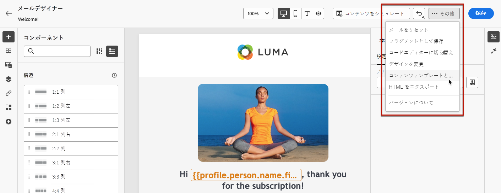
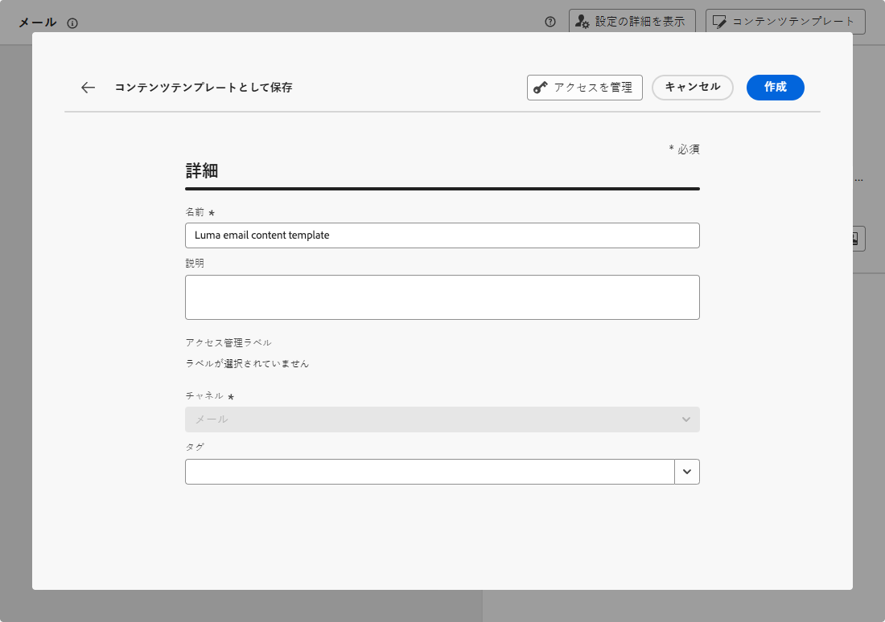

# コンテンツテンプレートの作成 {#create-content-templates}

>[!CONTEXTUALHELP]
>id="ajo_create_template"
>title="独自のコンテンツテンプレートを定義"
>abstract="スタンドアロンのカスタムテンプレートをゼロから作成して、複数のジャーニーやキャンペーンでコンテンツを再利用できるようにします。"

コンテンツテンプレートを作成する方法は 2 つあります。

* 左パネルの「**[!UICONTROL コンテンツテンプレート]**」メニューを使用して、ゼロからコンテンツテンプレートを作成する。[方法についてはこちらを参照](#create-template-from-scratch)

* キャンペーンまたはジャーニー内でコンテンツをデザインする際に、テンプレートとして保存する。[方法についてはこちらを参照](#save-as-template)

保存すると、コンテンツテンプレートをキャンペーンやジャーニーで使用できるようになります。 ゼロから作成した場合でも、以前のコンテンツから作成した場合でも、[!DNL Journey Optimizer] 内でコンテンツを作成する際にこのテンプレートを使用できるようになりました。[方法についてはこちらを参照](#use-content-templates)

>[!NOTE]
>
>* コンテンツテンプレートに加えられた変更は、ライブかドラフトかに関わらず、キャンペーンやジャーニーには反映されません。
>
>* 同様に、キャンペーンやジャーニーでテンプレートを使用する場合、キャンペーンやジャーニーのコンテンツにを編集しても、以前に使用したコンテンツテンプレートには影響しません。

## テンプレートをゼロから作成 {#create-template-from-scratch}

コンテンツテンプレートをゼロから作成するには、次の手順に従います。

1. **[!UICONTROL コンテンツ管理]**／**[!UICONTROL コンテンツテンプレート]**&#x200B;の左側のメニューからコンテンツテンプレートリストにアクセスします。

1. 「**[!UICONTROL テンプレートの作成]**」を選択します。

1. テンプレートの詳細を入力し、目的のチャネルを選択します。

   

   >[!NOTE]
   >
   >現在、web を除くすべてのチャネルを使用できます。

1. 選択したチャネルの&#x200B;**[!UICONTROL タイプ]**&#x200B;を選択します。

   

   * **[!UICONTROL メール]**&#x200B;の場合、「**[!UICONTROL コンテンツ]**」を選択すると、[件名](../email/create-email.md#define-email-content)をテンプレートの一部として定義できます。「**[!UICONTROL HTML]**」を選択すると、メール本文のコンテンツのみを定義できます。

   * **[!UICONTROL SMS]**、**[!UICONTROL プッシュ]**、**[!UICONTROL アプリ内]**&#x200B;および&#x200B;**[!UICONTROL ダイレクトメール]**&#x200B;の場合、現在のチャネルに使用できるのはデフォルトのタイプのみですが、選択は行う必要があります。

1. 「**[!UICONTROL タグ]**」フィールドから Adobe Experience Platform タグを選択または作成してテンプレートを分類し、検索の向上を図ります。[詳細情報](../start/search-filter-categorize.md#tags)

1. テンプレートにカスタムまたはコアのデータ使用ラベルを割り当てるには、「**[!UICONTROL アクセスを管理]**」を選択します。[オブジェクトレベルのアクセス制御（OLAC）についての詳細はこちらを参照してください](../administration/object-based-access.md)。

1. 「**[!UICONTROL 作成]**」をクリックし、選択したチャネルに従って、ジャーニーやキャンペーン内のコンテンツと同じ方法で、必要に応じてコンテンツをデザインします。

   

   様々なチャネル用のコンテンツを作成する方法については、次の節を参照してください。
   * [メールコンテンツの定義](../email/get-started-email-design.md)
   * [プッシュコンテンツの定義](../push/design-push.md)
   * [SMS コンテンツの定義](../sms/create-sms.md#sms-content)
   * [ダイレクトメールコンテンツの定義](../direct-mail/create-direct-mail.md)
   * [アプリ内コンテンツの定義](../in-app/design-in-app.md)

1. **[!UICONTROL HTML]** タイプで&#x200B;**[!UICONTROL メール]**&#x200B;テンプレートを作成している場合は、コンテンツをテストできます。[方法についてはこちらを参照](#test-template)

1. テンプレートの準備が整ったら、「**[!UICONTROL 保存]**」をクリックします。

1. テンプレート名の横にある矢印をクリックして&#x200B;**[!UICONTROL 詳細]**&#x200B;画面に戻ります。

   

このテンプレートを、[!DNL Journey Optimizer] 内でコンテンツを作成する際に使用できるようになりました。[方法についてはこちらを参照](#use-content-templates)

## コンテンツをコンテンツテンプレートとして保存 {#save-as-template}

>[!CONTEXTUALHELP]
>id="ajo_messages_depecrated_inventory"
>title="メッセージの移行方法を説明します。"
>abstract="2022年7月25日（PT）より、メッセージメニューが表示されなくなり、ジャーニーから直接メッセージが作成されます。 従来のメッセージをジャーニーで再利用する場合は、それらをテンプレートとして保存する必要があります。"

キャンペーンやジャーニーでコンテンツをデザインする際、保存しておくと、後で再利用できます。それには、次の手順に従います。

1. メッセージの&#x200B;**[!UICONTROL コンテンツを編集]**&#x200B;画面で、「**[!UICONTROL コンテンツテンプレート]**」ボタンをクリックします。

1. ドロップダウンメニューから「**[!UICONTROL コンテンツテンプレートとして保存]**」を選択します。

   

   [メールデザイナー](../email/get-started-email-design.md)を使用している場合は、画面右上の&#x200B;**[!UICONTROL その他]**&#x200B;ドロップダウンリストからこのオプションを選択することもできます。

   

1. このテンプレートの名前と説明を追加します。

   

   >[!NOTE]
   >
   >現在のチャネルとタイプは自動的に入力され、編集できません。[メールデザイナー](../email/get-started-email-design.md)から作成したメールテンプレートの場合、**[!UICONTROL HTML]** タイプが自動的に選択されます。

1. 「**タグ**」フィールドから Adobe Experience Platform タグを選択または作成して、テンプレートを分類します。[詳細情報](../start/search-filter-categorize.md#tags)

1. テンプレートにカスタムまたはコアのデータ使用ラベルを割り当てるには、「**[!UICONTROL アクセスを管理]**」を選択します。[詳細情報](../administration/object-based-access.md)。

1. 「**[!UICONTROL 保存]**」をクリックします。

1. テンプレートは&#x200B;**[!UICONTROL コンテンツテンプレート]**&#x200B;リストに保存され、[!DNL Journey Optimizer] 専用メニューからアクセスできます。このテンプレートは、そのリストの他の項目と同様に、アクセス、編集、削除できるスタンドアロンのコンテンツテンプレートになります。[詳細情報](#access-manage-templates)

[!DNL Journey Optimizer] 内でコンテンツを作成する際に、このテンプレートを使用できるようになりました。[方法についてはこちらを参照](#use-content-templates)

>[!NOTE]
>
>その新しいテンプレートに対する変更は、送信元のコンテンツには生成されません。同様に、そのコンテンツ内で元のコンテンツを編集しても、新しいテンプレートは変更されません。
