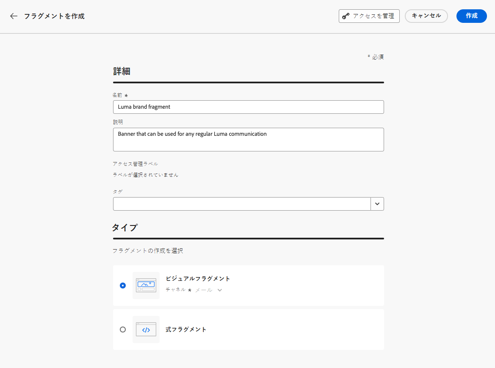
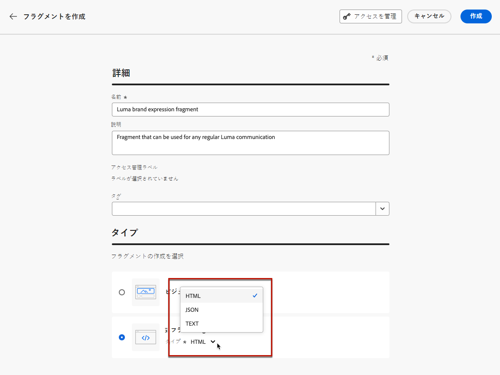
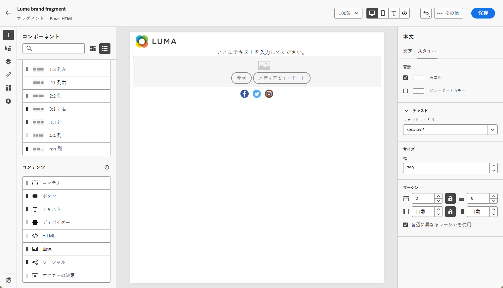
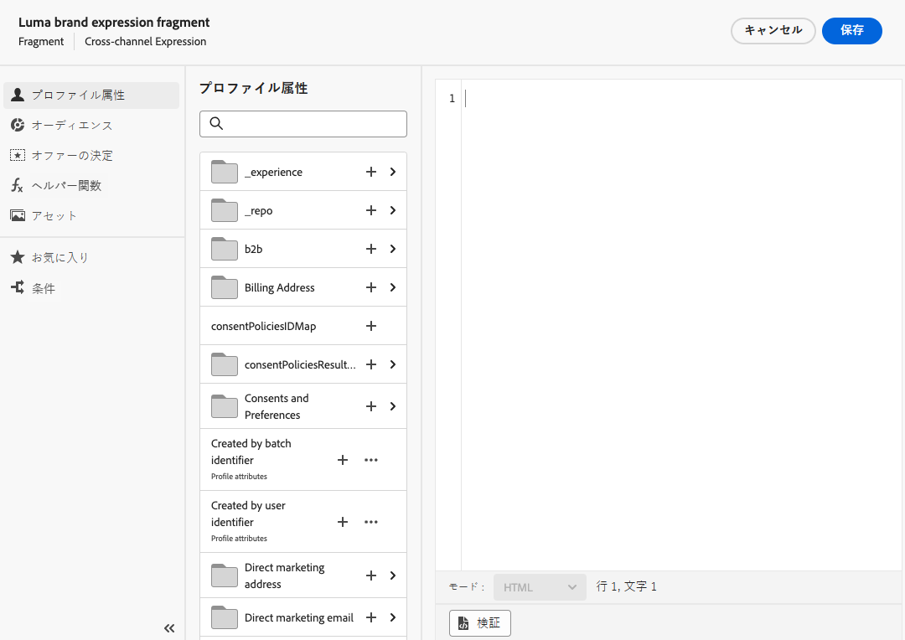
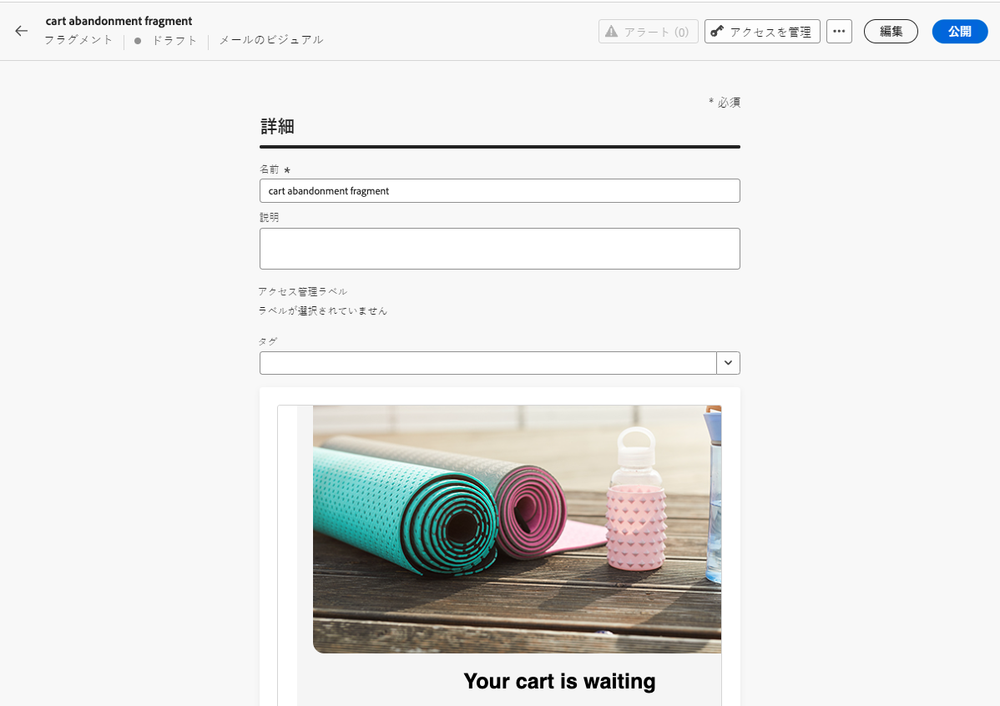
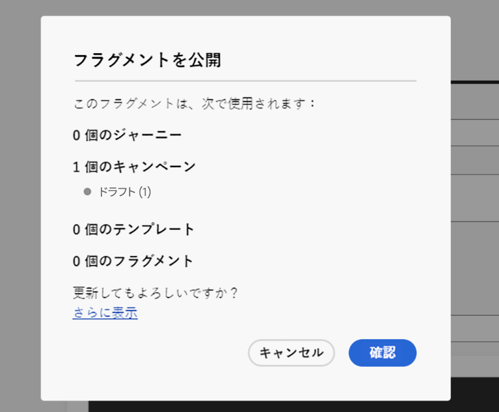

# フラグメントの作成 {#create-fragments}

>[!CONTEXTUALHELP]
>id="ajo_create_visual_fragment"
>title="ビジュアルタイプを選択"
>abstract="スタンドアロンのビジュアルフラグメントを作成して、ジャーニーまたはキャンペーン内のメールや、コンテンツテンプレートでコンテンツを再利用できるようにします。"
>additional-url="https://experienceleague.adobe.com/en/docs/journey-optimizer/using/email/design-email/add-content/use-visual-fragments" text="メールへのビジュアルフラグメントの追加"

>[!CONTEXTUALHELP]
>id="ajo_create_expression_fragment"
>title="式タイプの選択"
>abstract="スタンドアロン式のフラグメントを作成して、複数のジャーニーやキャンペーンでコンテンツを再利用できるようにします。パーソナライゼーションエディターを使用すると、現在のサンドボックスで作成されたすべての式フラグメントを活用できます。"
>additional-url="https://experienceleague.adobe.com/docs/journey-optimizer/using/content-management/personalization/expression-editor/use-expression-fragments.html?lang=ja" text="式フラグメントを活用"

フラグメントは、左側のメニューの&#x200B;**[!UICONTROL フラグメント]**&#x200B;からゼロから作成できます。さらに、コンテンツをデザインする際に、既存のコンテンツの一部をフラグメントとして保存することもできます。[方法についてはこちらを参照](#save-as-fragment)

保存すると、フラグメントをジャーニー、キャンペーンまたはテンプレートで使用できるようになります。このフラグメントは、ジャーニーとキャンペーン内でコンテンツを作成する際に使用できます。[ビジュアルフラグメントの追加](../email/use-visual-fragments.md)および[式フラグメントの活用](../personalization/use-expression-fragments.md)を参照してください

フラグメントを作成するには、次の手順に従います。

## フラグメントのプロパティの定義 {#properties}

1. **[!UICONTROL コンテンツ管理]**／**[!UICONTROL フラグメント]**&#x200B;の左のメニューから、フラグメントリストにアクセスします。

1. 「**[!UICONTROL フラグメントを作成]**」を選択し、フラグメント名と説明を（必要に応じて）入力します。

   

1. 「**[!UICONTROL タグ]**」フィールドから Adobe Experience Platform タグを選択または作成してフラグメントを分類し、検索の向上を図ります。[詳しくは、統合タグの操作方法を参照してください](../start/search-filter-categorize.md#tags)

1. フラグメントタイプ（**ビジュアルフラグメント**&#x200B;または&#x200B;**式フラグメント**）を選択します。[詳しくは、ビジュアルフラグメントと式フラグメントを参照してください](../content-management/fragments.md#visual-expression)

   >[!NOTE]
   >
   >現時点では、ビジュアルフラグメントは、**メール**&#x200B;チャネルでのみ使用できます。

1. 式フラグメントを作成する場合は、使用するコードのタイプを **[!UICONTROL HTML]**、**[!UICONTROL JSON]** または&#x200B;**[!UICONTROL テキスト]**&#x200B;から選択します。

   

1. カスタムまたはコアのデータ使用ラベルをフラグメントに割り当てるには、画面の上部セクションで「**[!UICONTROL アクセスを管理]**」ボタンをクリックします。[オブジェクトレベルのアクセス制御（OLAC）について詳しくは、こちらを参照してください](../administration/object-based-access.md)。

1. 「**[!UICONTROL 作成]**」をクリックして、フラグメントのコンテンツをデザインします。

## フラグメントコンテンツのデザイン {#content}

フラグメントのプロパティを設定すると、作成するフラグメントのタイプに応じて、E メールデザイナーまたはパーソナライゼーションエディターが開きます。

* ビジュアルフラグメントの場合は、ジャーニーやキャンペーン内のメールと同じ方法で、必要に応じてコンテンツを編集します。[詳細情報](../email/get-started-email-design.md)

  

* 式フラグメントの場合は、[!DNL Journey Optimizer] パーソナライゼーションエディターのすべてのパーソナライズ機能およびオーサリング機能を活用して、フラグメントコンテンツを構築します。[詳細情報](../personalization/personalization-build-expressions.md)

  

コンテンツの準備が整ったら、「**保存**」ボタンをクリックします。フラグメントが作成され、**ドラフト**&#x200B;ステータスでフラグメントリストに追加されます。追加されたフラグメントをプレビューして公開し、ジャーニーとキャンペーンで使用できます。

## フラグメントのプレビューと公開 {#publish}

>[!NOTE]
>
>フラグメントを公開するには、次が必要です [Publish フラグメント](../administration/ootb-product-profiles.md#content-library-manager) ユーザー権限。

フラグメントを公開する準備が整ったら、プレビューして公開し、ジャーニーとキャンペーンで使用できます。それには、次の手順に従います。

1. コンテンツをデザインした後にフラグメントの作成画面に戻るか、フラグメントのリストから開きます。

1. フラグメントのプレビューは、「**タグ**」フィールドで利用でき、レンダリングを確認できます。変更を行う必要がある場合は、画面の上部セクションで「**編集**」ボタンをクリックして、フラグメントのタイプに応じてE メールデザイナーまたはパーソナライゼーションエディターを開きます。

   

1. 右上隅の「**公開**」ボタンをクリックして、フラグメントを公開します。

   フラグメントがライブジャーニーまたはキャンペーンで使用されている場合は、通知するメッセージが開きます。「**さらに表示**」リンクをクリックすると、参照先のジャーニーやキャンペーンのリストにアクセスできます。[詳しくは、フラグメントの参照の探索方法を参照してください](../content-management/manage-fragments.md#explore-references)

   「**確認**」をクリックしてフラグメントを公開し、使用しているライブジャーニー／キャンペーンで更新します。

   {width="70%" align="center"}

フラグメントは&#x200B;**ライブ**&#x200B;になり、[!DNL Journey Optimizer] E メールデザイナーまたはパーソナライゼーションエディター内でコンテンツを作成する際に使用できます。

* [ビジュアルフラグメントの使用方法を学ぶ](../email/use-visual-fragments.md)
* [式フラグメントの使用方法を学ぶ](../personalization/use-expression-fragments.md)
