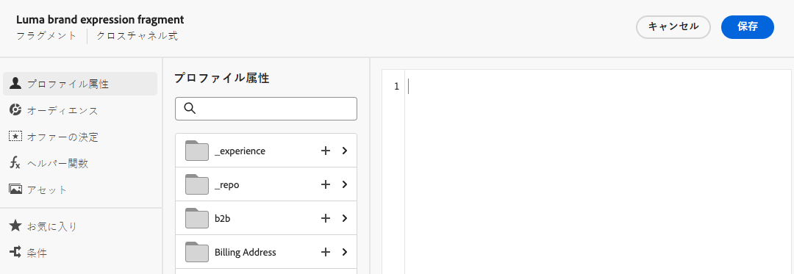

# フラグメントを作成 {#create-fragments}

>[!CONTEXTUALHELP]
>id="ajo_create_visual_fragment"
>title="ビジュアルタイプを選択"
>abstract="スタンドアロンのビジュアルフラグメントを作成して、ジャーニーまたはキャンペーン内のメールや、コンテンツテンプレートでコンテンツを再利用できるようにします。"
>additional-url="https://experienceleague.adobe.com/en/docs/journey-optimizer/using/email/design-email/add-content/use-visual-fragments" text="メールへのビジュアルフラグメントの追加"

>[!CONTEXTUALHELP]
>id="ajo_create_expression_fragment"
>title="式タイプの選択"
>abstract="スタンドアロン式のフラグメントを作成して、複数のジャーニーやキャンペーンでコンテンツを再利用できるようにします。パーソナライゼーションエディターを使用すると、現在のサンドボックスで作成されたすべての式フラグメントを活用できます。"
>additional-url="https://experienceleague.adobe.com/docs/journey-optimizer/using/content-management/personalization/expression-editor/use-expression-fragments.html?lang=ja" text="式フラグメントを活用"

フラグメントは、 **[!UICONTROL フラグメント]** 左メニュー。 さらに、コンテンツをデザインする際に、既存のコンテンツの一部をフラグメントとして保存することもできます。[方法についてはこちらを参照](#save-as-fragment)

保存すると、フラグメントをジャーニー、キャンペーンまたはテンプレートで使用できるようになります。このフラグメントは、ジャーニーとキャンペーン内でコンテンツを作成する際に使用できます。 [ビジュアルフラグメントの追加](../email/use-visual-fragments.md)および[式フラグメントの活用](../personalization/use-expression-fragments.md)を参照してください

フラグメントを作成するには、次の手順に従います。

## フラグメントのプロパティの定義 {#properties}

1. **[!UICONTROL コンテンツ管理]**／**[!UICONTROL フラグメント]**&#x200B;の左のメニューから、フラグメントリストにアクセスします。

1. を選択 **[!UICONTROL フラグメントを作成]** さらに、必要に応じてフラグメント名と説明を入力します。

   

1. 「**[!UICONTROL タグ]**」フィールドから Adobe Experience Platform タグを選択または作成してフラグメントを分類し、検索の向上を図ります。[統合タグの操作方法を学ぶ](../start/search-filter-categorize.md#tags)

1. フラグメントタイプを選択します。 **ビジュアルフラグメント** または **式フラグメント**. [ビジュアルフラグメントと式フラグメントについて詳しく説明します](../content-management/fragments.md#visual-expression)

   >[!NOTE]
   >
   >現時点では、ビジュアルフラグメントは次で使用できます **電子メール** チャネルのみ。

1. 式フラグメントを作成する場合は、使用するコードのタイプを **[!UICONTROL HTML]**、**[!UICONTROL JSON]** または&#x200B;**[!UICONTROL テキスト]**&#x200B;から選択します。

   

1. カスタムまたはコアのデータ使用ラベルをフラグメントに割り当てるには、 **[!UICONTROL アクセスを管理]** ボタンをクリックします。 [オブジェクトレベルのアクセス制御（OLAC）について詳しくは、こちらを参照してください](../administration/object-based-access.md)。

1. クリック **[!UICONTROL 作成]** フラグメントのコンテンツをデザインする

## フラグメントコンテンツのデザイン {#content}

フラグメントのプロパティを設定すると、作成するフラグメントのタイプに応じて、メールDesignerまたはパーソナライゼーションエディターが開きます。

* ビジュアルフラグメントの場合は、ジャーニーやキャンペーン内のメールと同じ方法で、必要に応じてコンテンツを編集します。 [詳細情報](../email/get-started-email-design.md)

  

* 式フラグメントの場合は、[!DNL Journey Optimizer] パーソナライゼーションエディターのすべてのパーソナライズ機能およびオーサリング機能を活用して、フラグメントコンテンツを構築します。[詳細情報](../personalization/personalization-build-expressions.md)

  

コンテンツの準備が整ったら、 **保存** ボタン。 フラグメントが作成され、 **ドラフト** ステータス。 プレビューして公開すると、ジャーニーやキャンペーンで利用できるようになります。

## フラグメントのプレビューと公開 {#publish}

>[!NOTE]
>
>フラグメントを公開するには、次が必要です **Publish フラグメント** 関連する権限。 [権限について詳しくはこちらを参照](../administration/ootb-permissions.md)

フラグメントの公開準備が整ったら、プレビューして公開し、ジャーニーやキャンペーンで利用できるようにします。 それには、次の手順に従います。

1. コンテンツをデザインした後にフラグメント作成画面に戻るか、フラグメントのリストから開きます。

1. フラグメントのプレビューは、次の場所で利用できます **タグ** フィールドに移動し、レンダリングを確認できます。 変更が必要な場合は、 **編集** 画面の上部セクションにある「」ボタンをクリックして、フラグメントタイプに応じてメールDesignerまたはパーソナライゼーションエディターを開きます。

   

1. 「」をクリックします **Publish** 右上隅のボタンをクリックして、フラグメントを公開します。

   フラグメントがライブジャーニーまたはキャンペーンで使用されている場合は、通知するメッセージが開きます。 「」をクリックします **さらに表示** 参照先のジャーニーやキャンペーンのリストにアクセスするためのリンク。 [フラグメントの参照を探索する方法を学ぶ](../content-management/manage-fragments.md#explore-references)

   クリック **確認** ：フラグメントを公開し、そのフラグメントを使用しているライブジャーニー/キャンペーンで更新します。

   {width="70%" align="center"}

フラグメントはになります **ライブ**、およびは、内でコンテンツを作成する際に使用できるようになります [!DNL Journey Optimizer] メールDesignerまたはパーソナライゼーションエディター：

* [ビジュアルフラグメントの使用方法を学ぶ](../email/use-visual-fragments.md)
* [式フラグメントの使用方法を学ぶ](../personalization/use-expression-fragments.md)
