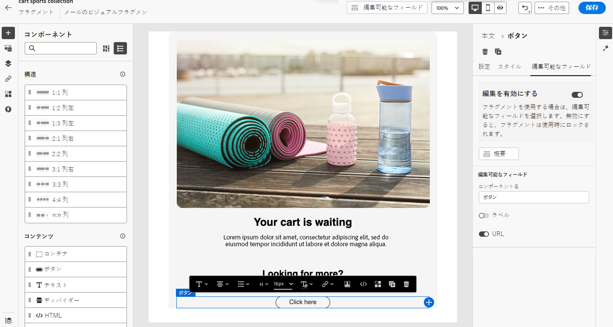
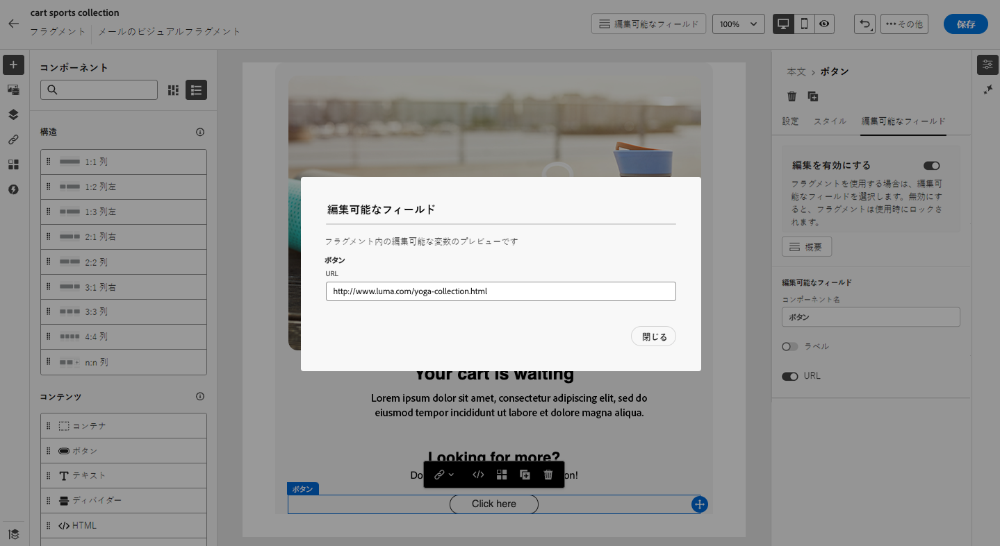
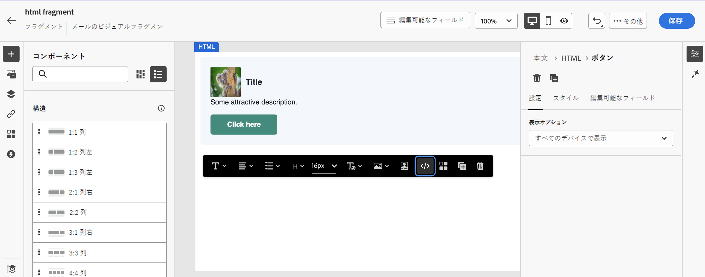
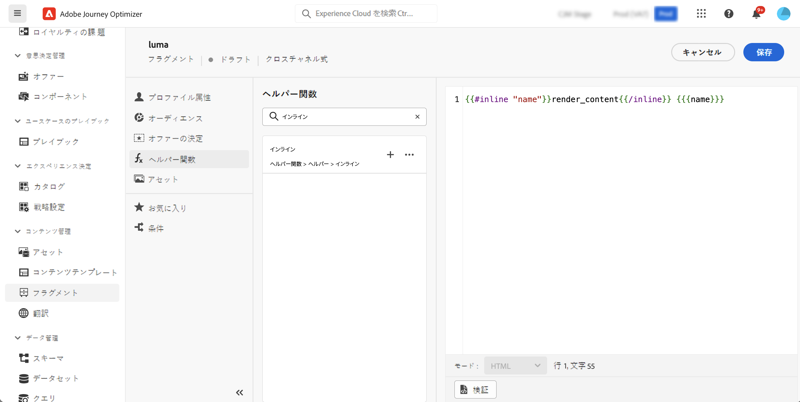
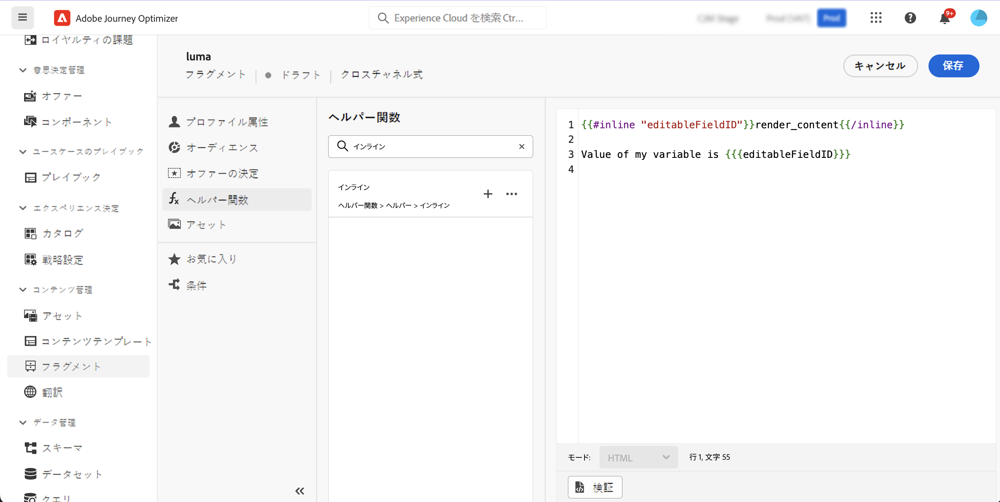
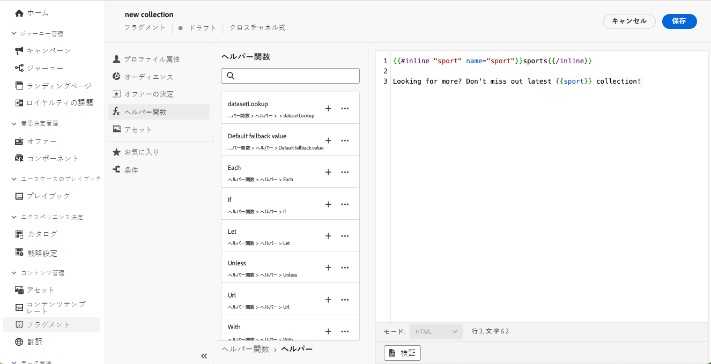

# カスタマイズ可能なフラグメント {#customizable-fragments}

フラグメントをキャンペーンまたはジャーニーアクションで使用すると、継承が原因で、デフォルトでロックされます。 つまり、フラグメントに対して行われた変更は、フラグメントが使用されているすべてのキャンペーンおよびジャーニーに自動的に反映されます。 カスタマイズ可能なフラグメントを使用すれば、フラグメントがキャンペーンまたはジャーニーアクションに追加された際に、フラグメント内の特定のフィールドを編集可能として定義できます。 例えば、バナー、テキストおよびボタンを含むフラグメントがあるとします。 画像やボタンのターゲット URL など、特定のフィールドを編集可能として指定できます。 これにより、ユーザーはフラグメントをキャンペーンやジャーニーに組み込む際にこれらの要素を変更でき、元のフラグメントに影響を与えることなくカスタマイズされたエクスペリエンスを提供できます。

カスタマイズ可能なフラグメントを使用すると、フラグメントの継承を中断する必要がなくなります。フラグメントの継承により、以前は、フラグメントレベルで一元化された変更が、キャンペーンやジャーニーに反映されるのを停止していました。 このアプローチにより、コンテンツの部分を使用時に調整できるので、コンテキスト固有の詳細を使用してデフォルト値を上書きする柔軟性が得られます。

カスタマイズ可能なフラグメントを活用することで、まったく新しいコンテンツブロックを作成したり、元のフラグメントからの継承を中断したりすることなく、コンテンツを効率的に管理およびパーソナライズできます。 これにより、フラグメントレベルで行われた変更が引き続き反映されますが、キャンペーンレベルまたはジャーニーレベルで必要なカスタマイズが可能になります。

ビジュアルフラグメントと式フラグメントは、どちらもカスタマイズ可能としてマークできます。 各タイプのフラグメントを処理する方法については、以下の節を参照してください。

## ビジュアルフラグメントへの編集可能なフィールドの追加 {#visual}

ビジュアルフラグメントの一部を編集可能にするには、次の手順に従います。

>[!NOTE]
>
>編集可能フィールドはに追加できます。 **画像**, **text** および **ボタン** コンポーネント。 の場合 **HTML** コンポーネント、編集可能フィールドは、式フラグメントと同様に、パーソナライゼーションエディターを使用して追加されます。 [HTMLコンポーネントと式フラグメントに編集可能フィールドを追加する方法を説明します](#expression)

1. フラグメントコンテンツ編集画面を開きます。

1. 編集可能なフィールドを設定するフラグメント内のコンポーネントを選択します。

1. コンポーネントのプロパティペインが右側に開きます。 「」を選択します **編集可能フィールド** tab キーを押してから「 **エディションを有効にする** オプション。

1. 選択したコンポーネントについて編集可能なすべてのフィールドがパネルに表示されます。 編集可能なフィールドは、選択したコンポーネントタイプによって異なります。

   以下の例では、「ここをクリック」ボタンの URL の編集を許可します。

   

1. 「」をクリックします **概要** すべての編集可能フィールドとそのデフォルト値を確認するには、次の手順を実行します。

   この例では、ボタンの URL フィールドは、コンポーネントで定義されたデフォルト値を使用して表示されます。 この値は、ユーザーがフラグメントをコンテンツに追加した後にカスタマイズできます。

   

1. 準備が整ったら、変更を保存してフラグメントを更新します。

1. フラグメントをメールに追加すると、フラグメントで設定されたすべての編集可能フィールドをユーザーがカスタマイズできるようになります。 [ビジュアルフラグメント内の編集可能フィールドをカスタマイズする方法を説明します](../email/use-visual-fragments.md#customize-fields)

## HTMLコンポーネントと式フラグメントに編集可能なフィールドを追加 {#expression}

HTMLコンポーネントまたは式フラグメントの一部を編集可能にするには、式エディターで特定の構文を使用する必要があります。 これには、次を宣言します **変数** デフォルト値（ユーザーがコンテンツにフラグメントを追加した後に上書きできる）。

例えば、メールに追加するフラグメントを作成し、ユーザーが様々な場所で使用する特定の色（フレームやボタンの背景色など）をカスタマイズできるようにするとします。 フラグメントを作成する場合は、を使用して変数を宣言する必要があります。 **ユニーク ID**&#x200B;例えば「color」を指定し、このカラーを適用するフラグメントコンテンツ内の目的の場所で呼び出します。 フラグメントをコンテンツに追加する際に、ユーザーは、変数が参照される場所で使用されるカラーをカスタマイズできます。

HTMLコンポーネントの場合は、特定の要素のみを編集可能フィールドにすることができます。 詳しくは、以下の節を展開してください。

+++HTMLコンポーネントの編集可能な要素：

の下の要素は、HTMLコンポーネントで編集可能なフィールドにすることができます。

* テキストの一部
* リンクまたは画像の完全な URL （URL の一部では機能しません）
* CSS プロパティ全体（部分プロパティでは機能しません）

例えば、以下のコードでは、赤でハイライト表示された各要素がプロパティになる可能性があります。

{width="70%"}

+++

変数を宣言してフラグメントで使用するには、次の手順に従います。

1. 式フラグメントを開き、パーソナライゼーションエディターでそのコンテンツを編集します。 HTMLコンポーネントの場合は、フラグメント内のコンポーネントを選択し、 **ソースコードを表示** ボタン。

   

1. ユーザーに編集を求める変数を宣言します。 に移動します。 **ヘルパー関数** 左側のナビゲーションパネルのメニューと以下を追加 **インライン** ヘルパー関数。 変数を宣言して呼び出す構文は、コンテンツに自動的に追加されます。

   

1. 置換 `"name"` を編集可能なフィールドを識別する一意の ID に置き換えます。

   >[!NOTE]
   >
   >フィールド ID は一意である必要があり、スペースを含めることはできません。 この ID は、変数の値を表示するコンテンツ内のすべての場所で使用する必要があります。

1. 以下の表で説明するパラメーターを追加して、ニーズに合わせて構文を調整します。

   | アクション | パラメーター | 例 |
   | ------- | ------- | ------- |
   | を使用して編集可能なフィールドを宣言 **デフォルト値**. フラグメントをコンテンツに追加する際に、カスタマイズしない場合は、このデフォルト値が使用されます。 | インラインタグの間にデフォルト値を追加します。 | `{{#inline "editableFieldID"}}default_value{{/inline}}` |
   | の定義 **ラベル** 編集可能フィールドの場合。 このラベルは、フラグメントのフィールドを編集するときに、メールDesignerに表示されます。 | `name="title"` | `{{#inline "editableFieldID" name="title"}}default_value{{/inline}}` |
   | を含む編集可能なフィールドを宣言 **画像のソース** その件を公開する必要がある。 | `assetType="image"` | `{{#inline "editableFieldID" assetType="image"}}default_value{{/inline}}` |
   | を含む編集可能なフィールドを宣言 **URL** その点を突き止める必要があります。 既製の「ミラーページの URL」および「登録解除リンク」事前定義済みブロックは、編集可能フィールドにすることはできません。 | `assetType="url"` | `{{#inline "editableFieldID" assetType="url"}}default_value{{/inline}}` |

1. の使用 `{{{name}}}` 編集可能フィールドの値を表示するすべての場所のコードの構文。 置換 `name` と、前に定義したフィールドの一意の ID。

   

1. フラグメントを保存します。

ユーザーは、メールコンテンツにフラグメントを追加する際に、変数のデフォルト値を選択した値で上書きできるようになりました。

* 式フラグメントの場合、変数値を上書きするために特定の構文が使用されます。 [式フラグメントで編集可能フィールドをカスタマイズする方法を説明します](../personalization/use-expression-fragments.md#customize-fields)

* HTMLコンポーネントの場合、変数は、メールDesignerの編集可能なフィールドのリストに表示されます。 [ビジュアルフラグメント内の編集可能フィールドをカスタマイズする方法を説明します](../email/use-visual-fragments.md#customize-fields)

## 編集可能な式フラグメントの例 {#example}

以下の例では、新しいスポーツコレクションを紹介する式フラグメントを作成しています。 デフォルトでは、フラグメントには次のコンテンツが表示されます。 *詳細を見る？ 最新のスポーツコレクションをお見逃しなく！*

このコンテンツの「スポーツ」を、ユーザーが選択したスポーツに置き換えることを許可します。 例： *詳細を見る？ 最新のヨガコレクションをお見逃しなく！*

それには、以下の手順を実行します。

1. ID が「sport」の「sport」変数を宣言します。

   デフォルトでは、ユーザーがコンテンツにフラグメントを追加した後に変数の値を変更しない場合、次の範囲で定義された値が表示されます `{{#inline}}` および `{{/inline}}` タグ、例：「スポーツ」。

1. を追加 ``{{{sport}}}`` フラグメントコンテンツ内の変数値（デフォルトでは「sports」、ユーザーが選択した値など）を表示する構文。

   

1. 式フラグメントをコンテンツに追加する際に、ユーザーは式エディターから直接選択して変数の値を変更できます。 [式フラグメントで編集可能フィールドをカスタマイズする方法を説明します](../personalization/use-expression-fragments.md#customize-fields)

   
