# カスタマイズ可能なフラグメント {#customizable-fragments}

>[!BEGINSHADEBOX]

**このページ：**&#x200B;では、ビジュアルフラグメントとエクスプレッションフラグメントの特定のフィールドを編集可能にする方法を説明します。これにより、ユーザーは、元のフラグメントからの継承を解除することなく、キャンペーンまたはジャーニーにフラグメントを追加するときに、それらのフラグメントをカスタマイズできます。

>[!ENDSHADEBOX]

キャンペーンまたはジャーニーアクションでフラグメントを使用する際、フラグメントは継承によりデフォルトでロックされます。 つまり、フラグメントに対して行った変更は、フラグメントを使用するすべてのキャンペーンとジャーニーに自動的に生成されます。

**カスタマイズ可能なフラグメント**&#x200B;を使用すると、フラグメントがキャンペーンまたはジャーニーアクションに追加された際に、フラグメント内の特定のフィールドを編集可能として定義できます。 例えば、バナー、テキスト、ボタンを含むフラグメントがあるとします。 画像やボタンのターゲット URL など、特定のフィールドを編集可能として指定できます。 これにより、ユーザーはフラグメントをキャンペーンやジャーニーに組み込む際にこれらの要素を変更でき、元のフラグメントに影響を与えることなくカスタマイズされたエクスペリエンスを提供できます。

カスタマイズ可能なフラグメントにより、フラグメントの継承を解除する必要がなくなります。以前はフラグメントレベルで一元化された変更はキャンペーンやジャーニーに反映されませんでした。 このアプローチにより、使用時にコンテンツ部分を調整できるので、コンテキスト固有の詳細でデフォルト値を上書きする柔軟性が得られます。

カスタマイズ可能なフラグメントを活用することで、まったく新しいコンテンツブロックを作成したり、元のフラグメントからの継承を中断したりすることなく、コンテンツを効率的に管理およびパーソナライズできます。 これにより、フラグメントレベルで行われた変更が引き続き反映され、キャンペーンまたはジャーニーレベルで必要なカスタマイズが可能になります。

ビジュアルフラグメントと式フラグメントの両方をカスタマイズ可能としてマークできます。 各タイプのフラグメントの処理方法について詳しくは、以下の節を参照してください。

## ビジュアルフラグメントに編集可能なフィールドを追加する {#visual}

ビジュアルフラグメントの一部を編集可能にするには、次の手順に従います。

>[!NOTE]
>
>編集可能なフィールドは、**画像**、**テキスト**、**ボタン**&#x200B;コンポーネントに追加できます。 **HTML** コンポーネントの場合、式フラグメントと同様に、パーソナライゼーションエディターを使用すると、編集可能なフィールドが追加されます。 [HTML コンポーネントと式フラグメントに編集可能フィールドを追加する方法の詳細情報](#expression)

1. フラグメントコンテンツ編集画面を開きます。

1. 編集可能なフィールドを設定するフラグメント内のコンポーネントを選択します。

1. コンポーネントのプロパティパネルが右側に開きます。 「**編集可能なフィールド**」タブを選択し、「**編集を有効にする**」オプションを切り替えます。

1. 選択したコンポーネントの編集可能なすべてのフィールドがパネルにリストされます。 編集可能なフィールドは、選択したコンポーネントタイプによって異なります。

   以下の例では、「ここをクリック」ボタンの URL の編集を許可します。

   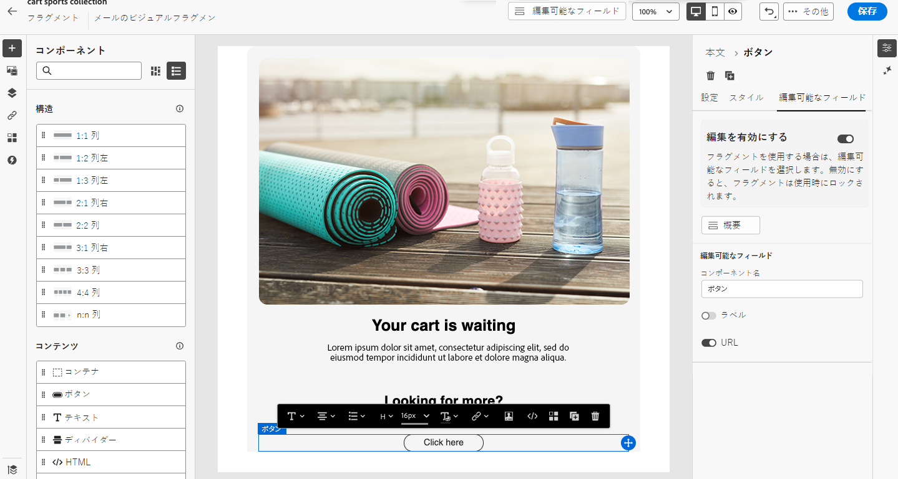

1. 「**概要**」をクリックして、編集可能なすべてのフィールドとそのデフォルト値を確認します。

   この例では、ボタンの URL フィールドに、コンポーネントで定義したデフォルト値が表示されます。 この値は、ユーザーがコンテンツにフラグメントを追加した後にカスタマイズできます。

   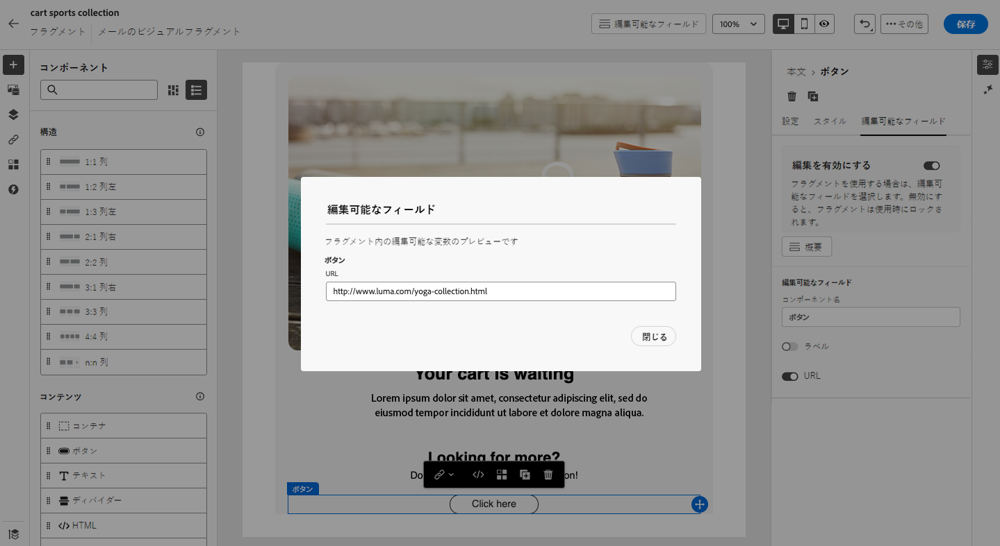

1. 準備が整ったら、変更を保存してフラグメントを更新します。

1. フラグメントをメールに追加すると、ユーザーはフラグメントで設定されたすべての編集可能なフィールドをカスタマイズできます。 [詳しくは、ビジュアルフラグメント内の編集可能フィールドをカスタマイズする方法を参照してください](../email/use-visual-fragments.md#customize-fields)

>[!CAUTION]
>
>ボタンコンポーネントの&#x200B;**ラベル**&#x200B;と&#x200B;**URL**&#x200B;の両方をフラグメントで編集可能にした場合、トラッキングレポートにはボタンラベルの代わりにURLが表示されます。 [詳しくは、トラッキングを参照してください](../email/message-tracking.md)

## カスタマイズ可能なビジュアルフラグメントでリッチテキスト編集を有効にする {#rich-text-visual}

>[!CONTEXTUALHELP]
>id="ajo_editable_fragment_compatibility"
>title="レガシーフラグメント"
>abstract="このフラグメントの編集可能なフィールドは、テキストのみのモードです。 つまり、このフラグメントをメールで編集する際には、プレーンテキストのみを入力できます。太字、斜体、ハイパーリンク、改行などの完全な書式設定オプションはサポートされていません。 「<b>有効にする</b>」をクリックして、電子メールでフラグメントを使用する際に、編集可能なフィールドでリッチテキストを許可します。"

>[!CONTEXTUALHELP]
>id="ajo_editable_field_compatibility"
>title="レガシーフラグメント"
>abstract="この編集可能なフィールドは、テキストのみのモードです。 完全な書式設定オプション（太字、斜体、ハイパーリンク、改行など） フラグメントをリッチテキストモードにアップグレードするまで使用できません。 フラグメント本文の設定に移動し、<b>有効</b>をクリックして、編集可能なフィールドでリッチテキストのロックを解除します。"
>additional-url="https://experienceleague.adobe.com/ja/docs/journey-optimizer/using/channels/email/design-email/add-content/use-visual-fragments#customize-fields" text="フラグメントの編集可能なフィールドをカスタマイズ"

>[!CONTEXTUALHELP]
>id="ac_editable_fragment_compatibility"
>title="レガシーフラグメント"
>abstract="このフラグメントの編集可能なフィールドは、テキストのみのモードです。 完全な書式設定オプション（太字、斜体、ハイパーリンク、改行など） フラグメントをリッチテキストモードにアップグレードするまで使用できません。 このモードをロック解除するには、フラグメントエディターを開き、<b>有効</b>をクリックします。"
>additional-url="https://experienceleague.adobe.com/ja/docs/journey-optimizer/using/channels/email/design-email/add-content/use-visual-fragments#customize-fields" text="フラグメントの編集可能なフィールドをカスタマイズ"

リッチテキスト <!--— including bold, italic, line breaks, and hyperlinks —-->は、カスタマイズ可能なビジュアルフラグメントでネイティブにサポートされるようになりました。

カスタマイズ可能なビジュアルフラグメントをメールで使用すると、フラグメントの&#x200B;**[!UICONTROL テキスト]**、**[!UICONTROL ボタン]**、および&#x200B;**[!UICONTROL Html]** コンポーネントの編集可能なフィールド内で、太字、斜体、改行、箇条書きリスト、ハイパーリンクなどの完全な書式設定オプションを直接使用できます。 [編集可能なフィールドのカスタマイズ方法について説明します](../email/use-visual-fragments.md#customize-fields)

ただし、リッチテキスト機能が導入される前にフラグメントを作成し、編集可能フィールドを定義した場合、編集可能フィールドはデフォルトでテキスト専用モードに設定されます。

* フラグメントエディターに互換性に関する警告が表示されます。

  

  電子メールでフラグメントを使用する際に、これらの編集可能なフィールドのリッチテキストモードを解除するには、「**有効にする**」ボタンをクリックしてフラグメントを保存します。

* フラグメントを電子メールに追加すると、電子メールDesignerでフラグメントを選択すると、互換性に関する警告も表示されます。

  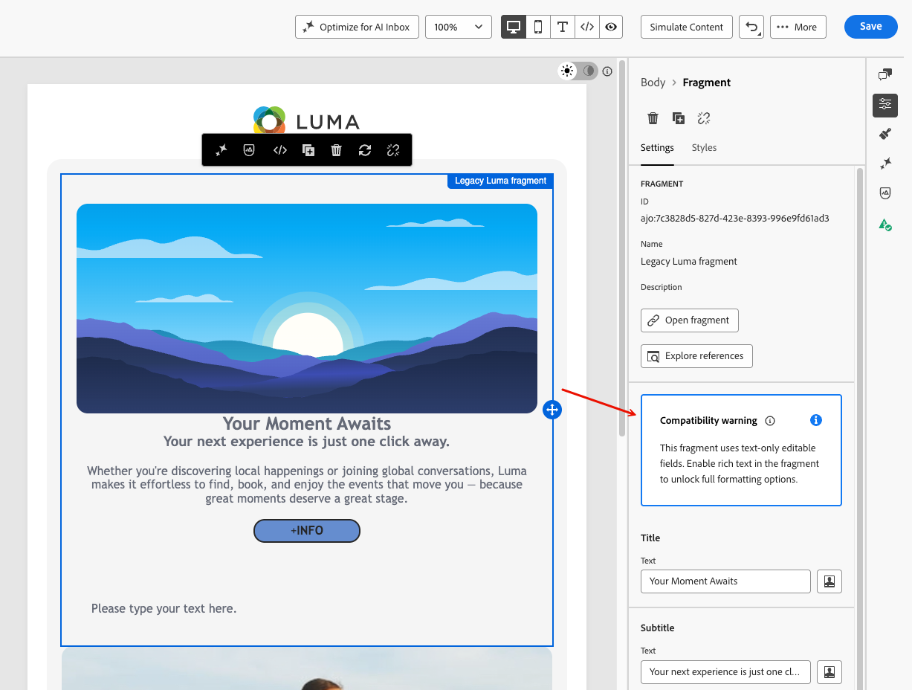

  フラグメントをリッチテキストモードにアップグレードするには、**フラグメントを開く** ボタンを使用してフラグメントエディターにアクセスし、**有効** ボタンをクリックしてフラグメントを保存します。

リッチテキストモードが解除されるまで、従来のカスタマイズ可能なビジュアルフラグメントは、プレーンテキストのみをサポートし続けます。 ユーザーは、これらのフラグメントの編集可能なフィールドにリッチテキストを入力することはできません。

## HTML コンポーネントと式フラグメントへの編集可能なフィールドの追加 {#expression}

HTML コンポーネントまたは式フラグメントの一部を編集可能にするには、式エディターで特定の構文を使用する必要があります。 これには、フラグメントをコンテンツに追加した後にユーザーが上書きできるデフォルト値を持つ&#x200B;**変数**&#x200B;を宣言することが含まれます。

例えば、メールに追加するフラグメントを作成し、フレームやボタンの背景色など、様々な場所で使用される特定の色をユーザーがカスタマイズできるようにするとします。 フラグメントを作成する際は、「color」などの&#x200B;**一意の ID** を持つ変数を宣言し、フラグメントコンテンツ内でこの色を適用する目的の場所でその変数を呼び出す必要があります。 フラグメントをコンテンツに追加すると、ユーザーは変数が参照される場所で使用する色をカスタマイズできます。

HTML コンポーネントの場合、特定の要素のみを編集可能なフィールドにすることができます。 詳しくは、以下の節を展開してください。

+++HTML コンポーネントの編集可能な要素：

以下の要素を、HTML コンポーネント内の編集可能なフィールドにすることができます。

* テキストの一部
* リンクまたは画像の完全な URL（URL の一部では機能しません）
* CSS プロパティ全体（部分的なプロパティでは機能しません）

例えば、以下のコードでは、赤色でハイライト表示された各要素をプロパティにすることができます。

{width="70%"}

+++

変数を宣言してフラグメントで使用するには、次の手順に従います。

1. 式フラグメントを開き、パーソナライゼーションエディターでそのコンテンツを編集します。

   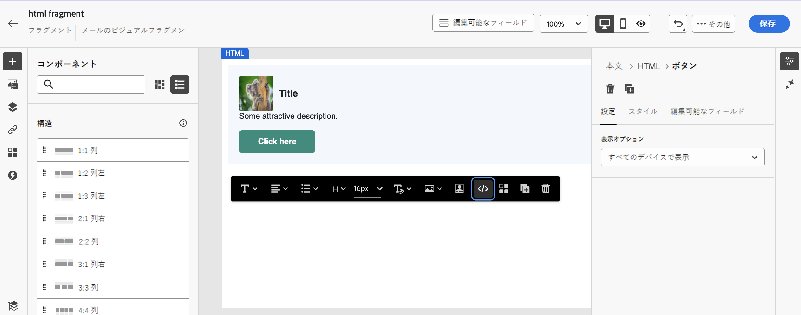

   HTML コンポーネントの場合は、フラグメント内のコンポーネントを選択し、「**ソースコードを表示**」ボタンをクリックします。

1. ユーザーが編集する変数を宣言します。 左ナビゲーションパネルの&#x200B;**ヘルパー関数**&#x200B;メニューに移動し、**インライン**&#x200B;ヘルパー関数を追加します。 変数を宣言し呼び出す構文は、コンテンツに自動的に追加されます。

   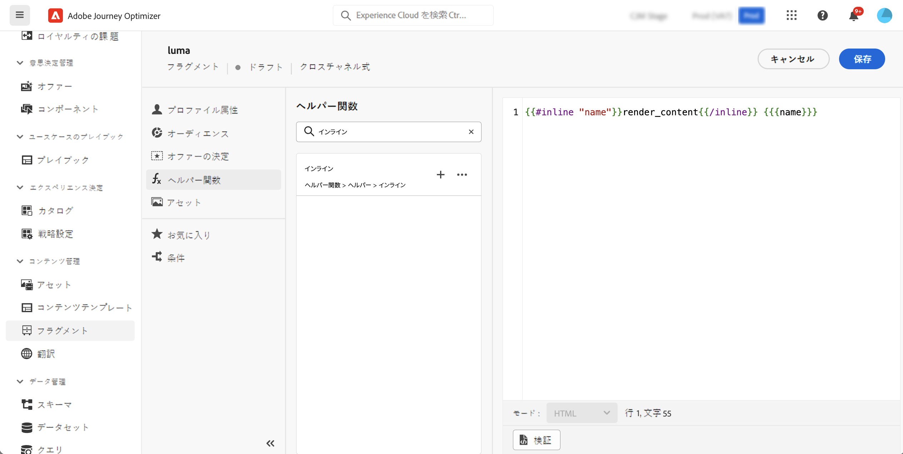

1. `"name"` を編集可能フィールドを識別する一意の ID に置き換えます。

   >[!NOTE]
   >
   >フィールド ID は一意である必要があり、スペースを含めることはできません。 コンテンツ内で変数の値を表示するすべての場所でこの ID を使用する必要があります。

1. 以下の表で説明するパラメーターを追加して、ニーズに合わせて構文を調整します。

   | アクション | パラメーター | 例 |
   | ------- | ------- | ------- |
   | 編集可能フィールドを&#x200B;**デフォルト値**&#x200B;と共に宣言します。 カスタマイズしない場合、フラグメントをコンテンツに追加する際には、このデフォルト値が使用されます。 | インラインタグの間にデフォルト値を追加します。 | `{{#inline "editableFieldID"}}default_value{{/inline}}` |
   | 編集可能フィールドの&#x200B;**ラベル**&#x200B;を定義します。 このラベルは、フラグメントのフィールドを編集する際に、E メールデザイナーに表示されます。 | `name="title"` | `{{#inline "editableFieldID" name="title"}}default_value{{/inline}}` |
   | 公開する必要がある&#x200B;**画像ソース**&#x200B;を含んだ編集可能フィールドを宣言します。 | `assetType="image"` | `{{#inline "editableFieldID" assetType="image"}}default_value{{/inline}}` |
   | 追跡する必要がある **URL** を含んだ編集可能フィールドを宣言します。 標準の「ミラーページの URL」と「登録解除リンク」定義済みブロックは、編集可能フィールドにすることはできません。 | `assetType="url"` | `{{#inline "editableFieldID" assetType="url"}}default_value{{/inline}}` |

1. コード内では、編集可能フィールドの値を表示するすべての場所で `{{{name}}}` 構文を使用します。 `name` を、先ほど定義したフィールドの一意の ID に置き換えます。

   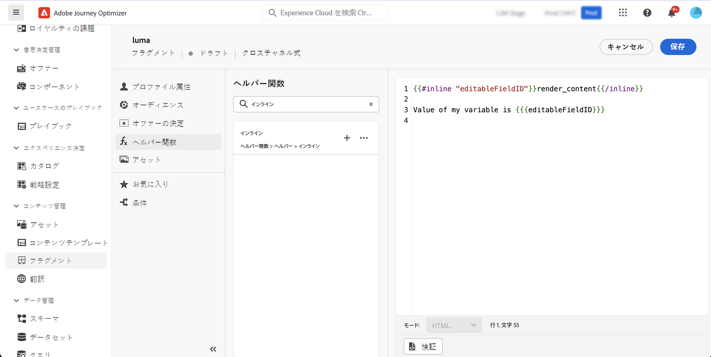

1. フラグメントを保存して公開します。

ユーザーは、メールコンテンツにフラグメントを追加する際に、変数のデフォルト値を、自分で選んだ値で上書きできるようになりました。

* 式フラグメントの場合、変数値を上書きするには、特定の構文が使用されます。 [詳しくは、式フラグメントの編集可能フィールドをカスタマイズする方法を参照してください](../personalization/use-expression-fragments.md#customize-fields)

* HTML コンポーネントの場合、変数は、E メールデザイナーの編集可能フィールドのリストに表示されます。 [詳しくは、ビジュアルフラグメントの編集可能フィールドをカスタマイズする方法を参照してください](../email/use-visual-fragments.md#customize-fields)

### 例：カスタマイズ可能な式フラグメント {#example}

以下の例では、新しいスポーツコレクションを紹介する式フラグメントを作成しています。 デフォルトでは、フラグメントには次のコンテンツが表示されます。*他のアイテムもお探しですか？ 最新のスポーツコレクションをお見逃しなく。*

このコンテンツの「スポーツ」を、ユーザーが自分で選択したスポーツに置換できるようにします。 例：*他のアイテムもお探しですか？ 最新のヨガコレクションをお見逃しなく。*

それには、以下の手順を実行します。

1. ID が「sport」の「sport」変数を宣言します。

   デフォルトでは、ユーザーがコンテンツにフラグメントを追加した後で変数の値を変更しない場合、`{{#inline}}` タグと `{{/inline}}` タグの間で定義された値（つまり「スポーツ」）が表示されます。

1. フラグメントコンテンツ内で変数値（デフォルト値「スポーツ」か、ユーザーが選んだ値）を表示する箇所に ``{{{sport}}}`` 構文を追加します。

   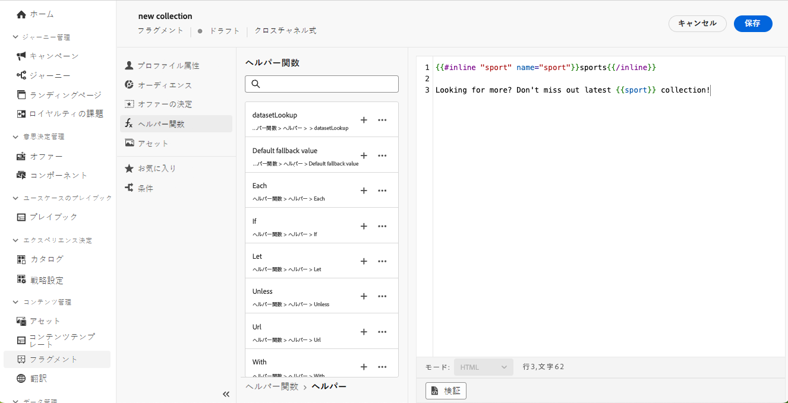

1. 式フラグメントをコンテンツに追加する際、ユーザーは式エディターから直接、変数の値を任意の値に変更できます。 [詳しくは、式フラグメントの編集可能フィールドをカスタマイズする方法を参照してください](../personalization/use-expression-fragments.md#customize-fields)

   

<!--
## Add rich text to a customizable fragment {#rich-text}

Rich text such as line breaks, bold, italics etc., can be added to a customizable fragment by using HTML components. To do so, follow the steps below.

➡️ [Learn how to add and use rich text in a customizable fragment in this video](#video)

### Create a fragment including rich text {#add-rich-text}

The approach below (using HTML components with inline variables) remains fully supported for advanced HTML-based scenarios??

1. Create a visual [fragment](create-fragments.md) and start adding components.

1. Add an [HTML component](../email/content-components.md#HTML) and open the HTML editor.

1. Navigate to the **[!UICONTROL Helper functions]** menu in the left navigation pane and add the **inline** helper function.

1. Replace `"name"` with the ID you want to use for your editable content, for example "EditableContent".

1. Replace `render_content` with the HTML code corresponding to the default rich content you want. You can add bold, italic, line breaks, bulleted lists, etc.

    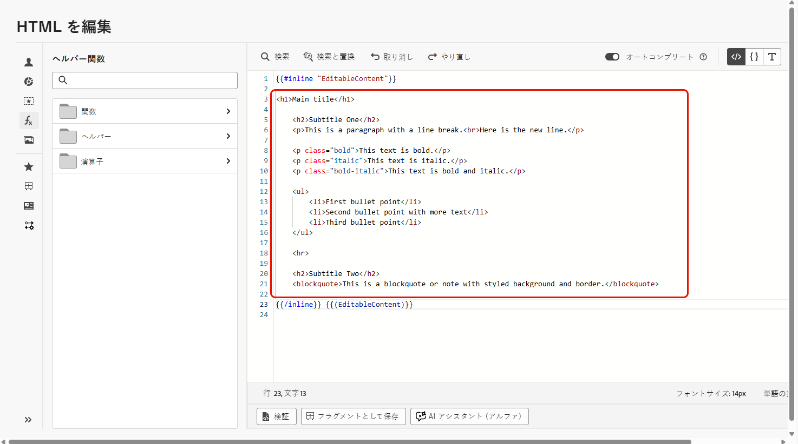

1. Within the same HTML component, add another **inline** helper function for your styling elements.

1. Replace `"name"` and `render_content` with the ID and HTML code corresponding to the default styling you want.

    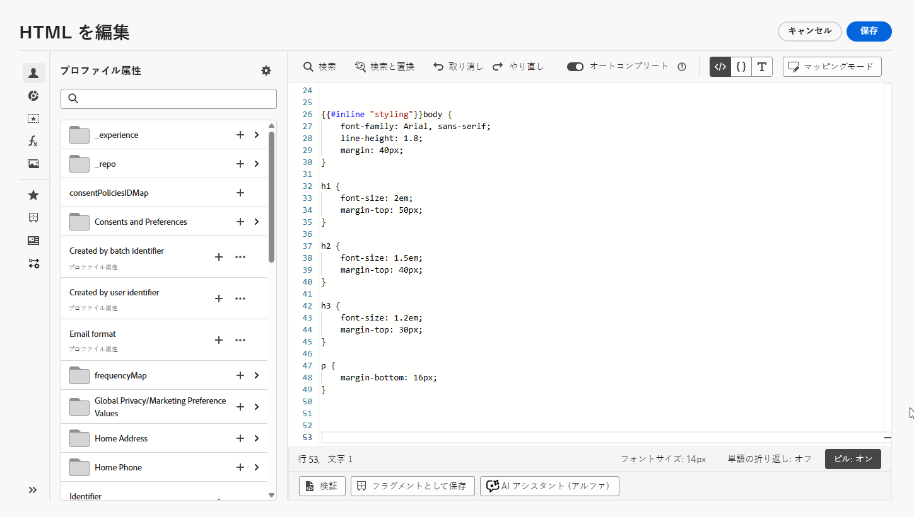

1. Save your content. The selected editable fields are displayed on the right-hand side.

    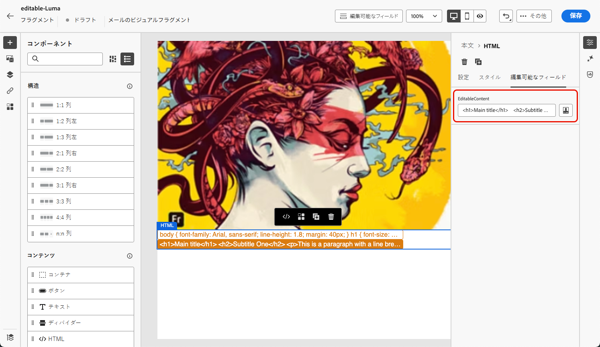

1. Save and [publish](create-fragments.md#publish) the fragment.

### Use rich text in customizable fragments {#use-rich-text}

When adding the fragment to your email, you can now edit the rich text content and styling that you created. As a marketer, follow the steps below.

1. [Create an email](../email/create-email.md) in a campaign or a journey, then add the fragment with rich text that was [created](#add-rich-text).

    You can see the two editable fields that were created on the right-hand side.

    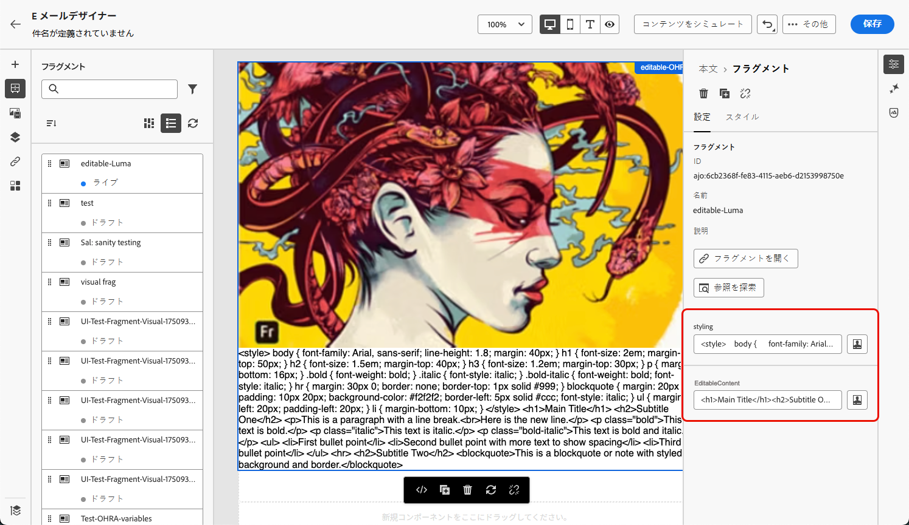

1. Use either simulation method to see how the editable content and styling render: click **[!UICONTROL Simulate content]** to test content variations with sample input data or AI auto-generation, or click **[!UICONTROL Simulate content]**, then select **[!UICONTROL Simulate content (AEP profiles)]** from the dropdown to preview with test profiles. [Learn more on previewing content](preview-test.md)

1. Select the **[!UICONTROL Add personalization]** icon next to one of the editable fields.

1. In the personalization editor that opens, update the styling and/or content as wanted by adding or removing elements of the editable field.

    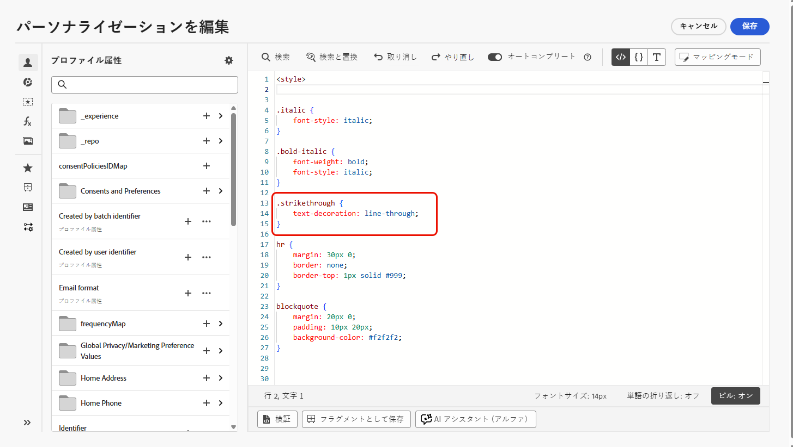

## How-to video {#video}

This video shows how to make HTML components within a fragment editable, allowing for dynamic updates to both content and styling.

>[!VIDEO](https://video.tv.adobe.com/v/3464369/?captions=jpn&learn=on&#x26;enablevpops)
-->