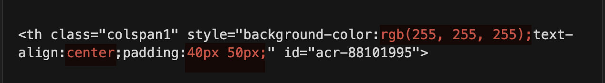
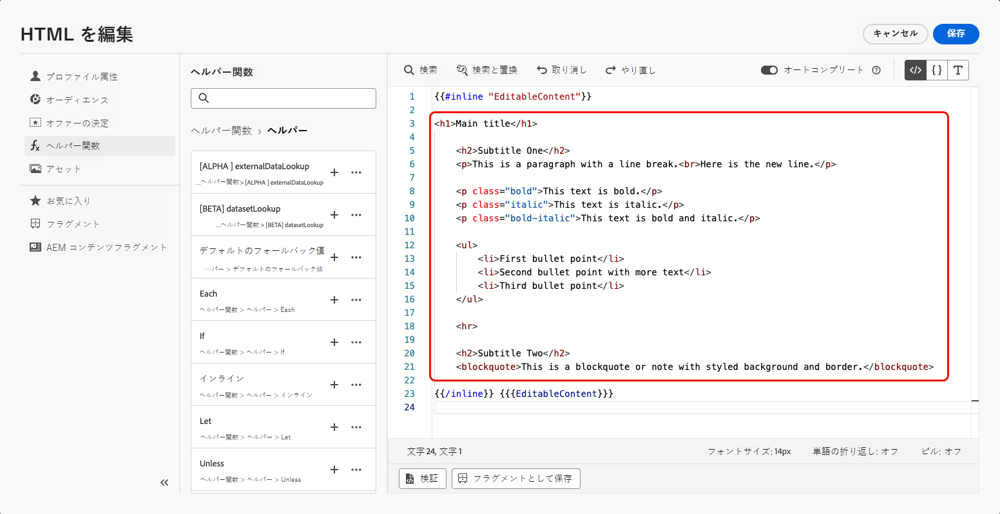
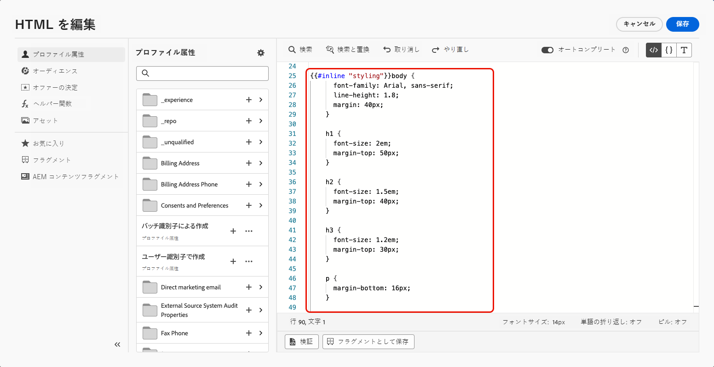
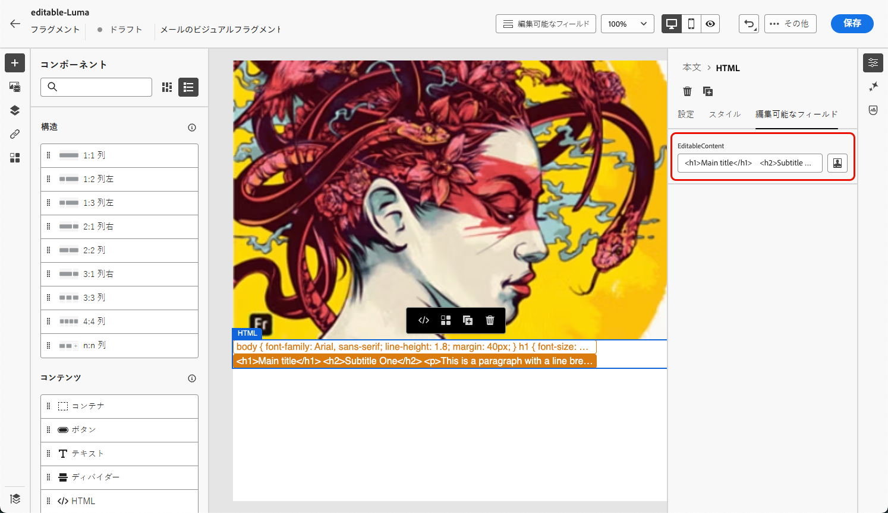
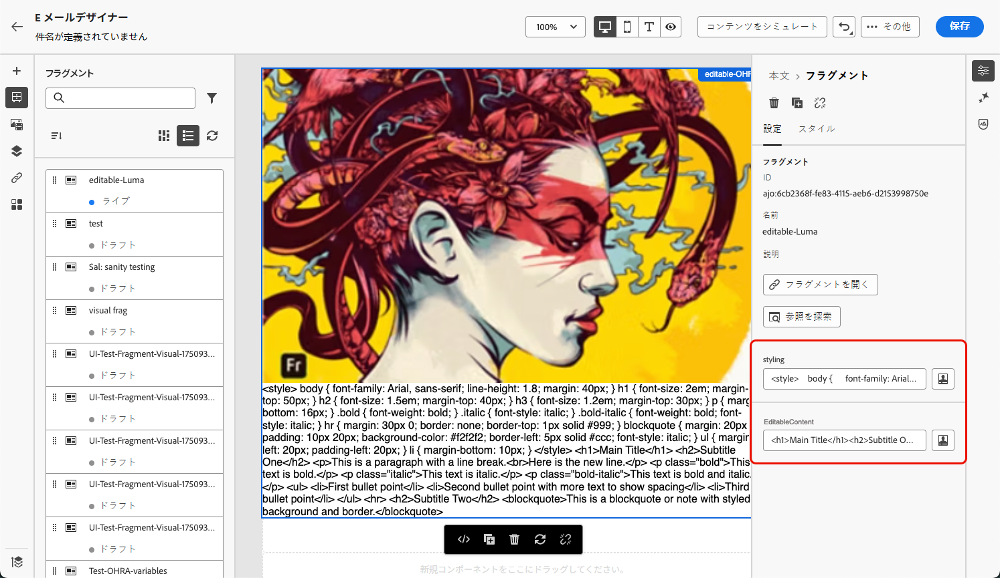
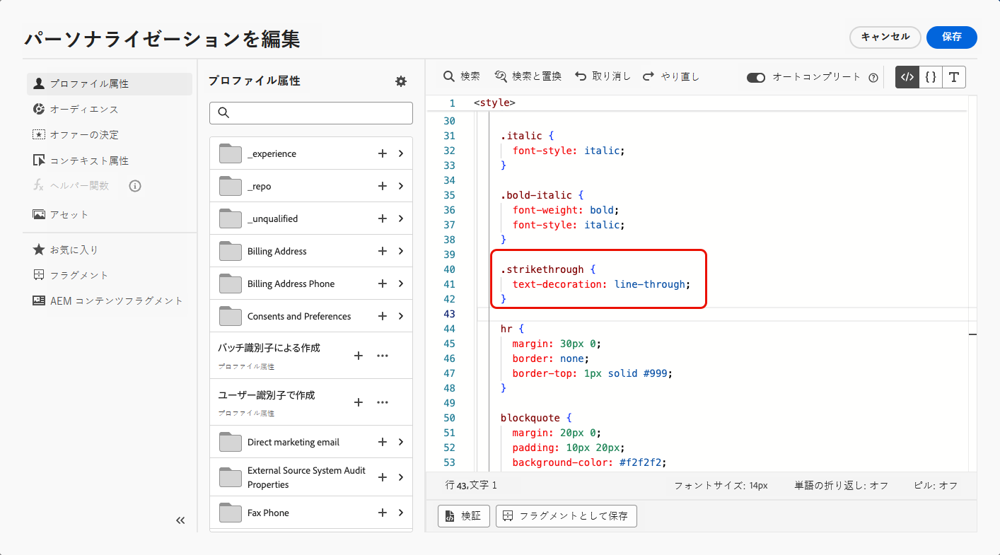

# カスタマイズ可能なフラグメント {#customizable-fragments}

キャンペーンまたはジャーニーアクションでフラグメントを使用する際、フラグメントは継承によりデフォルトでロックされます。つまり、フラグメントに対して行われた変更は、フラグメントが使用されているすべてのキャンペーンおよびジャーニーに自動的に反映されます。

**カスタマイズ可能なフラグメント** を使用すると、フラグメントがキャンペーンまたはジャーニーアクションに追加された際に、フラグメント内の特定のフィールドを編集可能として定義できます。 例えば、バナー、テキスト、ボタンを含むフラグメントがあるとします。画像やボタンのターゲット URL など、特定のフィールドを編集可能として指定できます。これにより、ユーザーはフラグメントをキャンペーンやジャーニーに組み込む際にこれらの要素を変更でき、元のフラグメントに影響を与えることなくカスタマイズされたエクスペリエンスを提供できます。

カスタマイズ可能なフラグメントにより、フラグメントの継承を解除する必要がなくなります。以前はフラグメントレベルで一元化された変更はキャンペーンやジャーニーに反映されませんでした。このアプローチにより、使用時にコンテンツ部分を調整できるので、コンテキスト固有の詳細でデフォルト値を上書きする柔軟性が得られます。

カスタマイズ可能なフラグメントを活用することで、まったく新しいコンテンツブロックを作成したり、元のフラグメントからの継承を中断したりすることなく、コンテンツを効率的に管理およびパーソナライズできます。これにより、フラグメントレベルで行われた変更が引き続き反映され、キャンペーンまたはジャーニーレベルで必要なカスタマイズが可能になります。

ビジュアルフラグメントと式フラグメントの両方をカスタマイズ可能としてマークできます。各タイプのフラグメントの処理方法について詳しくは、以下の節を参照してください。


## ビジュアルフラグメントへの編集可能なフィールドの追加 {#visual}

ビジュアルフラグメントの一部を編集可能にするには、次の手順に従います。

>[!NOTE]
>
>編集可能なフィールドは、**画像**、**テキスト**、**ボタン**&#x200B;コンポーネントに追加できます。**HTML** コンポーネントの場合、式フラグメントと同様に、パーソナライゼーションエディターを使用すると、編集可能なフィールドが追加されます。[HTML コンポーネントおよび式フラグメントに編集可能フィールドを追加する方法を説明します ](#expression)

1. フラグメントコンテンツ編集画面を開きます。

1. 編集可能なフィールドを設定するフラグメント内のコンポーネントを選択します。

1. コンポーネントのプロパティペインが右側に開きます。 **編集可能フィールド** タブを選択してから、「**編集を有効にする** オプションを切り替えます。

1. 選択したコンポーネントの編集可能なすべてのフィールドがパネルにリストされます。編集可能なフィールドは、選択したコンポーネントタイプによって異なります。

   以下の例では、「ここをクリック」ボタンの URL の編集を許可します。

   

1. 「**概要**」をクリックして、編集可能なすべてのフィールドとそのデフォルト値を確認します。

   この例では、ボタンの URL フィールドに、コンポーネントで定義したデフォルト値が表示されます。この値は、ユーザーがコンテンツにフラグメントを追加した後にカスタマイズできます。

   

1. 準備が整ったら、変更を保存してフラグメントを更新します。

1. フラグメントをメールに追加すると、ユーザーはフラグメントで設定されたすべての編集可能なフィールドをカスタマイズできます。[詳しくは、ビジュアルフラグメント内の編集可能フィールドをカスタマイズする方法を参照してください](../email/use-visual-fragments.md#customize-fields)

## HTML コンポーネントと式フラグメントに編集可能なフィールドを追加する {#expression}

HTML コンポーネントまたは式フラグメントの一部を編集可能にするには、式エディターで特定の構文を使用する必要があります。これには、フラグメントをコンテンツに追加した後にユーザーが上書きできるデフォルト値を持つ&#x200B;**変数**&#x200B;を宣言することが含まれます。

例えば、メールに追加するフラグメントを作成し、フレームやボタンの背景色など、様々な場所で使用される特定の色をユーザーがカスタマイズできるようにするとします。フラグメントを作成する際は、「color」などの&#x200B;**一意の ID** を持つ変数を宣言し、フラグメントコンテンツ内でこの色を適用する目的の場所でその変数を呼び出す必要があります。フラグメントをコンテンツに追加すると、ユーザーは変数が参照される場所で使用する色をカスタマイズできます。

HTML コンポーネントの場合、特定の要素のみを編集可能なフィールドにすることができます。詳しくは、以下の節を展開してください。

+++HTML コンポーネントの編集可能な要素：

以下の要素を、HTML コンポーネント内の編集可能なフィールドにすることができます。

* テキストの一部
* リンクまたは画像の完全な URL （URL の一部では機能しません）
* CSS プロパティ全体（部分プロパティでは機能しません）

例えば、以下のコードでは、赤色でハイライト表示された各要素をプロパティにすることができます。

{width="70%"}

+++

変数を宣言してフラグメントで使用するには、次の手順に従います。

1. 式フラグメントを開き、パーソナライゼーションエディターでそのコンテンツを編集します。

   

   HTML コンポーネントの場合は、フラグメント内のコンポーネントを選択し、「**ソースコードを表示**」ボタンをクリックします。

1. ユーザーが編集する変数を宣言します。左ナビゲーションパネルの&#x200B;**ヘルパー関数**&#x200B;メニューに移動し、**インライン**&#x200B;ヘルパー関数を追加します。変数を宣言し呼び出す構文は、コンテンツに自動的に追加されます。

   

1. `"name"` を編集可能フィールドを識別する一意の ID に置き換えます。

   >[!NOTE]
   >
   >フィールド ID は一意である必要があり、スペースを含めることはできません。コンテンツ内で変数の値を表示するすべての場所でこの ID を使用する必要があります。

1. 以下の表で説明するパラメーターを追加して、ニーズに合わせて構文を調整します。

   | アクション | パラメーター | 例 |
   | ------- | ------- | ------- |
   | 編集可能フィールドを&#x200B;**デフォルト値**&#x200B;と共に宣言します。フラグメントをコンテンツに追加する際に、カスタマイズしない場合は、このデフォルト値が使用されます。 | インラインタグの間にデフォルト値を追加します。 | `{{#inline "editableFieldID"}}default_value{{/inline}}` |
   | 編集可能フィールドの&#x200B;**ラベル**&#x200B;を定義します。このラベルは、フラグメントのフィールドを編集する際に、E メールデザイナーに表示されます。 | `name="title"` | `{{#inline "editableFieldID" name="title"}}default_value{{/inline}}` |
   | 公開する必要がある&#x200B;**画像ソース**&#x200B;を含んだ編集可能フィールドを宣言します。 | `assetType="image"` | `{{#inline "editableFieldID" assetType="image"}}default_value{{/inline}}` |
   | 追跡する必要がある **URL** を含んだ編集可能フィールドを宣言します。<br/>標準の「ミラーページの URL」と「登録解除リンク」定義済みブロックは、編集可能フィールドにすることはできません。 | `assetType="url"` | `{{#inline "editableFieldID" assetType="url"}}default_value{{/inline}}` |

1. コード内では、編集可能フィールドの値を表示するすべての場所で `{{{name}}}` 構文を使用します。`name` を、先ほど定義したフィールドの一意の ID に置き換えます。

   

1. フラグメントを保存して公開します。

ユーザーは、メールコンテンツにフラグメントを追加する際に、変数のデフォルト値を、自分で選んだ値で上書きできるようになりました。

* 式フラグメントの場合、変数値を上書きするには、特定の構文が使用されます。[詳しくは、式フラグメントの編集可能フィールドをカスタマイズする方法を参照してください](../personalization/use-expression-fragments.md#customize-fields)

* HTML コンポーネントの場合、変数は、E メールデザイナーの編集可能フィールドのリストに表示されます。[詳しくは、ビジュアルフラグメントの編集可能フィールドをカスタマイズする方法を参照してください](../email/use-visual-fragments.md#customize-fields)

### 編集可能な式フラグメントの例{#example}

以下の例では、新しいスポーツコレクションを紹介する式フラグメントを作成しています。デフォルトでは、フラグメントには次のコンテンツが表示されます。*他のアイテムもお探しですか？最新のスポーツコレクションをお見逃しなく。*

このコンテンツの「スポーツ」を、ユーザーが自分で選択したスポーツに置換できるようにします。例：*他のアイテムもお探しですか？最新のヨガコレクションをお見逃しなく。*

それには、以下の手順を実行します。

1. ID が「sport」の「sport」変数を宣言します。

   デフォルトでは、ユーザーがコンテンツにフラグメントを追加した後に変数の値を変更しない場合、`{{#inline}}` タグと `{{/inline}}` タグの間に定義された値（「sports」など）が表示されます。

1. フラグメントコンテンツ内で変数値（デフォルト値「スポーツ」か、ユーザーが選んだ値）を表示する箇所に ``{{{sport}}}`` 構文を追加します。

   

1. 式フラグメントをコンテンツに追加する際、ユーザーは式エディターから直接、変数の値を任意の値に変更できます。[詳しくは、式フラグメントの編集可能フィールドをカスタマイズする方法を参照してください](../personalization/use-expression-fragments.md#customize-fields)

   

## カスタマイズ可能なフラグメントへのリッチテキストの追加 {#rich-text}

HTML コンポーネントを使用して、改行、太字、斜体などのリッチテキストを編集可能なフラグメントに追加できます。 これを行うには、以下の手順に従います。

➡️[ このビデオで、編集可能なフラグメントにリッチテキストを追加して使用する方法を説明します ](#video)

### リッチテキストを含むフラグメントの作成 {#add-rich-text}

1. ビジュアル [ フラグメント ](create-fragments.md) を作成し、コンポーネントの追加を開始します。

1. [HTML コンポーネントを追加し ](../email/content-components.md#HTML)HTML エディターを開きます。

1. 左側のナビゲーションペインで **[!UICONTROL ヘルパー関数]** メニューに移動し、**inline** ヘルパー関数を追加します。

1. `"name"` を、編集可能なコンテンツに使用する ID に置き換えます（例：「EditableContent」）。

1. `render_content` を、必要なデフォルトのリッチコンテンツに対応するHTML コードに置き換えます。 太字、斜体、改行、箇条書きなどを追加できます。

   
<!--
    +++For example:

    ```html

    <h1>Main title</h1>

    <h2>Subtitle One</h2>
    <p>This is a paragraph with a line break.<br>Here is the new line.</p>

    <p class="bold">This text is bold.</p>
    <p class="italic">This text is italic.</p>
    <p class="bold-italic">This text is bold and italic.</p>

    <ul>
        <li>First bullet point</li>
        <li>Second bullet point with more text</li>
        <li>Third bullet point</li>
    </ul>

    <hr>

    <h2>Subtitle Two</h2>
    <blockquote>This is a blockquote or note with styled background and border.</blockquote>

    ```

    +++
-->

1. 同じHTML コンポーネント内に、スタイル設定要素用に別の **インライン** ヘルパー関数を追加します。

1. `"name"` と `render_content` を、必要なデフォルトのスタイル設定に対応する ID とHTML コードに置き換えます。

   

1. コンテンツを保存します。 選択した編集可能フィールドが右側に表示されます。

   

1. フラグメントを保存して [ 公開 ](create-fragments.md#publish) します。

### 編集可能なリッチテキストフラグメントの使用 {#use-rich-text}

フラグメントをメールコンテンツに追加する際に、ユーザーは、作成したリッチテキストコンテンツとスタイルを編集できるようになりました。 マーケターが編集可能なリッチテキストフラグメントを使用するには、次の手順に従います。

1. キャンペーンまたはジャーニーで [ メールを作成 ](../email/create-email.md) してから、（作成 [ されたリッチテキストを含むフラグメントを追加 ](#add-rich-text) ます。

   右側に作成された 2 つの編集可能なフィールドが表示されます。

   

1. **[!UICONTROL コンテンツをシミュレート]** をクリックして、編集可能なコンテンツとスタイル設定がどのようにレンダリングされるかを確認できます。 [ コンテンツのプレビューの詳細情報 ](preview-test.md)

1. 編集可能なフィールドの横にある **[!UICONTROL パーソナライゼーションを追加]** アイコンを選択します。

1. 開いたパーソナライゼーションエディターで、編集可能フィールドの要素を追加または削除して、必要に応じて <!--CSS--> スタイル設定やコンテンツを更新します。

   

## チュートリアルビデオ {#video}

このビデオでは、フラグメント内のHTML コンポーネントを編集可能にして、コンテンツとスタイルの両方を動的に更新できるようにする方法を説明します。

>[!VIDEO](https://video.tv.adobe.com/v/3464369/?learn=on&#x26;enablevpops&captions=jpn)
