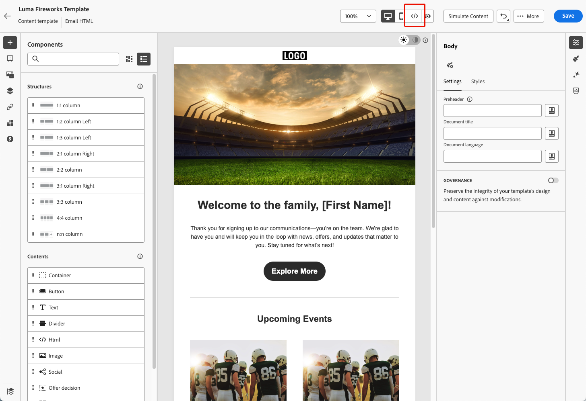

# 高度なHTML エディターでのメールテンプレートの編集 {#email-template-expert-mode}

>[!AVAILABILITY]
>
>この機能は、限定提供で使用できます。アクセス権を取得するには、アドビ担当者にお問い合わせください。

**高度なHTML エディター** は、メールコンテンツテンプレートの生のソースコードを、[!DNL Journey Optimizer] Email Designer インターフェイスから直接表示して編集できるエキスパートモードです。

この機能を使用すると、条件などの高度な式をソース内に直接挿入できます。 ビジュアル（デスクトップ）ビューに戻すと、コンテンツが再レンダリングされるので、外観を確認して、どちらのビューでも編集を続行できます。

>[!NOTE]
>
>この機能は、コンテンツテンプレートおよびメールチャネルでのみ使用できます。

## ガードレール {#guardrails}

高度なHTML エディターを使用する場合、コンテンツの互換性を保護し、期待値を設定するために、次のガードレールが用意されています。

* 現在、高度なHTML エディターには **検証プロセスなし** があります。 構文エラーや壊れたレイアウトはチェックされません。 保存する前に、コンテンツを慎重に確認してください。

* 今後のシステムアップデートにより、デフォルトのマークアップに対して行われた変更が元に戻される場合があります。 **変更内容が上書きされる場合があります**。

* カスタムコードと手動の変更によって発生した問題 **トラブルシューティングはできません**、または [!DNL Adobe] サポートチームによって解決されます。 以前のバージョンに戻す必要がある場合は、コンテンツのバックアップを作成します。

* コンテンツの互換性を確保するために、HTMLの高度な表示では **保存を使用できません**。 変更を保存する準備ができたら、デスクトップビューに戻す必要があります。

>[!WARNING]
>
>コンテンツテンプレートの高度なHTML エディターは、メールDesignerの **[!UICONTROL 独自にコーディング]** モードとは異なります。 [!UICONTROL &#x200B; 独自にコーディング &#x200B;] モードでは、ビジュアルエディターに戻すことはできません。そのパスを選択すると、コードのみの編集になります。 これに対して、高度なHTML エディターでは、HTML表示とデスクトップ（ビジュアル）表示をいつでも切り替えることができます。 [詳しくは、コードエディターを参照してください](../email/code-content.md)

## HTMLの詳細表示に切り替える {#switch-to-desktop-view}

1. [&#x200B; メールテンプレート &#x200B;](../content-management/create-content-templates.md) を開くか作成し、[&#x200B; メールDesigner](../email/get-started-email-design.md) を開いてコンテンツを編集します。

1. 画面の右上隅にある「**[!UICONTROL HTML]**」ボタンをクリックします。

   

1. 高度なHTML エディターを初めて開くと、警告メッセージが表示されます。 慎重に確認し、「**[!UICONTROL OK]**」をクリックして続行します。 [詳細情報](#guardrails)

   >[!NOTE]
   >
   >この警告は、HTMLの詳細編集を初めて開いたときに表示され、毎月リセットされます。

   {zoomable="yes"}

1. 高度なHTML エディターが表示されます。

   

1. メールコンテンツに必要な変更を追加します。

   >[!WARNING]
   >
   >構文の検証プロセスはなく、[!DNL Adobe] によるサポートも提供されていないので、正しいHTMLと CSS コードを入力してください。 [詳細情報](#guardrails)

1. HTMLの詳細表示では、保存機能は使用できません。 デスクトップビューに戻って変更を保存します。

   {zoomable="yes"}

   >[!NOTE]
   >
   >コンテンツは、コンテンツの互換性の理由から、デスクトップ表示でのみ保存できます。 編集内容は、ビューを切り替えても保持されます。

1. HTMLの高度な表示では、コンテンツシミュレーションは使用できません。 コンテンツをシミュレートするには、デスクトップビューに切り替えます。

   {zoomable="yes"}

