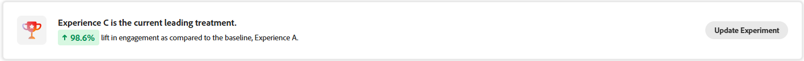

# 実行の追跡 {#monitor}

「**[!UICONTROL 実験]**」タブでは、Adobe Journey Optimizer と Adobe Target のテストのトラッキングと分析が一元化されます。すべての実験を表示し、KPI を確認し、フィルタリングまたは検索して特定のテストを見つけることができます。

## ダッシュボード {#dashboard}

「実験」タブにアクセスすると、Journey Optimizer と Adobe Target の使用可能なすべての実験が統合ビューにリストされます。これにより、両方のプラットフォームをまたいで実験を 1 か所ですばやく確認および比較できます。
実験リストには、以下が含まれます。

* キャンペーンまたはジャーニーのいずれかで作成された Journey Optimizer 実験。

* 同じ IMS 組織にリンクされた Journey Optimizer 実稼動デフォルトサンドボックスで使用可能な Adobe Target 実験。

「KPI」セクションには、作成された実験の合計数や現在処理中の実験の数を含む主要指標が表示され、全体的な実験アクティビティのスナップショットが示されます。

「」をクリックしてフィルターにアクセスします。これにより、**[!UICONTROL タイプ]**、**[!UICONTROL スター付き]**、**[!UICONTROL ステータス]**、**[!UICONTROL ソース]**&#x200B;によるフィルタリングなどのコンテキスト固有のオプションを使用できます。例えば、Journey Optimizer からのアクティブな実験のみを表示するようにフィルタリングできます。

または、検索バーに実験の名前を入力して、実験をすばやく見つけることもできます。

## 実験の監視 {#monitor-page}

実験にアクセスして監視するには、「**[!UICONTROL 実験]**」タブの実験のリストから以前に設定した実験を選択するか、詳細設定メニューを使用して「**[!UICONTROL 詳細を表示]**」または「**[!UICONTROL ソースで開く]**」を選択します。

実験の詳細ページは、次のセクションに分割されています。

* [実験結果](#experiment-outcome)
* [仮説](#hypothesis)
* [詳細](#details)
* [機会](#opportunities)
* [結果](#results)
* [実験のインサイト](#insights)

### 実験結果 {#experiment-outcome}

**[!UICONTROL 実験結果]**&#x200B;では、実験の勝利バリエーションをすばやく確認できます。

### 設定 {#set-up}

**[!UICONTROL 仮説]**&#x200B;では、テストされる予定の変更をキャプチャし、プライマリ指標への予想される影響を文書化します。明確な&#x200B;**[!UICONTROL 仮説]**&#x200B;を定義すると、各実験に測定可能な目的が確保され、結果を評価し、変更が有意義な改善につながるかどうかを判断しやすくなります。

[実験のインサイト](#insights)を生成するには、仮説と処理の詳細および統計的優位差を確認する必要があります。

1. 「**[!UICONTROL 追加]**」をクリックして、実験の&#x200B;**[!UICONTROL 仮説]**&#x200B;を作成します。

   

1. **[!UICONTROL 仮説]**&#x200B;の入力では、行われた変更とプライマリ指標に与える影響を詳しく記述します。

   「**[!UICONTROL 保存]**」をクリックします。

1. 「**[!UICONTROL レビュー]**」をクリックして、各処理の画像を追加または置換します。

   

1. 処理画像は自動的に生成されますが、必要に応じて、「**[!UICONTROL 画像を追加]**」または「**[!UICONTROL 画像を置換]**」を選択して、ローカルファイルから「**[!UICONTROL 処理]**」用の優先スクリーンショットをアップロードできます。

   スクリーンショットはページ全体をキャプチャする必要があります。

1. 必要に応じて、「」アイコンをクリックして&#x200B;**[!UICONTROL 仮説]**&#x200B;を更新します。

**[!UICONTROL 仮説]**&#x200B;の設定が完了したら、貴重な[インサイト](#insights)と[機会](#opportunities)が得られます。

### 詳細 {#details}

**[!UICONTROL 実験効果]**&#x200B;ウィジェットでは、実験がターゲットオーディエンスセグメントに与えた影響を詳細に確認できます。これは、エンゲージメントと行動を評価するのに役立つ次の主要業績評価指標を示します。

* 実験の作成時に設定された内容に応じて、Journey Optimizer からの&#x200B;**[!UICONTROL 成功指標]**&#x200B;または Adobe Target からの&#x200B;**[!UICONTROL プライマリ指標]**。

* **[!UICONTROL 訪問者数]**：実験に公開されたユニーク訪問者の合計数。

また、次の指標を通じて、主要な処理のパフォーマンスのリアルタイムスナップショットを表示することもできます。

* **[!UICONTROL 現在のリーダー]**：現在、最高のパフォーマンスを発揮している処理を特定します。

* **[!UICONTROL ベースライン上の上昇率]**：コントロールまたはベースラインと比較した主要な処理の改善率を測定します。

* 実験の作成時に設定された内容に応じて、Journey Optimizer からの&#x200B;**[!UICONTROL 成功指標]**&#x200B;または Adobe Target からの&#x200B;**[!UICONTROL プライマリ指標]**。

ウィジェットの下部には、次の実験設定の簡潔な概要が表示されます。

* 実験の作成時に設定された内容に応じて、Journey Optimizer からの&#x200B;**[!UICONTROL 成功指標]**&#x200B;または Adobe Target からの&#x200B;**[!UICONTROL プライマリ指標]**。

* **[!UICONTROL 処理数]**：テストしたバリエーションの合計数。

* **[!UICONTROL オーディエンス]**：実験のターゲットにする定義済みのユーザーセグメント。

### 機会 {#opportunities}

>[!AVAILABILITY]
>
>機会機能は、テキストベースの変更を含む実験に制限されています。

**[!UICONTROL 機会]**&#x200B;パネルには、テストのパフォーマンスを向上させ、より広範なビジネス目標と KPI に一致するように設計された AI 生成のレコメンデーションが表示されます。

実験の機会を生成するには、まず、[仮説と処理の詳細](#set-up)を確認する必要があります。

1. 提案された機会を参照し、「**[!UICONTROL 機会を表示]**」をクリックします。

   

1. 機会を選択すると、**機会の詳細**&#x200B;ウィンドウが開き、Journey Optimizer 実験アクセラレーターにより提案された特定の処理やバリエーションの概要が表示されます。この表示には、以下が含まれます。

   * **[!UICONTROL 仮説]**：提案された処理の予想される結果を説明する AI 生成の仮説。

   * **[!UICONTROL 論理的根拠]**：Journey Optimizer 実験アクセラレーターがこの機会を提案した理由の説明。

   * **[!UICONTROL 機会評価]**：以下に基づいたレコメンデーションの二重評価。

      * **[!UICONTROL 学習の可能性]**：過去にテストされたものとの違いに基づいて、この機会が新しいインサイトを提供できる程度の推定値。

      * **[!UICONTROL コンバージョンの可能性]**：過去にうまく機能してきた戦略との類似性に基づいて、この機会が現在の処理を上回る可能性の推定値。
   <!--
   * **[!UICONTROL New text treatment example]**: Words or phrases that demonstrate the style the AI recommends using.
   -->

   

1. その後、「**[!UICONTROL 実験を開く]**」を選択して、実験に直接追加できます。

1. 元の実験が Adobe Journey Optimizer で作成および管理されている場合、このアクションにより、このキャンペーン内で&#x200B;**[!UICONTROL コンテンツ実験パネル]**&#x200B;が開きます。

   **[!DNL Adobe Target]** から実行される実験の場合、提案された変更は代わりに **[!DNL Adobe Target]** の実験ワークフローに読み込まれます。

   ➡️ [詳しくは、Adobe Target ドキュメントを参照してください。](https://experienceleague.adobe.com/ja/docs/target/using/activities/abtest/test-ab)

1. 実験ビュー内では、Journey Optimizer 実験アクセラレーターにより表示されたものと同じ AI **[!UICONTROL 実験機会]**&#x200B;にアクセスできます。

   「**[!UICONTROL 表示]**」を選択して、機会の詳細を開きます。

1. 提案された変更を適用するには、「**[!UICONTROL 実験を変更]**」を選択して、既存の実験を直接編集できます。

### 結果 {#results}

**[!UICONTROL 結果]**&#x200B;テーブルには、実験内の各処理の詳細なパフォーマンスの分類が表示されます。これらのインジケーターは、有効性、ユーザーエンゲージメント、主要なビジネス成果への全体的な影響を評価するのに役立ちます。

* **[!UICONTROL 場所]**：パフォーマンスに基づく処理のランキング位置で、他の処理との比較を示します。

* 実験の作成時に設定された内容に応じて、Journey Optimizer からの&#x200B;**[!UICONTROL 成功指標]**&#x200B;または Adobe Target からの&#x200B;**[!UICONTROL プライマリ指標]**。

* **[!UICONTROL ユーザー]**：メッセージのターゲットプロファイルに適格な、ユーザープロファイルの数。

* **[!UICONTROL 上昇率]**：ベースラインに対する特定の処理のコンバージョン率の向上率を測定します。

* **[!UICONTROL 信頼性]**：ある処理がベースライン処理と同じであることを示す証拠。[詳細情報](../content-management/experiment-calculations.md#understand-confidence)

* **[!UICONTROL コンバージョン率]**：処理を確認した後に目的のアクション（例：購入、新規登録）を完了したプロファイルの割合。

### 実験のインサイト {#insights}

>[!AVAILABILITY]
>
>実験のインサイト機能は、テキストベースの変更を含む実験に制限されています。

**[!UICONTROL 実験のインサイト]**&#x200B;は、この実験から派生した AI 生成の学習結果です。これらのインサイトは、実験が統計的優位差に達すると使用可能になり、実験の成功に貢献した内容を文脈的に理解できます。これらは、コントロールとは異なる、結果に影響を与えた可能性のある、勝利した処理に存在する主要な属性をハイライト表示します。

実験のインサイトを生成するには、まず[仮説と処理の詳細](#set-up)および到達すべき統計的優位差を確認する必要があります。

各インサイトの詳細を確認するには、「**[!UICONTROL 詳細を表示]**」をクリックします。

 

