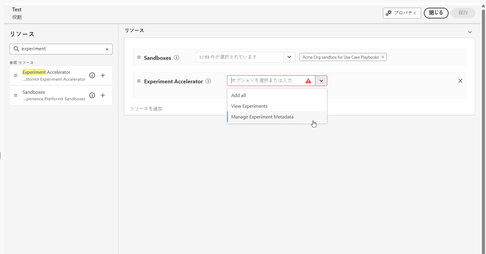

# Journey Optimizer 実験アクセラレーターの基本を学ぶ {#content-experiment}

>[!AVAILABILITY]
>
>**Journey Optimizer Experimentation Accelerator** には、お客様に対して有料ライセンスが必要で、Adobe TargetまたはAdobe Journey Optimizerとシームレスに統合されます。

**Journey Optimizer 実験アクセラレーター**&#x200B;は、実験プロセスの効率化および強化を目的に設計された強力なツールです。Adobe Target および Adobe Journey Optimizer と統合することで、実験を管理、分析、最適化する一元化されたプラットフォームを提供します。Journey Optimizer 実験アクセラレーターは、AI 駆動型のインサイトとアダプティブテストを活用し、データ主導の決定、マーケティング戦略の改善、測定可能な結果の推進を実現します。

主なメリットは次のとおりです。

* **より迅速な実験**：時間の経過と共に調整されるモデルを使用して、アダプティブな常時稼動テストを実行します。

* **統合プラットフォーム**：Adobe Target と Journey Optimizer のすべての実験を 1 か所で管理します。

* **AI 駆動型インサイト**：主要な調査結果、パフォーマンスの推進要因、新しい機会を自動的に表示します。

* **よりスマートなターゲティング**：行動データとコンテンツデータを使用して、効果的な実験を優先します。

* **KPI の監視**：実験をまたいで上昇率や信頼性などの指標を追跡します。

* **シームレスな共同作業**：リアルタイムアラートを使用して結果を簡単に共有し、チームの役割を管理します。

## Journey Optimizer 実験アクセラレーターへのアクセス

[実験を作成および設定](content-experiment.md)し、キャンペーンまたはジャーニーをプロファイルに送信した後、**[!UICONTROL Journey Optimizer 実験アクセラレーター]**&#x200B;にアクセスして、実験のパフォーマンスをより深く掘り下げることができます。

**[!UICONTROL Journey Optimizer 実験アクセラレーター]**&#x200B;には、[!UICONTROL 実験]ドロップダウンの左側のメニューから、またはアプリスイッチャーからアクセスできます。Target ライセンスのみを持つユーザーは、アプリスイッチャーを通じてのみアクセスできます。

使用可能な実験は、設定によって異なります。

* **Adobe Journey Optimizer ユーザーの場合**：有効にした組織のサンドボックスで設定した実験は自動的に含まれます。

* **Journey Optimizer を使用している Adobe Target ユーザーの場合**：Target の任意の A/B アクティビティは、Journey Optimizer の実稼動サンドボックス内の **[!UICONTROL Journey Optimizer 実験アクセラレーター]**&#x200B;に表示されます。

* **Adobe Target のみのユーザーの場合**：Target 組織内のすべての A/B アクティビティは、Journey Optimizer の実稼動サンドボックスに含まれます。

**[!UICONTROL Journey Optimizer 実験アクセラレーター]**&#x200B;を使用するには、サンドボックスにアクセスし、関連する権限に従う必要があります。

* **[!UICONTROL 実験を表示]**
* **[!UICONTROL 実験メタデータを管理]**

+++ 実験関連の権限を割り当てる方法について説明します

1. **[!DNL Permissions]** 製品で、「**[!UICONTROL 役割]**」タブに移動し、目的の「**[!UICONTROL 役割]**」を選択します。

1. 「**[!UICONTROL 編集]**」をクリックして、権限を変更します。

1. **[!UICONTROL 実験アクセラレーター]**&#x200B;のリソースを追加し、ドロップダウンメニューから「**[!UICONTROL 実験を表示]**」または「**[!UICONTROL 実験メタデータを管理]**」を選択します。

   

1. 「**[!UICONTROL 保存]**」をクリックして、変更を適用します。

この役割に既に割り当てられているユーザーの権限は、自動的に更新されます。

この役割を新しいユーザーに割り当てるには：

1. 役割ダッシュボード内の「**[!UICONTROL ユーザー]**」タブに移動し、「**[!UICONTROL ユーザーを追加]**」をクリックします。

1. ユーザーの名前、メールアドレスを入力するか、リストから選択して、「**[!UICONTROL 保存]**」をクリックします。

   まだユーザーを作成していない場合は、[このドキュメント](https://experienceleague.adobe.com/ja/docs/experience-platform/access-control/abac/permissions-ui/users)を参照してください。

ユーザーは、インスタンスにアクセスする手順が記載されたメールを受信します。

+++

<!--table style="table-layout:fixed"><tr style="border: 0;">
<td>

<strong><a href="experiment-accelerator-overview.md">Overview</a></strong>

</td>
<td>

<strong><a href="experiment-accelerator-monitor.md">Experiments</a></strong>

</td>
<td>

<strong><a href="experiment-accelerator-metrics.md">Metrics</a></strong>

</td>
</tr></table-->
