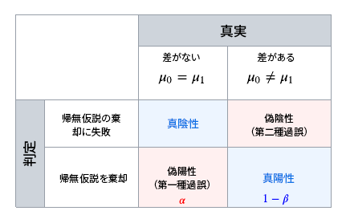

# 統計計算について {#experiment-calculations}

この記事では、Adobe Journey Optimizer で実験を実行する際に使用される統計計算について説明します。

実験では、[高度な統計手法](../content-management/assets/confidence_sequence_technical_details.pdf)を使用して&#x200B;**信頼性シーケンス**&#x200B;および&#x200B;**信頼性**&#x200B;を計算し、必要に応じて実験を実行し、結果を継続的に監視できます。

この記事では、実験の仕組みを説明し、アドビの&#x200B;**常に有効な信頼性シーケンス**&#x200B;について分かりやすく紹介します。

エキスパートユーザー向けの技術的な詳細と参照について詳しくは、[このページ](../content-management/assets/confidence_sequence_technical_details.pdf)を参照してください。

## 統計テストとエラーの制御 {#statistical-testing}

実験を実行する際は、2 つの母集団間に違いがあるかどうかと、その違いが偶然による可能性があるかどうかを判断しようとします。

一般に、次の 2 つの仮説があります。

* **null 仮説（帰無仮説）**&#x200B;は、処理にエフェクトがないことを表します。
* **対立仮説**&#x200B;は、処理にエフェクトがあることを表します。

統計的有意差の目標は、null 仮説を却下する証拠の強度を評価することです。注意すべき重要な点の 1 つは、統計的有意差は、処理法が成功する可能性の高さではなく、異なる可能性の程度を判断するために使用されるということです。このため、統計的有意差は、**上昇率**&#x200B;と組み合わせて使用されます。

効果的な実験を行うには、誤った推論を引き起こす可能性のある様々なタイプのエラーを考慮する必要があります。

上の表に、様々なエラーのタイプを示します。

* **偽陽性（Type-I エラー）**：null 仮説が実際には真の場合に、誤って却下されてしまうことです。オンライン実験のコンテキストでは、同じ結果であったにもかかわらず、各処理で結果指標が異なると誤って結論付けてしまうことを意味します。
   実験を実行する前に、通常、しきい値を選択します`\alpha`。実験の実行後、`p-value` が計算され、`null if p < \alpha` は却下されます。`/alpha` の選択は、間違った回答が得られた場合の結果に基づいて行われます。例えば、他のユーザーへのサポートに影響を与える可能性がある論理的な試験では、`\alpha = 0.005` を選択する場合があります。オンライン実験で一般的に使用されるしきい値は `\alpha = 0.05` です。これは、長期的に見て、100 回の実験のうち 5 回は偽陽性であると想定することを意味します。

* **偽陰性（Type-II エラー）**：null 仮説が偽であるにもかかわらず、却下できないことを意味します。実験の場合、実際には異なる場合に、null 仮説を却下しないことを意味します。このタイプのエラーを制御するには、通常、`1 - \beta`（つまり、1 から Type-II エラーの確率を引いた値）と定義される特定の Power を保証するために、実験に十分なユーザーが必要です。

ほとんどの統計的推論手法では、検証する効果のサイズに基づいて、事前にサンプルサイズおよびエラー許容値（`\alpha` および `\beta`）を修正する必要があります。ただし、Adobe Journey Optimizer の手法は、任意のサンプルサイズに対して、継続的に結果を確認できるように設計されています。

## アドビの統計手法：常に有効な信頼性シーケンス

**信頼性シーケンス**&#x200B;は、**信頼区間**&#x200B;の連続的類似性で、例えば、実験を 100 回繰り返し、実験に参加する新規ユーザーごとに、平均指標とそれに関連する 95％信頼性シーケンスの推定値を計算します。95％の信頼性シーケンスは、実行した 100 件の実験のうち 95 件の指標の true の値を含みます。95%の信頼区間は、同じ 95％の範囲を保証するために、実験ごとに 1 回だけ計算でき、新規ユーザーごとの計算はできません。したがって、信頼性シーケンスを使用すると、偽陽性エラー率を増やすことなく、実験を継続的に監視できます。

以下のアニメーションに、1 つの実験に対する信頼性シーケンスと信頼区間の違いを示します。

**信頼性シーケンス**&#x200B;は、統計的優位差のしきい値に基づいて null 仮説を却下するか否かではなく、処理間の平均の違いの正確な推定に焦点を当て、仮説テストの代わりに推定に対して実験の焦点を移します。

しかし、`p-values`や&#x200B;**信頼性**、および&#x200B;**信頼区間**&#x200B;の関係と同様に、**信頼性シーケンス**&#x200B;および常に有効な `p-values` または常に有効な信頼性の関係も存在します。信頼性のような数値は使いやすいので、アドビでは、レポートで、**信頼性シーケンス**&#x200B;および常に有効な信頼性の両方を提供します。

**信頼性シーケンス**&#x200B;の理論的基礎は、マルチンゲールとして知られる確率変数の数列の研究に由来しています。エキスパート読者向けの主な結果は以下のとおりですが、実務担当者向けの留意点はより明確です。

>[!NOTE]
>
>信頼性シーケンスは、信頼区間の安全な順次アナログとして解釈できます。信頼区間を使用すると、事前に定義されたサンプルサイズに達した場合にのみ実験を解釈できます。ただし、信頼性シーケンスを使用すると、必要に応じて実験のデータを確認して解釈でき、実験を安全に停止または続行できます。対応する常に有効な信頼性、つまり `p-value` もいつでも安全に解釈できます。

信頼性シーケンスは「常に有効」なので、同じサンプルサイズで使用される固定水平線手法よりも控えめな方法であることに注意する必要があります。信頼性シーケンスの範囲は、一般に信頼区間の計算よりも広くなりますが、常に有効な信頼性は、固定水平線の信頼性の計算よりも小さくなります。この保守的傾向の利点は、常に安全に結果を解釈できることです。

## 実験が決定的であると宣言する

ユーザーが実験レポートを表示するたびに、アドビはその時点まで実験で累積したデータを分析し、常に有効な信頼性が少なくとも 1 つの処理のしきい値 95％を超えると、実験が「決定的」であることを宣言します。

この時点で、（コンバージョン率またはプロファイルで正規化された指標値に基づいて）最もパフォーマンスの高い処理がレポート画面の上部にハイライト表示され、表形式レポートに星印が表示されます。この決定では、ベースラインとともに信頼性が 95％を超える処理のみが考慮されます。

2 つ以上の処理がある場合、ボンフェローニ補正リンクを使用して複数の比較問題を修正し、ファミリー単位のエラー率を制御します。このシナリオでは、信頼性が 95％を超え、信頼区間が重複する複数の処理が存在する可能性もあります。この場合、Adobe Journey Optimizer は、最も高いコンバージョン率（またはプロファイルで正規化された指標値）があるものを最もパフォーマンスの高い処理であると宣言します。
