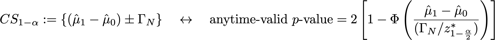

# 実験レポートの統計計算について {#experiment-report-calculations}

このページでは、Adobe Journey Optimizer のキャンペーンの実験レポートで使用される詳細な統計計算について説明します。

このページは、技術ユーザーを対象としています。

## コンバージョン率

実験の各処理 `ν` のコンバージョン率または&#x200B;**平均** μν は、指標の合計と、その指標に割り当てられたプロファイルの数 Nν との比率として定義されます。

{width="125" align="center"}

ここで、Yiν は、特定のバリアント *ν* に割り当てられた各プロファイル `i` の目標指標の値です。目標指標が「一意」の指標である（つまり、特定のアクションを実行しているプロファイル数のカウントである）場合、これはコンバージョン率としてパーセンテージで表示されます。指標が「カウント」または「合計値」指標（メールの開封数、売上高など）の場合、指標の平均推定値は「プロファイルあたりのカウント」または「プロファイルあたりの値」として表示されます。

必要に応じて、サンプルの標準偏差を式と共に使用します。

{width="225" align="center"}

## 上昇率 {#lift}

バリアント *ν* とコントロールバリアント *ν0* の間の上昇率は、コンバージョン率の相対的な「デルタ」であり、個々のコンバージョン率が上記で定義されている場合に、以下の計算として定義されます。この値はパーセンテージで表示されます。

{width="125" align="center"}

 

## 個々の処理で常に有効な信頼区間

ジャーニー実験パネルには、実験の個々の処理に対する「常に有効な」信頼区間（信頼性シーケンス）が表示されます。

個々のバリアント `ν` の信頼性シーケンスは、アドビが使用する統計手法の中心です。その定義について詳しくは、[このページ](https://doi.org/10.48550/arXiv.2103.06476)（[Waudby-Smith et al.] から転載）を参照してください。

実験でのバリアントのコンバージョン率などのターゲットパラメーター `ψ` の推定に興味がある場合、一連の「固定時間」信頼区間（CI）と時間一様信頼性シーケンス（CS）との間の二分法は、次のように要約できます。

{width="500" align="center"}

通常の信頼区間の場合、ターゲットパラメーターが Ċn の値の範囲内にあるという確率論的保証は、`n`（`n` はサンプル数）の単一の固定値でのみ有効です。逆に、信頼性シーケンスの場合、サンプルサイズ `t` のすべての時間／すべての値で、対象のパラメーターの「true」値が範囲内にあることが保証されます。

これには、オンラインテストにとって非常に重要な深い意味がいくつかあります。

* CS は、新しいデータが使用可能になるたびに、オプションで更新できます。
* 実験は、継続的に監視したり、適応的に停止したり、継続したりできます。
* Type-I エラーは、データに依存する時間も含めて、すべての停止時間で制御されます。

アドビでは、平均推定値 `μ` を持つ個々のバリアントの形式が次のような漸近的信頼性シーケンスを使用しています。

{width="300" align="center"}

ここで、

* `N` は、そのバリアントの単位数です。
* `σ` は、標準偏差（上記で定義）のサンプル推定値です。
* `α` は、Type-I エラー（または誤検出確率）の望ましいレベルです。これは、常に 0.05 に設定されています。
* ρ2 は、CS が最も厳密なサンプルサイズを調整する定数です。アドビは、ρ2 = 10-2.8 というユニバーサル値を選択しました。これは、オンライン実験で見られるコンバージョン率のタイプに適しています。

## 信頼性 {#confidence}

アドビが使用する信頼性は、「常に有効な」信頼性であり、平均処理効果の信頼性シーケンスを反転することによって得られます。

正確には、2 つのバリアント間の平均値の差に対する 2 つのサンプル *t* テストでは、このテストの :1p *値と平均値の差の信頼区間の間に 1* マッピングがあります。 同様に、常に有効な *p* 値は、平均処理効果推定量の（常に有効な）信頼シーケンスを反転することによって得られます。

{width="200" align="center"}

ここで *E* は期待値です。使用される推定量は、逆傾向重み付け（IPW）推定量です。N = N0 + N1 単位、単位がバリアント `ν`=0,1 に割り当てられている場合、Ai=0,1 でラベル付けされた各単位 `i` のバリアント割り当てを考慮してください。ユーザーに固定確率（傾向）π0, (1-π0) が割り当てられ、その結果指標が Yi である場合、平均処理効果の IPW 推定量は次のようになります。

{width="400" align="center"}

*f* が影響関数であることに注意して、Waudby-Smith et al.では、この推定量の信頼性シーケンスが次のようになることを示しました。

{width="500" align="center"}

割り当て確率をその経験的推定値で置き換えると、π0 = N0/N、平方偏差項は、個々のサンプル平均推定値 μ0,1 と標準偏差推定値 σ0,1 で次のように表すことができます。

{width="500" align="center"}

次に、テスト統計量 z = (μA-μ0/σp) を使用した通常の仮説テストでは、`p` 値と信頼区間の間に対応関係があることを思い出してください。

{width="500" align="center"}

ここで、`Φ` は標準正規分布の累積分布です。常に有効な `p` 値については、上記で定義された平均処理効果の信頼性シーケンスを指定すると、この関係を反転できます。

{width="600" align="center"}

最後に、**常に有効な信頼性**&#x200B;は次のとおりです。

{width="200" align="center"}

## 実験が決定的であると宣言する

2 つのアームを使用する実験の場合、Journey Optimizer の実験パネルには、常に有効な信頼性が 95％を超えた場合（常に有効な `p` 値が 5％未満）に実験が&#x200B;**決定的**&#x200B;であるというメッセージが表示されます。

3 つ以上のバリアントが存在する場合は、ファミリーごとのエラー率を制御するために、ボンフェローニ補正が適用されます。`K` の処理と単一のベースライン（コントロール）処理による実験では、`K-1` 回の独立仮説テストが行われます。ボンフェローニ補正とは、常に有効な `p` 値（上記で定義）がしきい値 `α/(K-1)` を下回っている場合、コントロールと特定のバリアントの平均が等しいという帰無仮説が棄却されることを意味します。

## 最もパフォーマンスの高いアーム

実験が決定的であると宣言されると、最もパフォーマンスの高いアームが表示されます。このアームは、コントロールを含むセットと、`p`（ボンフェローニしきい値を下回る値）を持つすべてのアームの中で、最もパフォーマンスが高い（平均またはコンバージョン率が最も高い）アームです。
