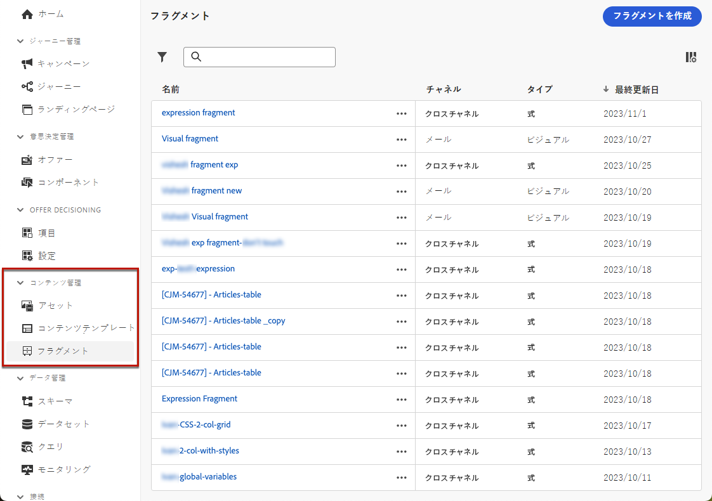

# フラグメントの基本を学ぶ {#fragments}

>[!CONTEXTUALHELP]
>id="ajo_create_fragment"
>title="独自のフラグメントを定義"
>abstract="スタンドアロンのフラグメントを作成および管理して、複数のジャーニーやキャンペーンでコンテンツを再利用できるようにします。"
>additional-url="https://experienceleague.adobe.com/ja/docs/journey-optimizer/using/content-management/fragments/create-fragments" text="フラグメントを作成"

フラグメントは、[!DNL Journey Optimizer] キャンペーンおよびジャーニー全体で 1 つ以上のメールで参照できる再利用可能なコンポーネントです。この機能を使用すると、マーケティングユーザーが改善されたデザインプロセスでメールコンテンツをすばやく組み立てるために使用できる複数のカスタムコンテンツブロックを事前に作成できます。

➡️ [フラグメントの管理、作成、使用方法については、これらのビデオをご覧ください](#video-fragments)

フラグメントを最大限に活用するには：

* **独自のフラグメントを作成**：ビジュアルフラグメントまたは式フラグメントを、ゼロから作成するか、コンテンツをフラグメントとして保存して作成します。[フラグメントの作成方法を学ぶ](#create-fragments)また、Journey Optimizer の **Content REST API** を活用すると、コンテンツフラグメントを管理できます。詳しくは、[Journey Optimizer API ドキュメント](https://developer.adobe.com/journey-optimizer-apis/references/content/){target="_blank"}を参照してください。
* **フラグメントの再利用**：作成したフラグメントを、必要な回数だけコンテンツで使用します。[ビジュアルフラグメントの追加](../email/use-visual-fragments.md)および[式フラグメントの活用](../personalization/use-expression-fragments.md)を参照してください

## 開始する前に {#fragment-prerequisites}

フラグメントを作成、編集、アーカイブおよび公開するには、**[!DNL Content Library Manager]** 製品プロファイルに含まれている **[!DNL Manage library items]** および&#x200B;**[フラグメントを公開]**&#x200B;する権限が必要です。[詳細情報](../administration/ootb-product-profiles.md#content-library-manager)

このバージョンでは、次の制限が適用されます。

* **ビジュアルフラグメント**&#x200B;は、メールチャネルでのみ使用できます。
* **式フラグメント**&#x200B;は、アプリ内チャネルでは使用できません。

## ビジュアルフラグメントと式フラグメント {#visual-expression}

次の 2 つのタイプの除外を使用できます。

* **ビジュアルフラグメント**&#x200B;は、[E メールデザイナー](../email/get-started-email-design.md)または[コンテンツテンプレート](../email/use-email-templates.md)を使用して、複数のメール配信で再利用できる、事前定義されたビジュアルブロックです。
* **式フラグメント**&#x200B;は、[パーソナライゼーションエディター](../personalization/personalization-build-expressions.md)の専用のエントリから使用できる、事前定義された式です。

作成されたすべてのフラグメントには、左メニューの&#x200B;**[!UICONTROL コンテンツ管理]**／**[!UICONTROL フラグメント]**&#x200B;からアクセスできます。[フラグメントの管理方法を学ぶ](../content-management/manage-fragments.md)

## チュートリアルビデオ {#video-fragments}

[!DNL Journey Optimizer] で&#x200B;**ビジュアルフラグメント**&#x200B;を管理、作成および使用する方法について説明します。

>[!VIDEO](https://video.tv.adobe.com/v/3419932/?quality=12)

[!DNL Journey Optimizer] で&#x200B;**式フラグメント**&#x200B;を管理、作成および使用する方法について説明します。

>[!VIDEO](https://video.tv.adobe.com/v/3424587/?quality=12)
