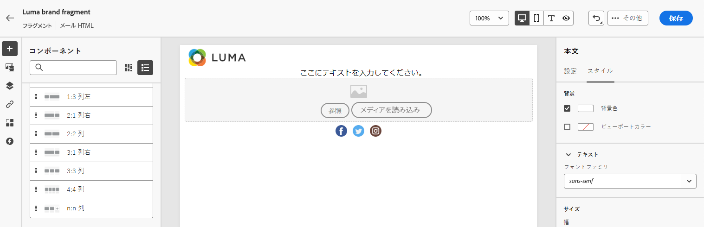
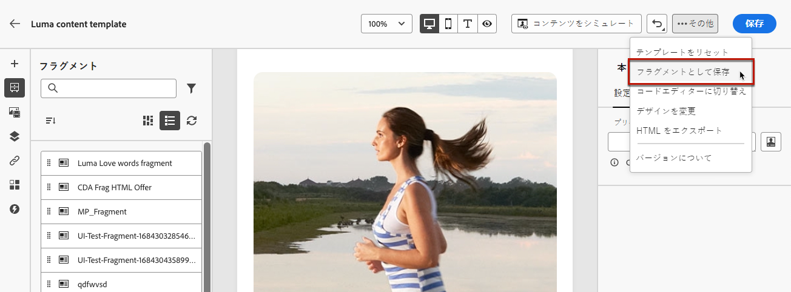
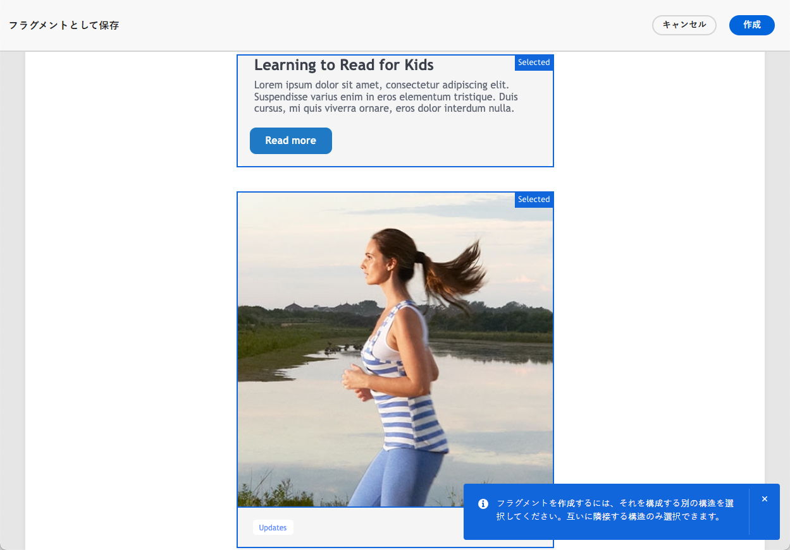

# フラグメントの操作 {#fragments}

>[!CONTEXTUALHELP]
>id="ajo_create_fragment"
>title="独自のフラグメントを定義"
>abstract="スタンドアロンのフラグメントを作成および管理して、複数のジャーニーやキャンペーンでコンテンツを再利用できるようにします。"
>additional-url="https://experienceleague.adobe.com/docs/journey-optimizer/using/content-management/reusable-content/fragments.html?lang=ja#create-fragments" text="フラグメントを作成"

フラグメントは、[!DNL Journey Optimizer] キャンペーンおよびジャーニー全体で 1 つ以上のメールで参照できる再利用可能なコンポーネントです。

この機能を使用すると、マーケティングユーザーが改善されたデザインプロセスでメールコンテンツを迅速に組み立てるために使用できる複数のカスタムコンテンツブロックを事前に構築できます。

➡️ [フラグメントの管理、作成、使用方法については、これらのビデオをご覧ください](#video-fragments)

フラグメントを最大限に活用するには：

* 独自のフラグメントを作成します。ビジュアルフラグメントまたは式フラグメントを作成できます。[詳細情報](#create-fragments)

* 作成したフラグメントを、必要な回数だけコンテンツで使用します。[ビジュアルフラグメントの追加](../email/use-visual-fragments.md)および[式フラグメントの活用](../personalization/use-expression-fragments.md)を参照してください

>[!NOTE]
>
>**ビジュアルフラグメント** 次で使用できます [電子メールデザイナー](../email/get-started-email-design.md)それに対して **式フラグメント** からアクセスできます [パーソナライゼーションエディター](../personalization/personalization-build-expressions.md).

また、Journey Optimizer の **Content REST API** を活用すると、コンテンツフラグメントを管理できます。詳しくは、[Journey Optimizer API ドキュメント](https://developer.adobe.com/journey-optimizer-apis/references/content/){target="_blank"}を参照してください。

## 開始する前に {#fragment-prerequisites}

>[!CAUTION]
>
>フラグメントを作成、編集、アーカイブするには、**[!DNL Content Library Manager]** 製品プロファイルに **[!DNL Manage library items]** 権限が付与されている必要があります。[詳細情報](../administration/ootb-product-profiles.md#content-library-manager)

このバージョンでは、次の制限が適用されます。

* ビジュアルフラグメントは、メールチャネルでのみ使用できます

* 式フラグメントは、アプリ内チャネルでは使用できません

## フラグメントへのアクセスと管理 {#access-manage-fragments}

フラグメントリストにアクセスするには、左のメニューで&#x200B;**[!UICONTROL コンテンツ管理]**／**[!UICONTROL フラグメント]**&#x200B;を選択します。

現在のサンドボックスで作成されたすべてのフラグメント（[**[!UICONTROL フラグメント]**&#x200B;メニューから](#create-fragments)か、「[フラグメントとして保存](#save-as-fragment)」オプションを使用して）が表示されます。

次の項目でフラグメントをフィルタリングできます。

* タイプ：**[!UICONTROL ビジュアル]**&#x200B;または&#x200B;**[!UICONTROL 式]**
* タグ
* 作成日または変更日

すべてのフラグメントを表示するか、現在のユーザーが作成または変更した項目のみを表示するかを選択できます。

また、**[!UICONTROL アーカイブ済み]**&#x200B;フラグメントを表示することもできます。[詳細情報](#archive-fragments)

各フラグメントの横にある「**[!UICONTROL その他のアクション]**」ボタンから、次の操作を実行できます。

* フラグメントを複製します。

* 「**[!UICONTROL 参照を探索]**」オプションを使用して、使用されているジャーニー、キャンペーン、テンプレートを確認します。[詳細情報](#explore-references)

* フラグメントをアーカイブします。[詳細情報](#archive-fragments)

* フラグメントの[タグ](../start/search-filter-categorize.md#tags)を編集します。

### フラグメントの編集 {#edit-fragments}

フラグメントを編集するには、次の手順に従います。

1. **[!UICONTROL フラグメント]**&#x200B;リストから目的の項目をクリックします。
1. フラグメントのプロパティから、[参照の探索](#explore-references)、[そのアクセスの管理](../administration/object-based-access.md)および[タグ](../start/search-filter-categorize.md#tags)などのフラグメント詳細の更新を行えます。

   

1. フラグメントをゼロから作成する場合と同様に、対応するボタンを選択してコンテンツを編集します。[詳細情報](#create-from-scratch)

>[!NOTE]
>
>フラグメントを編集すると、**[!UICONTROL ライブ]**&#x200B;ジャーニーまたはキャンペーンで使用するコンテンツを除く、そのフラグメントを使用するすべてのコンテンツに変更が自動的に生成されます。また、元のフラグメントからの継承を解除することもできます。詳しくは、[メールへのビジュアルフラグメントの追加](../email/use-visual-fragments.md#break-inheritance)および[式フラグメントの活用](../personalization/use-expression-fragments.md#break-inheritance) の節を参照してください。

### 参照の探索 {#explore-references}

フラグメントを現在使用しているジャーニー、キャンペーン、コンテンツテンプレートのリストを表示できます。

これを行うには、フラグメントリストの&#x200B;**[!UICONTROL その他のアクション]**&#x200B;メニューまたはフラグメントのプロパティ画面から「**[!UICONTROL 参照を探索]**」を選択します。

タブを選択して、ジャーニー、キャンペーン、テンプレート、フラグメントを切り替えます。ステータスを確認し、名前をクリックすると、フラグメントが参照されている対応する項目にリダイレクトされます。

>[!NOTE]
>
>アクセスを妨げるラベルが付いているジャーニー、キャンペーン、テンプレートでフラグメントが使用されている場合、選択したタブの上部にアラートメッセージが表示されます。[オブジェクトレベルのアクセス制御（OLAC）について詳しくはこちらを参照してください](../administration/object-based-access.md)

### フラグメントのアーカイブ {#archive-fragments}

ブランドと関係がなくなった項目からフラグメントリストを削除できます。

これを行うには、目的のフラグメントの横にある「**[!UICONTROL その他のアクション]**」ボタンをクリックし、「**[!UICONTROL アーカイブ]**」を選択します。フラグメントリストから表示されなくなるので、今後のメールやテンプレートでユーザーはフラグメントを使用できなくなります。

>[!NOTE]
>
>コンテンツで使用しているフラグメントをアーカイブしても、<!--it will remain in the email or template, but you won't be able to select it from the fragment list to edit it-->そのコンテンツは影響を受けません。

フラグメントをアーカイブ解除するには、**[!UICONTROL アーカイブ済み]**&#x200B;項目をフィルタリングし、**[!UICONTROL その他のアクション]**&#x200B;メニューから「**[!UICONTROL アーカイブ解除]**」を選択します。これで、フラグメントリストから再びアクセスし、任意のメールまたはテンプレートで使用できるようになりました。

## フラグメントを作成 {#create-fragments}

フラグメントの作成方法は 2 つあります。

* **[!UICONTROL フラグメント]**&#x200B;専用のメニューを使用して、フラグメントを最初から作成します。[方法についてはこちらを参照](#create-from-scratch)

* コンテンツをデザインする際は、コンテンツの一部をフラグメントとして保存します。[方法についてはこちらを参照](#save-as-fragment)

保存すると、フラグメントをジャーニー、キャンペーンまたはテンプレートで使用できるようになります。ゼロから作成した場合も、既存のコンテンツから作成した場合でも、このフラグメントを使用して、[!DNL Journey Optimizer] 内でコンテンツを構築できるようになりました。[ビジュアルフラグメントの追加](../email/use-visual-fragments.md)および[式フラグメントの活用](../personalization/use-expression-fragments.md)を参照してください

### ゼロから作成 {#create-from-scratch}

フラグメントをゼロから作成するには、次の手順に従います。

1. **[!UICONTROL コンテンツ管理]**／**[!UICONTROL フラグメント]**&#x200B;の左のメニューから、フラグメントリストにアクセスします。

1. 「**[!UICONTROL フラグメントを作成]**」を選択します。

1. フラグメントの詳細、名前や説明などを（必要に応じて）入力します。

   

1. フラグメントのタイプ（[ビジュアルフラグメント](#create-visual-fragment)または[式フラグメント](#create-expression-fragment)）を選択します。

1. カスタムまたはコアのデータ使用ラベルをフラグメントに割り当てるには、「**[!UICONTROL アクセスを管理]**」を選択します。[オブジェクトレベルのアクセス制御（OLAC）についての詳細はこちらを参照してください](../administration/object-based-access.md)。

1. 「**[!UICONTROL タグ]**」フィールドから Adobe Experience Platform タグを選択または作成してフラグメントを分類し、検索の向上を図ります。[詳細情報](../start/search-filter-categorize.md#tags)

1. 「**[!UICONTROL 作成]**」をクリックします。

### ビジュアルフラグメントを作成 {#create-visual-fragment}

>[!CONTEXTUALHELP]
>id="ajo_create_visual_fragment"
>title="ビジュアルタイプを選択"
>abstract="スタンドアロンのビジュアルフラグメントを作成して、ジャーニーまたはキャンペーン内のメールや、コンテンツテンプレートでコンテンツを再利用できるようにします。"
>additional-url="https://experienceleague.adobe.com/docs/journey-optimizer/using/email/design-email/add-content/use-visual-fragments.html?lang=ja" text="メールへのビジュアルフラグメントの追加"

1. **[!UICONTROL コンテンツ管理]**／**[!UICONTROL フラグメント]**&#x200B;の左側のメニューから[フラグメントを作成](#create-from-scratch)し、**[!UICONTROL ビジュアルフラグメント]**&#x200B;タイプを選択します。

   >[!NOTE]
   >
   >現在、ビジュアルフラグメントについては、**メール**&#x200B;チャネルのみがサポートされています。

1. [E メールデザイナー](../email/get-started-email-design.md)が表示されます。ジャーニーやキャンペーン内のメールと同じ方法で、必要に応じてコンテンツを編集します。

   >[!NOTE]
   >
   >パーソナライゼーションフィールドと動的コンテンツを追加できますが、コンテキスト属性はフラグメントではサポートされていません。

   

1. フラグメントの準備が整ったら、「**[!UICONTROL 保存]**」をクリックします。[フラグメントリスト](#access-manage-fragments)に追加されます。

1. 必要に応じて、フラグメント名の横にある矢印をクリックして&#x200B;**[!UICONTROL 詳細]**&#x200B;画面に戻り、フラグメントを編集します。

   

このフラグメントは、[!DNL Journey Optimizer] 内で[メール](../email/get-started-email-design.md)または[コンテンツテンプレート](content-templates.md)を作成する際に使用できるようになりました。[方法についてはこちらを参照](../email/use-visual-fragments.md)

### 式フラグメントを作成 {#create-expression-fragment}

>[!CONTEXTUALHELP]
>id="ajo_create_expression_fragment"
>title="式タイプの選択"
>abstract="スタンドアロン式のフラグメントを作成して、複数のジャーニーやキャンペーンでコンテンツを再利用できるようにします。パーソナライゼーションエディターを使用する場合、現在のサンドボックスで作成されたすべての式フラグメントを活用できます。"
>additional-url="https://experienceleague.adobe.com/docs/journey-optimizer/using/content-management/personalization/expression-editor/use-expression-fragments.html?lang=ja" text="式フラグメントを活用"

1. **[!UICONTROL コンテンツ管理]**／左側の&#x200B;**[!UICONTROL フラグメント]**&#x200B;メニューから[フラグメントを作成](#create-from-scratch)して、**[!UICONTROL 式フラグメント]**&#x200B;タイプを選択します。

1. 使用するコードのタイプ（**[!UICONTROL HTML]**、**[!UICONTROL JSON]** または&#x200B;**[!UICONTROL テキスト]**）を選択します。

   

   <!--Expression fragments can be used in any channel.-->

1. 「**[!UICONTROL 作成]**」をクリックします。パーソナライゼーションエディターが開きます。

1. を利用できます [!DNL Journey Optimizer] すべてのパーソナライゼーション機能とオーサリング機能を備えたパーソナライゼーションエディター。 [詳細情報](../personalization/personalization-build-expressions.md)

   

1. フラグメントの準備が整ったら、「**[!UICONTROL 保存]**」をクリックします。[フラグメントリスト](#access-manage-fragments)に追加されます。

1. 必要に応じて、フラグメント名の横にある矢印をクリックして&#x200B;**[!UICONTROL 詳細]**&#x200B;画面に戻り、フラグメントを編集します。

このフラグメントは、内でコンテンツを作成するときに使用できるようになりました [!DNL Journey Optimizer] パーソナライゼーションエディター。 [方法についてはこちらを参照](../personalization/use-expression-fragments.md)

## フラグメントとして保存 {#save-as-fragment}

[!DNL Journey Optimizer] でコンテンツを編集する際、後で再利用するために、コンテンツのすべてまたは一部をフラグメントとして保存できます。

### ビジュアルフラグメントとして保存 {#save-as-visual-fragment}

キャンペーンやジャーニーで[コンテンツテンプレート](content-templates.md)または[メール](../email/get-started-email-design.md)をデザインする際、コンテンツの一部をビジュアルフラグメントとして保存できます。それには、次の手順に従います。

1. [E メールデザイナー](../email/get-started-email-design.md)で、画面の右上にある「...」をクリックします。

1. ドロップダウンメニューから「**[!UICONTROL フラグメントとして保存]**」を選択します。

   

1. **[!UICONTROL フラグメントとして保存]**&#x200B;画面が表示されます。パーソナライゼーションフィールドや動的コンテンツなど、フラグメントに含める要素を選択します。コンテキスト属性は、フラグメントではサポートされていません。

   >[!CAUTION]
   >
   >互いに隣接するセクションのみを選択できます。空の構造や別のフラグメントは選択できません。

   

1. 「**[!UICONTROL 作成]**」をクリックします。フラグメントの詳細、名前や説明などを（必要に応じて）入力します。

1. カスタムまたはコアのデータ使用ラベルをフラグメントに割り当てるには、「**[!UICONTROL アクセスを管理]**」を選択します。[オブジェクトレベルのアクセス制御（OLAC）についての詳細はこちらを参照してください](../administration/object-based-access.md)。

1. 「**タグ**」フィールドから Adobe Experience Platform タグを選択または作成してテンプレートを分類し、検索の向上を図ります。[詳細情報](../start/search-filter-categorize.md#tags)

1. 「**[!UICONTROL 作成]**」をもう一度クリックします。フラグメントは[フラグメントリスト](#access-manage-fragments)に保存され、[!DNL Journey Optimizer] 専用メニューからアクセスできます。

   このフラグメントは、そのリストの他の項目と同様に、[アクセス](#access-manage-fragments)、[編集](#edit-fragments)、[アーカイブ](#archive-fragments)できるスタンドアロンのフラグメントになります。

このフラグメントは、[!DNL Journey Optimizer] 内で[メール](../email/get-started-email-design.md)または[コンテンツテンプレート](content-templates.md)を作成する際に使用できるようになりました。[方法についてはこちらを参照](../email/use-visual-fragments.md)

>[!NOTE]
>
>その新しいフラグメントに対する変更は、送信元のメールまたはテンプレートには生成されません。同様に、そのメールまたはテンプレート内で元のコンテンツを編集しても、新しいフラグメントは変更されません。

### 式フラグメントとして保存 {#save-as-expression-fragment}

>[!CONTEXTUALHELP]
>id="ajo_perso_library"
>title="式フラグメントとして保存"
>abstract="この [!DNL Journey Optimizer] パーソナライゼーションエディターを使用すると、コンテンツを式フラグメントとして保存できます。 その後、これらの式を使用して、パーソナライズされたコンテンツを作成できます。"

この [!DNL Journey Optimizer] パーソナライゼーションエディターを使用すると、コンテンツを式フラグメントとして保存できます。 その後、これらの式を使用して、パーソナライズされたコンテンツを作成できます。

コンテンツを式フラグメントとして保存するには、次の手順に従います。

1. が含まれる [パーソナライゼーションエディター](../personalization/personalization-build-expressions.md) インターフェイス、式の作成およびクリック **[!UICONTROL フラグメントとして保存]**.

1. 右側のパネルで式の名前と説明を入力して、式を見つけやすくします。

   

1. 「**[!UICONTROL フラグメントを保存]**」をクリックします。

   <!--An expression fragment cannot be nested inside another fragment.-->

1. 式フラグメントが[フラグメントリスト](#access-manage-fragments)に追加されます。この式フラグメントを使用してパーソナライズされたコンテンツを構築することができます。

>[!NOTE]
>
>式は 200 KB 以内にする必要があります。

## チュートリアルビデオ {#video-fragments}

ビジュアルフラグメントを管理、作成および使用する方法については、[!DNL Journey Optimizer] を参照してください。

>[!VIDEO](https://video.tv.adobe.com/v/3419932/?quality=12)

フラグメントを管理、作成および使用する方法については、[!DNL Journey Optimizer] を参照してください。

>[!VIDEO](https://video.tv.adobe.com/v/3424587/?quality=12)
