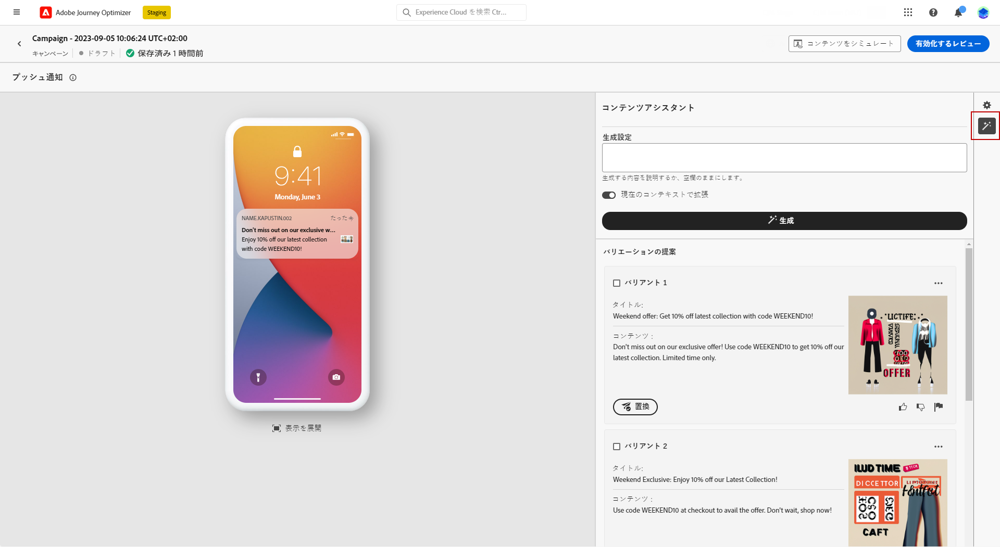
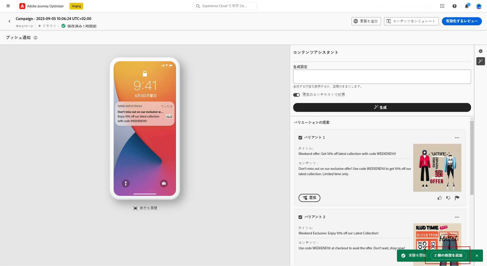

# コンテンツアシスタントを使用したコンテンツの生成 {#title-content-assistant}

>[!BEGINSHADEBOX]

**目次**

* [コンテンツアシスタント入門](gs-generative.md)
* **[コンテンツアシスタントを使用したコンテンツの生成](generative-content.md)**
* [コンテンツアシスタントを使用した画像の生成](generative-image.md)

>[!ENDSHADEBOX]

メッセージを作成してパーソナライズしたら、コンテンツアシスタントを使用してコンテンツを次のレベルに引き上げます。

コンテンツアシスタントを活用して、様々なコンテンツを試すことで、メッセージの影響を最適化できるようになりました。各バリアントを個別の処理とみなし、どのコンテンツがより多くのクリックを効果的に生み出すかを測定して比較します。

この例では、コンテンツ実験を使用して魅力的なプッシュ通知を送信する方法を説明します。次の手順に従います。

1. プッシュ通知キャンペーンを作成して設定したら、「**[!UICONTROL コンテンツを作成]**」をクリックします。

1. 生成アシスタントを使用して&#x200B;**[!UICONTROL タイトル]**&#x200B;を変更します。

   「**[!UICONTROL ヘッダー]**」フィールドの横にある「**[!UICONTROL テキスト生成アシスタントを使用して編集]**」をクリックします。

   

1. **[!UICONTROL ユーザーアクション]**&#x200B;メニューで、「**[!UICONTROL テキストの絞り込み]**」を選択します。

   * **[!UICONTROL 要約]**：このオプションを使用すると、テキストを短くし、要旨を残します。

   * **[!UICONTROL 詳細]**：このオプションを使用すると、コンテンツアシスタントからクリエイティブなバリエーションを追加して、コンテンツを拡充します。

   

1. **[!UICONTROL 口調を変更]**&#x200B;メニューでバリエーションの口調を選択します。

1. **[!UICONTROL フリーフォーム]**&#x200B;メニューから、結果をより細かく調整するためのプロンプトを提供することも選択できます。

   

1. 適切なバリエーションが見つかったら、「**[!UICONTROL ユーザーバリアント]**」をクリックして「**[!UICONTROL 適用]**」をクリックします。

   

1. プッシュ通知の&#x200B;**[!UICONTROL 本文]**&#x200B;をパーソナライズした後、「**[!UICONTROL コンテンツアシスタントを表示]**」を選択します。

   ここでは、元のコンテンツで既にバリエーションのリストを使用できます。

   

1. 生成する内容を記述して、コンテンツを微調整します。

   コンテンツアシスタントの「**[!UICONTROL 現在のコンテンツで拡充]**」オプションを有効にして、メッセージ、キャンペーン名、選択したオーディエンスに基づいて、新しいコンテンツをパーソナライズします。

1. 「**[!UICONTROL 置換]**」をクリックしてコンテンツを変更するか、複数の&#x200B;**[!UICONTROL バリアント]**&#x200B;を選択して実験用の&#x200B;**[!UICONTROL 処理]**&#x200B;を作成し、「**X 処理を追加**」をクリックします。

   

1. **[!UICONTROL 実験設定]**&#x200B;メニューまたは&#x200B;**[!UICONTROL アクション]**&#x200B;メニューにアクセスして、実験をさらにパーソナライズします。[詳細情報](../campaigns/content-experiment.md)

   

1. メッセージの内容を定義したら、「**[!UICONTROL コンテンツをシミュレート]**」ボタンをクリックしてレンダリングを制御し、テストプロファイルでパーソナライゼーション設定を確認します。[詳細情報](../content-management/preview-test.md)

1. コンテンツ実験の準備が整ったら、キャンペーンの概要ページで「**[!UICONTROL アクティブ化のレビュー]**」をクリックして、キャンペーンの概要を表示できます。パラメーターが正しくない、または見つからない場合は、警告が表示されます。

1. キャンペーンを開始する前に、すべての設定が正しいことを再確認し、「**[!UICONTROL アクティブ化]**」をクリックします。

実験とキャンペーンを正常に設定したら、キャンペーンレポートを使用してキャンペーンをトラッキングできます。[詳細情報](../reports/campaign-global-report.md#experimentation-report)
