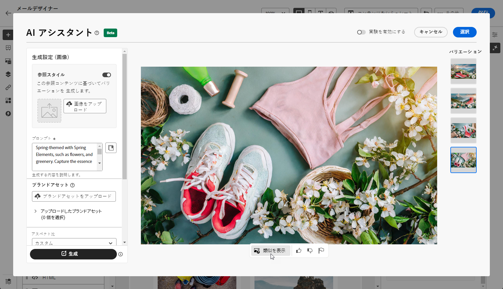

# AI アシスタントを使用したメールの生成 {#generative-email}

>[!BEGINSHADEBOX]

**目次**

* [AI アシスタントの基本を学ぶ](gs-generative.md)
* AI アシスタントを使用したメールの生成
* [AI アシスタントを使用した SMS の生成](generative-sms.md)
* [AI アシスタントを使用したプッシュの生成](generative-push.md)
* [AI アシスタントを使用したコンテンツ実験](generative-experimentation.md)

>[!ENDSHADEBOX]

>[!NOTE]
>
>この機能の使用を開始する前に、関連する[ガードレールと制限](gs-generative.md#generative-guardrails)のトピックに目を通してください。

メールを作成しカスタマイズしたら、生成 AI を利用した Journey Optimizer の AI アシスタントの機能を活用して、コンテンツを向上させます。

AI アシスタントを使用すると、オーディエンスに直接話しかける完全なメール、調整されたテキストスニペットおよびカスタマイズされた画像を作成し、エンゲージメントとインタラクションを強化することで、キャンペーンの有効性を高めることができます。

Journey Optimizer で AI アシスタントを使用する方法については、以下のタブを参照してください。

>[!BEGINTABS]

>[!TAB 完全なメールの生成]

次の例では、AI アシスタントを活用して既存のメールテンプレートを改良します。

1. メールキャンペーンを作成および設定したら、「**[!UICONTROL コンテンツを編集]**」をクリックします。

   メールキャンペーンの設定方法について詳しくは、[こちら](../campaigns/create-campaign.md)を参照してください。

1. 必要に応じてメールをパーソナライズし、 **[!UICONTROL AI アシスタント]** メニュー。

   {zoomable="yes"}

1. AI アシスタントの「**[!UICONTROL 元のコンテンツを使用]**」オプションを有効にして、キャンペーンのコンテンツ、名前および選択したオーディエンスに基づいて、新しいコンテンツをパーソナライズします。

   プロンプトは、常に現在のコンテンツに結び付ける必要があります。

1. 生成する内容を「**[!UICONTROL プロンプト]**」フィールドに記述して、コンテンツを微調整します。

   プロンプトの作成に関するサポートが必要な場合は、キャンペーンを改善するための様々なプロンプトのアイデアを提供する&#x200B;**[!UICONTROL プロンプトライブラリ]**&#x200B;にアクセスしてください。

   {zoomable="yes"}

1. 「**[!UICONTROL 件名]**」オプションと「**[!UICONTROL プリヘッダー]**」オプションを切り替えて、バリアントの生成に含めることができます。

1. クリック **[!UICONTROL ブランドアセットのアップロード]** ai アシスタントに追加のコンテキストを提供できるコンテンツを含むブランドアセットを追加するか、以前にアップロードしたものを選択します。

   {zoomable="yes"}

1. 様々なオプションを使用してプロンプトを調整します。

   * **[!UICONTROL コミュニケーション戦略]**：生成テキストに最適なコミュニケーションスタイルを選択します。
   * **[!UICONTROL 言語]**：コンテンツを生成する言語を選択します。
   * **[!UICONTROL トーン]**：メールのトーンは、オーディエンスの共感を呼ぶはずです。 情報を提供する、遊び心がある、説得力がある、のいずれを求めているかに関わらず、AI アシスタントはメッセージを適切に適応させることができます。

   {zoomable="yes"}

1. プロンプトの準備ができたら、 **[!UICONTROL Generate]**.

1. 生成された&#x200B;**[!UICONTROL バリエーション]**&#x200B;を参照し、「**[!UICONTROL プレビュー]**」をクリックして、選択したバリエーションのフルスクリーンバージョンを表示します。

1. に移動します。 **[!UICONTROL 調整]** 内のオプション **[!UICONTROL プレビュー]** 追加のカスタマイズ機能にアクセスするためのウィンドウ：

   * **[!UICONTROL Rephrase]**:AI アシスタントは、様々な方法でメッセージのフレーズを変更できるので、書き物を新鮮に保ち、様々なオーディエンスを魅了します。

   * **[!UICONTROL よりシンプルな言語の使用]**:AI アシスタントを活用して言語を簡素化し、より広いオーディエンスに対して明確なアクセシビリティを確保します。

   {zoomable="yes"}

1. クリック **[!UICONTROL を選択]** 適切なコンテンツが見つかったら、

   また、コンテンツの実験を有効にすることもできます。[詳細情報](generative-experimentation.md)

1. パーソナライゼーションフィールドを挿入して、プロファイルデータに基づいてメールコンテンツをカスタマイズします。 次に、 **[!UICONTROL コンテンツをシミュレート]** ボタンをクリックしてレンダリングを制御し、テストプロファイルでパーソナライゼーション設定を確認します。 [詳細情報](../personalization/personalize.md)

コンテンツ、オーディエンスおよびスケジュールを定義したら、メールキャンペーンの準備が整います。[詳細情報](../campaigns/review-activate-campaign.md)

>[!TAB テキストの生成]

次の例では、AI アシスタントを活用して、メールのコンテンツを強化します。

1. メールキャンペーンを作成および設定したら、「**[!UICONTROL コンテンツを編集]**」をクリックします。

   メールキャンペーンの設定方法について詳しくは、[こちら](../email/create-email.md)を参照してください。

1. を選択 **[!UICONTROL テキストコンポーネント]** 特定のコンテンツのみをターゲットにします。 にアクセスします。 **[!UICONTROL AI アシスタント]** メニュー。

   {zoomable="yes"}

1. AI アシスタントの「**[!UICONTROL 元のコンテンツを使用]**」オプションを有効にして、キャンペーンのコンテンツ、名前および選択したオーディエンスに基づいて、新しいコンテンツをパーソナライズします。

   プロンプトは、常に現在のコンテンツに結び付ける必要があります。

1. 生成する内容を「**[!UICONTROL プロンプト]**」フィールドに記述して、コンテンツを微調整します。

   プロンプトの作成に関するサポートが必要な場合は、キャンペーンを改善するための様々なプロンプトのアイデアを提供する&#x200B;**[!UICONTROL プロンプトライブラリ]**&#x200B;にアクセスしてください。

   {zoomable="yes"}

1. クリック **[!UICONTROL ブランドアセットのアップロード]** AI アシスタントに追加のコンテキストを提供できるコンテンツを含むブランドアセットを追加します。

   {zoomable="yes"}

1. 様々なオプションを使用してプロンプトを調整します。

   * **[!UICONTROL コミュニケーション戦略]**：生成テキストに適した通信方法を選択します。
   * **[!UICONTROL 言語]**：バリアントのコンテンツの言語を選択します。
   * **[!UICONTROL トーン]**：テキストがオーディエンスと目的に適していることを確認します。
   * **[!UICONTROL 長さ]**：範囲スライダーを使用して、コンテンツの長さを選択します。

   {zoomable="yes"}

1. プロンプトの準備ができたら、 **[!UICONTROL Generate]**.

1. 生成された&#x200B;**[!UICONTROL バリエーション]**&#x200B;を参照し、「**[!UICONTROL プレビュー]**」をクリックして、選択したバリエーションのフルスクリーンバージョンを表示します。

1. に移動します。 **[!UICONTROL 調整]** 内のオプション **[!UICONTROL プレビュー]** 追加のカスタマイズ機能にアクセスするためのウィンドウ：

   * **[!UICONTROL を参照コンテンツとして使用]**：選択したバリアントは、他の結果を生成するための参照コンテンツとして機能します。

   * **[!UICONTROL 精巧]**:AI アシスタントは、特定のトピックを展開するのに役立ち、理解とエンゲージメントを深めるために追加の詳細を提供します。

   * **[!UICONTROL 要約]**：情報が長すぎると、メール受信者が過負荷になる可能性があります。 AI アシスタントを使用して、重要なポイントを明確かつ簡潔な要約に要約し、注意を引いてさらに読むよう促します。

   * **[!UICONTROL 言い換え]**：AI アシスタントは、メッセージを様々な方法で言い換えることができ、ユーザーが作成した文章を多様なオーディエンスにとって新鮮で魅力的なメッセージにします。

   * **[!UICONTROL よりシンプルな言語の使用]**:AI アシスタントを活用して言語を簡素化し、より広いオーディエンスに対して明確なアクセシビリティを確保します。

   {zoomable="yes"}

1. クリック **[!UICONTROL を選択]** 適切なコンテンツが見つかったら、

   また、コンテンツの実験を有効にすることもできます。[詳細情報](generative-experimentation.md)

1. パーソナライゼーションフィールドを挿入して、プロファイルデータに基づいてメールコンテンツをカスタマイズします。 次に、 **[!UICONTROL コンテンツをシミュレート]** ボタンをクリックしてレンダリングを制御し、テストプロファイルでパーソナライゼーション設定を確認します。 [詳細情報](../personalization/personalize.md)

コンテンツ、オーディエンスおよびスケジュールを定義したら、メールキャンペーンの準備が整います。[詳細情報](../campaigns/review-activate-campaign.md)

>[!TAB 画像生成]

次の例では、AI アシスタントを活用してアセットを最適化および改善し、より使いやすいエクスペリエンスを確保する方法について説明します。

1. メールキャンペーンを作成および設定したら、「**[!UICONTROL コンテンツを編集]**」をクリックします。

   メールキャンペーンの設定方法について詳しくは、[こちら](../email/create-email.md)を参照してください。

1. キャンペーンの&#x200B;**[!UICONTROL 基本的な詳細]**&#x200B;を入力します。完了したら、「**[!UICONTROL メールコンテンツを編集]**」をクリックします。

1. AI アシスタントで変更するアセットを選択します。

1. 右側のメニューから、 **[!UICONTROL AI アシスタント]**.

   {zoomable="yes"}

1. AI アシスタントの「**[!UICONTROL 参照スタイル]**」オプションを有効にして、参照コンテンツに基づいて新しいコンテンツをパーソナライズします。また、画像をアップロードして、バリエーションにコンテキストを追加することもできます。

   プロンプトは、常に現在のコンテンツに結び付ける必要があります。

1. 生成する内容を「**[!UICONTROL プロンプト]**」フィールドに記述して、コンテンツを微調整します。

   プロンプトの作成に関するサポートが必要な場合は、キャンペーンを改善するための様々なプロンプトのアイデアを提供する&#x200B;**[!UICONTROL プロンプトライブラリ]**&#x200B;にアクセスしてください。

   {zoomable="yes"}

1. クリック **[!UICONTROL ブランドアセットのアップロード]** AI アシスタントに追加のコンテキストを提供できるコンテンツを含むブランドアセットを追加します。

1. 様々なオプションを使用してプロンプトを調整します。

   * **[!UICONTROL 縦横比]**：アセットの幅と高さを決定します。 16:9、4:3、3:2、1:1 などの一般的な比率から選択することも、カスタムサイズを入力することもできます。
   * **[!UICONTROL カラーとトーン]**：画像内の色の全体的な外観と、それが伝えるムードまたは雰囲気。
   * **[!UICONTROL コンテンツタイプ]**：これにより、視覚要素の性質が分類され、写真、グラフィック、アートなど、様々な視覚的表現が区別されます。
   * **[!UICONTROL 照明]**：これは、画像内に存在する稲妻を指し、大気を形作り、特定の要素を強調表示します。
   * **[!UICONTROL 構成]**：画像のフレーム内の要素の配置を指します

   {zoomable="yes"}

1. プロンプトの設定に満足したら、 **[!UICONTROL Generate]**.

1. 「**[!UICONTROL バリエーションの提案]**」を参照して、目的のアセットを見つけます。

   クリック **[!UICONTROL プレビュー]** 選択したバリエーションのフルスクリーンバージョンを表示します。

   {zoomable="yes"}

1. を選択 **[!UICONTROL 類似を表示]** このバリアントに関連する画像を表示する場合。

   {zoomable="yes"}

1. クリック **[!UICONTROL を選択]** 適切なコンテンツが見つかったら、

   また、コンテンツの実験を有効にすることもできます。[詳細情報](generative-experimentation.md)

1. メッセージの内容を定義したら、「**[!UICONTROL コンテンツをシミュレート]**」ボタンをクリックしてレンダリングを制御し、テストプロファイルでパーソナライゼーション設定を確認します。[詳細情報](../personalization/personalize.md)

1. コンテンツ、オーディエンスおよびスケジュールを定義したら、メールキャンペーンの準備が整います。[詳細情報](../campaigns/review-activate-campaign.md)

>[!ENDTABS]

## チュートリアルビデオ {#video}

AI アシスタントを使用して、完全なメール、テキストまたは画像を生成する方法を説明します。

>[!VIDEO](https://video.tv.adobe.com/v/3428341)
