# Journey Optimizerの AI アシスタントによるメール生成 – コンテンツアクセラレーター {#generative-email}

>[!IMPORTANT]
>
>この機能の使用を開始する前に、関連する[ガードレールと制限](gs-generative.md#generative-guardrails)のトピックに目を通してください。
> 
>
>コンテンツアクセラレーションのためにJourney Optimizerで AI アシスタントを使用するには、[ ユーザー使用許諾契約 ](https://www.adobe.com/legal/licenses-terms/adobe-dx-gen-ai-user-guidelines.html) に同意する必要があります。 詳しくは、アドビ担当者にお問い合わせください。

メールを作成およびカスタマイズした後、Journey Optimizerの AI アシスタントの機能を活用して、ジェネレーティブ AI によって強化されたコンテンツアクセラレーションを活用して、コンテンツを強化します。

Journey Optimizerのコンテンツアクセラレーション用 AI アシスタントを使用すると、完全な E メール、カスタマイズされたテキストスニペット、オーディエンスに直接話しかけるカスタマイズされた画像を作成し、エンゲージメントとインタラクションを高めることで、キャンペーンの効果を高めることができます。

以下のタブを参照して、Journey Optimizerの AI アシスタントをコンテンツの高速化に使用する方法を確認してください。

>[!BEGINTABS]

>[!TAB 完全なメールの生成]

次の例では、コンテンツ加速用 AI アシスタントを活用して、既存のメールテンプレートを調整します。

1. メールキャンペーンを作成および設定したら、「**[!UICONTROL コンテンツを編集]**」をクリックします。

   メールキャンペーンの設定方法について詳しくは、[こちら](../campaigns/create-campaign.md)を参照してください。

1. 必要に応じてレイアウトをパーソナライズし、**[!UICONTROL AI アシスタント]** メニューにアクセスします。

   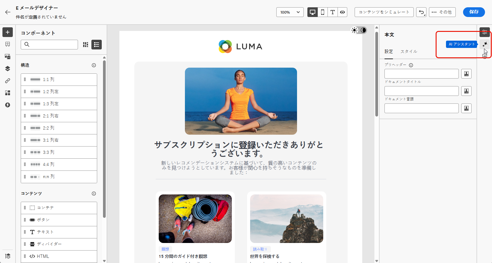{zoomable="yes"}

1. AI Assistant for Content Acceleration で「**[!UICONTROL 元のコンテンツを使用]**」オプションを有効にして、選択したコンテンツに基づいて新しいコンテンツをパーソナライズします。

1. 生成する内容を「**[!UICONTROL プロンプト]**」フィールドに記述して、コンテンツを微調整します。

   プロンプトの作成に関するサポートが必要な場合は、キャンペーンを改善するための様々なプロンプトのアイデアを提供する&#x200B;**[!UICONTROL プロンプトライブラリ]**&#x200B;にアクセスしてください。

   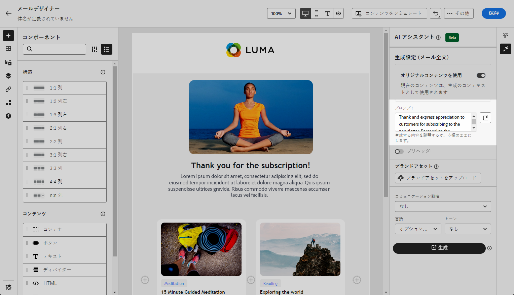{zoomable="yes"}

1. 「**[!UICONTROL 件名]**」オプションと「**[!UICONTROL プリヘッダー]**」オプションを切り替えて、バリアントの生成に含めることができます。

1. 「**[!UICONTROL テキスト設定]**」オプションを使用してプロンプトをカスタマイズします。

   * **[!UICONTROL コミュニケーション戦略]**：生成テキストに最適なコミュニケーションスタイルを選択します。
   * **[!UICONTROL トーン]**：メールのトーンは、オーディエンスの共感を呼びます。情報を提供する、遊び心がある、説得力がある、のいずれを求めているかに関わらず、AI アシスタントはメッセージを適切に適応させることができます。

   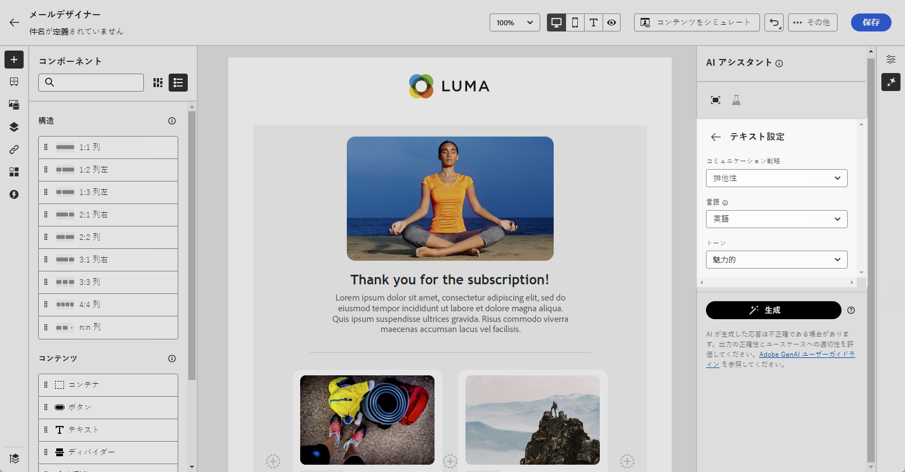{zoomable="yes"}

1. **[!UICONTROL 画像設定]** を選択します。

   * **[!UICONTROL コンテンツタイプ]**：これにより、視覚要素の性質が分類され、写真、グラフィック、アートなど、様々な視覚的表現が区別されます。
   * **[!UICONTROL 視覚的な強さ]**：画像の強さを調整することで、画像の影響を制御できます。 低い値（2）を設定すると、より柔らかく抑制された外観が作成され、高い値（10）を設定すると、画像がより鮮やかで視覚的に強力になります。
   * **[!UICONTROL カラーとトーン]**：画像内のカラーの全体的な外観と、画像が伝えるムードまたは雰囲気。
   * **[!UICONTROL 照明]**：画像内の稲妻を指し、画像の雰囲気を形成し、特定の要素をハイライト表示します。
   * **[!UICONTROL 構成]**：画像のフレーム内の要素の配置を指します

   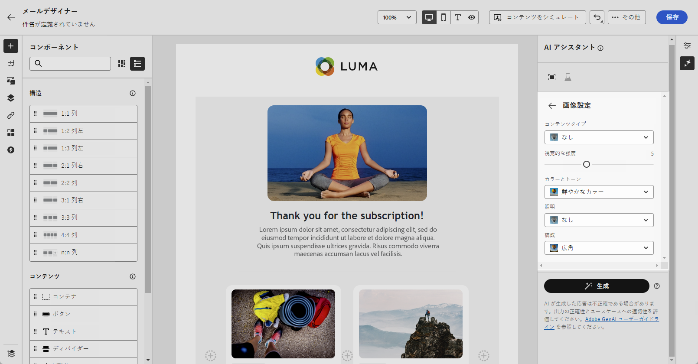{zoomable="yes"}

1. **[!UICONTROL ブランドアセット]** メニューで「**[!UICONTROL ブランドアセットをアップロード]**」をクリックし、AI アシスタントに追加のコンテキストを提供できるコンテンツを含むブランドアセットを追加するか、以前にアップロードしたものを選択します。

   以前にアップロードしたファイルは、**[!UICONTROL アップロードされたブランドアセット]** ドロップダウンで使用できます。 世代に含めるアセットを切り替えるだけです。

   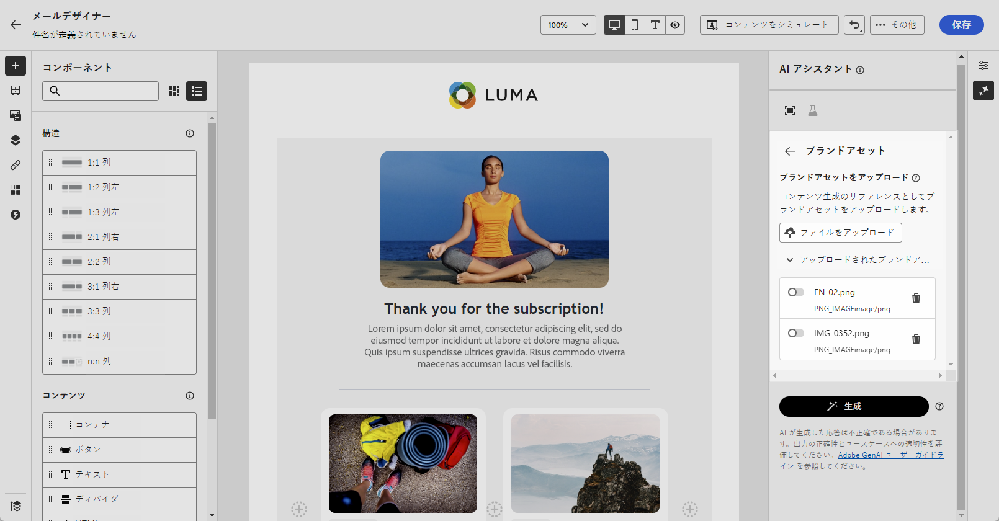{zoomable="yes"}

1. プロンプトの準備が整ったら、「**[!UICONTROL 生成]**」をクリックします。

1. 生成された&#x200B;**[!UICONTROL バリエーション]**&#x200B;を参照し、「**[!UICONTROL プレビュー]**」をクリックして、選択したバリエーションのフルスクリーンバージョンを表示します。

1. **[!UICONTROL プレビュー]**&#x200B;ウィンドウ内の「**[!UICONTROL 絞り込み]**」オプションに移動して、追加のカスタマイズ機能にアクセスします。

   * **[!UICONTROL 言い換え]**：AI アシスタントは、メッセージを様々な方法で言い換えることができ、ユーザーが作成した文章を新鮮で、多様なオーディエンスを惹きつけるメッセージにします。

   * **[!UICONTROL よりシンプルな言葉を使用]**：AI アシスタントを活用して言語をわかりやすく簡素化し、幅広いオーディエンスがアクセスできるようにします。

   また、テキストの **[!UICONTROL トーン]** と **[!UICONTROL コミュニケーション戦略]** を変更することもできます。

   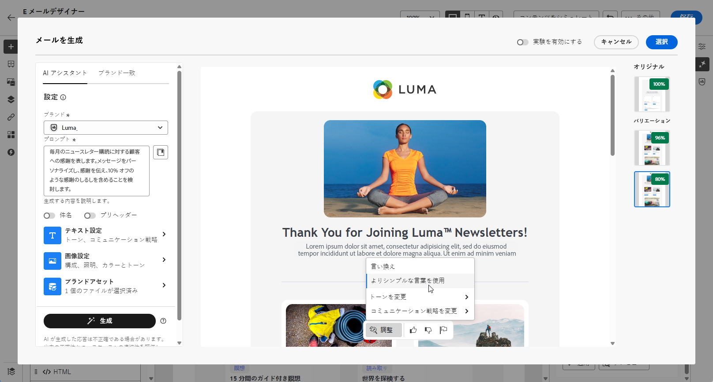{zoomable="yes"}

1. 適切なコンテンツが見つかったら、「**[!UICONTROL 選択]**」をクリックします。

   また、コンテンツの実験を有効にすることもできます。[詳細情報](generative-experimentation.md)

1. パーソナライゼーションフィールドを挿入し、プロファイルデータに基づいてメールコンテンツをカスタマイズします。次に「**[!UICONTROL コンテンツをシミュレート]**」ボタンをクリックしてレンダリングを制御し、テストプロファイルでパーソナライゼーション設定を確認します。[詳細情報](../personalization/personalize.md)

コンテンツ、オーディエンスおよびスケジュールを定義したら、メールキャンペーンの準備が整います。[詳細情報](../campaigns/review-activate-campaign.md)

>[!TAB  テキストのみの生成 ]

次の例では、コンテンツ加速用 AI アシスタントを活用して、メールのコンテンツを強化します。

1. メールキャンペーンを作成および設定したら、「**[!UICONTROL コンテンツを編集]**」をクリックします。

   メールキャンペーンの設定方法について詳しくは、[こちら](../email/create-email.md)を参照してください。

1. 「**[!UICONTROL テキストコンポーネント]**」を選択して、特定のコンテンツのみをターゲットにします。次に、**[!UICONTROL AI アシスタント]**&#x200B;メニューにアクセスします。

   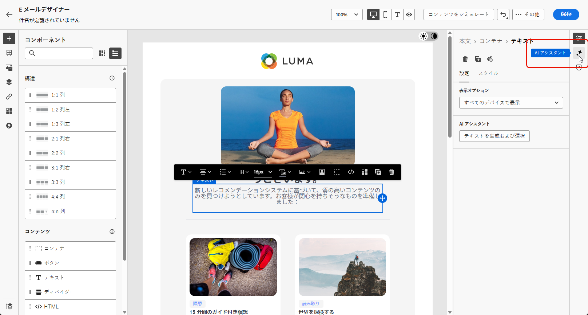{zoomable="yes"}

1. AI Assistant for Content Acceleration で「**[!UICONTROL 元のコンテンツを使用]**」オプションを有効にして、選択したコンテンツに基づいて新しいコンテンツをパーソナライズします。

1. 生成する内容を「**[!UICONTROL プロンプト]**」フィールドに記述して、コンテンツを微調整します。

   プロンプトの作成に関するサポートが必要な場合は、キャンペーンを改善するための様々なプロンプトのアイデアを提供する&#x200B;**[!UICONTROL プロンプトライブラリ]**&#x200B;にアクセスしてください。

   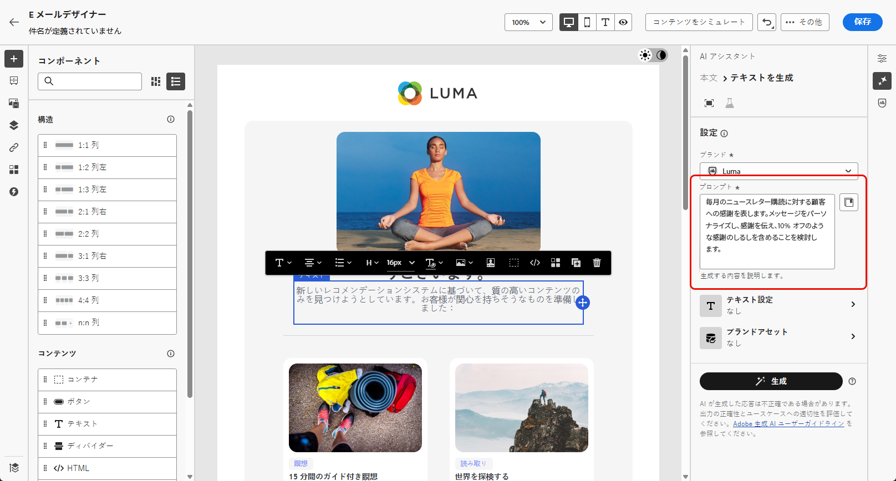{zoomable="yes"}

1. 「**[!UICONTROL テキスト設定]**」オプションを使用してプロンプトをカスタマイズします。

   * **[!UICONTROL コミュニケーション戦略]**：生成テキストに最適なコミュニケーションスタイルを選択します。
   * **[!UICONTROL トーン]**：メールのトーンは、オーディエンスの共感を呼びます。情報を提供する、遊び心がある、説得力がある、のいずれを求めているかに関わらず、AI アシスタントはメッセージを適切に適応させることができます。
   * **テキストの長さ**：スライダーを使用して、テキストの目的の長さを選択します。

   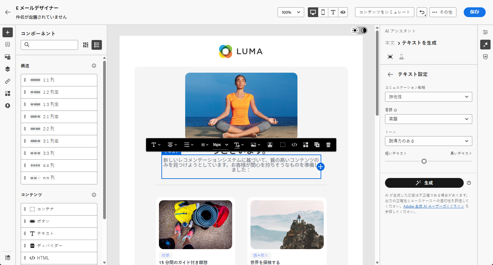{zoomable="yes"}

1. **[!UICONTROL ブランドアセット]** メニューで「**[!UICONTROL ブランドアセットをアップロード]**」をクリックし、AI アシスタントに追加のコンテキストを提供できるコンテンツを含むブランドアセットを追加するか、以前にアップロードしたものを選択します。

   以前にアップロードしたファイルは、**[!UICONTROL アップロードされたブランドアセット]** ドロップダウンで使用できます。 世代に含めるアセットを切り替えるだけです。

   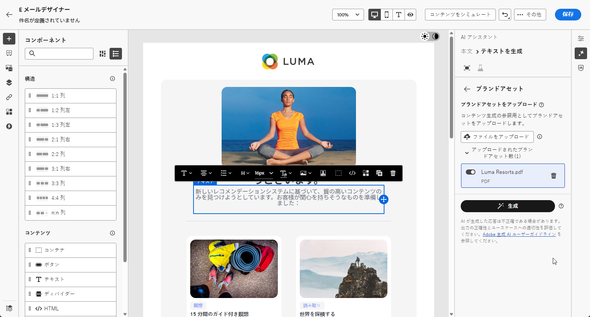{zoomable="yes"}

1. プロンプトの準備が整ったら、「**[!UICONTROL 生成]**」をクリックします。

1. 生成された&#x200B;**[!UICONTROL バリエーション]**&#x200B;を参照し、「**[!UICONTROL プレビュー]**」をクリックして、選択したバリエーションのフルスクリーンバージョンを表示します。

1. **[!UICONTROL プレビュー]**&#x200B;ウィンドウ内の「**[!UICONTROL 絞り込み]**」オプションに移動して、追加のカスタマイズ機能にアクセスします。

   * **[!UICONTROL 参照コンテンツとして使用]**：選択したバリアントは、他の結果を生成するための参照コンテンツとして機能します。

   * **[!UICONTROL 詳しく述べる]**：AI アシスタントは、特定のトピックを拡大できるようユーザーをサポートし、理解とエンゲージメントを深められるよう、追加の詳細を提供します。

   * **[!UICONTROL 要約する]**：情報が長すぎると、メール受信者が過負荷になる可能性があります。AI アシスタントを使用して、重要なポイントを明確かつ簡潔な概要に要約し、注意を引いてさらに読むよう促します。

   * **[!UICONTROL 言い換え]**：AI アシスタントは、メッセージを様々な方法で言い換えることができ、ユーザーが作成した文章を多様なオーディエンスにとって新鮮で魅力的なメッセージにします。

   * **[!UICONTROL よりシンプルな言葉を使用]**：AI アシスタントを活用して言語をわかりやすく簡素化し、幅広いオーディエンスがアクセスできるようにします。

   また、テキストの **[!UICONTROL トーン]** と **[!UICONTROL コミュニケーション戦略]** を変更することもできます。

   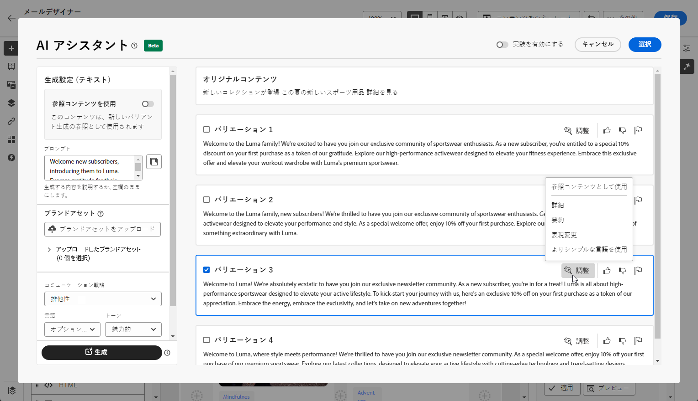{zoomable="yes"}

1. 適切なコンテンツが見つかったら、「**[!UICONTROL 選択]**」をクリックします。

   また、コンテンツの実験を有効にすることもできます。[詳細情報](generative-experimentation.md)

1. パーソナライゼーションフィールドを挿入し、プロファイルデータに基づいてメールコンテンツをカスタマイズします。次に「**[!UICONTROL コンテンツをシミュレート]**」ボタンをクリックしてレンダリングを制御し、テストプロファイルでパーソナライゼーション設定を確認します。[詳細情報](../personalization/personalize.md)

コンテンツ、オーディエンスおよびスケジュールを定義したら、メールキャンペーンの準備が整います。[詳細情報](../campaigns/review-activate-campaign.md)

>[!TAB  画像のみの生成 ]

次の例では、コンテンツ高速化に AI アシスタントを活用して、アセットを最適化および改善し、より使いやすいエクスペリエンスを確保する方法について説明します。

1. メールキャンペーンを作成および設定したら、「**[!UICONTROL コンテンツを編集]**」をクリックします。

   メールキャンペーンの設定方法について詳しくは、[こちら](../email/create-email.md)を参照してください。

1. コンテンツアクセラレーション用 AI アシスタントで変更するアセットを選択します。

1. 右側のメニューから、「**[!UICONTROL AI アシスタント]**」を選択します。

   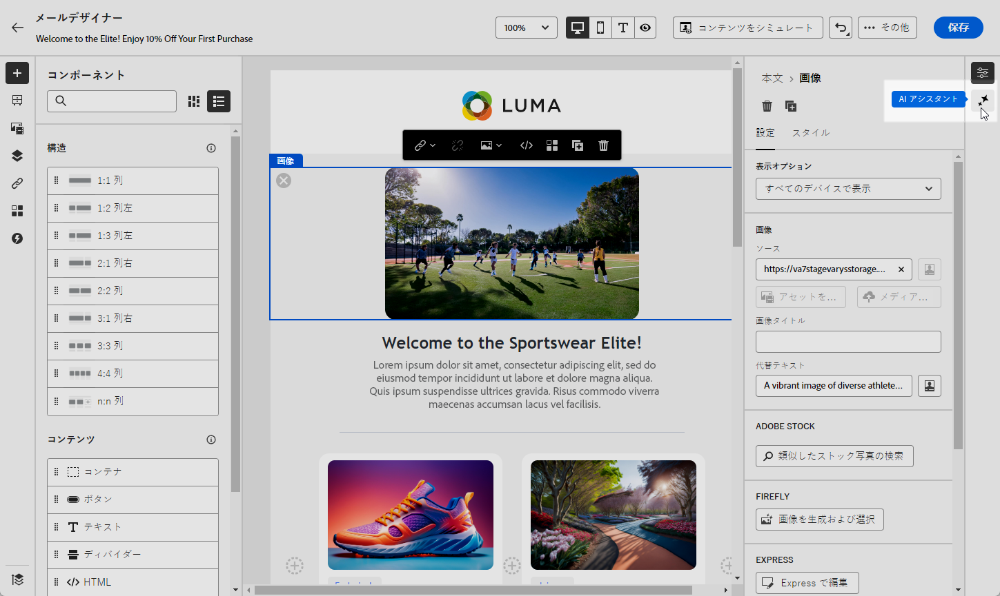{zoomable="yes"}

1. コンテンツ加速用 AI アシスタントの **[!UICONTROL 参照スタイル]** オプションを有効にして、参照コンテンツに基づいて新しいコンテンツをパーソナライズします。 また、画像をアップロードして、バリエーションにコンテキストを追加することもできます。

1. 生成する内容を「**[!UICONTROL プロンプト]**」フィールドに記述して、コンテンツを微調整します。

   プロンプトの作成に関するサポートが必要な場合は、キャンペーンを改善するための様々なプロンプトのアイデアを提供する&#x200B;**[!UICONTROL プロンプトライブラリ]**&#x200B;にアクセスしてください。

   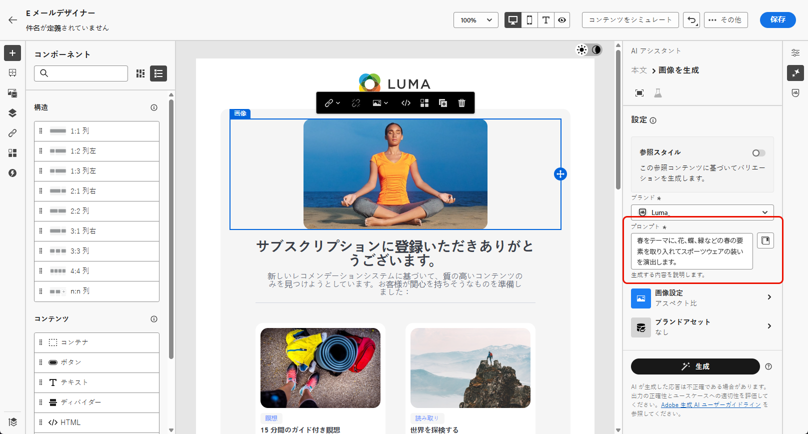{zoomable="yes"}

1. 「**[!UICONTROL 画像設定]**」オプションを使用してプロンプトをカスタマイズします。

   * **[!UICONTROL 縦横比]**：これにより、アセットの幅と高さが決まります。16:9、4:3、3:2、1:1 など、一般的な比率から選択することも、カスタムサイズを入力することもできます。
   * **[!UICONTROL コンテンツタイプ]**：これにより、視覚要素の性質が分類され、写真、グラフィック、アートなど、様々な視覚的表現が区別されます。
   * **[!UICONTROL 視覚的な強さ]**：画像の強さを調整することで、画像の影響を制御できます。 低い値（2）を設定すると、より柔らかく抑制された外観が作成され、高い値（10）を設定すると、画像がより鮮やかで視覚的に強力になります。
   * **[!UICONTROL カラーとトーン]**：画像内のカラーの全体的な外観と、画像が伝えるムードまたは雰囲気。
   * **[!UICONTROL 照明]**：画像内の稲妻を指し、画像の雰囲気を形成し、特定の要素をハイライト表示します。
   * **[!UICONTROL 構成]**：画像のフレーム内の要素の配置を指します

   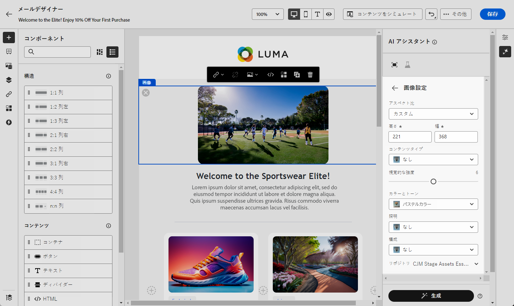{zoomable="yes"}

1. **[!UICONTROL ブランドアセット]** メニューで「**[!UICONTROL ブランドアセットをアップロード]**」をクリックし、AI アシスタントに追加のコンテキストを提供できるコンテンツを含むブランドアセットを追加するか、以前にアップロードしたものを選択します。

   以前にアップロードしたファイルは、**[!UICONTROL アップロードされたブランドアセット]** ドロップダウンで使用できます。 世代に含めるアセットを切り替えるだけです。

1. プロンプトの設定が完了したら、「**[!UICONTROL 生成]**」をクリックします。

1. 「**[!UICONTROL バリエーションの提案]**」を参照して、目的のアセットを見つけます。

   「**[!UICONTROL プレビュー]**」をクリックして、選択したバリエーションのフルスクリーンバージョンを表示します。

1. このバリアントに関連する画像を表示する場合は、「**[!UICONTROL 類似を生成]**」を選択します。

1. 適切なコンテンツが見つかったら、「**[!UICONTROL 選択]**」をクリックします。

   また、コンテンツの実験を有効にすることもできます。[詳細情報](generative-experimentation.md)

1. メッセージの内容を定義したら、「**[!UICONTROL コンテンツをシミュレート]**」ボタンをクリックしてレンダリングを制御し、テストプロファイルでパーソナライゼーション設定を確認します。[詳細情報](../personalization/personalize.md)

1. コンテンツ、オーディエンスおよびスケジュールを定義したら、メールキャンペーンの準備が整います。[詳細情報](../campaigns/review-activate-campaign.md)

>[!ENDTABS]

## チュートリアルビデオ {#video}

Journey Optimizerのコンテンツアクセラレーション用 AI アシスタントを使用して、完全なメール、テキスト、画像を生成する方法を説明します。

>[!VIDEO](https://video.tv.adobe.com/v/3433552)
