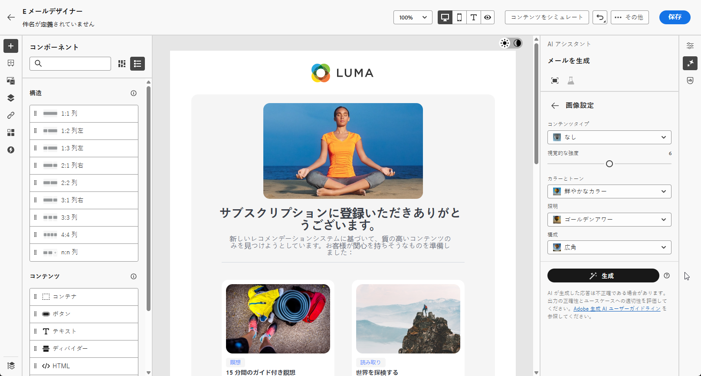

# AI アシスタントコンテンツアクセラレータによるメール生成 {#generative-email}

>[!IMPORTANT]
>
>この機能の使用を開始する前に、関連する[ガードレールと制限](gs-generative.md#generative-guardrails)のトピックに目を通してください。
> 
>
>Journey Optimizer で AI アシスタントコンテンツアクセラレータを使用する前に、[ユーザー契約](https://www.adobe.com/jp/legal/licenses-terms/adobe-dx-gen-ai-user-guidelines.html)に同意する必要があります。詳しくは、アドビ担当者にお問い合わせください。

メールを作成してカスタマイズしたら、生成 AI を利用した Journey Optimizer の AI アシスタントコンテンツアクセラレータの機能を活用して、コンテンツを改善します。

Journey Optimizer の AI アシスタントコンテンツアクセラレータを使用すると、完全なメール、調整されたテキストスニペットおよびカスタマイズされた画像を作成し、オーディエンスに直接訴えかけて、エンゲージメントとインタラクションを強化することで、キャンペーンの有効性を高めることができます。

Journey Optimizer で AI アシスタントコンテンツアクセラレータを使用する方法については、以下のタブを参照してください。

>[!BEGINTABS]

>[!TAB 完全なメールの生成]

次の例では、AI アシスタントコンテンツアクセラレータを活用して既存のメールテンプレートを改良します。

1. メールキャンペーンを作成および設定したら、「**[!UICONTROL コンテンツを編集]**」をクリックします。

   メールキャンペーンの設定方法について詳しくは、[こちら](../campaigns/create-campaign.md)を参照してください。

1. 必要に応じてレイアウトをパーソナライズし、**[!UICONTROL AI アシスタント]**&#x200B;メニューにアクセスします。

   {zoomable="yes"}

1. AI アシスタントコンテンツアクセラレータの「**[!UICONTROL オリジナルコンテンツを使用]**」オプションを有効にすると、選択したコンテンツに基づいて新しいコンテンツがパーソナライズされます。

1. 生成する内容を「**[!UICONTROL プロンプト]**」フィールドに記述して、コンテンツを微調整します。

   プロンプトの作成に関するサポートが必要な場合は、キャンペーンを改善するための様々なプロンプトのアイデアを提供する&#x200B;**[!UICONTROL プロンプトライブラリ]**&#x200B;にアクセスしてください。

   {zoomable="yes"}

1. 「**[!UICONTROL 件名]**」オプションと「**[!UICONTROL プリヘッダー]**」オプションを切り替えて、バリアントの生成に含めることができます。

1. 次の&#x200B;**[!UICONTROL テキスト設定]**&#x200B;オプションを使用してプロンプトを調整します。

   * **[!UICONTROL コミュニケーション戦略]**：生成テキストに最適なコミュニケーションスタイルを選択します。
   * **[!UICONTROL トーン]**：メールのトーンは、オーディエンスの共感を呼びます。情報を提供する、遊び心を持たせる、説得力があるなど、目的に合わせて、AI アシスタントはメッセージを適切に調整することができます。

   {zoomable="yes"}

1. **[!UICONTROL 画像設定]**&#x200B;を選択します。

   * **[!UICONTROL コンテンツタイプ]**：これにより、視覚要素の性質が分類され、写真、グラフィック、アートなど、様々な視覚的表現が区別されます。
   * **[!UICONTROL 視覚的な強度]**：画像の強度を調整することで、画像の影響を制御できます。低い設定（2）では、より柔らかく抑制された外観が作成され、高い設定（10）では、画像がより鮮やかで視覚的に強力になります。
   * **[!UICONTROL カラーとトーン]**：画像内のカラーの全体的な外観と、画像が伝えるムードまたは雰囲気。
   * **[!UICONTROL 照明]**：画像内の稲妻を指し、画像の雰囲気を形成し、特定の要素をハイライト表示します。
   * **[!UICONTROL 構成]**：画像のフレーム内の要素の配置を指します

   {zoomable="yes"}

1. **[!UICONTROL ブランドアセット]**&#x200B;メニューから「**[!UICONTROL ブランドアセットをアップロード]**」をクリックすると、AI アシスタントに追加のコンテキストを提供できるコンテンツを含むブランドアセットを追加するか、以前にアップロードしたアセットを選択できます。

   以前にアップロードしたファイルは、**[!UICONTROL アップロードされたブランドアセット]**&#x200B;ドロップダウンで使用できます。生成に含めるアセットを切り替えるだけです。

   {zoomable="yes"}

1. プロンプトの準備が整ったら、「**[!UICONTROL 生成]**」をクリックします。

1. 生成された&#x200B;**[!UICONTROL バリエーション]**&#x200B;を参照し、「**[!UICONTROL プレビュー]**」をクリックして、選択したバリエーションのフルスクリーンバージョンを表示します。

1. **[!UICONTROL プレビュー]**&#x200B;ウィンドウ内の「**[!UICONTROL 絞り込み]**」オプションに移動して、追加のカスタマイズ機能にアクセスします。

   * **[!UICONTROL 言い換え]**：AI アシスタントは、メッセージを様々な方法で言い換えることができ、ユーザーが作成した文章を新鮮で、多様なオーディエンスを惹きつけるメッセージにします。

   * **[!UICONTROL よりシンプルな言葉を使用]**：AI アシスタントを活用して言語をわかりやすく簡素化し、幅広いオーディエンスがアクセスできるようにします。

   または、テキストの&#x200B;**[!UICONTROL トーン]**&#x200B;や&#x200B;**[!UICONTROL コミュニケーション戦略]**&#x200B;を変更することもできます。

   {zoomable="yes"}

1. 適切なコンテンツが見つかったら、「**[!UICONTROL 選択]**」をクリックします。

   また、コンテンツの実験を有効にすることもできます。[詳細情報](generative-experimentation.md)

1. パーソナライゼーションフィールドを挿入し、プロファイルデータに基づいてメールコンテンツをカスタマイズします。次に「**[!UICONTROL コンテンツをシミュレート]**」ボタンをクリックしてレンダリングを制御し、テストプロファイルでパーソナライゼーション設定を確認します。[詳細情報](../personalization/personalize.md)

コンテンツ、オーディエンスおよびスケジュールを定義したら、メールキャンペーンの準備が整います。[詳細情報](../campaigns/review-activate-campaign.md)

>[!TAB テキストのみの生成]

次の例では、AI アシスタントコンテンツアクセラレータを活用して、メールのコンテンツを強化します。

1. メールキャンペーンを作成および設定したら、「**[!UICONTROL コンテンツを編集]**」をクリックします。

   メールキャンペーンの設定方法について詳しくは、[こちら](../email/create-email.md)を参照してください。

1. 「**[!UICONTROL テキストコンポーネント]**」を選択して、特定のコンテンツのみをターゲットにします。次に、**[!UICONTROL AI アシスタント]**&#x200B;メニューにアクセスします。

   {zoomable="yes"}

1. AI アシスタントコンテンツアクセラレータの「**[!UICONTROL オリジナルコンテンツを使用]**」オプションを有効にすると、選択したコンテンツに基づいて新しいコンテンツがパーソナライズされます。

1. 生成する内容を「**[!UICONTROL プロンプト]**」フィールドに記述して、コンテンツを微調整します。

   プロンプトの作成に関するサポートが必要な場合は、キャンペーンを改善するための様々なプロンプトのアイデアを提供する&#x200B;**[!UICONTROL プロンプトライブラリ]**&#x200B;にアクセスしてください。

   {zoomable="yes"}

1. 次の&#x200B;**[!UICONTROL テキスト設定]**&#x200B;オプションを使用してプロンプトを調整します。

   * **[!UICONTROL コミュニケーション戦略]**：生成テキストに最適なコミュニケーションスタイルを選択します。
   * **[!UICONTROL トーン]**：メールのトーンは、オーディエンスの共感を呼びます。情報を提供する、遊び心を持たせる、説得力があるなど、目的に合わせて、AI アシスタントはメッセージを適切に調整することができます。
   * **テキストの長さ**：スライダーを使用して、目的のテキストの長さを選択します。

   {zoomable="yes"}

1. **[!UICONTROL ブランドアセット]**&#x200B;メニューから「**[!UICONTROL ブランドアセットをアップロード]**」をクリックすると、AI アシスタントに追加のコンテキストを提供できるコンテンツを含むブランドアセットを追加するか、以前にアップロードしたアセットを選択できます。

   以前にアップロードしたファイルは、**[!UICONTROL アップロードされたブランドアセット]**&#x200B;ドロップダウンで使用できます。生成に含めるアセットを切り替えるだけです。

   {zoomable="yes"}

1. プロンプトの準備が整ったら、「**[!UICONTROL 生成]**」をクリックします。

1. 生成された&#x200B;**[!UICONTROL バリエーション]**&#x200B;を参照し、「**[!UICONTROL プレビュー]**」をクリックして、選択したバリエーションのフルスクリーンバージョンを表示します。

1. **[!UICONTROL プレビュー]**&#x200B;ウィンドウ内の「**[!UICONTROL 絞り込み]**」オプションに移動して、追加のカスタマイズ機能にアクセスします。

   * **[!UICONTROL 参照コンテンツとして使用]**：選択したバリアントは、他の結果を生成するための参照コンテンツとして機能します。

   * **[!UICONTROL 詳しく述べる]**：AI アシスタントは、特定のトピックを拡大できるようユーザーをサポートし、理解とエンゲージメントを深められるよう、追加の詳細を提供します。

   * **[!UICONTROL 要約する]**：情報が長すぎると、メール受信者が過負荷になる可能性があります。AI アシスタントを使用して、重要なポイントを明確かつ簡潔な概要に要約し、注意を引いてさらに読むよう促します。

   * **[!UICONTROL 言い換え]**：AI アシスタントは、メッセージを様々な方法で言い換えることができ、ユーザーが作成した文章を多様なオーディエンスにとって新鮮で魅力的なメッセージにします。

   * **[!UICONTROL よりシンプルな言葉を使用]**：AI アシスタントを活用して言語をわかりやすく簡素化し、幅広いオーディエンスがアクセスできるようにします。

   または、テキストの&#x200B;**[!UICONTROL トーン]**&#x200B;や&#x200B;**[!UICONTROL コミュニケーション戦略]**&#x200B;を変更することもできます。

   {zoomable="yes"}

1. 適切なコンテンツが見つかったら、「**[!UICONTROL 選択]**」をクリックします。

   また、コンテンツの実験を有効にすることもできます。[詳細情報](generative-experimentation.md)

1. パーソナライゼーションフィールドを挿入し、プロファイルデータに基づいてメールコンテンツをカスタマイズします。次に「**[!UICONTROL コンテンツをシミュレート]**」ボタンをクリックしてレンダリングを制御し、テストプロファイルでパーソナライゼーション設定を確認します。[詳細情報](../personalization/personalize.md)

コンテンツ、オーディエンスおよびスケジュールを定義したら、メールキャンペーンの準備が整います。[詳細情報](../campaigns/review-activate-campaign.md)

>[!TAB 画像のみの生成]

以下の例では、AI アシスタントコンテンツアクセラレータを活用してアセットの最適化と改善を行い、より使いやすいエクスペリエンスを実現する方法について説明します。

1. メールキャンペーンを作成および設定したら、「**[!UICONTROL コンテンツを編集]**」をクリックします。

   メールキャンペーンの設定方法について詳しくは、[こちら](../email/create-email.md)を参照してください。

1. AI アシスタントコンテンツアクセラレータで変更するアセットを選択します。

1. 右側のメニューから、「**[!UICONTROL AI アシスタント]**」を選択します。

   {zoomable="yes"}

1. AI アシスタントコンテンツアクセラレータの「**[!UICONTROL 参照スタイル]**」オプションを有効にすると、参照コンテンツに基づいて新しいコンテンツがパーソナライズされます。また、画像をアップロードして、バリエーションにコンテキストを追加することもできます。

1. 生成する内容を「**[!UICONTROL プロンプト]**」フィールドに記述して、コンテンツを微調整します。

   プロンプトの作成に関するサポートが必要な場合は、キャンペーンを改善するための様々なプロンプトのアイデアを提供する&#x200B;**[!UICONTROL プロンプトライブラリ]**&#x200B;にアクセスしてください。

   {zoomable="yes"}

1. 次の&#x200B;**[!UICONTROL 画像設定]**&#x200B;オプションを使用してプロンプトを調整します。

   * **[!UICONTROL 縦横比]**：これにより、アセットの幅と高さが決まります。16:9、4:3、3:2、1:1 など、一般的な比率から選択することも、カスタムサイズを入力することもできます。
   * **[!UICONTROL コンテンツタイプ]**：これにより、視覚要素の性質が分類され、写真、グラフィック、アートなど、様々な視覚的表現が区別されます。
   * **[!UICONTROL 視覚的な強度]**：画像の強度を調整することで、画像の影響を制御できます。低い設定（2）では、より柔らかく抑制された外観が作成され、高い設定（10）では、画像がより鮮やかで視覚的に強力になります。
   * **[!UICONTROL カラーとトーン]**：画像内のカラーの全体的な外観と、画像が伝えるムードまたは雰囲気。
   * **[!UICONTROL 照明]**：画像内の稲妻を指し、画像の雰囲気を形成し、特定の要素をハイライト表示します。
   * **[!UICONTROL 構成]**：画像のフレーム内の要素の配置を指します

   {zoomable="yes"}

1. **[!UICONTROL ブランドアセット]**&#x200B;メニューから「**[!UICONTROL ブランドアセットをアップロード]**」をクリックすると、AI アシスタントに追加のコンテキストを提供できるコンテンツを含むブランドアセットを追加するか、以前にアップロードしたアセットを選択できます。

   以前にアップロードしたファイルは、**[!UICONTROL アップロードされたブランドアセット]**&#x200B;ドロップダウンで使用できます。生成に含めるアセットを切り替えるだけです。

1. プロンプトの設定が完了したら、「**[!UICONTROL 生成]**」をクリックします。

1. 「**[!UICONTROL バリエーションの提案]**」を参照して、目的のアセットを見つけます。

   「**[!UICONTROL プレビュー]**」をクリックして、選択したバリエーションのフルスクリーンバージョンを表示します。

1. このバリアントに関連する画像を表示する場合は、「**[!UICONTROL 類似を生成]**」を選択します。

1. 適切なコンテンツが見つかったら、「**[!UICONTROL 選択]**」をクリックします。

   また、コンテンツの実験を有効にすることもできます。[詳細情報](generative-experimentation.md)

1. メッセージの内容を定義したら、「**[!UICONTROL コンテンツをシミュレート]**」ボタンをクリックしてレンダリングを制御し、テストプロファイルでパーソナライゼーション設定を確認します。[詳細情報](../personalization/personalize.md)

1. コンテンツ、オーディエンスおよびスケジュールを定義したら、メールキャンペーンの準備が整います。[詳細情報](../campaigns/review-activate-campaign.md)

>[!ENDTABS]

## チュートリアルビデオ {#video}

Journey Optimizer の AI アシスタントコンテンツアクセラレータを使用して、完全なメール、テキストまたは画像を生成する方法について説明します。

>[!VIDEO](https://video.tv.adobe.com/v/3433552)
