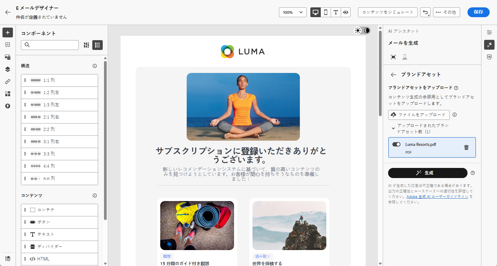
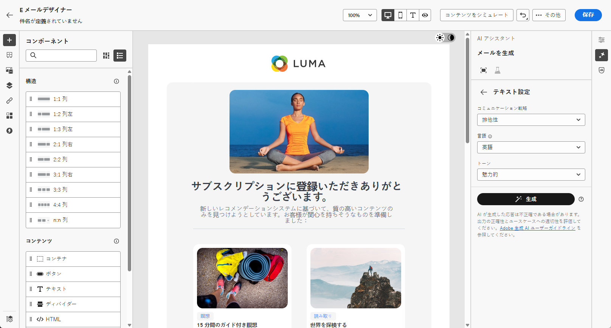

# AI アシスタントを使用したメールの生成 {#generative-email}

>[!BEGINSHADEBOX]

**目次**

* [AI アシスタントの基本を学ぶ](gs-generative.md)
* **[AI アシスタントを使用したメールの生成](generative-email.md)**
* [AI アシスタントを使用した SMS の生成](generative-sms.md)
* [AI アシスタントによるプッシュ生成](generative-push.md)
* [AI アシスタントを使用したコンテンツ実験](generative-experimentation.md)

>[!ENDSHADEBOX]

>[!NOTE]
>
>この機能の使用を開始する前に、関連する[ガードレールと制限](gs-generative.md#generative-guardrails)のトピックに目を通してください。

メールを作成およびカスタマイズした後、生成 AI を活用したJourney Optimizerの AI アシスタントの機能を活用して、コンテンツを高めます。

AI アシスタントを使用して、完全なメール、カスタマイズされたテキストスニペット、オーディエンスに直接話しかけるカスタマイズされた画像を作成し、エンゲージメントとインタラクションを高めることで、キャンペーンの有効性を高めます。

Journey Optimizerで AI アシスタントを使用する方法については、以下のタブを参照してください。

>[!BEGINTABS]

>[!TAB 完全なメール生成]

次の例では、AI アシスタントを利用して、既存のメールテンプレートを絞り込みます。

1. メールキャンペーンを作成して設定したら、 **[!UICONTROL コンテンツを編集]**.

   メールキャンペーンの設定方法について詳しくは、次を参照してください。 [このページ](../campaigns/create-campaign.md).

1. 必要に応じてメールをパーソナライズし、**[!UICONTROL AI アシスタント]**&#x200B;メニューにアクセスします。

   {zoomable=&quot;yes&quot;}

1. を有効にする **[!UICONTROL 元のコンテンツを使用]** キャンペーンのコンテンツ、名前、選択したオーディエンスに基づいて新しいコンテンツをパーソナライズするための AI アシスタントのオプション。

   プロンプトは、常に現在のコンテンツに結び付ける必要があります。

1. 「**[!UICONTROL プロンプト]**」フィールドに生成する内容を記述して、コンテンツを微調整します。

   プロンプトの作成に関する支援を探している場合は、 **[!UICONTROL プロンプトライブラリ]** キャンペーンを改善するための様々な迅速なアイデアを提供します。

   {zoomable=&quot;yes&quot;}

1. を切り替えることができます **[!UICONTROL 件名]** および **[!UICONTROL プリヘッダー]** バリアント生成に含めるオプション。

1. 「**[!UICONTROL ブランドアセットをアップロード]**」をクリックして、AI アシスタントに追加のコンテキストを提供できるコンテンツを含むブランドアセットを追加するか、以前にアップロードしたものを選択します。

   {zoomable=&quot;yes&quot;}

1. 様々なオプションを使用してプロンプトを調整します。

   * **[!UICONTROL コミュニケーション戦略]**：生成テキストに最適なコミュニケーションスタイルを選択します。
   * **[!UICONTROL 言語]**：コンテンツを生成する言語を選択します。
   * **[!UICONTROL トーン]**：メールのトーンは、オーディエンスの共感を呼びます。情報を提供する、遊び心がある、説得力がある、のいずれを求めているかに関わらず、AI アシスタントはメッセージを適切に適応させることができます。

   {zoomable=&quot;yes&quot;}

1. プロンプトの準備が整ったら、「**[!UICONTROL 生成]**」をクリックします。

1. 生成された&#x200B;**[!UICONTROL バリエーション]**&#x200B;を参照して、「**[!UICONTROL プレビュー]**」をクリックし、選択したバリエーションのフルスクリーンバージョンを表示します。

1. **[!UICONTROL プレビュー]**&#x200B;ウィンドウ内の「**[!UICONTROL 絞り込み]**」オプションに移動して、追加のカスタマイズ機能にアクセスします。

   * **[!UICONTROL 言い換え]**：AI アシスタントは、メッセージを様々な方法で言い換えることができ、ユーザーが作成した文章を新鮮で、多様なオーディエンスを惹きつけるメッセージにします。

   * **[!UICONTROL よりシンプルな言語の使用]**:AI アシスタントを活用して言語を簡素化し、より広いオーディエンスに対して明確なアクセシビリティを確保します。

   {zoomable=&quot;yes&quot;}

1. 適切なコンテンツが見つかったら、「**[!UICONTROL 選択]**」をクリックします。

   コンテンツの実験を有効にすることもできます。 [詳細情報](generative-experimentation.md)

1. パーソナライゼーションフィールドを挿入し、プロファイルデータに基づいてメールコンテンツをカスタマイズします。次に「**[!UICONTROL コンテンツをシミュレート]**」ボタンをクリックしてレンダリングを制御し、テストプロファイルでパーソナライゼーション設定を確認します。[詳細情報](../personalization/personalize.md)

コンテンツ、オーディエンスおよびスケジュールを定義したら、メールキャンペーンの準備を始めます。 [詳細情報](../campaigns/review-activate-campaign.md)

>[!TAB テキスト生成]

次の例では、AI アシスタントを活用して、メールのコンテンツを強化します。

1. メールキャンペーンを作成して設定したら、 **[!UICONTROL コンテンツを編集]**.

   メールキャンペーンの設定方法について詳しくは、次を参照してください。 [このページ](../email/create-email.md).

1. 「**[!UICONTROL テキストコンポーネント]**」を選択して、特定のコンテンツのみをターゲットにします。次に、**[!UICONTROL AI アシスタント]**&#x200B;メニューにアクセスします。

   {zoomable=&quot;yes&quot;}

1. を有効にする **[!UICONTROL 元のコンテンツを使用]** キャンペーンのコンテンツ、名前、選択したオーディエンスに基づいて新しいコンテンツをパーソナライズするための AI アシスタントのオプション。

   プロンプトは、常に現在のコンテンツに結び付ける必要があります。

1. 「**[!UICONTROL プロンプト]**」フィールドに生成する内容を記述して、コンテンツを微調整します。

   プロンプトの作成に関する支援を探している場合は、 **[!UICONTROL プロンプトライブラリ]** キャンペーンを改善するための様々な迅速なアイデアを提供します。

   {zoomable=&quot;yes&quot;}

1. 「**[!UICONTROL ブランドアセットをアップロード]**」をクリックし、AI アシスタントに追加のコンテキストを提供できるコンテンツを含むブランドアセットを追加します。

   {zoomable=&quot;yes&quot;}

1. 様々なオプションを使用してプロンプトを調整します。

   * **[!UICONTROL コミュニケーション戦略]**：生成テキストに適した通信方法を選択します。
   * **[!UICONTROL 言語]**：バリアントのコンテンツの言語を選択します。
   * **[!UICONTROL トーン]**：テキストがオーディエンスと目的に適したものになります。
   * **[!UICONTROL 長さ]**：範囲スライダーを使用して、コンテンツの長さを選択します。

   {zoomable=&quot;yes&quot;}

1. プロンプトの準備が整ったら、「**[!UICONTROL 生成]**」をクリックします。

1. 生成された&#x200B;**[!UICONTROL バリエーション]**&#x200B;を参照して、「**[!UICONTROL プレビュー]**」をクリックし、選択したバリエーションのフルスクリーンバージョンを表示します。

1. **[!UICONTROL プレビュー]**&#x200B;ウィンドウ内の「**[!UICONTROL 絞り込み]**」オプションに移動して、追加のカスタマイズ機能にアクセスします。

   * **[!UICONTROL 参照コンテンツとして使用]**：選択したバリアントは、他の結果を生成するための参照コンテンツとして機能します。

   * **[!UICONTROL 詳しく述べる]**：AI アシスタントは、特定のトピックを拡大できるようユーザーをサポートし、理解とエンゲージメントを深められるよう、追加の詳細を提供します。

   * **[!UICONTROL 要約する]**：情報が長すぎると、メール受信者が過負荷になる可能性があります。AI アシスタントを使用して、重要なポイントを明確かつ簡潔な概要に要約し、注意を引いてさらに読むよう促します。

   * **[!UICONTROL 言い換え]**：AI アシスタントは、メッセージを様々な方法で言い換えることができ、ユーザーが作成した文章を新鮮で、多様なオーディエンスを惹きつけるメッセージにします。

   * **[!UICONTROL よりシンプルな言語の使用]**:AI アシスタントを活用して言語を簡素化し、より広いオーディエンスに対して明確なアクセシビリティを確保します。

   {zoomable=&quot;yes&quot;}

1. 適切なコンテンツが見つかったら、「**[!UICONTROL 選択]**」をクリックします。

   コンテンツの実験を有効にすることもできます。 [詳細情報](generative-experimentation.md)

1. パーソナライゼーションフィールドを挿入し、プロファイルデータに基づいてメールコンテンツをカスタマイズします。次に「**[!UICONTROL コンテンツをシミュレート]**」ボタンをクリックしてレンダリングを制御し、テストプロファイルでパーソナライゼーション設定を確認します。[詳細情報](../personalization/personalize.md)

コンテンツ、オーディエンスおよびスケジュールを定義したら、メールキャンペーンの準備を始めます。 [詳細情報](../campaigns/review-activate-campaign.md)

>[!TAB 画像生成]

次の例では、AI アシスタントを活用してアセットを最適化および改善し、使いやすいエクスペリエンスを実現する方法を説明します。

1. メールキャンペーンを作成して設定したら、 **[!UICONTROL コンテンツを編集]**.

   メールキャンペーンの設定方法について詳しくは、次を参照してください。 [このページ](../email/create-email.md).

1. を入力します **[!UICONTROL 基本の詳細]** キャンペーン用。 完了したら、「**[!UICONTROL メールコンテンツを編集]**」をクリックします。

1. AI アシスタントで変更するアセットを選択します。

1. 右側のメニューから、「**[!UICONTROL AI アシスタント]**」を選択します。

   {zoomable=&quot;yes&quot;}

1. を有効にする **[!UICONTROL 参照スタイル]** 参照コンテンツに基づいて新しいコンテンツをパーソナライズするための AI アシスタントのオプション。 また、画像をアップロードして、バリエーションにコンテキストを追加することもできます。

   プロンプトは、常に現在のコンテンツに結び付ける必要があります。

1. 「**[!UICONTROL プロンプト]**」フィールドに生成する内容を記述して、コンテンツを微調整します。

   プロンプトの作成に関する支援を探している場合は、 **[!UICONTROL プロンプトライブラリ]** キャンペーンを改善するための様々な迅速なアイデアを提供します。

   {zoomable=&quot;yes&quot;}

1. 「**[!UICONTROL ブランドアセットをアップロード]**」をクリックし、AI アシスタントに追加のコンテキストを提供できるコンテンツを含むブランドアセットを追加します。

1. 様々なオプションを使用してプロンプトを調整します。

   * **[!UICONTROL 縦横比]**：これにより、アセットの幅と高さが決まります。16:9、4:3、3:2、1:1 など、一般的な比率から選択することも、カスタムサイズを入力することもできます。
   * **[!UICONTROL カラーとトーン]**：画像内のカラーの全体的な外観と、画像が伝えるムードまたは雰囲気。
   * **[!UICONTROL コンテンツタイプ]**：これにより、視覚要素の性質が分類され、写真、グラフィック、アートなど、様々な視覚的表現が区別されます。
   * **[!UICONTROL 照明]**：画像内の稲妻を指し、画像の雰囲気を形成し、特定の要素をハイライト表示します。
   * **[!UICONTROL 構成]**：画像のフレーム内の要素の配置を指します

   {zoomable=&quot;yes&quot;}

1. プロンプトの設定が完了したら、「**[!UICONTROL 生成]**」をクリックします。

1. 「**[!UICONTROL バリエーションの提案]**」を参照して、目的のアセットを見つけます。

   「**[!UICONTROL プレビュー]**」をクリックして、選択したバリエーションのフルスクリーンバージョンを表示します。

   {zoomable=&quot;yes&quot;}

1. このバリアントに関連する画像を表示する場合は、「**[!UICONTROL 類似を表示]**」を選択します。

   {zoomable=&quot;yes&quot;}

1. 適切なコンテンツが見つかったら、「**[!UICONTROL 選択]**」をクリックします。

   コンテンツの実験を有効にすることもできます。 [詳細情報](generative-experimentation.md)

1. メッセージの内容を定義したら、「**[!UICONTROL コンテンツをシミュレート]**」ボタンをクリックしてレンダリングを制御し、テストプロファイルでパーソナライゼーション設定を確認します。[詳細情報](../personalization/personalize.md)

1. コンテンツ、オーディエンスおよびスケジュールを定義したら、メールキャンペーンの準備を始めます。 [詳細情報](../campaigns/review-activate-campaign.md)

>[!ENDTABS]

## チュートリアルビデオ {#video}

AI アシスタントを使用して、完全なメール、テキストまたは画像を生成する方法を説明します。

>[!VIDEO](https://video.tv.adobe.com/v/3428341)
