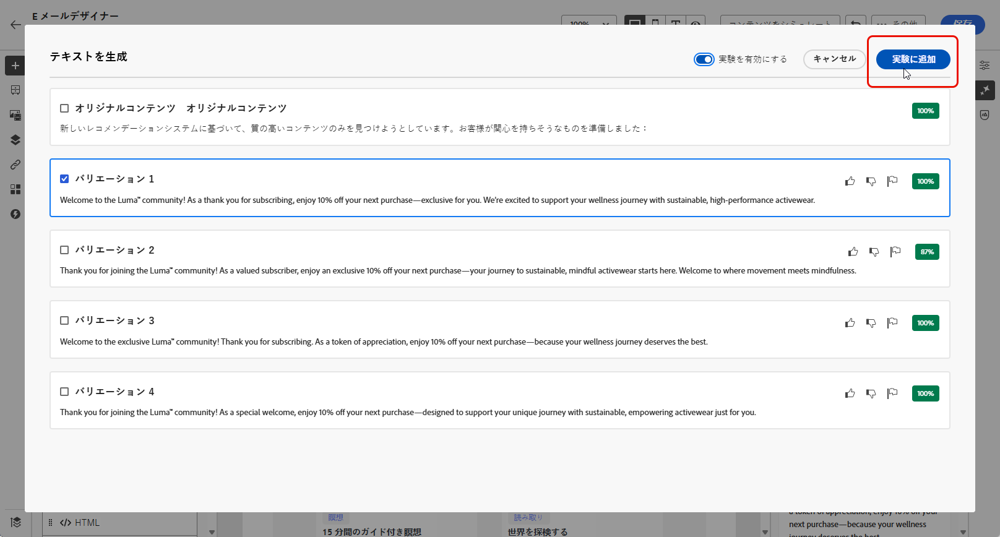

# AI アシスタントを使用したコンテンツ実験 {#generative-experimentation}

>[!BEGINSHADEBOX]

**目次**

* [AI アシスタントの基本を学ぶ](gs-generative.md)
* [AI アシスタントを使用したメールの生成](generative-email.md)
* [AI アシスタントを使用した SMS の生成](generative-sms.md)
* [AI アシスタントによるプッシュ生成](generative-push.md)
* **[AI アシスタントを使用したコンテンツ実験](generative-experimentation.md)**

>[!ENDSHADEBOX]

メッセージを作成してパーソナライズしたら、コンテンツ実験機能を含むJourney Optimizer AI アシスタントを使用してコンテンツを強化します。 このツールを使用すると、様々なコンテンツの複数の配信処理を定義して、ターゲットオーディエンスのパフォーマンスを測定できます。

1. キャンペーンを作成し、AI アシスタントを使用してバリアントを生成します。

   この例では、プロモーションコードを含んだ購読確認メールを生成しました。

   

1. 生成された&#x200B;**[!UICONTROL バリエーション]**&#x200B;を参照して、「**[!UICONTROL プレビュー]**」をクリックし、選択したバリエーションのフルスクリーンバージョンを表示します。

   

1. を選択 **[!UICONTROL 実験を有効にする]** 作成を開始するには **[!UICONTROL 件の処理]** 実験のために。

1. 実験に含めるバリエーションを選択します。

1. クリック **X 個の処理を追加**.

   

1. コンテンツ実験ウィンドウから、にアクセスします **[!UICONTROL 実験設定]** 実験を設定するボタン。 [コンテンツ実験の詳細情報](../campaigns/content-experiment.md)

   

1. コンテンツ実験の準備が整ったら、キャンペーンの概要ページで、 **[!UICONTROL アクティブ化するレビュー]** キャンペーンの概要を表示します。 パラメーターが正しくない、または見つからない場合は、アラートが表示されます。 [詳細情報](../campaigns/content-experiment.md#treatment-experiment)

1. キャンペーンを開始する前に、すべての設定が正しいことを再確認し、「**[!UICONTROL アクティブ化]**」をクリックします。

キャンペーンの設定とパーソナライズが完了したら、キャンペーンレポートでキャンペーンをトラッキングできます。 [詳細情報](../reports/campaign-global-report.md)
