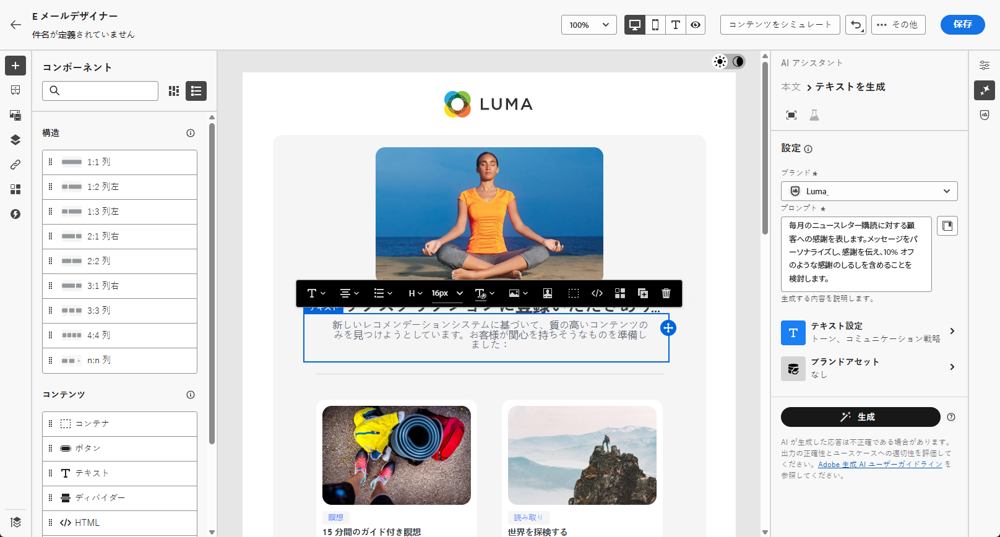
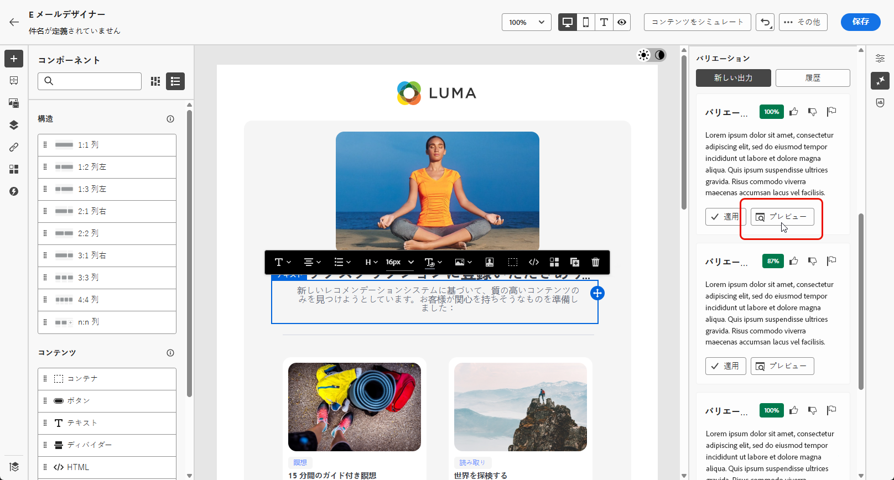
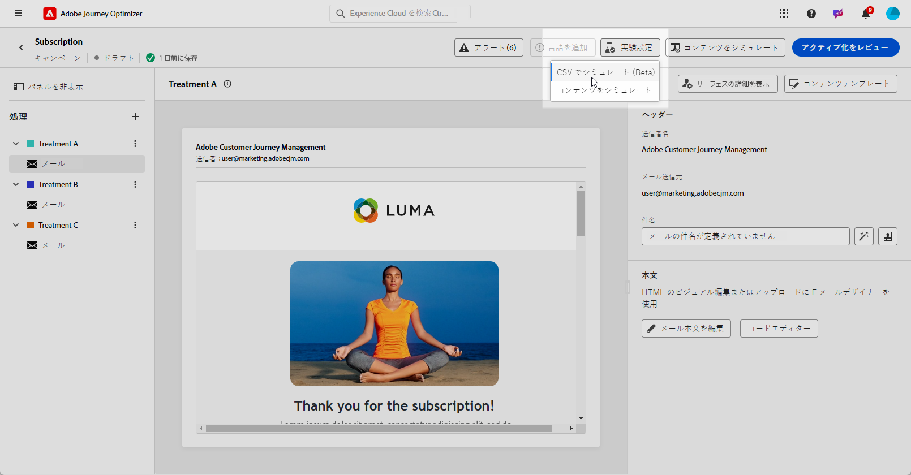

# AI アシスタントコンテンツアクセラレータによるコンテンツ実験 {#generative-experimentation}

>[!IMPORTANT]
>
>この機能の使用を開始する前に、関連する[ガードレールと制限](gs-generative.md#generative-guardrails)のトピックに目を通してください。
> 
>
>Journey Optimizer で AI アシスタントコンテンツアクセラレータを使用する前に、[ユーザー契約](https://www.adobe.com/jp/legal/licenses-terms/adobe-dx-gen-ai-user-guidelines.html)に同意する必要があります。詳しくは、アドビ担当者にお問い合わせください。

メッセージを作成してパーソナライズしたら、コンテンツ実験機能を含む Adobe Journey Optimizer の AI アシスタントコンテンツアクセラレータを使用してコンテンツを強化します。このツールを使用すると、コンテンツを変えて複数の配信処理を定義して、ターゲットオーディエンスのパフォーマンスを測定できます。

1. キャンペーンを作成し、AI アシスタントコンテンツアクセラレータを使用してバリアントを生成します。

   この例では、プロモーションコードを含んだ購読確認メールを生成しました。

   

1. 生成された&#x200B;**[!UICONTROL バリエーション]**&#x200B;を参照し、「**[!UICONTROL プレビュー]**」をクリックして、選択したバリエーションのフルスクリーンバージョンを表示します。

   

1. 「**[!UICONTROL 実験を有効にする]**」を選択して、実験用の&#x200B;**[!UICONTROL 処理]**&#x200B;の作成を開始します。

1. 実験に含めるバリエーションを選択します。

1. 「**実験に追加**」をクリックします。

   

1. コンテンツ実験ウィンドウから「**[!UICONTROL 実験の設定]**」ボタンにアクセスして、実験を設定します。[コンテンツ実験の詳細情報](../content-management/content-experiment.md)

   

1. コンテンツ実験の準備が整ったら、キャンペーンの概要ページで「**[!UICONTROL アクティブ化するレビュー]**」をクリックして、キャンペーンの概要を表示できます。パラメーターが正しくないか見つからない場合は、警告が表示されます。[詳細情報](../content-management/content-experiment.md#treatment-experiment)

1. キャンペーンを開始する前に、すべての設定が正しいことを再確認し、「**[!UICONTROL アクティブ化]**」をクリックします。

キャンペーンを正常に設定しパーソナライズしたら、キャンペーンレポートでキャンペーンを追跡できます。[詳細情報](../reports/campaign-global-report-cja.md)
