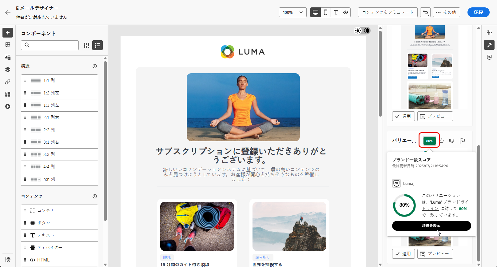
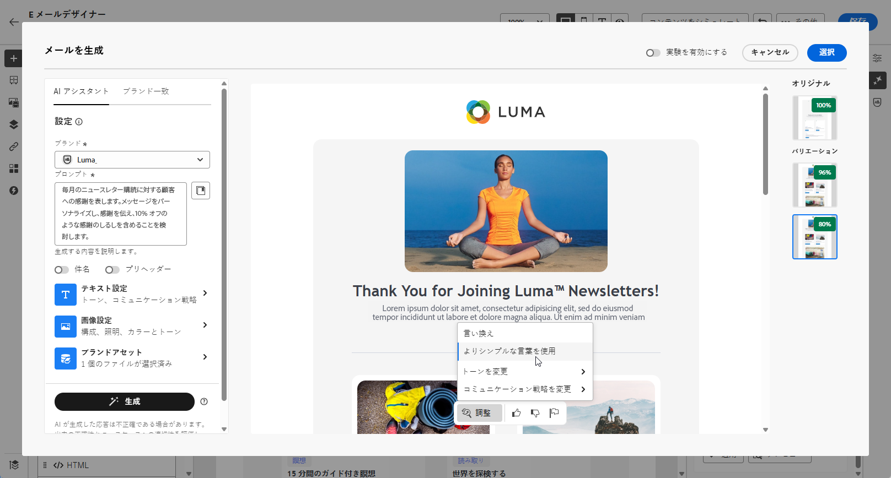
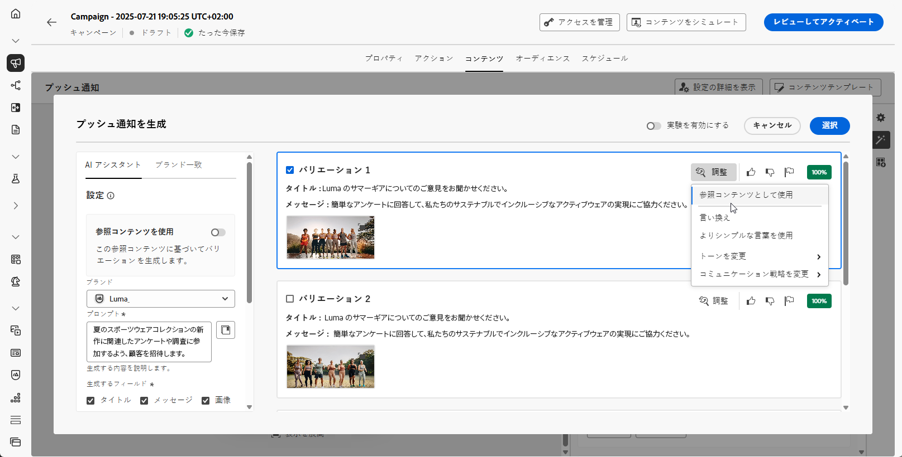

# AI アシスタントで完全なコンテンツを生成 {#generative-full-content}

>[!IMPORTANT]
>
>この機能の使用を開始する前に、関連する[ガードレールと制限](gs-generative.md#generative-guardrails)のトピックに目を通してください。
> 
>
>Journey Optimizer で AI アシスタントを使用する前に、[ユーザー契約](https://www.adobe.com/jp/legal/licenses-terms/adobe-dx-gen-ai-user-guidelines.html)に同意する必要があります。詳しくは、アドビ担当者にお問い合わせください。

Journey Optimizerの AI アシスタントを使用すると、メール、web、ランディングページ、プッシュ通知などのチャネルをまたいで、包括的なコンテンツエクスペリエンスを生成できます。 AI アシスタントは、オーディエンスの共感を得られる包括的なコンテンツを作成することで、配信の影響を最適化するのに役立ちます。

## メールおよび Web チャネルの場合 {#email-web-channels}

AI アシスタントは、メールキャンペーン、web ページ、ランディングページに完全なコンテンツエクスペリエンスを生成し、テキストと画像の両方を生成できます。 この堅牢な機能により、すべてのデジタルタッチポイントにわたってオーディエンスとつながる、魅力的なオンブランドコンテンツを作成できます。

### アクセスと設定 {#access-configure}

AI アシスタントでコンテンツの作成を開始する前に、キャンペーンまたはジャーニーを設定し、コンテンツエディターを開く必要があります。 以下の手順を使用してワークスペースを準備し、AI アシスタント パネルにアクセスします。

1. キャンペーンまたはジャーニーを作成して設定します。
   * **メール**：メールキャンペーンを作成して設定したら、「**[!UICONTROL コンテンツを編集]**」をクリックします。 [詳細情報](../campaigns/create-campaign.md)
   * **Web**:Web ページを作成および設定したら、「**[!UICONTROL Web ページを編集]**」をクリックします。 [詳細情報](../web/create-web.md)
   * **ランディングページ**：ランディングページを作成して設定したら、**[!UICONTROL コンテンツを編集]** をクリックします。 [詳細情報](../landing-pages/create-lp.md)

1. 必要に応じてレイアウトをパーソナライズし、**[!UICONTROL AI アシスタント]**&#x200B;メニューにアクセスします。

   {zoomable="yes"}

### コンテンツを生成 {#generate-content}

AI アシスタントを開くと、ブランドとキャンペーンの目標に合ったコンテンツを作成するように生成設定を設定できるようになりました。 テキストおよび画像パラメーターのカスタマイズ、ブランドアセットの追加、オーディエンスに関連するバリエーションの生成において AI をガイドするプロンプトの提供を行います。

1. 「**[!UICONTROL オリジナルコンテンツを使用]**」オプションを有効にして、AI アシスタントで、選択したコンテンツに基づいて新しいコンテンツをパーソナライズします。

1. **[!UICONTROL ブランド]**&#x200B;を選択して、AI で生成されたコンテンツがブランドの仕様と一致していることを確認します。ブランドについて詳しくは、[こちら](brands.md)を参照してください。

1. 生成する内容を「**[!UICONTROL プロンプト]**」フィールドに記述して、コンテンツを微調整します。

   プロンプトを作成する際に支援を求めている場合は、**[!UICONTROL プロンプトライブラリ]** にアクセスしてください。このライブラリは、キャンペーンを改善するための様々な迅速なアイデアを提供します。 [ プロンプトのベストプラクティスの詳細情報 ](ai-assistant-prompting-guide.md)

   {zoomable="yes"}

1. **メールの場合**、「件名 **** および **[!UICONTROL プリヘッダー]**」オプションを切り替えて、バリアント生成に含めることができます。

1. 次の&#x200B;**[!UICONTROL テキスト設定]**&#x200B;オプションを使用してプロンプトを調整します。

   * **[!UICONTROL コミュニケーション戦略]**：生成テキストに最適なコミュニケーションスタイルを選択します。
   * **[!UICONTROL 言語]**：生成されたコンテンツの言語を選択します。
   * **[!UICONTROL トーン]**：トーンはオーディエンスの共感を得られるはずです。 情報を提供する、遊び心を持たせる、説得力があるなど、目的に合わせて、AI アシスタントはメッセージを適切に調整することができます。

   {zoomable="yes"}

1. **[!UICONTROL 画像設定]**&#x200B;を選択します。

   * **[!UICONTROL コンテンツタイプ]**：これにより、視覚要素の性質が分類され、写真、グラフィック、アートなど、様々な視覚的表現が区別されます。
   * **[!UICONTROL 視覚的な強度]**：画像の強度を調整することで、画像の影響を制御できます。低い設定（2）では、より柔らかく抑制された外観が作成され、高い設定（10）では、画像がより鮮やかで視覚的に強力になります。
   * **[!UICONTROL カラーとトーン]**：画像内のカラーの全体的な外観と、画像が伝えるムードまたは雰囲気。
   * **[!UICONTROL 照明]**：画像内の稲妻を指し、画像の雰囲気を形成し、特定の要素をハイライト表示します。
   * **[!UICONTROL 構成]**：画像のフレーム内の要素の配置を指します

   {zoomable="yes"}

1. **[!UICONTROL ブランドアセット]**&#x200B;メニューから「**[!UICONTROL ブランドアセットをアップロード]**」をクリックすると、AI アシスタントに追加のコンテキストを提供できるコンテンツを含むブランドアセットを追加するか、以前にアップロードしたアセットを選択できます。

   以前にアップロードしたファイルは、**[!UICONTROL アップロードされたブランドアセット]**&#x200B;ドロップダウンで使用できます。生成に含めるアセットを切り替えるだけです。

   {zoomable="yes"}

1. プロンプトの準備が整ったら、「**[!UICONTROL 生成]**」をクリックします。

### 絞り込みと最終処理 {#refine-finalize}

コンテンツのバリエーションを生成したら、結果を微調整して、正確な要件を満たすことができます。 ブランドの整合性を確認し、トーンと言語を調整し、キャンペーンまたはジャーニーでアクティブ化するコンテンツを準備します。

1. 生成後、**[!UICONTROL バリエーション]** を参照し、**[!UICONTROL プレビュー]** をクリックして、選択したバリエーションのフルスクリーンバージョンを表示するか、**[!UICONTROL 適用]** をクリックして、現在のコンテンツを置き換えます。

1. 「割合」アイコンをクリックして、**[!UICONTROL ブランド一致スコア]**&#x200B;を表示し、ブランドとの不一致を特定します。

   詳しくは、[ブランド一致スコア](brands-score.md)を参照してください。

   {zoomable="yes"}

1. **[!UICONTROL プレビュー]**&#x200B;ウィンドウ内の「**[!UICONTROL 絞り込み]**」オプションに移動して、追加のカスタマイズ機能にアクセスします。

   * **[!UICONTROL フレーズ変更]**：メッセージの意味を保持したまま、メッセージを書き換えます。 このオプションを使用すると、コアメッセージを変更せずに代替表現を生成したり、フローを改善したり、言葉遣いを調整したりできます。

   * **[!UICONTROL よりシンプルな言葉を使用]**：AI アシスタントを活用して言葉を簡素化し、より幅広いオーディエンスに対して明確さとアクセシビリティを確保します。

   * **[!UICONTROL トーンを変更]**：メッセージのトーンを調整して、よりフレンドリーでプロフェッショナル、緊急、または感動的なコミュニケーションスタイルに合わせます。

   * **[!UICONTROL コミュニケーション戦略の変更]**：緊急性の創出や魅力的なアピールの強調など、目的に応じてメッセージングアプローチを変更します。

   {zoomable="yes"}

1. 「**[!UICONTROL ブランド一致]**」タブを開いて、コンテンツが[ブランドガイドライン](brands.md)とどのように一致しているかを確認します。

1. 適切なコンテンツが見つかったら、「**[!UICONTROL 選択]**」をクリックします。

   また、コンテンツの実験を有効にすることもできます。[詳細情報](generative-experimentation.md)

1. パーソナライゼーションフィールドを挿入して、プロファイルデータに基づいてコンテンツをカスタマイズします。 次に「**[!UICONTROL コンテンツをシミュレート]**」ボタンをクリックしてレンダリングを制御し、テストプロファイルでパーソナライゼーション設定を確認します。[詳細情報](../personalization/personalize.md)

1. コンテンツをレビューしてアクティブ化します。
   * **メール**：コンテンツ、オーディエンス、スケジュールを定義したら、メールキャンペーンの準備を始めます。 [詳細情報](../campaigns/review-activate-campaign.md)
   * **Web**:web キャンペーンの設定を定義し、必要に応じてコンテンツを編集したら、web キャンペーンをレビューおよびアクティブ化できます。 [詳細情報](../web/create-web.md#activate-web-campaign)
   * **ランディングページ**：ランディングページの準備が整ったら、ページを公開して、メッセージで使用できるようにします。 [詳細情報](../landing-pages/create-lp.md#publish-landing-page)

## モバイルチャネル用 {#mobile-channels}

また、AI アシスタントは、モバイルプッシュ通知のコンテンツ生成もサポートしており、モバイルアプリ向けの魅力的なタイトル、メッセージ、画像を作成できます。 これにより、モバイルを含むすべての顧客タッチポイントで、一貫性のある高品質の通信を維持できます。

### アクセスと設定 {#mobile-access-configure}

AI アシスタントをプッシュ通知に使用するには、まずプッシュキャンペーンを設定し、コンテンツエディターを開きます。 以下の手順では、キャンペーンの準備と AI アシスタントツールへのアクセスについて説明します。

1. プッシュ通知キャンペーンを作成し設定したら、「**[!UICONTROL コンテンツを編集]**」をクリックします。

   プッシュ通知キャンペーンの設定方法について詳しくは、[こちら](../push/create-push.md)を参照してください。

1. キャンペーンの&#x200B;**[!UICONTROL 基本的な詳細]**&#x200B;を入力します。完了したら、「**[!UICONTROL コンテンツを編集]**」をクリックします。

1. 必要に応じて、プッシュ通知をパーソナライズします。[詳細情報](../push/design-push.md)

1. **[!UICONTROL AI アシスタントを表示]**&#x200B;メニューにアクセスします。

   {zoomable="yes"}

### コンテンツを生成 {#mobile-generate-content}

プッシュ通知用に AI アシスタントにアクセスしたら、生成設定を設定して、魅力的なモバイルコンテンツを作成できます。 テキストと画像の環境設定を定義し、ブランドアセットを選択し、プロンプトを使用してモバイルユーザーを引き付けるプッシュ通知のバリエーションを生成します。

1. 「**[!UICONTROL オリジナルコンテンツを使用]**」オプションを有効にして、AI アシスタントで、選択したコンテンツに基づいて新しいコンテンツをパーソナライズします。

1. **[!UICONTROL ブランド]**&#x200B;を選択して、AI で生成されたコンテンツがブランドの仕様と一致していることを確認します。ブランドについて詳しくは、[こちら](brands.md)を参照してください。

   ブランド機能は Private Beta としてリリースされており、今後のリリースですべての顧客が段階的に利用できるようになります。

1. 生成する内容を「**[!UICONTROL プロンプト]**」フィールドに記述して、コンテンツを微調整します。

   プロンプトの作成に関するサポートが必要な場合は、キャンペーンを改善するための様々なプロンプトのアイデアを提供する&#x200B;**[!UICONTROL プロンプトライブラリ]**&#x200B;にアクセスしてください。

   {zoomable="yes"}

1. 生成するフィールド（「**[!UICONTROL タイトル]**」、「**[!UICONTROL メッセージ]**」、「**[!UICONTROL 画像]**」）を選択します。

1. 次の&#x200B;**[!UICONTROL テキスト設定]**&#x200B;オプションを使用してプロンプトを調整します。

   * **[!UICONTROL コミュニケーション戦略]**：生成テキストに最適なコミュニケーションスタイルを選択します。
   * **[!UICONTROL 言語]**：生成されたコンテンツの言語を選択します。
   * **[!UICONTROL トーン]**：プッシュ通知のトーンは、オーディエンスの共感を呼ぶものにします。情報を提供する、遊び心を持たせる、説得力があるなど、目的に合わせて、AI アシスタントはメッセージを適切に調整することができます。

   {zoomable="yes"}

1. **[!UICONTROL 画像設定]**&#x200B;を選択します。

   * **[!UICONTROL コンテンツタイプ]**：これにより、視覚要素の性質が分類され、写真、グラフィック、アートなど、様々な視覚的表現が区別されます。
   * **[!UICONTROL 視覚的な強度]**：画像の強度を調整することで、画像の影響を制御できます。低い設定（2）では、より柔らかく抑制された外観が作成され、高い設定（10）では、画像がより鮮やかで視覚的に強力になります。
   * **[!UICONTROL カラーとトーン]**：画像内のカラーの全体的な外観と、画像が伝えるムードまたは雰囲気。
   * **[!UICONTROL 照明]**：画像内の稲妻を指し、画像の雰囲気を形成し、特定の要素をハイライト表示します。
   * **[!UICONTROL 構成]**：画像のフレーム内の要素の配置を指します

   {zoomable="yes"}

1. **[!UICONTROL ブランドアセット]**&#x200B;メニューから「**[!UICONTROL ブランドアセットをアップロード]**」をクリックすると、AI アシスタントに追加のコンテキストを提供できるコンテンツを含むブランドアセットを追加するか、以前にアップロードしたアセットを選択できます。

   以前にアップロードしたファイルは、**[!UICONTROL アップロードされたブランドアセット]**&#x200B;ドロップダウンで使用できます。生成に含めるアセットを切り替えるだけです。

1. プロンプトの準備が整ったら、「**[!UICONTROL 生成]**」をクリックします。

### 絞り込みと最終処理 {#mobile-refine-finalize}

生成されたプッシュ通知のバリエーションを確認した後、コンテンツを完全なものにすることができます。 プッシュキャンペーンをアクティブ化する前に、絞り込みツールを使用して言語とトーンを調整し、ブランドの関連付けを検証し、コンテンツをパーソナライズします。

1. 生成された&#x200B;**[!UICONTROL バリエーション]**&#x200B;を参照します。

1. 割合アイコンをクリックして、**[!UICONTROL ブランド一致スコア]**&#x200B;を表示し、ブランドとの不一致を特定します。

   詳しくは、[ブランド一致スコア](brands-score.md)を参照してください。

   {zoomable="yes"}

1. 「**[!UICONTROL プレビュー]**」をクリックして、選択したバリエーションの全画面バージョンを表示するか、「**[!UICONTROL 適用]**」をクリックして、現在のコンテンツを置き換えます。

1. **[!UICONTROL プレビュー]**&#x200B;ウィンドウ内の「**[!UICONTROL 絞り込み]**」オプションに移動して、追加のカスタマイズ機能にアクセスします。

   * **[!UICONTROL 参照コンテンツとして使用]**：選択したバリアントは、他の結果を生成するための参照コンテンツとして機能します。

   * **[!UICONTROL フレーズ変更]**：メッセージの意味を保持したまま、メッセージを書き換えます。 このオプションを使用すると、コアメッセージを変更せずに代替表現を生成したり、フローを改善したり、言葉遣いを調整したりできます。

   * **[!UICONTROL よりシンプルな言葉を使用]**：AI アシスタントを活用して言葉を簡素化し、より幅広いオーディエンスに対して明確さとアクセシビリティを確保します。

   * **[!UICONTROL トーンを変更]**：メッセージのトーンを調整して、よりフレンドリーでプロフェッショナル、緊急、または感動的なコミュニケーションスタイルに合わせます。

   * **[!UICONTROL コミュニケーション戦略の変更]**：緊急性の創出や魅力的なアピールの強調など、目的に応じてメッセージングアプローチを変更します。

   {zoomable="yes"}

1. 「**[!UICONTROL ブランド一致]**」タブを開いて、コンテンツが[ブランドガイドライン](brands.md)とどのように一致しているかを確認します。

1. 適切なコンテンツが見つかったら、「**[!UICONTROL 選択]**」をクリックします。

   また、コンテンツの実験を有効にすることもできます。[詳細情報](generative-experimentation.md)

1. パーソナライゼーションフィールドを挿入して、プロファイルデータに基づいてプッシュ通知コンテンツをカスタマイズします。次に「**[!UICONTROL コンテンツをシミュレート]**」ボタンをクリックしてレンダリングを制御し、テストプロファイルでパーソナライゼーション設定を確認します。[詳細情報](../personalization/personalize.md)

コンテンツ、オーディエンスおよびスケジュールを定義したら、プッシュキャンペーンの準備が整います。[詳細情報](../campaigns/review-activate-campaign.md)

## チュートリアルビデオ {#video}

Journey Optimizerで AI アシスタントを使用して、完全なコンテンツエクスペリエンスを生成する方法を説明します。

>[!VIDEO](https://video.tv.adobe.com/v/3433552)
