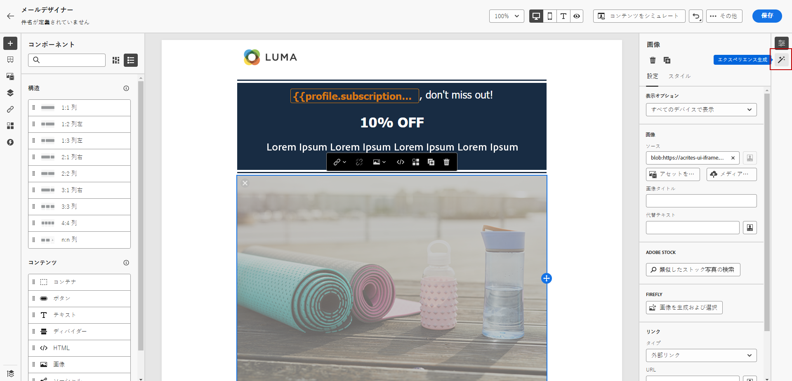
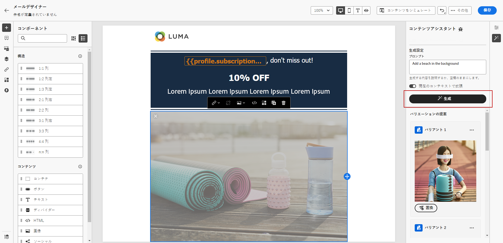
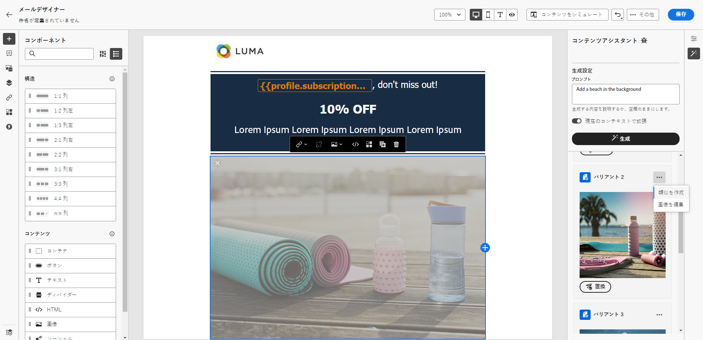
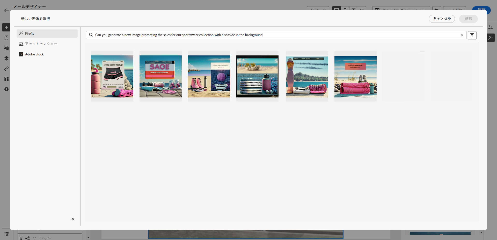
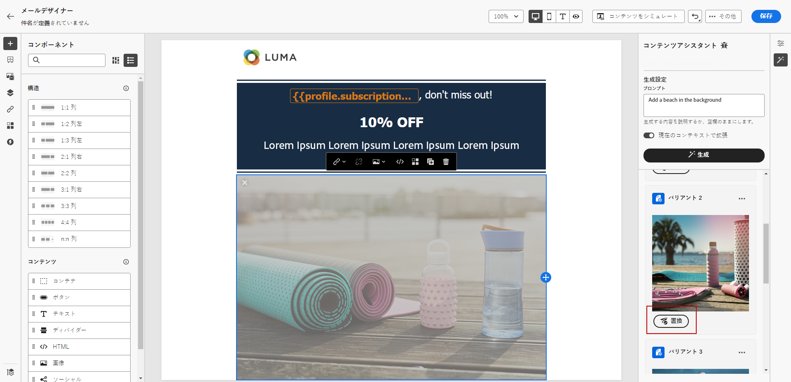
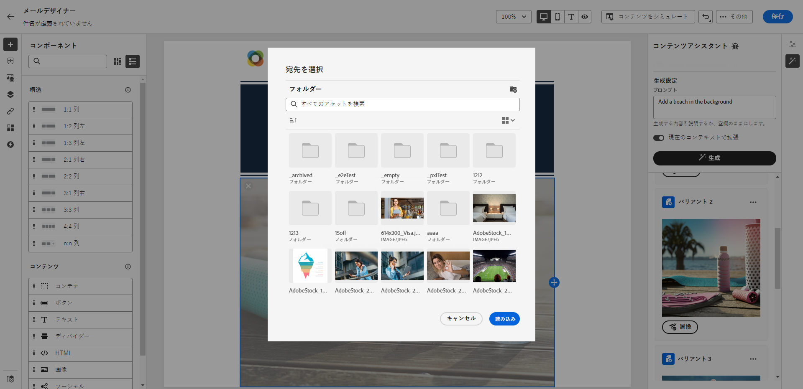

# コンテンツアシスタントを使用した画像の生成 {#image-content-assistant}

>[!BEGINSHADEBOX]

**目次**

* [コンテンツアシスタント入門](gs-generative.md)
* [コンテンツアシスタントでのテキストの生成](generative-content.md)
* **[コンテンツアシスタントで画像を生成](generative-image.md)**

>[!ENDSHADEBOX]

メールまたは web ページを作成してパーソナライズしたら、コンテンツアシスタントを使用してコンテンツを次のレベルに引き上げます。この強力なツールを使用すると、コンテンツを容易にパーソナライズおよび強化できます。

以下の例では、コンテンツアシスタントを使用してアセットの更新と改善を行い、ユーザーエクスペリエンスを向上させる方法について説明します。次の手順に従います。

1. メッセージを作成して設定したら、「**[!UICONTROL コンテンツを作成]**」をクリックし、必要に応じてパーソナライズします。

1. コンテンツアシスタントで変更するアセットを選択します。

1. 右側のメニューから、「**[!UICONTROL エクスペリエンスの生成]**」を選択します。

   

1. 結果を微調整するためのプロンプトを追加し、「**[!UICONTROL 生成]**」をクリックします。

   コンテンツアシスタントの「**[!UICONTROL 現在のコンテンツで拡充]**」オプションを有効にして、メッセージ、キャンペーン名、選択したオーディエンスに基づいて、新しいアセットをパーソナライズします。

   

1. 「**[!UICONTROL バリエーションの提案]**」を参照して、目的のアセットを見つけます。

1. 「**[!UICONTROL バリアント]**」を選択したら、選択したアセットの詳細メニューにアクセスします。

   

1. 「**[!UICONTROL 類似を作成]**」を選択すると、選択したバリアントに基づいてさらにバリアントを生成できます。

1. 「**[!UICONTROL 画像の編集]**」をクリックして、「**[!UICONTROL 新しい画像を選択]**」メニューにアクセスします。

1. このメニューから、新しいアセットを生成するか、アセットフォルダーから既存のアセットを使用するように選択できます。

   

1. 「**[!UICONTROL 挿入]**」をクリックして、生成されたアセットをコンテンツに追加します。

   

1. 生成したアセットを保存するフォルダーを選択し、「**[!UICONTROL 読み込み]**」をクリックします。

   

1. メッセージの内容を定義したら、「**[!UICONTROL コンテンツをシミュレート]**」ボタンをクリックしてレンダリングを制御し、テストプロファイルでパーソナライゼーション設定を確認します。[詳細情報](../email/preview.md)

1. メッセージの準備が整ったら、キャンペーンの概要ページで「**[!UICONTROL アクティブ化のレビュー]**」をクリックして、キャンペーンの概要を表示できます。パラメーターが正しくない、または見つからない場合は、警告が表示されます。

1. キャンペーンを開始する前に、すべての設定が正しいことを再確認し、「**[!UICONTROL アクティブ化]**」をクリックします。

実験とキャンペーンを正常に設定したら、キャンペーンレポートを使用してキャンペーンをトラッキングできます。[詳細情報](../reports/campaign-global-report.md#experimentation-report)
