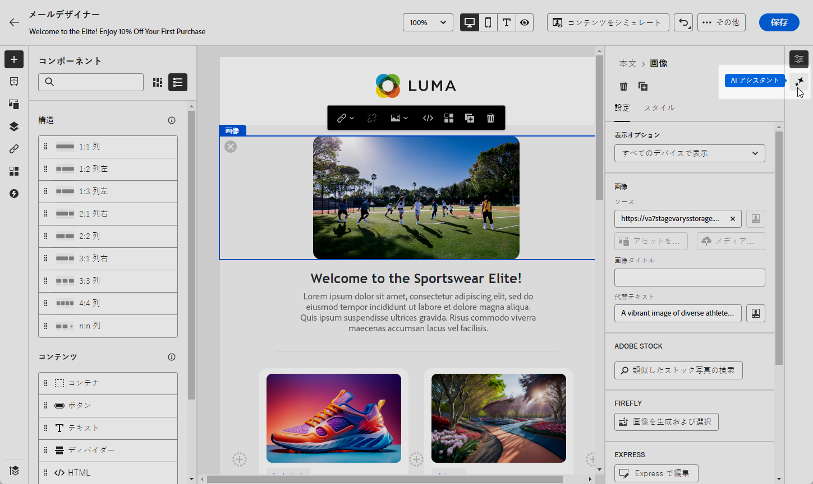
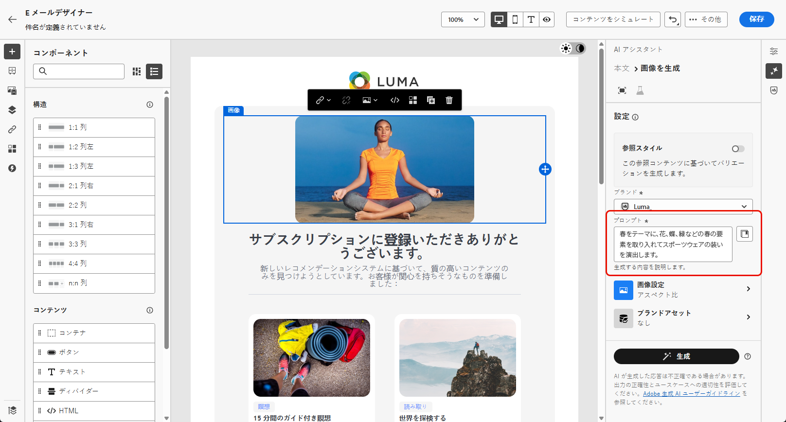
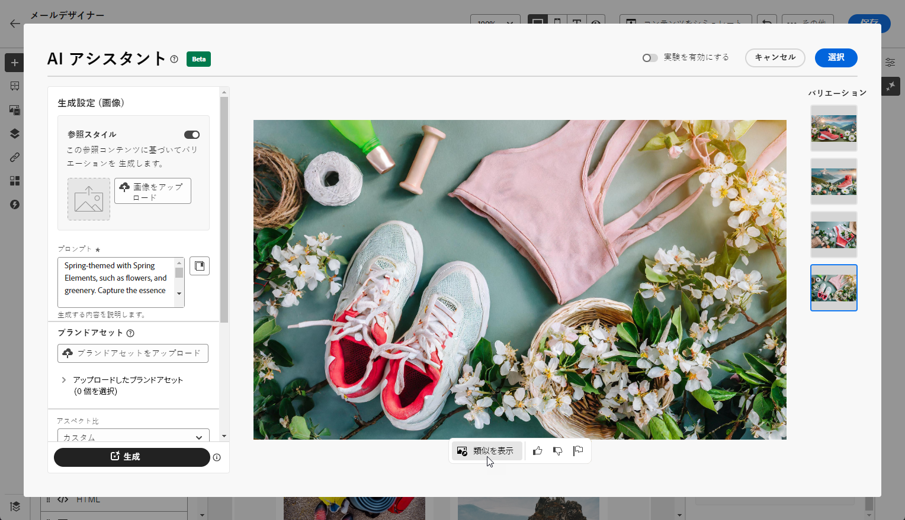
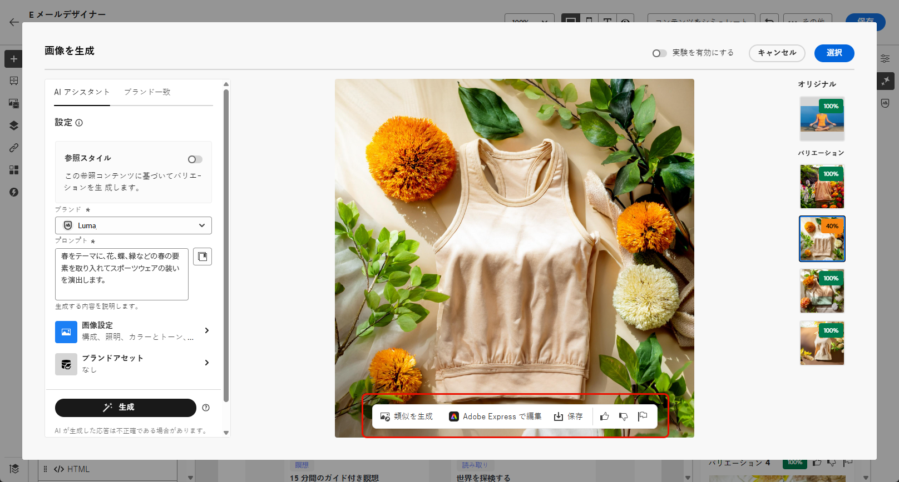
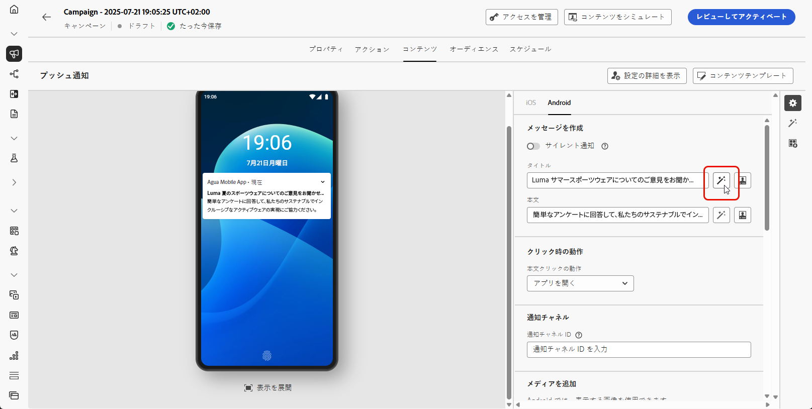
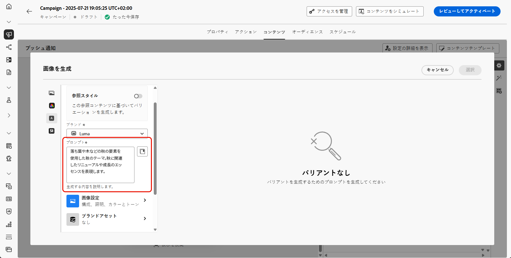
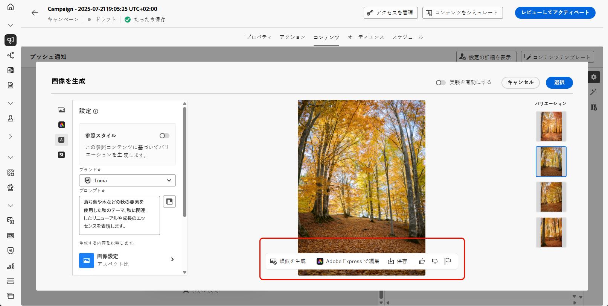

# AI アシスタントを使用した画像の生成 {#generative-image}

>[!IMPORTANT]
>
>この機能の使用を開始する前に、関連する[ガードレールと制限](gs-generative.md#generative-guardrails)のトピックに目を通してください。
> 
>
>Journey Optimizer で AI アシスタントを使用する前に、[ユーザー契約](https://www.adobe.com/jp/legal/licenses-terms/adobe-dx-gen-ai-user-guidelines.html)に同意する必要があります。詳しくは、アドビ担当者にお問い合わせください。

Journey Optimizer の AI アシスタントを使用して、メール、web、ランディングページ、プッシュ通知をまたいでメッセージを強化する魅力的なビジュアルコンテンツを生成します。AI アシスタントは、アセットの最適化と改善に役立ち、オーディエンスに対してより使いやすい魅力的なエクスペリエンスを実現します。

## メールと web チャネルの場合 {#email-web-channels}

AI アシスタントは、キャンペーン、web エクスペリエンス、ランディングページに完全なビジュアルエクスペリエンスを生成できます。この機能により、デジタルタッチポイントをまたいでオーディエンスの共感を得られる、ブランドに即した注目を集める画像を作成できます。

### アクセスと設定 {#access-configure}

AI アシスタントを使用して画像の生成を開始するには、まずキャンペーンやジャーニーを設定して、コンテンツエディターを開きます。ワークスペースを準備し、AI アシスタントパネルにアクセスするには、次の手順に従います。

1. キャンペーンやジャーニーを作成および設定します。
   * **メール**：メールキャンペーンを作成および設定したら、「**[!UICONTROL コンテンツを編集]**」をクリックします。[詳細情報](../email/create-email.md)
   * **Web**：web ページを作成および設定したら、「**[!UICONTROL Web ページを編集]**」をクリックします。[詳細情報](../web/create-web.md)
   * **ランディングページ**：ランディングページを作成および設定したら、「**[!UICONTROL デザイナーを開く]**」をクリックします。[詳細情報](../landing-pages/create-lp.md)

1. AI アシスタントで変更するアセットを選択します。

1. 右側のメニューから「**[!UICONTROL AI アシスタント]**」（web の場合は「**[!UICONTROL コンテンツアシスタントを表示]**」）を選択します。

   {zoomable="yes"}

### コンテンツを生成 {#generate-content}

AI アシスタントを使用して、効果的なプロンプトを作成し、画像設定を指定して、視覚的に魅力的な画像を生成する方法について説明します。縦横比、視覚強度、照明などのパラメーターをカスタマイズして、ブランドやキャンペーンの目標に一致する画像を作成します。

1. AI アシスタントの「**[!UICONTROL 参照スタイル]**」オプションを有効にして、参照コンテンツに基づいて新しいコンテンツをパーソナライズします。また、画像をアップロードして、バリエーションにコンテキストを追加することもできます。

1. **[!UICONTROL ブランド]**&#x200B;を選択して、AI で生成されたコンテンツがブランドの仕様と一致していることを確認します。ブランドについて詳しくは、[こちら](brands.md)を参照してください。

1. 生成する内容を「**[!UICONTROL プロンプト]**」フィールドに記述して、コンテンツを微調整します。

   プロンプトの作成に関するサポートが必要な場合は、キャンペーンを改善するための様々なプロンプトのアイデアを提供する&#x200B;**[!UICONTROL プロンプトライブラリ]**&#x200B;にアクセスしてください。

   {zoomable="yes"}

1. 次の&#x200B;**[!UICONTROL 画像設定]**&#x200B;オプションを使用してプロンプトを調整します。

   * **[!UICONTROL 生成モデル]**：すぐに使用できる **[!UICONTROL Adobe モデル]**、専用の機能を実現する **[!UICONTROL パートナーモデル]**、またはブランドアセットについてトレーニングされた **[!UICONTROL カスタムモデル]** から選択できます。 [詳細情報](generative-models.md)
   * **[!UICONTROL 縦横比]**：これにより、アセットの幅と高さが決まります。16:9、4:3、3:2、1:1 など、一般的な比率から選択することも、カスタムサイズを入力することもできます。
   * **[!UICONTROL コンテンツタイプ]**：これにより、視覚要素の性質が分類され、写真、グラフィック、アートなど、様々な視覚的表現が区別されます。
   * **[!UICONTROL 視覚的な強度]**：画像の強度を調整することで、画像の影響を制御できます。低い設定（2）では、より柔らかく抑制された外観が作成され、高い設定（10）では、画像がより鮮やかで視覚的に強力になります。
   * **[!UICONTROL カラーとトーン]**：画像内のカラーの全体的な外観と、画像が伝えるムードまたは雰囲気。
   * **[!UICONTROL 照明]**：画像内の稲妻を指し、画像の雰囲気を形成し、特定の要素をハイライト表示します。
   * **[!UICONTROL 構成]**：画像のフレーム内の要素の配置を指します

     {zoomable="yes"}

1. **[!UICONTROL 参照コンテンツ]**&#x200B;メニューから、「**[!UICONTROL ファイルをアップロード]**」をクリックして、AI アシスタントに追加のコンテキストを提供できるコンテンツを含むブランドアセットを追加するか、以前にアップロードしたものを選択します。

   以前にアップロードしたファイルは、**[!UICONTROL アップロードされた参照コンテンツ]**&#x200B;ドロップダウンで使用できます。生成に含めるアセットを切り替えるだけです。

1. プロンプトの設定が完了したら、「**[!UICONTROL 生成]**」をクリックします。

### 絞り込みと最終処理 {#refine-finalize}

画像のバリエーションを生成したら、結果を確認し、ブランド一致をチェックし、Adobe Express で編集して、コンテンツに最適なオプションを選択できます。

1. 「**[!UICONTROL バリエーションの提案]**」を参照して、目的のアセットを見つけます。

1. 「割合」アイコンをクリックして、**[!UICONTROL ブランド一致スコア]**&#x200B;を表示し、ブランドとの不一致を特定します。

   詳しくは、[ブランド一致スコア](brands-score.md)を参照してください。

   {zoomable="yes"}

1. 「**[!UICONTROL プレビュー]**」をクリックして、選択したバリエーションの全画面バージョンを表示するか、「**[!UICONTROL 適用]**」をクリックして、現在のコンテンツを置き換えます。

1. **[!UICONTROL プレビュー]**&#x200B;ウィンドウ内の「**[!UICONTROL 絞り込み]**」オプションに移動して、追加のカスタマイズ機能にアクセスします。

   * このバリアントに関連する画像を表示するには、「**[!UICONTROL 類似を生成]**」を選択します。
   * アセットをさらにカスタマイズするには、「**[!UICONTROL Adobe Express で編集]**」を選択します。

[Adobe Express 統合の詳細情報](../integrations/express.md)

   * 後でアクセスできるようにアセットを保存するには、「**[!UICONTROL 保存]**」を選択します。

     {zoomable="yes"}

1. 適切なコンテンツが見つかったら、「**[!UICONTROL 選択]**」をクリックします。

   また、コンテンツの実験を有効にすることもできます。[詳細情報](generative-experimentation.md)

1. メッセージの内容を定義したら、「**[!UICONTROL コンテンツをシミュレート]**」ボタンをクリックしてレンダリングを制御し、テストプロファイルでパーソナライゼーション設定を確認します。[詳細情報](../personalization/personalize.md)

1. コンテンツを確認およびアクティブ化します。
   * **メール**：コンテンツ、オーディエンスおよびスケジュールを定義したら、メールキャンペーンの準備が整います。[詳細情報](../campaigns/review-activate-campaign.md)
   * **Web**：web キャンペーンの設定を定義し、必要に応じてコンテンツを編集したら、web キャンペーンをレビューおよびアクティブ化できます。[詳細情報](../web/create-web.md#activate-web-campaign)
   * **ランディングページ**：ランディングページの準備が整ったら、公開して、メッセージで使用できるようになります。[詳細情報](../landing-pages/create-lp.md#publish-landing-page)

## モバイルチャネルの場合 {#mobile-channels}

AI アシスタントを使用すると、プッシュ通知用の魅力的な画像を生成できるので、注目を集め、オーディエンスの共感を得る、視覚的に魅力的なモバイルコミュニケーションを作成できます。

### アクセスと設定 {#mobile-access-configure}

プッシュ通知に AI アシスタントを使用するには、プッシュ配信を設定し、コンテンツエディターに移動する必要があります。配信の作成と AI アシスタント機能へのアクセスを実行するには、次の手順に従います。

1. プッシュ通知配信を作成および設定した後、「**[!UICONTROL コンテンツを編集]**」をクリックします。

   プッシュ配信の設定方法について詳しくは、[このページ](../push/create-push.md)を参照してください。

1. 必要に応じて、プッシュ通知をパーソナライズします。[詳細情報](../push/design-push.md)

1. **[!UICONTROL AI アシスタントを表示]**&#x200B;メニューにアクセスします。

   {zoomable="yes"}

### コンテンツを生成 {#mobile-generate-content}

AI アシスタントにアクセスしたら、生成設定を調整して、ブランドに一致する画像を作成し、プッシュ通知の目標をサポートできます。プロンプトと画像のパラメーターを設定して、モバイルディスプレイに最適化されたビジュアルを生成します。

1. **[!UICONTROL ブランド]**&#x200B;を選択して、AI で生成されたコンテンツがブランドの仕様と一致していることを確認します。ブランドについて詳しくは、[こちら](brands.md)を参照してください。

   ブランド機能は Private Beta としてリリースされており、今後のリリースですべての顧客が段階的に利用できるようになります。

1. 生成する内容を「**[!UICONTROL プロンプト]**」フィールドに記述して、コンテンツを微調整します。

   プロンプトの作成に関するサポートが必要な場合は、キャンペーンを改善するための様々なプロンプトのアイデアを提供する&#x200B;**[!UICONTROL プロンプトライブラリ]**&#x200B;にアクセスしてください。

   {zoomable="yes"}

1. 生成するフィールドとして「**[!UICONTROL 画像]**」を選択します。

1. **[!UICONTROL 画像設定]**&#x200B;を選択します。

   * **[!UICONTROL 生成モデル]**：すぐに使用できる **[!UICONTROL Adobe モデル]**、専用の機能を実現する **[!UICONTROL パートナーモデル]**、またはブランドアセットについてトレーニングされた **[!UICONTROL カスタムモデル]** から選択できます。 [詳細情報](generative-models.md)
   * **[!UICONTROL コンテンツタイプ]**：これにより、視覚要素の性質が分類され、写真、グラフィック、アートなど、様々な視覚的表現が区別されます。
   * **[!UICONTROL 視覚的な強度]**：画像の強度を調整することで、画像の影響を制御できます。低い設定（2）では、より柔らかく抑制された外観が作成され、高い設定（10）では、画像がより鮮やかで視覚的に強力になります。
   * **[!UICONTROL カラーとトーン]**：画像内のカラーの全体的な外観と、画像が伝えるムードまたは雰囲気。
   * **[!UICONTROL 照明]**：画像内の稲妻を指し、画像の雰囲気を形成し、特定の要素をハイライト表示します。
   * **[!UICONTROL 構成]**：画像のフレーム内の要素の配置を指します

     {zoomable="yes"}

1. **[!UICONTROL 参照コンテンツ]**&#x200B;メニューから、「**[!UICONTROL ファイルをアップロード]**」をクリックして、AI アシスタントに追加のコンテキストを提供できるコンテンツを含むブランドアセットを追加するか、以前にアップロードしたものを選択します。

   以前にアップロードしたファイルは、**[!UICONTROL アップロードされた参照コンテンツ]**&#x200B;ドロップダウンで使用できます。生成に含めるアセットを切り替えるだけです。

1. プロンプトの準備が整ったら、「**[!UICONTROL 生成]**」をクリックします。

### 絞り込みと最終処理 {#mobile-refine-finalize}

プッシュ通知の画像バリエーションを生成したら、結果を微調整して、正確な要件を満たすことができます。ブランド一致を確認し、必要に応じて Adobe Express で編集して、モバイルキャンペーンに最適な画像を選択します。

1. 生成された&#x200B;**[!UICONTROL バリエーション]**&#x200B;を参照します。

1. 割合アイコンをクリックして、**[!UICONTROL ブランド一致スコア]**&#x200B;を表示し、ブランドとの不一致を特定します。

   詳しくは、[ブランド一致スコア](brands-score.md)を参照してください。

   {zoomable="yes"}

1. 「**[!UICONTROL プレビュー]**」をクリックして、選択したバリエーションの全画面バージョンを表示するか、「**[!UICONTROL 適用]**」をクリックして、現在のコンテンツを置き換えます。

1. 「**[!UICONTROL ブランド一致]**」タブを開いて、コンテンツが[ブランドガイドライン](brands.md)とどのように一致しているかを確認します。

1. 適切なコンテンツが見つかったら、「**[!UICONTROL 選択]**」をクリックします。

   また、コンテンツの実験を有効にすることもできます。[詳細情報](generative-experimentation.md)

コンテンツ、オーディエンスおよびスケジュールを定義したら、プッシュキャンペーンの準備が整います。[詳細情報](../campaigns/review-activate-campaign.md)
