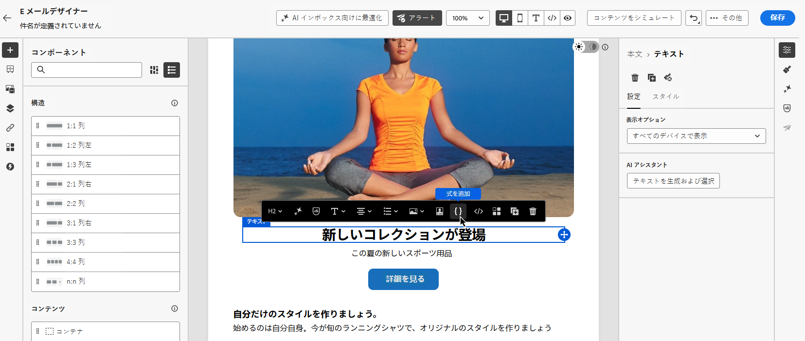

# パーソナライゼーション式用 AI アシスタント{#generative-personalization-expressions}

>[!BEGINSHADEBOX]

**このページでは、** Adobe Journey OptimizerのAI アシスタントを使用して、Personalization エディターと電子メール Designerで自然言語からパーソナライズされたエクスプレッションを生成、修正、説明する方法について説明します。

>[!ENDSHADEBOX]

>[!IMPORTANT]
>
>この機能の使用を開始する前に、関連する[ガードレールと制限](gs-generative.md#generative-guardrails)のトピックに目を通してください。
>
>Journey Optimizer で AI アシスタントを使用する前に、[ユーザー契約](https://www.adobe.com/jp/legal/licenses-terms/adobe-dx-gen-ai-user-guidelines.html)に同意する必要があります。 詳しくは、アドビ担当者にお問い合わせください。

## 概要 {#where-available}

[!UICONTROL AI アシスタント &#x200B;]は、平易な言語から新しいパーソナライゼーションを生成し、既存の式の機能を説明し、選択したコードの問題を修正するのに役立ちます。これにより、構文や手動でのフィールド検索に費やす時間を減らすことができます。 選択範囲を繰り返したり、会話の他の変更を求めたりすることもできます。 次の2つの方法で使用できます。

* **[!UICONTROL Personalization Editor]** — チャネル（件名、本文、その他のフィールドが開いている場合）でエディターを使用できる場所。 これが、AIを活用したパーソナライゼーションの一般的な道筋です。 エディターを開く場所と方法については、[&#x200B; パーソナライゼーションを追加](../personalization/personalization-build-expressions.md#where)を参照してください。
* **電子メールDesignerツールバー** – 電子メールDesignerで電子メールを作成する場合、コンポーネントを選択し、コンテキストツールバーの&#x200B;**[!UICONTROL 式を追加]**&#x200B;を使用して、最初に完全なエディターを開かずにツールボックスでアシスタントを開きます。 このエントリポイントは、メール作成以外では利用できません。 「[&#x200B; メール Designerから生成](#generate-email-designer)」を参照してください。

より広範なAI アシスタントの設定と言語については、[AI アシスタントの基本を学ぶ](gs-generative.md)を参照してください。 パーソナライゼーションの概念については、[&#x200B; パーソナライゼーションの基本を学ぶ](../personalization/personalize.md)を参照してください。 使用可能な式を生成するプロンプトを作成するには、[&#x200B; パーソナライゼーション式の効果的なプロンプトの作成](#prompt-best-practices)を参照してください。 コンテンツ生成プロンプトのアイデア（トーン、スタイル、ブランド）については、[AI プロンプトのベストプラクティス &#x200B;](ai-assistant-prompting-guide.md)を参照してください。

キャンペーンまたはジャーニーのコンテキストに応じて、アシスタントはデータを操作し、既に公開されている[!UICONTROL Personalization Editor]を作成できます（プロファイル属性、セグメントメンバーシップ、ヘルパー関数、関連するパーソナライゼーションソースなど）。

>[!NOTE]
>
>アシスタントは、[!UICONTROL AI アシスタント &#x200B;]がそのセッションで開いている間のみ、プロンプトのコンテキストを保持します。 アシスタントまたはエディターを閉じると、会話は消去されます。次回アシスタントを開くときに、新しい会話を開始します。

## パーソナライゼーション式の生成 {#generate}

次の手順では、パーソナライゼーション式をゼロから作成する方法を説明します。 既にエディター内にあるコードを操作するには、[既存のコードの編集、修正、説明](#edit-existing)を参照してください。

1. メッセージまたはコンテンツで、**[!UICONTROL Personalization Editor]**&#x200B;を開きます。

1. 生成されたパーソナライゼーションコードを挿入するエディターにカーソルを置き、**[!UICONTROL AI アシスタント]** ボタンをクリックします。

   

1. テキストフィールドで、必要なパーソナライゼーション式（必要なプロファイル属性、セグメント、ロジックなど）を平易な言語で記述し、「**[!UICONTROL 生成]**」をクリックします。

   また、パーソナライズされた挨拶やプロモーションコードの生成など、**[!UICONTROL クイックプロンプト]** セクションからすぐに使用できるプロンプトを使用することもできます。

   

   >[!NOTE]
   >
   >関連のないプロンプトや質問では、範囲外のエラーが返されます。 プロンプトを調整し、必要なパーソナライゼーションについて適切な質問をしましょう。

1. 複数回のやり取りでアシスタントとやり取りを続けることができます。プロンプトのコンテキストを維持し、同じ式をステップバイステップで微調整できます。 最初からやり直すには、「**[!UICONTROL 新しいセッション]**」ボタンをクリックします。

   

1. 式を生成したら、**[!UICONTROL サンプルプロファイルのプレビューを表示]**&#x200B;をクリックして、式が&#x200B;**one**&#x200B;合成サンプルプロファイルに対してどのように評価されるかを確認し、関連するペイロードをJSONとして表示します。 プレビューは&#x200B;**単一**&#x200B;のスポット チェックです。これにより、コードが期待どおりに解決されるかどうかを確認できます。複数の受信者、多様なデータ、または完全なカバレッジを&#x200B;**not**&#x200B;でシミュレートできます。 サンプルデータは、組織に保存または保存されません。

   サンプルを調整する必要がある場合（例えば、異なる属性を強調するなど）、アシスタントとのディスカッションで必要なことを説明し、プロンプトにキーワード **preview**&#x200B;を含めます。

   

   +++プレビューの例

   

   >[!NOTE]
   >
   >複数のプレビュー行や包括的なシナリオは期待しないでください。 コントロールは、クイックコードチェック用のサンプル評価&#x200B;**one**&#x200B;に意図的に制限されており、多くのプロファイルで部分的にカバーされていません。 非現実的に大きなプレビューセットを要求すると、リクエストが失敗する可能性があります。

   +++

   >[!NOTE]
   >
   >このコントロールは、コンテンツの完全なメッセージプレビューではなく、エディターでパーソナライゼーションコードを簡単に確認するためのものです。 エクスペリエンスを完全に検証するには、通常のシミュレーションフローを使用します。 [詳しくは、コンテンツをプレビューおよびテストする方法を参照してください](../content-management/preview-test.md)

1. パーソナライゼーション式に出力を実装するには、**[!UICONTROL 適用]**&#x200B;をクリックします。 アシスタント出力は、パーソナライゼーションエディターのカーソル位置に挿入されます。 既にあるコードを置き換えるには、まずエディターでそのコードを選択し、次に&#x200B;**[!UICONTROL AI アシスタントを使用した編集]**&#x200B;を使用します（[既存のコードの編集、修正、説明](#edit-existing)を参照）。

    アイコンを使用して、出力をコピーし、必要な場所に貼り付けることもできます。

## 既存のコードの編集、修正、説明 {#edit-existing}

既存のパーソナライゼーション式を選択し、AI アシスタントを使用してパーソナライゼーションの問題を修正したり、コードの機能を説明したり、その他の変更を求めたりできます。

1. エディターで既存のパーソナライゼーションコードを選択します。

1. 選択範囲を右クリックし、**[!UICONTROL AI アシスタントを使用して編集]**&#x200B;を選択すると、アシスタントは選択範囲をコンテキストとして使用します。

   

1. **[!UICONTROL AI アシスタント]**&#x200B;が開きます。 **[!UICONTROL クイックコマンド]**&#x200B;で、**[!UICONTROL 説明]**&#x200B;または&#x200B;**[!UICONTROL 修正]**&#x200B;をクリックするか、テキストフィールドを使用して他の変更を依頼し、会話を開始します。

   

1. **[!UICONTROL 修正]**&#x200B;を使用する場合は、ディスカッションの「**[!UICONTROL 修正の詳細を表示]**」をクリックして、修正の説明と、プレビューの前後の行ごとの説明を表示します。

   

1. パーソナライゼーション式を生成する場合と同様に、**[!UICONTROL 適用]**&#x200B;をクリックしてアシスタント出力を実装します。 パーソナライゼーションエディターで選択したコードに置き換わります。 例えば、コードの説明を求めた場合、適用すると、式にコメントが追加され、コードの動作が説明されます。

## 電子メールDesigner ツールバーから生成 {#generate-email-designer}

>[!NOTE]
>
>このセクションは、電子メール Designerで&#x200B;**電子メール**&#x200B;の内容を編集した場合にのみ適用されます。 その他のチャネルについては、**[!UICONTROL Personalization Editor]**&#x200B;を使用してください。

電子メール Designerでは、最初に[!UICONTROL Personalization Editor]全体を開かずに、コンテキストツールバーから[!UICONTROL AI アシスタントをパーソナライゼーション式]に使用できます。

1. 電子メールDesignerで、パーソナライズするコンポーネントを選択し、式を挿入する場所をクリックします。

1. コンテキストツールバーで、**[!UICONTROL 式を追加]**&#x200B;をクリックします。

   

1. AI アシスタントにパーソナライゼーションの入力を求めるツールボックスが開きます。 必要な情報をわかりやすい言葉で入力すると、AI アシスタントがプロファイルフィールドやプロンプトに一致する他の属性を提案するため、エクスプレッションをより迅速に構築できます。

1. アシスタントは式を生成します。

   

   以下を行うことができます。

   * 1つのサンプル値で式の出力を検証します。「**[!UICONTROL プレビュー]**」タブを使用します。
   * 同じプロンプトから別の提案を生成する – **[!UICONTROL 再生成]**&#x200B;を使用します。
   * ディスカッションをクリアして最初からやり直す – **[!UICONTROL リセット]**&#x200B;を使用します。
   * フルエディターでエクスプレッションを調整します。 アイコンをクリックして、**[!UICONTROL Personalization エディター]**&#x200B;を開きます。

1. 結果に問題がなければ、**[!UICONTROL 挿入]**&#x200B;をクリックして式をコンテンツに追加します。

## パーソナライゼーション式の効果的なプロンプトの作成 {#prompt-best-practices}

パーソナライゼーション表現のプロンプトは、トーン、スタイル、ブランドを中心としたコンテンツ生成プロンプトとは異なります。 アシスタントは、プロファイルデータとコンテキストデータに対して解決するテンプレートロジックを作成するので、プロンプトはそのロジックを正確に記述する必要があります。 提供したい顧客体験から始め、アシスタントが表現に変換できる言葉で表現します。

効果的なプロンプトには、通常、次の4つの要素が定義されます。

* **データソース** — プロファイル属性、コンテキストデータ、セグメント、オファー、または評価するその他のリソース。 `profile.person.name.firstName`など、正確なフィールドパスを入力します。
* **条件** – 適用するロジック（値が存在するか、特定の条件に一致するかどうかなど）。
* **Output** – 条件が満たされた場合に表示される内容（必須の形式を含む）。
* **フォールバック** — データが見つからないか、条件が満たされていない場合に表示する項目。

例えば、*お客様の更新日を取得し、1年を追加し、MM/dd/yyとして書式設定し、更新日が見つからない場合は何も表示しない*&#x200B;に対するリクエストでは、データソース、変換、出力形式、フォールバックが提供されます。アシスタントが使用可能な式を生成するために必要なすべての情報が提供されます。

### レコメンデーション {#prompt-recommendations}

パーソナライズされたコンテンツを提供します。

* 1回のリクエストで複数の無関係なルールを組み合わせるのではなく、各プロンプトを単一のパーソナライゼーションルールに集中させることができます。
* 環境内に存在するフィールド、フラグメント、オファー、データセットのみを参照します。 アシスタントは、エディターが公開するもので動作し、データソースは作成されません。
* オプションのデータまたは欠落している可能性のあるデータのフォールバック動作を記述します。これにより、式はすべてのプロファイルに対して適切に解決されます。
* 想定される出力構造が重要な場合に、明示的に記述します。例えば、キーとオファーペイロードはJSONとして返す必要があります。
* 既存のコードを編集する場合は、メッセージ全体ではなく関連する式のみをコンテキストとして指定し、**[!UICONTROL 説明]**&#x200B;を使用して、**[!UICONTROL 修正]**&#x200B;またはその他の変更を適用する前にコードを理解します。

## データと設定の要件 {#requirements}

アシスタントは、[!UICONTROL Personalization Editor]が既に公開しているリソースからエクスプレッションを生成するので、基礎となるデータを設定して使用可能にする必要があります。 プロンプトが使用可能な式を返さない場合は、次のことを確認します。

* 参照したフィールドは、環境内でアクティブな，
* 再利用したいフラグメントはすべて公開され，
* ルックアップに使用されるデータセットはすべてルックアップに対して有効であり、かつ
* リクエストは、別のタスクではなくテンプレートのパーソナライゼーションに関連しています。

設定が正しい場合は、データソース、条件、出力、フォールバックを明確にしてプロンプトを調整し、再度生成します。
