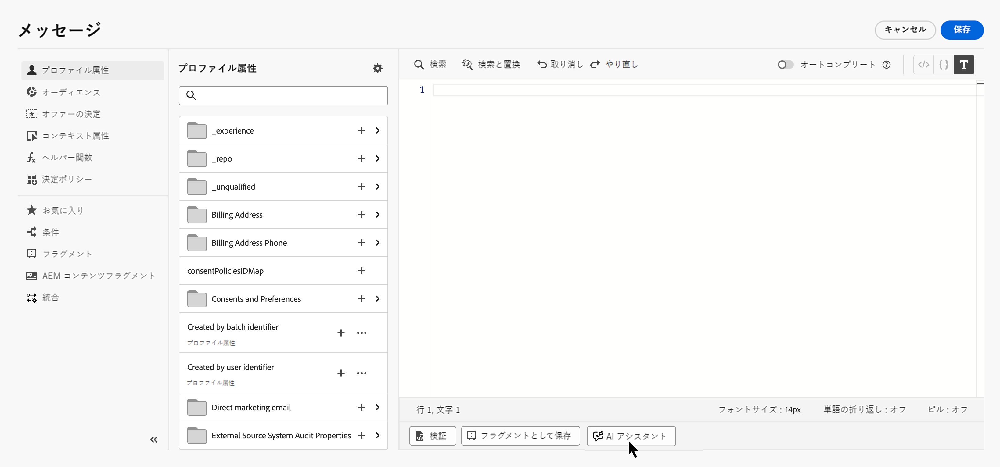
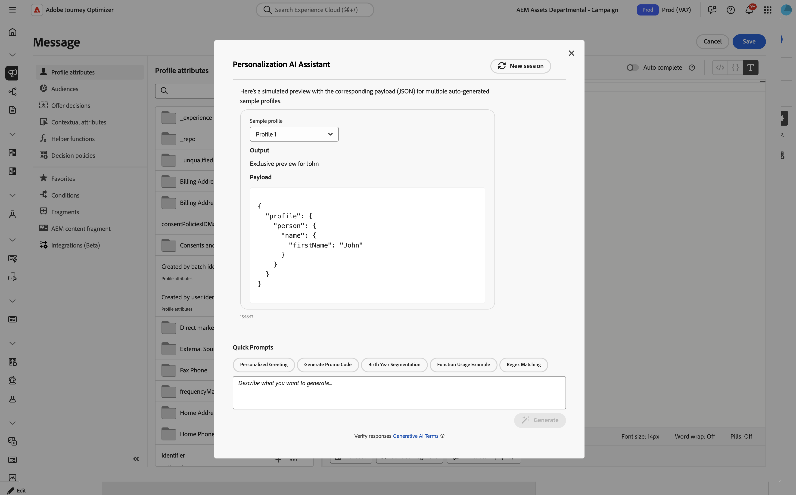
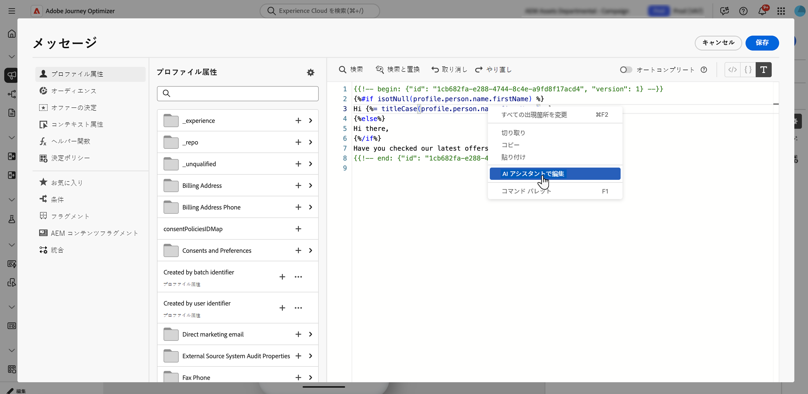
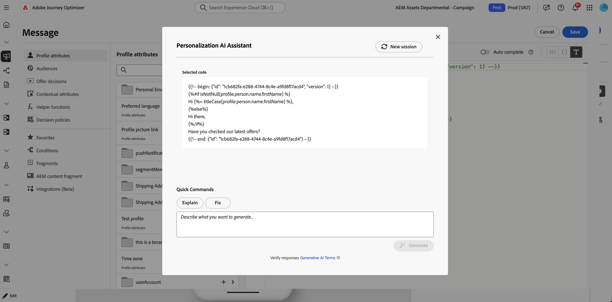

# PERSONALIZATION Expressions用AI アシスタント{#generative-personalization-expressions}

>[!IMPORTANT]
>
>この機能の使用を開始する前に、関連する[ガードレールと制限](gs-generative.md#generative-guardrails)のトピックに目を通してください。
> 
>
>Journey Optimizer で AI アシスタントを使用する前に、[ユーザー契約](https://www.adobe.com/jp/legal/licenses-terms/adobe-dx-gen-ai-user-guidelines.html)に同意する必要があります。詳しくは、アドビ担当者にお問い合わせください。

## 概要 {#where-available}

[!UICONTROL Personalization Editor]では、[!UICONTROL AI アシスタント &#x200B;]を使用して、平易な言葉から新しいパーソナライゼーションを生成し、既存の式の機能を説明し、選択したコードの問題を修正できます。これにより、構文や手動でのフィールド検索に費やす時間を減らすことができます。 選択範囲を繰り返したり、会話の他の変更を求めたりすることもできます。

* より広範なAI アシスタントの設定と言語については、[AI アシスタントの基本を学ぶ](gs-generative.md)を参照してください。
* [!DNL Journey Optimizer]でのパーソナライゼーションについて詳しくは、[&#x200B; パーソナライゼーションの基本を学ぶ](../personalization/personalize.md)を参照してください。
* プロンプトのアイデアについては、[AI プロンプトのベストプラクティス &#x200B;](ai-assistant-prompting-guide.md)を参照してください。

[!UICONTROL Personalization Editor]の任意の場所（件名、本文、その他のフィールドなど）で[!UICONTROL AI Assistant]を使用します。 エディターを開く場所と方法については、[&#x200B; パーソナライゼーションを追加](../personalization/personalization-build-expressions.md#where)を参照してください。

キャンペーンまたはジャーニーのコンテキストに応じて、アシスタントはデータを操作し、既に公開されている[!UICONTROL Personalization Editor]を作成できます（プロファイル属性、セグメントメンバーシップ、ヘルパー関数、関連するパーソナライゼーションソースなど）。

>[!NOTE]
>
>アシスタントは、[!UICONTROL AI アシスタント &#x200B;]がそのエディターセッションで開いている間のみ、プロンプトのコンテキストを保持します。 アシスタントまたは[!UICONTROL Personalization Editor]を閉じると、会話は保存されません。次回アシスタントを開くときに、新しい会話を開始します。

## パーソナライゼーション式の生成 {#generate}

次の手順では、パーソナライゼーション式をゼロから作成する方法を説明します。 既にエディター内にあるコードを操作するには、[既存のコードの編集、修正、説明](#edit-existing)を参照してください。

1. メッセージまたはコンテンツで、**[!UICONTROL Personalization Editor]**&#x200B;を開きます。

1. 生成されたパーソナライゼーションコードを挿入するエディターにカーソルを置き、**[!UICONTROL AI アシスタント]** ボタンをクリックします。

   

1. テキストフィールドで、必要なパーソナライゼーション式（必要なプロファイル属性、セグメント、ロジックなど）を平易な言語で記述し、「**[!UICONTROL 生成]**」をクリックします。

   また、パーソナライズされた挨拶やプロモーションコードの生成など、**[!UICONTROL クイックプロンプト]** セクションからすぐに使用できるプロンプトを使用することもできます。

   

   >[!NOTE]
   >
   >関連のないプロンプトや質問では、範囲外のエラーが返されます。 プロンプトを調整し、必要なパーソナライゼーションについて適切な質問をしましょう。

1. 複数回のやり取りでアシスタントとやり取りを続けることができます。プロンプトのコンテキストを維持し、同じ式をステップバイステップで微調整できます。 最初からやり直すには、「**[!UICONTROL 新しいセッション]**」ボタンをクリックします。

   

1. 式を生成したら、**[!UICONTROL サンプルプロファイルのプレビューを表示]**&#x200B;をクリックして、式がサンプルデータでどのように評価されるかを確認し、関連するペイロードをJSONとして表示します。 このチェックでは、アシスタントが生成する合成サンプルプロファイルのセットは限られており、組織には保存または保存されません。

   カスタムまたは追加のサンプルプロファイルが必要な場合は、アシスタントとのディスカッションで必要な内容を説明し、プロンプトに「**preview**」というキーワードを含めることで、チェックに適したプレビュープロファイルを生成できます。

   

   +++プレビューの例

   

   >[!NOTE]
   >
   >その他のプレビューは、抜き取り用です。 アシスタントは、約1から5つのプロファイルを生成するように調整されており、非常に多くの数を要求すると、リクエストが失敗する可能性があります。

   +++

   >[!NOTE]
   >
   >このコントロールは、コンテンツの完全なメッセージプレビューではなく、エディターでパーソナライゼーションコードを簡単に確認するためのものです。 エクスペリエンスを完全に検証するには、通常のシミュレーションフローを使用します。 [詳しくは、コンテンツをプレビューおよびテストする方法を参照してください](../content-management/preview-test.md)

1. パーソナライゼーション式に出力を実装するには、**[!UICONTROL 適用]**&#x200B;をクリックします。 アシスタント出力は、パーソナライゼーションエディターのカーソル位置に挿入されます。 既にあるコードを置き換えるには、まずエディターでそのコードを選択し、次に&#x200B;**[!UICONTROL AI アシスタントを使用した編集]**&#x200B;を使用します（[既存のコードの編集、修正、説明](#edit-existing)を参照）。

    アイコンを使用して、出力をコピーし、必要な場所に貼り付けることもできます。

## 既存のコードの編集、修正、説明 {#edit-existing}

既存のパーソナライゼーション式を選択し、AI アシスタントを使用してパーソナライゼーションの問題を修正したり、コードの機能を説明したり、その他の変更を求めたりできます。

1. エディターで既存のパーソナライゼーションコードを選択します。

1. 選択範囲を右クリックし、**[!UICONTROL AI アシスタントを使用して編集]**&#x200B;を選択すると、アシスタントは選択範囲をコンテキストとして使用します。

   

1. **[!UICONTROL AI アシスタント]**&#x200B;が開きます。 **[!UICONTROL クイックコマンド]**&#x200B;で、**[!UICONTROL 説明]**&#x200B;または&#x200B;**[!UICONTROL 修正]**&#x200B;をクリックするか、テキストフィールドを使用して他の変更を依頼し、会話を開始します。

   

1. **[!UICONTROL 修正]**&#x200B;を使用する場合は、ディスカッションの「**[!UICONTROL 修正の詳細を表示]**」をクリックして、修正の説明と、プレビューの前後の行ごとの説明を表示します。

   

1. パーソナライゼーション式を生成する場合と同様に、**[!UICONTROL 適用]**&#x200B;をクリックしてアシスタント出力を実装します。 パーソナライゼーションエディターで選択したコードに置き換わります。 例えば、コードの説明を求めた場合、適用すると、式にコメントが追加され、コードの動作が説明されます。
