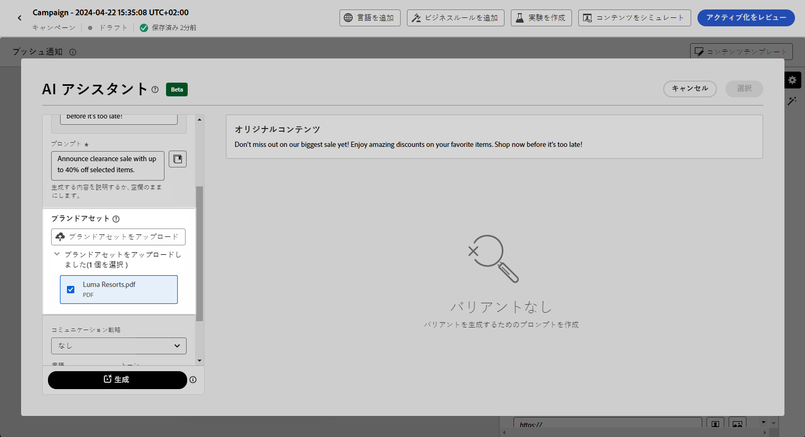

# AI アシスタントを使用したプッシュの生成 {#generative-push}

>[!BEGINSHADEBOX]

**目次**

* [AI アシスタントの基本を学ぶ](gs-generative.md)
* [AI アシスタントを使用したメールの生成](generative-email.md)
* [AI アシスタントを使用した SMS の生成](generative-sms.md)
* AI アシスタントを使用したプッシュの生成
* [AI アシスタントを使用したコンテンツ実験](generative-experimentation.md)

>[!ENDSHADEBOX]

>[!NOTE]
>
>この機能の使用を開始する前に、関連する[ガードレールと制限](gs-generative.md#generative-guardrails)のトピックに目を通してください。

メッセージを作成しパーソナライズしたら、Adobe Journey Optimizer の AI アシスタントを使用してプッシュ通知コンテンツを次のレベルに引き上げます。

Journey Optimizer で AI アシスタントを使用する方法については、以下のタブを参照してください。

>[!BEGINTABS]

>[!TAB 完全なプッシュの生成]

この例では、AI アシスタントを使用して魅力的なプッシュ通知を送信する方法を説明します。

次の手順に従います。

1. プッシュ通知キャンペーンを作成し設定したら、「**[!UICONTROL コンテンツを編集]**」をクリックします。

   プッシュ通知キャンペーンの設定方法について詳しくは、[こちら](../push/create-push.md)を参照してください。

1. キャンペーンの&#x200B;**[!UICONTROL 基本的な詳細]**&#x200B;を入力します。完了したら、 **[!UICONTROL コンテンツを編集]**.

1. 必要に応じてプッシュ通知をパーソナライズします。 [詳細情報](../push/design-push.md)

1. へのアクセス **[!UICONTROL AI アシスタントを表示]** メニュー。

   {zoomable="yes"}

1. AI アシスタントの「**[!UICONTROL 元のコンテンツを使用]**」オプションを有効にして、キャンペーンのコンテンツ、名前、選択したオーディエンスに基づいて、新しいコンテンツをパーソナライズします。

   プロンプトは、常に特定のコンテキストに関連付けられている必要があります。

1. 生成する内容を「**[!UICONTROL プロンプト]**」フィールドに記述して、コンテンツを微調整します。

   プロンプトの作成に関するサポートが必要な場合は、キャンペーンを改善するための様々なプロンプトのアイデアを提供する&#x200B;**[!UICONTROL プロンプトライブラリ]**&#x200B;にアクセスしてください。

   {zoomable="yes"}

1. を選択 **[!UICONTROL ブランドアセットのアップロード]** AI アシスタントに追加のコンテキストを提供できるコンテンツを含むブランドアセットを追加します。

1. 生成するフィールド（「**[!UICONTROL タイトル]**」や「**[!UICONTROL メッセージ]**」）を選択します。

1. 様々なオプションを使用してプロンプトを調整します。

   * **[!UICONTROL コミュニケーション戦略]**：生成テキストに最適なコミュニケーションスタイルを選択します。
   * **[!UICONTROL 言語]**：コンテンツを生成する言語を選択します。
   * **[!UICONTROL トーン]**：メールのトーンは、オーディエンスの共感を呼ぶはずです。 情報を提供する、遊び心がある、説得力がある、のいずれを求めているかに関わらず、AI アシスタントはメッセージを適切に適応させることができます。

   {zoomable="yes"}

1. プロンプトの準備ができたら、 **[!UICONTROL Generate]**.

1. 生成された&#x200B;**[!UICONTROL バリエーション]**&#x200B;を参照し、「**[!UICONTROL プレビュー]**」をクリックして、選択したバリエーションのフルスクリーンバージョンを表示します。

1. に移動します。 **[!UICONTROL 調整]** 内のオプション **[!UICONTROL プレビュー]** 追加のカスタマイズ機能にアクセスするためのウィンドウ：

   * **[!UICONTROL を参照コンテンツとして使用]**：選択したバリアントは、他の結果を生成するための参照コンテンツとして機能します。

   * **[!UICONTROL Rephrase]**:AI アシスタントは、様々な方法でメッセージのフレーズを変更できるので、書き物を新鮮に保ち、様々なオーディエンスを魅了します。

   * **[!UICONTROL シンプルな言語を使用]**:AI アシスタントを活用して言語を簡素化し、より広いオーディエンスに対して明確なアクセシビリティを確保します。

   {zoomable="yes"}

1. クリック **[!UICONTROL を選択]** 適切なコンテンツが見つかったら、

   また、コンテンツの実験を有効にすることもできます。[詳細情報](generative-experimentation.md)

1. パーソナライゼーションフィールドを挿入して、プロファイルデータに基づいてメールコンテンツをカスタマイズします。 次に、 **[!UICONTROL コンテンツをシミュレート]** ボタンをクリックしてレンダリングを制御し、テストプロファイルでパーソナライゼーション設定を確認します。 [詳細情報](../personalization/personalize.md)

コンテンツ、オーディエンスおよびスケジュールを定義したら、プッシュキャンペーンの準備が整います。[詳細情報](../campaigns/review-activate-campaign.md)

>[!TAB テキストの生成]

この例では、特定のコンテンツに対して AI アシスタントを使用する方法について説明します。次の手順に従います。

1. プッシュ通知キャンペーンを作成し設定したら、「**[!UICONTROL コンテンツを編集]**」をクリックします。

   プッシュキャンペーンの設定方法について詳しくは、[こちら](../push/create-push.md)を参照してください。

1. キャンペーンの&#x200B;**[!UICONTROL 基本的な詳細]**&#x200B;を入力します。完了したら、 **[!UICONTROL コンテンツを編集]**.

1. 必要に応じてプッシュ通知をパーソナライズします。 [詳細情報](../push/design-push.md)

1. 「**[!UICONTROL タイトル]**」フィールドまたは「**[!UICONTROL メッセージ]**」フィールドの横にある **[!UICONTROL AI アシスタントを表示]**&#x200B;メニューにアクセスします。

   {zoomable="yes"}

1. AI アシスタントの「**[!UICONTROL 参照コンテンツを使用]**」オプションを有効にして、キャンペーンコンテンツ、名前および選択したオーディエンスに基づいて新しいコンテンツをパーソナライズします。

   プロンプトは、常に特定のコンテキストに関連付けられている必要があります。

1. 生成する内容を「**[!UICONTROL プロンプト]**」フィールドに記述して、コンテンツを微調整します。

   プロンプトの作成に関するサポートが必要な場合は、キャンペーンを改善するための様々なプロンプトのアイデアを提供する&#x200B;**[!UICONTROL プロンプトライブラリ]**&#x200B;にアクセスしてください。

   {zoomable="yes"}

1. を選択 **[!UICONTROL ブランドアセットのアップロード]** AI アシスタントに追加のコンテキストを提供できるコンテンツを含むブランドアセットを追加します。

   {zoomable="yes"}

1. 様々なオプションを使用してプロンプトを調整します。

   * **[!UICONTROL コミュニケーション戦略]**：生成テキストに最適なコミュニケーションスタイルを選択します。
   * **[!UICONTROL 言語]**：コンテンツを生成する言語を選択します。
   * **[!UICONTROL トーン]**：メールのトーンは、オーディエンスの共感を呼ぶはずです。 情報を提供する、遊び心がある、説得力がある、のいずれを求めているかに関わらず、AI アシスタントはメッセージを適切に適応させることができます。
   * **[!UICONTROL 長さ]**：範囲スライダーを使用して、コンテンツの長さを選択します。

   {zoomable="yes"}

1. プロンプトの準備ができたら、 **[!UICONTROL Generate]**.

1. 生成された&#x200B;**[!UICONTROL バリエーション]**&#x200B;を参照し、「**[!UICONTROL プレビュー]**」をクリックして、選択したバリエーションのフルスクリーンバージョンを表示します。

1. に移動します。 **[!UICONTROL 調整]** 内のオプション **[!UICONTROL プレビュー]** 追加のカスタマイズ機能にアクセスするためのウィンドウ：

   * **[!UICONTROL を参照コンテンツとして使用]**：選択したバリアントは、他の結果を生成するための参照コンテンツとして機能します。

   * **[!UICONTROL 精巧]**:AI アシスタントは、特定のトピックを展開するのに役立ち、理解とエンゲージメントを深めるために追加の詳細を提供します。

   * **[!UICONTROL 要約]**：情報が長すぎると、メール受信者が過負荷になる可能性があります。 AI アシスタントを使用して、重要なポイントを明確かつ簡潔な要約に要約し、注意を引いてさらに読むよう促します。

   * **[!UICONTROL 言い換え]**：AI アシスタントは、メッセージを様々な方法で言い換えることができ、ユーザーが作成した文章を多様なオーディエンスにとって新鮮で魅力的なメッセージにします。

   * **[!UICONTROL よりシンプルな言語の使用]**:AI アシスタントを活用して言語を簡素化し、より広いオーディエンスに対して明確なアクセシビリティを確保します。

   {zoomable="yes"}

1. クリック **[!UICONTROL を選択]** 適切なコンテンツが見つかったら、

   また、コンテンツの実験を有効にすることもできます。[詳細情報](generative-experimentation.md)

1. パーソナライゼーションフィールドを挿入して、プロファイルデータに基づいてメールコンテンツをカスタマイズします。 次に、 **[!UICONTROL コンテンツをシミュレート]** ボタンをクリックしてレンダリングを制御し、テストプロファイルでパーソナライゼーション設定を確認します。 [詳細情報](../personalization/personalize.md)

コンテンツ、オーディエンスおよびスケジュールを定義したら、プッシュキャンペーンの準備が整います。[詳細情報](../campaigns/review-activate-campaign.md)

>[!ENDTABS]
