# AI Assistant コンテンツアクセラレーターによるプッシュ生成  {#generative-push}

>[!IMPORTANT]
>
>この機能の使用を開始する前に、関連する[ガードレールと制限](gs-generative.md#generative-guardrails)のトピックに目を通してください。
> 
>
>コンテンツアクセラレーションのためにJourney Optimizerで AI アシスタントを使用するには、[ ユーザー使用許諾契約 ](https://www.adobe.com/legal/licenses-terms/adobe-dx-gen-ai-user-guidelines.html) に同意する必要があります。 詳しくは、アドビ担当者にお問い合わせください。

メッセージを作成してパーソナライズしたら、Journey Optimizerのコンテンツアクセラレーション用 AI アシスタントを使用して、プッシュ通知コンテンツを次のレベルに引き上げます。

以下のタブを参照して、Journey Optimizerの AI アシスタントをコンテンツの高速化に使用する方法を確認してください。

>[!BEGINTABS]

>[!TAB 完全なプッシュの生成]

この特定の例では、コンテンツアクセラレーションのためにJourney Optimizerで AI アシスタントを使用して魅力的なプッシュ通知を送信する方法を説明します。

次の手順に従います。

1. プッシュ通知キャンペーンを作成し設定したら、「**[!UICONTROL コンテンツを編集]**」をクリックします。

   プッシュ通知キャンペーンの設定方法について詳しくは、[こちら](../push/create-push.md)を参照してください。

1. キャンペーンの&#x200B;**[!UICONTROL 基本的な詳細]**&#x200B;を入力します。完了したら、「**[!UICONTROL コンテンツを編集]**」をクリックします。

1. 必要に応じて、プッシュ通知をパーソナライズします。[詳細情報](../push/design-push.md)

1. **[!UICONTROL AI アシスタントを表示]**&#x200B;メニューにアクセスします。

   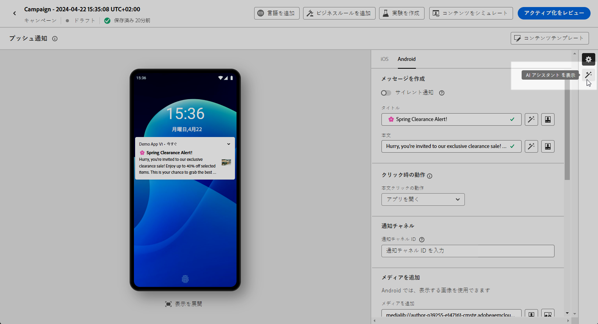{zoomable="yes"}

1. AI Assistant for Content Acceleration で「**[!UICONTROL 元のコンテンツを使用]**」オプションを有効にして、選択したコンテンツに基づいて新しいコンテンツをパーソナライズします。

1. 生成する内容を「**[!UICONTROL プロンプト]**」フィールドに記述して、コンテンツを微調整します。

   プロンプトの作成に関するサポートが必要な場合は、キャンペーンを改善するための様々なプロンプトのアイデアを提供する&#x200B;**[!UICONTROL プロンプトライブラリ]**&#x200B;にアクセスしてください。

   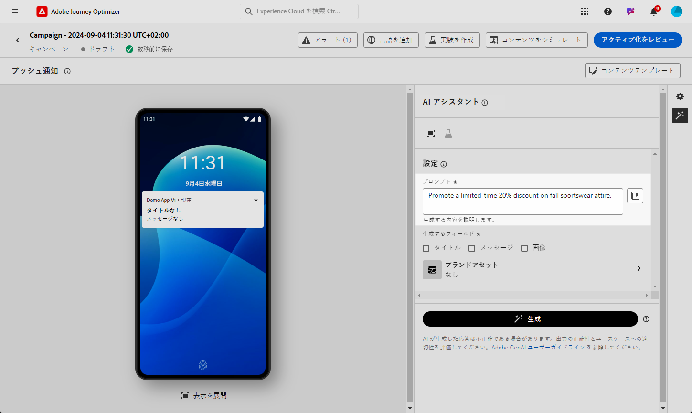{zoomable="yes"}

1. 生成するフィールド（**[!UICONTROL タイトル]**、**[!UICONTROL メッセージ]**、**[!UICONTROL 画像]** を選択します。

1. 「**[!UICONTROL テキスト設定]**」オプションを使用してプロンプトをカスタマイズします。

   * **[!UICONTROL コミュニケーション戦略]**：生成テキストに最適なコミュニケーションスタイルを選択します。
   * **[!UICONTROL トーン]**：プッシュ通知のトーンは、オーディエンスの共感を呼ぶ必要があります。 情報を提供する、遊び心がある、説得力がある、のいずれを求めているかに関わらず、AI アシスタントはメッセージを適切に適応させることができます。

   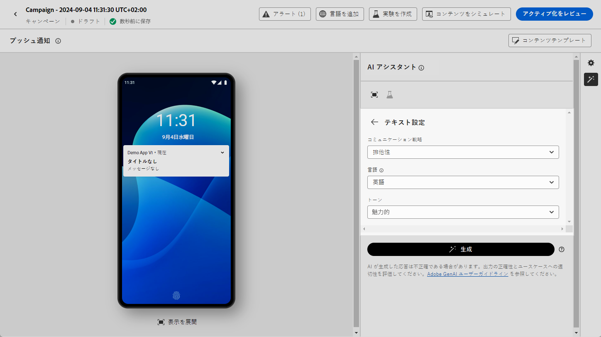{zoomable="yes"}

1. **[!UICONTROL 画像設定]** を選択します。

   * **[!UICONTROL コンテンツタイプ]**：これにより、視覚要素の性質が分類され、写真、グラフィック、アートなど、様々な視覚的表現が区別されます。
   * **[!UICONTROL 視覚的な強さ]**：画像の強さを調整することで、画像の影響を制御できます。 低い値（2）を設定すると、より柔らかく抑制された外観が作成され、高い値（10）を設定すると、画像がより鮮やかで視覚的に強力になります。
   * **[!UICONTROL カラーとトーン]**：画像内のカラーの全体的な外観と、画像が伝えるムードまたは雰囲気。
   * **[!UICONTROL 照明]**：画像内の稲妻を指し、画像の雰囲気を形成し、特定の要素をハイライト表示します。
   * **[!UICONTROL 構成]**：画像のフレーム内の要素の配置を指します

   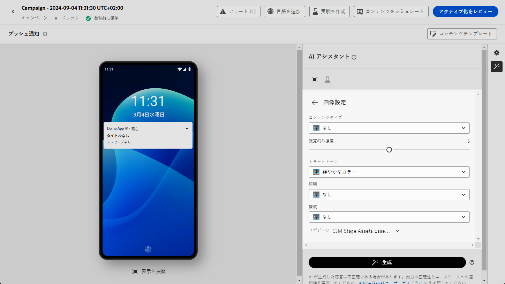{zoomable="yes"}

1. **[!UICONTROL ブランドアセット]** メニューで「**[!UICONTROL ブランドアセットをアップロード]**」をクリックし、AI アシスタントに追加のコンテキストを提供できるコンテンツを含むブランドアセットを追加するか、以前にアップロードしたものを選択します。

   以前にアップロードしたファイルは、**[!UICONTROL アップロードされたブランドアセット]** ドロップダウンで使用できます。 世代に含めるアセットを切り替えるだけです。

1. プロンプトの準備が整ったら、「**[!UICONTROL 生成]**」をクリックします。

1. 生成された&#x200B;**[!UICONTROL バリエーション]**&#x200B;を参照し、「**[!UICONTROL プレビュー]**」をクリックして、選択したバリエーションのフルスクリーンバージョンを表示します。

1. **[!UICONTROL プレビュー]**&#x200B;ウィンドウ内の「**[!UICONTROL 絞り込み]**」オプションに移動して、追加のカスタマイズ機能にアクセスします。

   * **[!UICONTROL 参照コンテンツとして使用]**：選択したバリアントは、他の結果を生成するための参照コンテンツとして機能します。

   * **[!UICONTROL 言い換え]**：AI アシスタントは、メッセージを様々な方法で言い換えることができ、ユーザーが作成した文章を新鮮で、多様なオーディエンスを惹きつけるメッセージにします。

   * **[!UICONTROL よりシンプルな言葉を使用]**：AI アシスタントを活用して言語をわかりやすく簡素化し、幅広いオーディエンスがアクセスできるようにします。

   また、テキストの **[!UICONTROL トーン]** と **[!UICONTROL コミュニケーション戦略]** を変更することもできます。

   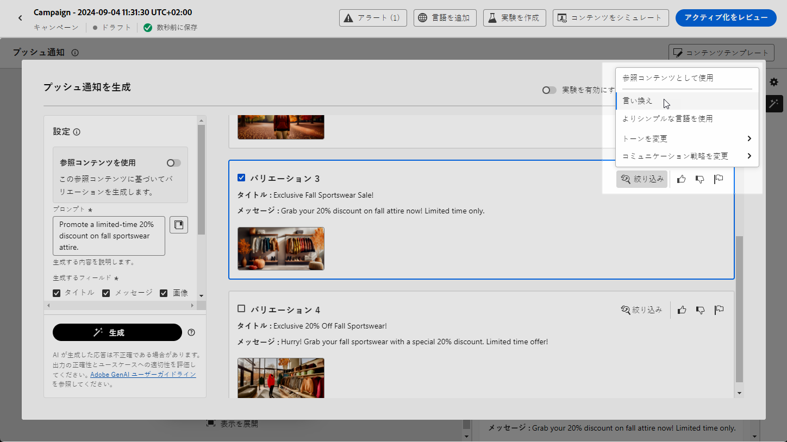{zoomable="yes"}

1. 適切なコンテンツが見つかったら、「**[!UICONTROL 選択]**」をクリックします。

   また、コンテンツの実験を有効にすることもできます。[詳細情報](generative-experimentation.md)

1. パーソナライゼーションフィールドを挿入して、プロファイルデータに基づいてプッシュ通知の内容をカスタマイズします。 次に「**[!UICONTROL コンテンツをシミュレート]**」ボタンをクリックしてレンダリングを制御し、テストプロファイルでパーソナライゼーション設定を確認します。[詳細情報](../personalization/personalize.md)

コンテンツ、オーディエンスおよびスケジュールを定義したら、プッシュキャンペーンの準備が整います。[詳細情報](../campaigns/review-activate-campaign.md)

>[!TAB  テキストのみの生成 ]

この特定の例では、Journey Optimizerの AI アシスタントを使用して、特定のコンテンツのコンテンツアクセラレーションを行う方法を説明します。 次の手順に従います。

1. プッシュ通知キャンペーンを作成し設定したら、「**[!UICONTROL コンテンツを編集]**」をクリックします。

   プッシュキャンペーンの設定方法について詳しくは、[こちら](../push/create-push.md)を参照してください。

1. キャンペーンの&#x200B;**[!UICONTROL 基本的な詳細]**&#x200B;を入力します。完了したら、「**[!UICONTROL コンテンツを編集]**」をクリックします。

1. 必要に応じて、プッシュ通知をパーソナライズします。[詳細情報](../push/design-push.md)

1. **[!UICONTROL タイトル**[!UICONTROL  または **** メッセージ ]**フィールドの横にある「AI アシスタントでテキストを編集]** メニューにアクセスします。

   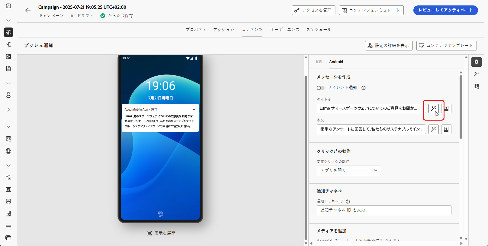{zoomable="yes"}

1. AI Assistant for Content Acceleration で「**[!UICONTROL 参照コンテンツを使用]**」オプションを有効にして、選択したコンテンツに基づいて新しいコンテンツをパーソナライズします。

1. 生成する内容を「**[!UICONTROL プロンプト]**」フィールドに記述して、コンテンツを微調整します。

   プロンプトの作成に関するサポートが必要な場合は、キャンペーンを改善するための様々なプロンプトのアイデアを提供する&#x200B;**[!UICONTROL プロンプトライブラリ]**&#x200B;にアクセスしてください。

   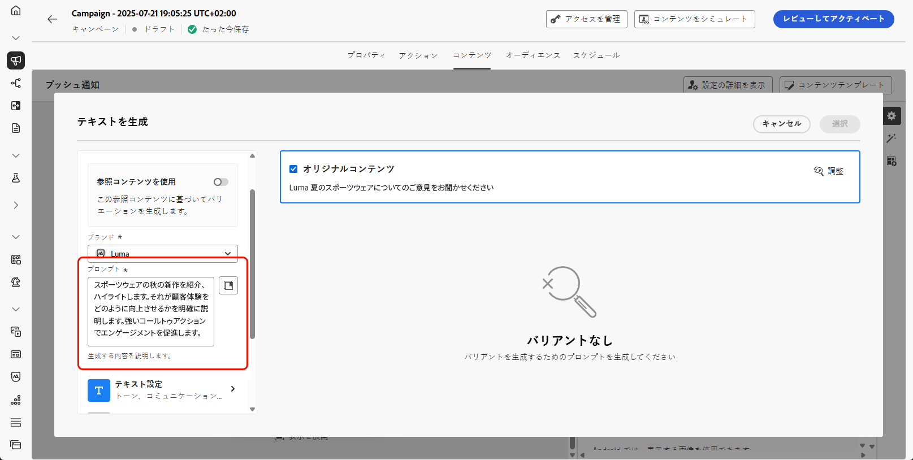{zoomable="yes"}

1. 「**[!UICONTROL テキスト設定]**」オプションを使用してプロンプトをカスタマイズします。

   * **[!UICONTROL コミュニケーション戦略]**：生成テキストに最適なコミュニケーションスタイルを選択します。
   * **[!UICONTROL トーン]**：プッシュ通知のトーンは、オーディエンスの共感を呼ぶ必要があります。 情報を提供する、遊び心がある、説得力がある、のいずれを求めているかに関わらず、AI アシスタントはメッセージを適切に適応させることができます。
   * **[!UICONTROL 長さ]**：範囲スライダーを使用して、コンテンツの長さを選択します。

   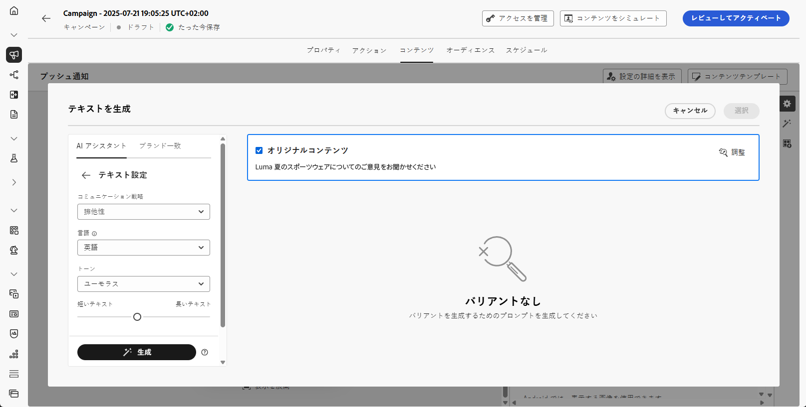{zoomable="yes"}

1. **[!UICONTROL ブランドアセット]** メニューで「**[!UICONTROL ブランドアセットをアップロード]**」をクリックし、AI アシスタントに追加のコンテキストを提供できるコンテンツを含むブランドアセットを追加するか、以前にアップロードしたものを選択します。

   以前にアップロードしたファイルは、**[!UICONTROL アップロードされたブランドアセット]** ドロップダウンで使用できます。 世代に含めるアセットを切り替えるだけです。

1. プロンプトの準備が整ったら、「**[!UICONTROL 生成]**」をクリックします。

1. **[!UICONTROL プレビュー]**&#x200B;ウィンドウ内の「**[!UICONTROL 絞り込み]**」オプションに移動して、追加のカスタマイズ機能にアクセスします。

   * **[!UICONTROL 参照コンテンツとして使用]**：選択したバリアントは、他の結果を生成するための参照コンテンツとして機能します。

   * **[!UICONTROL 詳しく述べる]**：AI アシスタントは、特定のトピックを拡大できるようユーザーをサポートし、理解とエンゲージメントを深められるよう、追加の詳細を提供します。

   * **[!UICONTROL 要約]**：情報が長いと、受信者が過負荷になる可能性があります。 AI アシスタントを使用して、重要なポイントを明確かつ簡潔な概要に要約し、注意を引いてさらに読むよう促します。

   * **[!UICONTROL 言い換え]**：AI アシスタントは、メッセージを様々な方法で言い換えることができ、ユーザーが作成した文章を多様なオーディエンスにとって新鮮で魅力的なメッセージにします。

   * **[!UICONTROL よりシンプルな言葉を使用]**：AI アシスタントを活用して言語をわかりやすく簡素化し、幅広いオーディエンスがアクセスできるようにします。

   また、テキストの **[!UICONTROL トーン]** と **[!UICONTROL コミュニケーション戦略]** を変更することもできます。

   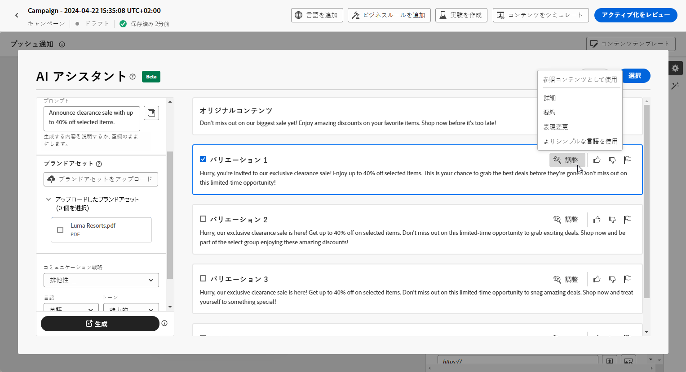{zoomable="yes"}

1. 適切なコンテンツが見つかったら、「**[!UICONTROL 選択]**」をクリックします。

   また、コンテンツの実験を有効にすることもできます。[詳細情報](generative-experimentation.md)

1. パーソナライゼーションフィールドを挿入して、プロファイルデータに基づいてプッシュ通知の内容をカスタマイズします。 次に「**[!UICONTROL コンテンツをシミュレート]**」ボタンをクリックしてレンダリングを制御し、テストプロファイルでパーソナライゼーション設定を確認します。[詳細情報](../personalization/personalize.md)

コンテンツ、オーディエンスおよびスケジュールを定義したら、プッシュキャンペーンの準備が整います。[詳細情報](../campaigns/review-activate-campaign.md)

>[!TAB  画像のみの生成 ]

1. プッシュ通知キャンペーンを作成し設定したら、「**[!UICONTROL コンテンツを編集]**」をクリックします。

   プッシュ通知キャンペーンの設定方法について詳しくは、[こちら](../push/create-push.md)を参照してください。

1. キャンペーンの&#x200B;**[!UICONTROL 基本的な詳細]**&#x200B;を入力します。完了したら、「**[!UICONTROL コンテンツを編集]**」をクリックします。

1. 必要に応じて、プッシュ通知をパーソナライズします。[詳細情報](../push/design-push.md)

1. **[!UICONTROL メディアを追加]** メニューにアクセスします。

   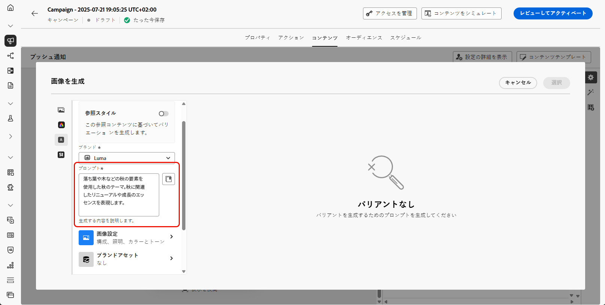{zoomable="yes"}

1. コンテンツ加速用 AI アシスタントの **[!UICONTROL 参照スタイル]** オプションを有効にして、参照コンテンツに基づいて新しいコンテンツをパーソナライズします。 また、画像をアップロードして、バリエーションにコンテキストを追加することもできます。

1. 生成する内容を「**[!UICONTROL プロンプト]**」フィールドに記述して、コンテンツを微調整します。

   プロンプトの作成に関するサポートが必要な場合は、キャンペーンを改善するための様々なプロンプトのアイデアを提供する&#x200B;**[!UICONTROL プロンプトライブラリ]**&#x200B;にアクセスしてください。

   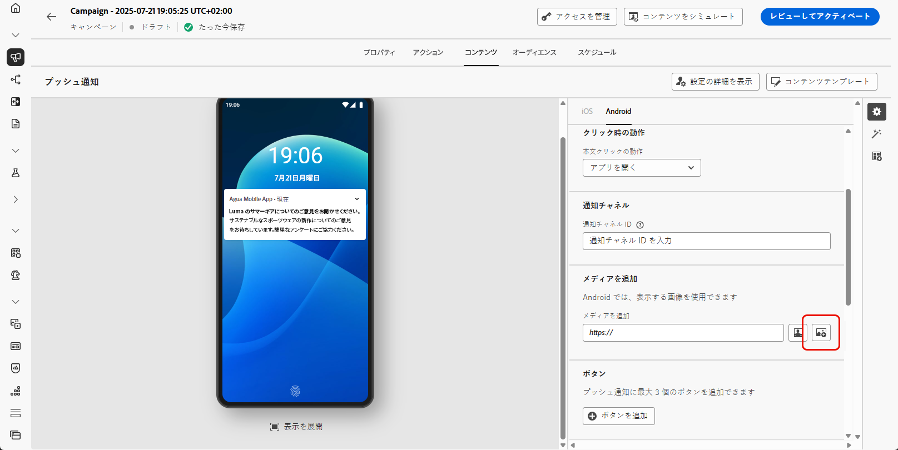{zoomable="yes"}

1. **[!UICONTROL 画像設定]** を選択します。

   * **[!UICONTROL コンテンツタイプ]**：これにより、視覚要素の性質が分類され、写真、グラフィック、アートなど、様々な視覚的表現が区別されます。
   * **[!UICONTROL 視覚的な強さ]**：画像の強さを調整することで、画像の影響を制御できます。 低い値（2）を設定すると、より柔らかく抑制された外観が作成され、高い値（10）を設定すると、画像がより鮮やかで視覚的に強力になります。
   * **[!UICONTROL カラーとトーン]**：画像内のカラーの全体的な外観と、画像が伝えるムードまたは雰囲気。
   * **[!UICONTROL 照明]**：画像内の稲妻を指し、画像の雰囲気を形成し、特定の要素をハイライト表示します。
   * **[!UICONTROL 構成]**：画像のフレーム内の要素の配置を指します

1. **[!UICONTROL ブランドアセット]** メニューで「**[!UICONTROL ブランドアセットをアップロード]**」をクリックし、AI アシスタントに追加のコンテキストを提供できるコンテンツを含むブランドアセットを追加するか、以前にアップロードしたものを選択します。

   以前にアップロードしたファイルは、**[!UICONTROL アップロードされたブランドアセット]** ドロップダウンで使用できます。 世代に含めるアセットを切り替えるだけです。

1. プロンプトの準備が整ったら、「**[!UICONTROL 生成]**」をクリックします。

1. 生成された **[!UICONTROL バリエーション]** を参照します。

   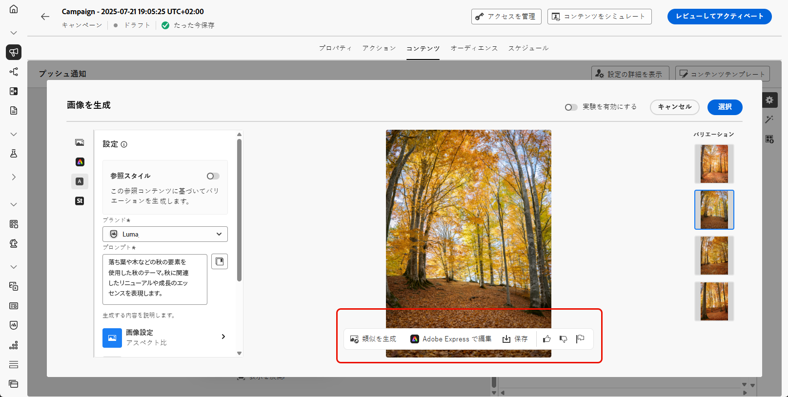{zoomable="yes"}

1. 「**[!UICONTROL 類似を生成]**」を選択して、現在のオプションに近い画像のバリエーションを表示し、一貫したテーマを持つ代替デザインを提供します。

1. 適切なコンテンツが見つかったら、「**[!UICONTROL 選択]**」をクリックします。

   また、コンテンツの実験を有効にすることもできます。[詳細情報](generative-experimentation.md)

コンテンツ、オーディエンスおよびスケジュールを定義したら、プッシュキャンペーンの準備が整います。[詳細情報](../campaigns/review-activate-campaign.md)

>[!ENDTABS]
