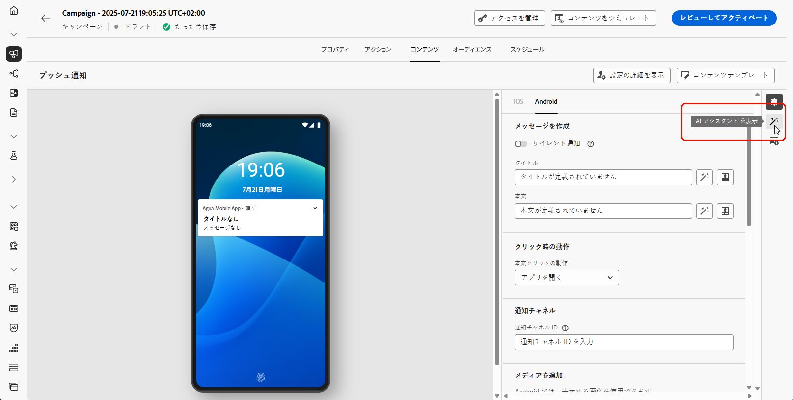

# AI アシスタントによるプッシュ生成 {#generative-push}

>[!BEGINSHADEBOX]

**目次**

* [AI アシスタントの基本を学ぶ](gs-generative.md)
* [AI アシスタントを使用したメールの生成](generative-email.md)
* [AI アシスタントを使用した SMS の生成](generative-sms.md)
* **[AI アシスタントによるプッシュ生成](generative-push.md)**
* [AI アシスタントを使用したコンテンツ実験](generative-experimentation.md)

>[!ENDSHADEBOX]

>[!NOTE]
>
>この機能の使用を開始する前に、関連する[ガードレールと制限](gs-generative.md#generative-guardrails)のトピックに目を通してください。

メッセージを作成してパーソナライズしたら、Adobe Journey Optimizerの AI アシスタントでプッシュ通知コンテンツを次のレベルに進めます。

Journey Optimizerで AI アシスタントを使用する方法については、以下のタブを参照してください。

>[!BEGINTABS]

>[!TAB フルプッシュ生成]

この特定の例では、AI アシスタントを使用して魅力的なプッシュ通知を送信する方法を説明します。

次の手順に従います。

1. プッシュ通知キャンペーンを作成して設定したら、 **[!UICONTROL コンテンツを編集]**.

   プッシュ通知キャンペーンの設定方法について詳しくは、以下を参照してください。 [このページ](../push/create-push.md).

1. を入力します **[!UICONTROL 基本の詳細]** キャンペーン用。 完了したら、「**[!UICONTROL コンテンツを編集]**」をクリックします。

1. 必要に応じて、プッシュ通知をパーソナライズします。[詳細情報](../push/design-push.md)

1. **[!UICONTROL AI アシスタントを表示]**&#x200B;メニューにアクセスします。

   {zoomable=&quot;yes&quot;}

1. を有効にする **[!UICONTROL 元のコンテンツを使用]** キャンペーンのコンテンツ、名前、選択したオーディエンスに基づいて新しいコンテンツをパーソナライズするための AI アシスタントのオプション。

   プロンプトは、常に特定のコンテキストに関連付けられている必要があります。

1. 「**[!UICONTROL プロンプト]**」フィールドに生成する内容を記述して、コンテンツを微調整します。

   プロンプトの作成に関する支援を探している場合は、 **[!UICONTROL プロンプトライブラリ]** キャンペーンを改善するための様々な迅速なアイデアを提供します。

   {zoomable=&quot;yes&quot;}

1. 「**[!UICONTROL ブランドアセットをアップロード]**」を選択し、AI アシスタントに追加のコンテキストを提供できるコンテンツを含むブランドアセットを追加します。

1. 生成するフィールドを選択： **[!UICONTROL タイトル]** および/または **[!UICONTROL メッセージ]**.

1. 様々なオプションを使用してプロンプトを調整します。

   * **[!UICONTROL コミュニケーション戦略]**：生成テキストに最適なコミュニケーションスタイルを選択します。
   * **[!UICONTROL 言語]**：コンテンツを生成する言語を選択します。
   * **[!UICONTROL トーン]**：メールのトーンは、オーディエンスの共感を呼びます。情報を提供する、遊び心がある、説得力がある、のいずれを求めているかに関わらず、AI アシスタントはメッセージを適切に適応させることができます。

   {zoomable=&quot;yes&quot;}

1. プロンプトの準備が整ったら、「**[!UICONTROL 生成]**」をクリックします。

1. 生成された&#x200B;**[!UICONTROL バリエーション]**&#x200B;を参照して、「**[!UICONTROL プレビュー]**」をクリックし、選択したバリエーションのフルスクリーンバージョンを表示します。

1. **[!UICONTROL プレビュー]**&#x200B;ウィンドウ内の「**[!UICONTROL 絞り込み]**」オプションに移動して、追加のカスタマイズ機能にアクセスします。

   * **[!UICONTROL 参照コンテンツとして使用]**：選択したバリアントは、他の結果を生成するための参照コンテンツとして機能します。

   * **[!UICONTROL 言い換え]**：AI アシスタントは、メッセージを様々な方法で言い換えることができ、ユーザーが作成した文章を新鮮で、多様なオーディエンスを惹きつけるメッセージにします。

   * **[!UICONTROL シンプルな言葉を使用]**：AI アシスタントを活用して言語を簡素化して、わかりやすく、幅広いオーディエンスがアクセスできるようにします。

   {zoomable=&quot;yes&quot;}

1. 適切なコンテンツが見つかったら、「**[!UICONTROL 選択]**」をクリックします。

   コンテンツの実験を有効にすることもできます。 [詳細情報](generative-experimentation.md)

1. パーソナライゼーションフィールドを挿入し、プロファイルデータに基づいてメールコンテンツをカスタマイズします。次に「**[!UICONTROL コンテンツをシミュレート]**」ボタンをクリックしてレンダリングを制御し、テストプロファイルでパーソナライゼーション設定を確認します。[詳細情報](../personalization/personalize.md)

コンテンツ、オーディエンスおよびスケジュールを定義したら、プッシュキャンペーンの準備を始めます。 [詳細情報](../campaigns/review-activate-campaign.md)

>[!TAB テキスト生成]

この特定の例では、特定のコンテンツに対して AI アシスタントを使用する方法を説明します。 次の手順に従います。

1. プッシュ通知キャンペーンを作成して設定したら、 **[!UICONTROL コンテンツを編集]**.

   プッシュキャンペーンの設定方法について詳しくは、次を参照してください。 [このページ](../push/create-push.md).

1. を入力します **[!UICONTROL 基本の詳細]** キャンペーン用。 完了したら、「**[!UICONTROL コンテンツを編集]**」をクリックします。

1. 必要に応じて、プッシュ通知をパーソナライズします。[詳細情報](../push/design-push.md)

1. へのアクセス **[!UICONTROL AI アシスタントを表示]** の横にあるメニュー **[!UICONTROL タイトル]** または **[!UICONTROL メッセージ]** フィールド。

   {zoomable=&quot;yes&quot;}

1. を有効にする **[!UICONTROL 参照コンテンツの使用]** キャンペーンのコンテンツ、名前、選択したオーディエンスに基づいて新しいコンテンツをパーソナライズするための AI アシスタントのオプション。

   プロンプトは、常に特定のコンテキストに関連付けられている必要があります。

1. 「**[!UICONTROL プロンプト]**」フィールドに生成する内容を記述して、コンテンツを微調整します。

   プロンプトの作成に関する支援を探している場合は、 **[!UICONTROL プロンプトライブラリ]** キャンペーンを改善するための様々な迅速なアイデアを提供します。

   {zoomable=&quot;yes&quot;}

1. 「**[!UICONTROL ブランドアセットをアップロード]**」を選択し、AI アシスタントに追加のコンテキストを提供できるコンテンツを含むブランドアセットを追加します。

   {zoomable=&quot;yes&quot;}

1. 様々なオプションを使用してプロンプトを調整します。

   * **[!UICONTROL コミュニケーション戦略]**：生成テキストに最適なコミュニケーションスタイルを選択します。
   * **[!UICONTROL 言語]**：コンテンツを生成する言語を選択します。
   * **[!UICONTROL トーン]**：メールのトーンは、オーディエンスの共感を呼びます。情報を提供する、遊び心がある、説得力がある、のいずれを求めているかに関わらず、AI アシスタントはメッセージを適切に適応させることができます。
   * **[!UICONTROL 長さ]**：範囲スライダーを使用して、コンテンツの長さを選択します。

   {zoomable=&quot;yes&quot;}

1. プロンプトの準備が整ったら、「**[!UICONTROL 生成]**」をクリックします。

1. 生成された&#x200B;**[!UICONTROL バリエーション]**&#x200B;を参照して、「**[!UICONTROL プレビュー]**」をクリックし、選択したバリエーションのフルスクリーンバージョンを表示します。

1. **[!UICONTROL プレビュー]**&#x200B;ウィンドウ内の「**[!UICONTROL 絞り込み]**」オプションに移動して、追加のカスタマイズ機能にアクセスします。

   * **[!UICONTROL 参照コンテンツとして使用]**：選択したバリアントは、他の結果を生成するための参照コンテンツとして機能します。

   * **[!UICONTROL 詳しく述べる]**：AI アシスタントは、特定のトピックを拡大できるようユーザーをサポートし、理解とエンゲージメントを深められるよう、追加の詳細を提供します。

   * **[!UICONTROL 要約する]**：情報が長すぎると、メール受信者が過負荷になる可能性があります。AI アシスタントを使用して、重要なポイントを明確かつ簡潔な概要に要約し、注意を引いてさらに読むよう促します。

   * **[!UICONTROL 言い換え]**：AI アシスタントは、メッセージを様々な方法で言い換えることができ、ユーザーが作成した文章を新鮮で、多様なオーディエンスを惹きつけるメッセージにします。

   * **[!UICONTROL よりシンプルな言語の使用]**:AI アシスタントを活用して言語を簡素化し、より広いオーディエンスに対して明確なアクセシビリティを確保します。

   {zoomable=&quot;yes&quot;}

1. 適切なコンテンツが見つかったら、「**[!UICONTROL 選択]**」をクリックします。

   コンテンツの実験を有効にすることもできます。 [詳細情報](generative-experimentation.md)

1. パーソナライゼーションフィールドを挿入し、プロファイルデータに基づいてメールコンテンツをカスタマイズします。次に「**[!UICONTROL コンテンツをシミュレート]**」ボタンをクリックしてレンダリングを制御し、テストプロファイルでパーソナライゼーション設定を確認します。[詳細情報](../personalization/personalize.md)

コンテンツ、オーディエンスおよびスケジュールを定義したら、プッシュキャンペーンの準備を始めます。 [詳細情報](../campaigns/review-activate-campaign.md)

>[!ENDTABS]
