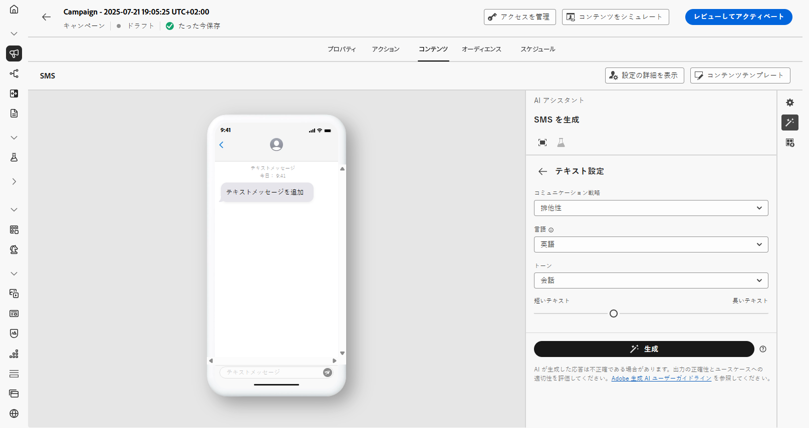
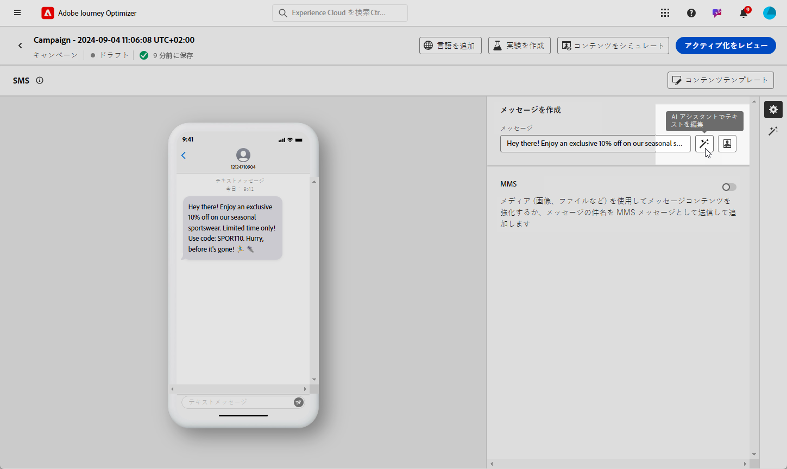

# AI アシスタントを使用した SMS の生成 {#generative-sms}

>[!BEGINSHADEBOX]

**目次**

* [AI アシスタントの基本を学ぶ](gs-generative.md)
* [AI アシスタントを使用したメールの生成](generative-email.md)
* AI アシスタントを使用した SMS の生成
* [AI アシスタントによるプッシュ生成](generative-push.md)
* [AI アシスタントを使用したコンテンツ実験](generative-experimentation.md)

>[!ENDSHADEBOX]

オーディエンスの好みに合わせて SMS メッセージを作成しカスタマイズしたら、Journey Optimizerの AI アシスタントとのコミュニケーションを強化します。

このリソースでは、コンテンツを微調整するための洞察に満ちたレコメンデーションを提供し、メッセージが共感を得て、最大のエンゲージメントを促進するのに役立ちます。

Journey Optimizerで AI アシスタントを使用する方法については、以下のタブを参照してください。

>[!NOTE]
>
>この機能の使用を開始する前に、関連する[ガードレールと制限](gs-generative.md#generative-guardrails)のトピックに目を通してください。

>[!BEGINTABS]

>[!TAB 完全な SMS 生成]

1. SMS キャンペーンを作成して設定したら、 **[!UICONTROL コンテンツを編集]**.

   SMS キャンペーンの設定方法について詳しくは、次を参照してください。 [このページ](../sms/create-sms.md).

1. を入力します **[!UICONTROL 基本の詳細]** キャンペーン用。 完了したら、「**[!UICONTROL コンテンツを編集]**」をクリックします。

1. 必要に応じて、SMS メッセージをパーソナライズします。[詳細情報](../sms/create-sms.md)

1. **[!UICONTROL AI アシスタントを表示]**&#x200B;メニューにアクセスします。

   {zoomable=&quot;yes&quot;}

1. を有効にする **[!UICONTROL 元のコンテンツを使用]** キャンペーンのコンテンツ、名前、選択したオーディエンスに基づいて新しいコンテンツをパーソナライズするための AI アシスタントのオプション。

   プロンプトは、常に特定のコンテキストに関連付けられている必要があります。

1. 「**[!UICONTROL プロンプト]**」フィールドに生成する内容を記述して、コンテンツを微調整します。

   プロンプトの作成に関する支援を探している場合は、 **[!UICONTROL プロンプトライブラリ]** キャンペーンを改善するための様々な迅速なアイデアを提供します。

   {zoomable=&quot;yes&quot;}

1. 「**[!UICONTROL ブランドアセットをアップロード]**」を選択し、AI アシスタントに追加のコンテキストを提供できるコンテンツを含むブランドアセットを追加します。

1. 様々なオプションを使用してプロンプトを調整します。

   * **[!UICONTROL コミュニケーション戦略]**：生成テキストに適した通信方法を選択します。
   * **[!UICONTROL 言語]**：バリアントのコンテンツの言語を選択します。
   * **[!UICONTROL トーン]**：テキストがオーディエンスと目的に適したものになります。
   * **[!UICONTROL 長さ]**：範囲スライダーを使用して、コンテンツの長さを選択します。

   {zoomable=&quot;yes&quot;}

1. プロンプトの準備が整ったら、「**[!UICONTROL 生成]**」をクリックします。

1. 生成された&#x200B;**[!UICONTROL バリエーション]**&#x200B;を参照して、「**[!UICONTROL プレビュー]**」をクリックし、選択したバリエーションのフルスクリーンバージョンを表示します。

1. **[!UICONTROL プレビュー]**&#x200B;ウィンドウ内の「**[!UICONTROL 絞り込み]**」オプションに移動して、追加のカスタマイズ機能にアクセスし、環境設定に合わせてバリエーションを微調整します。

   * **[!UICONTROL 参照コンテンツとして使用]**：選択したバリアントは、他の結果を生成するための参照コンテンツとして機能します。

   * **[!UICONTROL 言い換え]**：AI アシスタントは、メッセージを様々な方法で言い換えることができ、ユーザーが作成した文章を新鮮で、多様なオーディエンスを惹きつけるメッセージにします。

   * **[!UICONTROL よりシンプルな言語の使用]**:AI アシスタントを活用して言語を簡素化し、より広いオーディエンスに対して明確なアクセシビリティを確保します。

   {zoomable=&quot;yes&quot;}

1. 適切なコンテンツが見つかったら、「**[!UICONTROL 選択]**」をクリックします。

   コンテンツの実験を有効にすることもできます。 [詳細情報](generative-experimentation.md)

1. パーソナライゼーションフィールドを挿入して、プロファイルデータに基づいて SMS コンテンツをカスタマイズします。[詳しくは、コンテンツのパーソナライゼーションを参照してください](../personalization/personalize.md)

1. メッセージの内容を定義したら、「**[!UICONTROL コンテンツをシミュレート]**」ボタンをクリックしてレンダリングを制御し、テストプロファイルでパーソナライゼーション設定を確認します。[詳細情報](../personalization/personalize.md)

コンテンツ、オーディエンスおよびスケジュールを定義したら、SMS キャンペーンの準備を始めます。 [詳細情報](../campaigns/review-activate-campaign.md)

>[!TAB テキスト生成]

1. SMS キャンペーンを作成して設定したら、 **[!UICONTROL コンテンツを編集]**.

   SMS キャンペーンの設定方法について詳しくは、次を参照してください。 [このページ](../sms/create-sms.md).

1. を入力します **[!UICONTROL 基本の詳細]** キャンペーン用。 完了したら、「**[!UICONTROL コンテンツを編集]**」をクリックします。

1. 必要に応じて、SMS メッセージをパーソナライズします。[詳細情報](../sms/create-sms.md)

1. へのアクセス **[!UICONTROL AI アシスタントでテキストを編集]** の横にあるメニュー **[!UICONTROL メッセージ]** フィールド。

   {zoomable=&quot;yes&quot;}

1. を有効にする **[!UICONTROL 参照コンテンツの使用]** キャンペーンのコンテンツ、名前、選択したオーディエンスに基づいて新しいコンテンツをパーソナライズするための AI アシスタントのオプション。

   プロンプトは、常に特定のコンテキストに関連付けられている必要があります。

1. 「**[!UICONTROL プロンプト]**」フィールドに生成する内容を記述して、コンテンツを微調整します。

   プロンプトの作成に関する支援を探している場合は、 **[!UICONTROL プロンプトライブラリ]** キャンペーンを改善するための様々な迅速なアイデアを提供します。

   {zoomable=&quot;yes&quot;}

1. 「**[!UICONTROL ブランドアセットをアップロード]**」を選択し、AI アシスタントに追加のコンテキストを提供できるコンテンツを含むブランドアセットを追加します。

1. 様々なオプションを使用してプロンプトを調整します。

   * **[!UICONTROL コミュニケーション戦略]**：生成テキストに適した通信方法を選択します。
   * **[!UICONTROL 言語]**：バリアントのコンテンツの言語を選択します。
   * **[!UICONTROL トーン]**：テキストがオーディエンスと目的に適したものになります。
   * **[!UICONTROL 長さ]**：範囲スライダーを使用して、コンテンツの長さを選択します。

   {zoomable=&quot;yes&quot;}

1. プロンプトの準備が整ったら、「**[!UICONTROL 生成]**」をクリックします。

1. 生成された&#x200B;**[!UICONTROL バリエーション]**&#x200B;を参照して、「**[!UICONTROL プレビュー]**」をクリックし、選択したバリエーションのフルスクリーンバージョンを表示します。

1. **[!UICONTROL プレビュー]**&#x200B;ウィンドウ内の「**[!UICONTROL 絞り込み]**」オプションに移動して、追加のカスタマイズ機能にアクセスし、環境設定に合わせてバリエーションを微調整します。

   * **[!UICONTROL 参照コンテンツとして使用]**：選択したバリアントは、他の結果を生成するための参照コンテンツとして機能します。

   * **[!UICONTROL 言い換え]**：AI アシスタントは、メッセージを様々な方法で言い換えることができ、ユーザーが作成した文章を新鮮で、多様なオーディエンスを惹きつけるメッセージにします。

   * **[!UICONTROL よりシンプルな言語の使用]**:AI アシスタントを活用して言語を簡素化し、より広いオーディエンスに対して明確なアクセシビリティを確保します。

   {zoomable=&quot;yes&quot;}

1. 適切なコンテンツが見つかったら、「**[!UICONTROL 選択]**」をクリックします。

   コンテンツの実験を有効にすることもできます。 [詳細情報](generative-experimentation.md)

1. パーソナライゼーションフィールドを挿入して、プロファイルデータに基づいて SMS コンテンツをカスタマイズします。[詳しくは、コンテンツのパーソナライゼーションを参照してください](../personalization/personalize.md)

1. メッセージコンテンツを定義したら、 **[!UICONTROL コンテンツをシミュレート]** ボタンをクリックしてレンダリングを制御し、テストプロファイルでパーソナライゼーション設定を確認します。

コンテンツ、オーディエンスおよびスケジュールを定義したら、SMS キャンペーンの準備を始めます。 [詳細情報](../campaigns/review-activate-campaign.md)

>[!ENDTABS]
