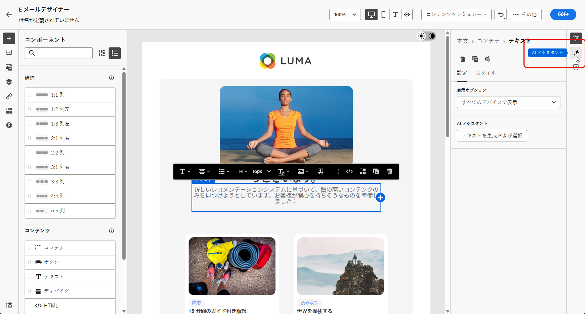
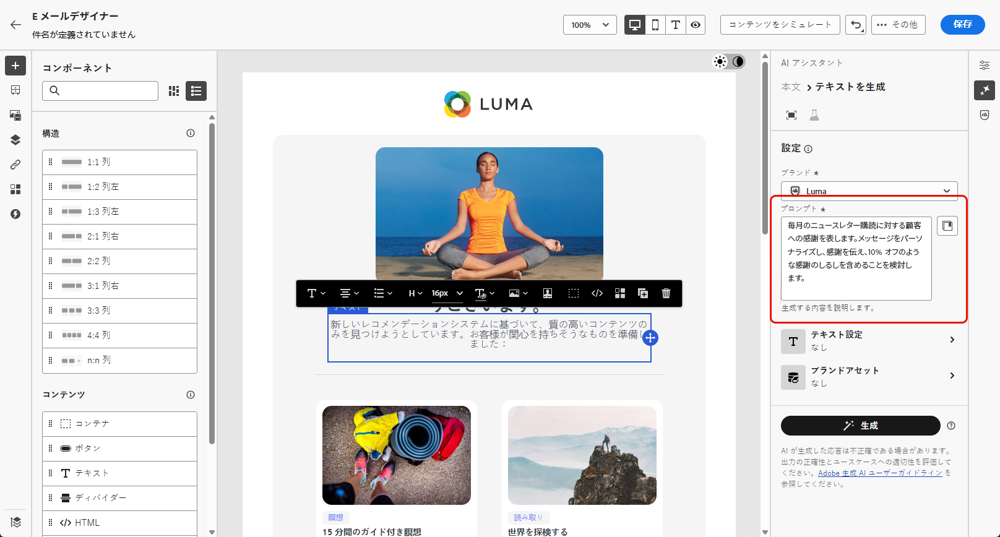
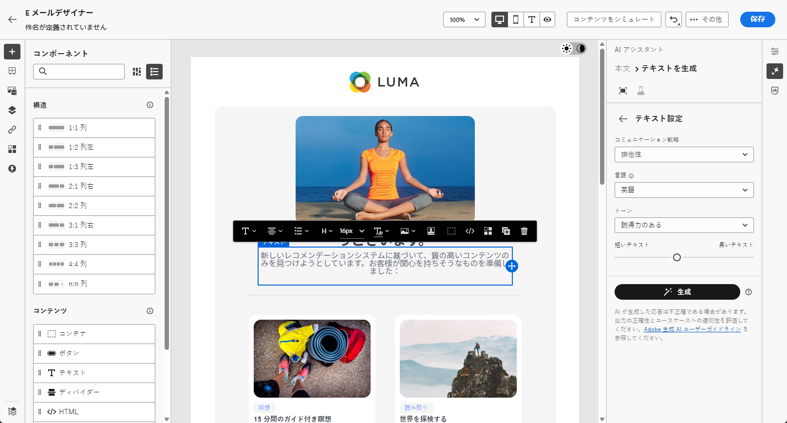
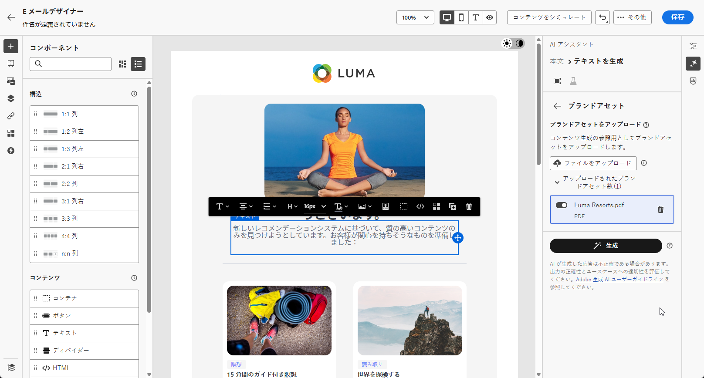
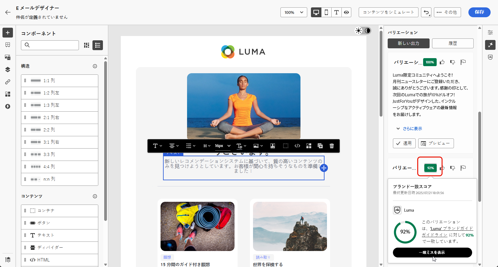
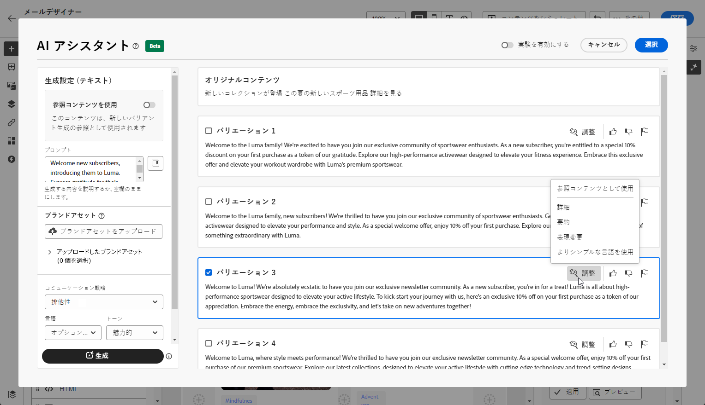
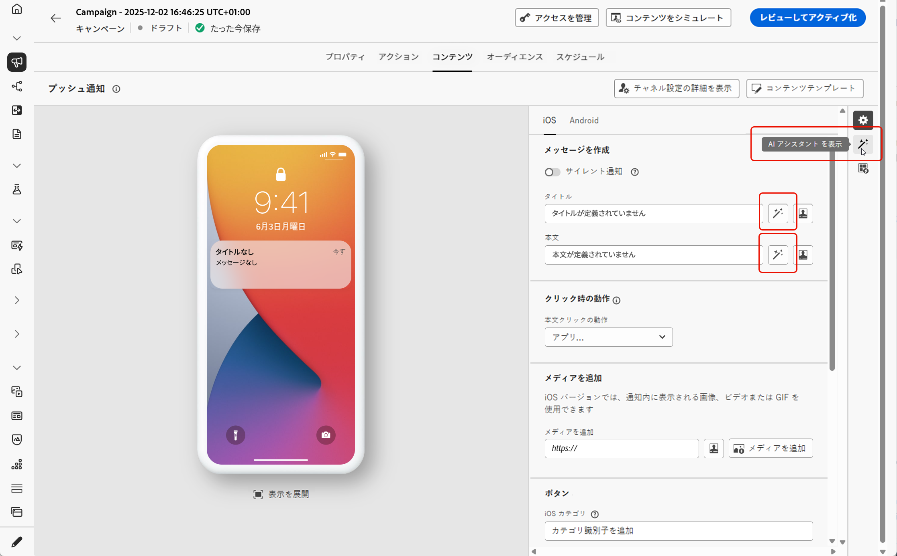
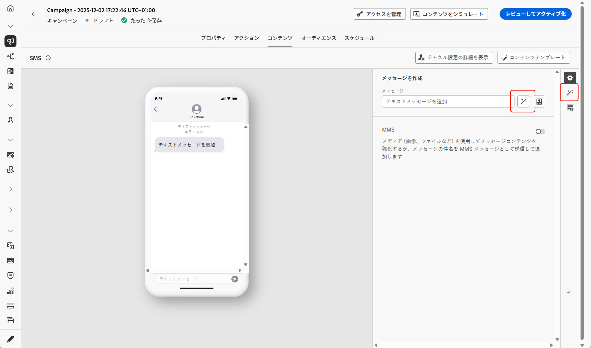
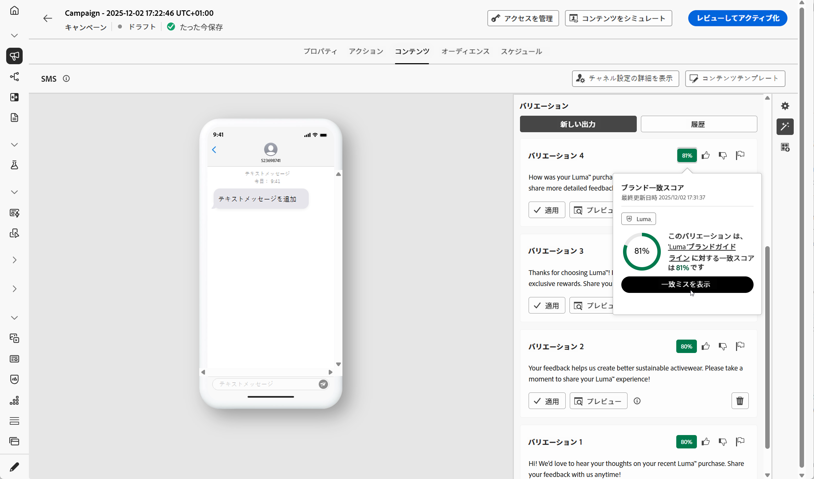
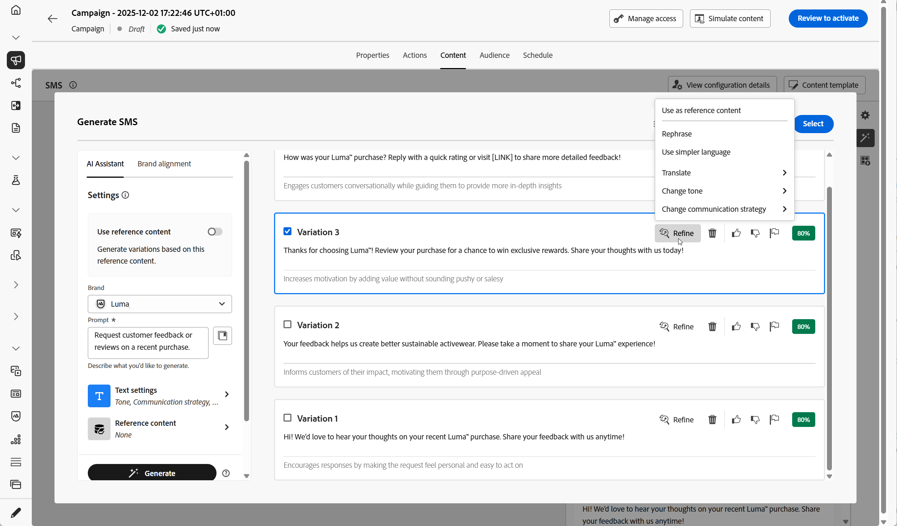

# AI アシスタントを使用したテキストの生成 {#generative-text}

>[!IMPORTANT]
>
>この機能の使用を開始する前に、関連する[ガードレールと制限](gs-generative.md#generative-guardrails)のトピックに目を通してください。
> 
>
>Journey Optimizer で AI アシスタントを使用する前に、[ユーザー契約](https://www.adobe.com/jp/legal/licenses-terms/adobe-dx-gen-ai-user-guidelines.html)に同意する必要があります。 詳しくは、アドビ担当者にお問い合わせください。

Journey Optimizer の AI アシスタントを使用して、オーディエンスの共感を得られる魅力的なテキストコンテンツを生成します。 メールのコピーを強化したり、魅力的な web コンテンツを作成したり、説得力のあるランディングページのテキストを作成したり、プッシュ通知メッセージを書き込んだり、SMS メッセージを作成したりする必要がある場合でも、AI アシスタントは影響力のあるテキストを配信するのに役立ちます。

## メールと web チャネルの場合 {#email-web-channels}

AI アシスタントは、メールキャンペーン、web エクスペリエンス、ランディングページに高品質なテキストコンテンツを生成できます。 この機能により、デジタルタッチポイントをまたいでオーディエンスとつながる、魅力的でブランドに即したメッセージを作成できます。

### アクセスと設定 {#access-configure}

AI アシスタントを使用してテキストコンテンツの生成を開始する前に、キャンペーンやジャーニーを設定し、コンテンツエディターにアクセスする必要があります。 ワークスペースを準備し、AI アシスタントパネルを開くには、次の手順に従います。

1. キャンペーンやジャーニーを作成および設定します。

   * **メール**：メールキャンペーンを作成および設定したら、「**[!UICONTROL コンテンツを編集]**」をクリックします。 [詳細情報](../email/create-email.md)
   * **Web**：web ページを作成および設定したら、「**[!UICONTROL Web ページを編集]**」をクリックします。 [詳細情報](../web/create-web.md)
   * **ランディングページ**：ランディングページを作成および設定したら、「**[!UICONTROL デザイナーを開く]**」をクリックします。 [詳細情報](../landing-pages/create-lp.md)

1. 特定のコンテンツのみをターゲットにするには、**[!UICONTROL テキストコンポーネント]**&#x200B;を選択し、**[!UICONTROL AI アシスタント]**&#x200B;メニュー（web の場合は **[!UICONTROL AI アシスタントを表示]**）にアクセスします。

   {zoomable="yes"}

### コンテンツを生成 {#generate-content}

AI アシスタントを使用して明確なプロンプトを作成し、設定を微調整し、カスタマイズされたテキストを生成して、メッセージがブランドとコミュニケーションの目標と一致していることを確認する方法について説明します。

1. 「**[!UICONTROL オリジナルコンテンツを使用]**」オプションを有効にして、AI アシスタントで、選択したコンテンツに基づいて新しいコンテンツをパーソナライズします。

1. **[!UICONTROL ブランド]**&#x200B;を選択して、AI で生成されたコンテンツがブランドの仕様と一致していることを確認します。 ブランドについて詳しくは、[こちら](brands.md)を参照してください。

1. 生成する内容を「**[!UICONTROL プロンプト]**」フィールドに記述して、コンテンツを微調整します。

   プロンプトの作成に関するサポートが必要な場合は、キャンペーンを改善するための様々なプロンプトのアイデアを提供する&#x200B;**[!UICONTROL プロンプトライブラリ]**&#x200B;にアクセスします。

   {zoomable="yes"}

1. 次の&#x200B;**[!UICONTROL テキスト設定]**&#x200B;オプションを使用してプロンプトを調整します。

   * **[!UICONTROL コミュニケーション戦略]**：生成テキストに最適なコミュニケーションスタイルを選択します。
   * **[!UICONTROL 言語]**：生成されたコンテンツの言語を選択します。
   * **[!UICONTROL トーン]**：トーンは、オーディエンスの共感を呼ぶ必要があります。 情報を提供する、遊び心を持たせる、説得力があるなど、目的に合わせて、AI アシスタントはメッセージを適切に調整することができます。
   * **テキストの長さ**：スライダーを使用して、目的のテキストの長さを選択します。

   {zoomable="yes"}

1. **[!UICONTROL ブランドアセット]**&#x200B;メニューから「**[!UICONTROL ブランドアセットをアップロード]**」をクリックすると、AI アシスタントに追加のコンテキストを提供できるコンテンツを含むブランドアセットを追加するか、以前にアップロードしたアセットを選択できます。

   以前にアップロードしたファイルは、**[!UICONTROL アップロードされたブランドアセット]**&#x200B;ドロップダウンで使用できます。 生成に含めるアセットを切り替えるだけです。

   {zoomable="yes"}

1. プロンプトの準備が整ったら、「**[!UICONTROL 生成]**」をクリックします。

### 絞り込みと最終処理 {#refine-finalize}

生成されたテキストを確認し、絞り込みを行い、パーソナライゼーションを適用してコンテンツを最終処理し、配信の準備が整った、洗練された魅力的なメッセージを作成する方法について説明します。

1. 生成された&#x200B;**[!UICONTROL バリエーション]**&#x200B;を参照します。

   「**[!UICONTROL プレビュー]**」をクリックして、選択したバリエーションの全画面バージョンを表示するか、「**[!UICONTROL 適用]**」をクリックして、現在のコンテンツを置き換えます。

1. 「割合」アイコンをクリックして、**[!UICONTROL ブランド一致スコア]**&#x200B;を表示し、ブランドとの不一致を特定します。

   詳しくは、[ブランド一致スコア](brands-score.md)を参照してください。

   {zoomable="yes"}

1. **[!UICONTROL プレビュー]**&#x200B;ウィンドウ内の「**[!UICONTROL 絞り込み]**」オプションに移動して、追加のカスタマイズ機能にアクセスします。

   * **[!UICONTROL 参照コンテンツとして使用]**：選択したバリアントは、他の結果を生成するための参照コンテンツとして機能します。

   * **[!UICONTROL 言い換え]**： 意味を保持しながらメッセージを書き換えます。 このオプションを使用すると、コアメッセージを変更せずに、代替表現を生成したり、フローを改善したり、フレーズを調整したりできます。

   * **[!UICONTROL よりシンプルな言葉を使用]**：AI アシスタントを活用して言葉を簡素化し、より幅広いオーディエンスに対して明確さとアクセシビリティを確保します。

   * **[!UICONTROL トーンを変更]**：メッセージのトーンを、より使いやすい、プロフェッショナル、緊急、インスピレーションなど、コミュニケーションスタイルに一致させて調整します。

   * **[!UICONTROL コミュニケーション戦略を変更]**：緊急性の創出や魅力的なアピールの強調など、目的に応じてメッセージングアプローチを変更します。

   {zoomable="yes"}

1. 「**[!UICONTROL ブランド一致]**」タブを開いて、コンテンツが[ブランドガイドライン](brands.md)とどのように一致しているかを確認します。

1. 適切なコンテンツが見つかったら、「**[!UICONTROL 選択]**」をクリックします。

   また、コンテンツの実験を有効にすることもできます。 [詳細情報](generative-experimentation.md)

1. パーソナライゼーションフィールドを挿入し、プロファイルデータに基づいてコンテンツをカスタマイズします。 次に「**[!UICONTROL コンテンツをシミュレート]**」ボタンをクリックしてレンダリングを制御し、テストプロファイルでパーソナライゼーション設定を確認します。 [詳細情報](../personalization/personalize.md)

1. コンテンツを確認およびアクティブ化します。
   * **メール**：コンテンツ、オーディエンスおよびスケジュールを定義したら、メールキャンペーンの準備が整います。 [詳細情報](../campaigns/review-activate-campaign.md)
   * **Web**：web キャンペーンの設定を定義し、必要に応じてコンテンツを編集したら、web キャンペーンをレビューおよびアクティブ化できます。 [詳細情報](../web/create-web.md#activate-web-campaign)
   * **ランディングページ**：ランディングページの準備が整ったら、公開して、メッセージで使用できるようになります。 [詳細情報](../landing-pages/create-lp.md#publish-landing-page)

## モバイルチャネル向け {#mobile-channels}

AI アシスタントは、プッシュ通知や SMS メッセージ用の魅力的なテキストコンテンツを生成し、すべてのモバイルタッチポイントをまたいでオーディエンスの共感を得られる魅力的なモバイルコミュニケーションの作成に役立ちます。

### アクセスと設定 {#mobile-access-configure}

モバイルチャネル用の AI アシスタントを使用してテキストの生成を開始する前に、キャンペーンを設定し、AI アシスタントにアクセスする必要があります。 アクセス方法は、プッシュ通知と SMS メッセージで少し異なります。

1. モバイルキャンペーンを作成および設定します。
   * **プッシュ通知**：プッシュ通知キャンペーンを作成および設定したら、「**[!UICONTROL コンテンツを編集]**」をクリックします。 [詳細情報](../push/create-push.md)
   * **SMS**：SMS キャンペーンを作成および設定したら、「**[!UICONTROL コンテンツを編集]**」をクリックします。 [詳細情報](../mobile/create-mobile-message.md)

1. キャンペーンの&#x200B;**[!UICONTROL 基本的な詳細]**&#x200B;を入力します。 完了したら、「**[!UICONTROL コンテンツを編集]**」をクリックします。

1. 必要に応じて、メッセージをパーソナライズします。
   * **プッシュ通知**：[詳細情報](../push/design-push.md)
   * **SMS**：[詳細情報](../mobile/create-mobile-message.md)

1. AI アシスタントへのアクセス：
   * **プッシュ通知の場合**：「**[!UICONTROL タイトル]**」フィールドまたは「**[!UICONTROL メッセージ]**」フィールドの横にある&#x200B;**[!UICONTROL AI アシスタントでテキストを編集]**&#x200B;メニューをクリックします。 また、**AI アシスタント**&#x200B;メニューに直接アクセスすることもできます。

     {zoomable="yes"}

   * **SMS の場合**：**[!UICONTROL メッセージ]**&#x200B;の横にある&#x200B;**[!UICONTROL AI アシスタントでテキストを編集]**&#x200B;メニューをクリックするか、**[!UICONTROL AI アシスタントを表示]**&#x200B;メニューにアクセスします。

     {zoomable="yes"}

### コンテンツを生成 {#mobile-generate-content}

AI アシスタントにアクセスしたら、生成設定を指定して、ブランドとキャンペーンの目標に一致するモバイルコンテンツを作成できます。 テキストパラメーターをカスタマイズし、ブランドアセットを追加し、関連するバリエーションの生成で AI をガイドするプロンプトを指定します。

1. **[!UICONTROL ブランド]**&#x200B;を選択して、AI で生成されたコンテンツがブランドの仕様と一致していることを確認します。 ブランドについて詳しくは、[こちら](brands.md)を参照してください。

   ブランド機能は Private Beta としてリリースされており、今後のリリースですべての顧客が段階的に利用できるようになります。

1. 生成する内容を「**[!UICONTROL プロンプト]**」フィールドに記述して、コンテンツを微調整します。

   プロンプトの作成に関するサポートが必要な場合は、キャンペーンを改善するための様々なプロンプトのアイデアを提供する&#x200B;**[!UICONTROL プロンプトライブラリ]**&#x200B;にアクセスします。 [プロンプトのベストプラクティスの詳細情報](ai-assistant-prompting-guide.md)

   {zoomable="yes"}

1. **プッシュ通知の場合**、生成するフィールド（タイトル、メッセージ）を選択します。

1. 次の&#x200B;**[!UICONTROL テキスト設定]**&#x200B;オプションを使用してプロンプトを調整します。

   * **[!UICONTROL コミュニケーション戦略]**：生成テキストに最適なコミュニケーションスタイルを選択します。
   * **[!UICONTROL 言語]**：生成されたコンテンツの言語を選択します。
   * **[!UICONTROL トーン]**：トーンは、オーディエンスの共感を呼ぶ必要があります。 情報を提供する、遊び心を持たせる、説得力があるなど、目的に合わせて、AI アシスタントはメッセージを適切に調整することができます。

     {zoomable="yes"}

1. **[!UICONTROL 参照コンテンツ]**&#x200B;メニューから、「**[!UICONTROL ファイルをアップロード]**」をクリックして、AI アシスタントに追加のコンテキストを提供できるコンテンツを含むブランドアセットを追加するか、以前にアップロードしたものを選択します。

   以前にアップロードしたファイルは、**[!UICONTROL アップロードされた参照コンテンツ]**&#x200B;ドロップダウンで使用できます。 生成に含めるアセットを切り替えるだけです。

1. プロンプトの準備が整ったら、「**[!UICONTROL 生成]**」をクリックします。

### 絞り込みと最終処理 {#mobile-refine-finalize}

モバイルメッセージのテキストバリエーションを生成したら、結果を微調整して、正確な要件を満たすことができます。 ブランド一致を確認し、トーンと言語を調整し、アクティブ化するコンテンツを準備します。

1. 生成後、**[!UICONTROL バリエーション]**&#x200B;を参照します。

1. 「割合」アイコンをクリックして、**[!UICONTROL ブランド一致スコア]**&#x200B;を表示し、ブランドとの不一致を特定します。

   詳しくは、[ブランド一致スコア](brands-score.md)を参照してください。

   {zoomable="yes"}

1. 「**[!UICONTROL プレビュー]**」をクリックして、選択したバリエーションの全画面バージョンを表示するか、「**[!UICONTROL 適用]**」をクリックして、現在のコンテンツを置き換えます。

1. **[!UICONTROL プレビュー]**&#x200B;ウィンドウ内の「**[!UICONTROL 絞り込み]**」オプションに移動して、追加のカスタマイズ機能にアクセスします。

   * **[!UICONTROL 参照コンテンツとして使用]**：選択したバリアントは、他の結果を生成するための参照コンテンツとして機能します。

   * **[!UICONTROL 言い換え]**： 意味を保持しながらメッセージを書き換えます。 このオプションを使用すると、コアメッセージを変更せずに、代替表現を生成したり、フローを改善したり、フレーズを調整したりできます。

   * **[!UICONTROL よりシンプルな言葉を使用]**：AI アシスタントを活用して言葉を簡素化し、より幅広いオーディエンスに対して明確さとアクセシビリティを確保します。

   * **[!UICONTROL 翻訳]**：言語をわかりやすく簡素化し、幅広いオーディエンスがアクセスできるようにします。

   * **[!UICONTROL トーンを変更]**：メッセージのトーンを、より使いやすい、プロフェッショナル、緊急、インスピレーションなど、コミュニケーションスタイルに一致させて調整します。

   * **[!UICONTROL コミュニケーション戦略を変更]**：緊急性の創出や魅力的なアピールの強調など、目的に応じてメッセージングアプローチを変更します。

     {zoomable="yes"}

1. 「**[!UICONTROL ブランド一致]**」タブを開いて、コンテンツが[ブランドガイドライン](brands.md)とどのように一致しているかを確認します。

1. 適切なコンテンツが見つかったら、「**[!UICONTROL 選択]**」をクリックします。

   また、コンテンツの実験を有効にすることもできます。 [詳細情報](generative-experimentation.md)

1. パーソナライゼーションフィールドを挿入し、プロファイルデータに基づいてコンテンツをカスタマイズします。 次に「**[!UICONTROL コンテンツをシミュレート]**」ボタンをクリックしてレンダリングを制御し、テストプロファイルでパーソナライゼーション設定を確認します。 [詳細情報](../personalization/personalize.md)

コンテンツ、オーディエンスおよびスケジュールを定義したら、モバイルキャンペーンの準備が整います。 [詳細情報](../campaigns/review-activate-campaign.md)
