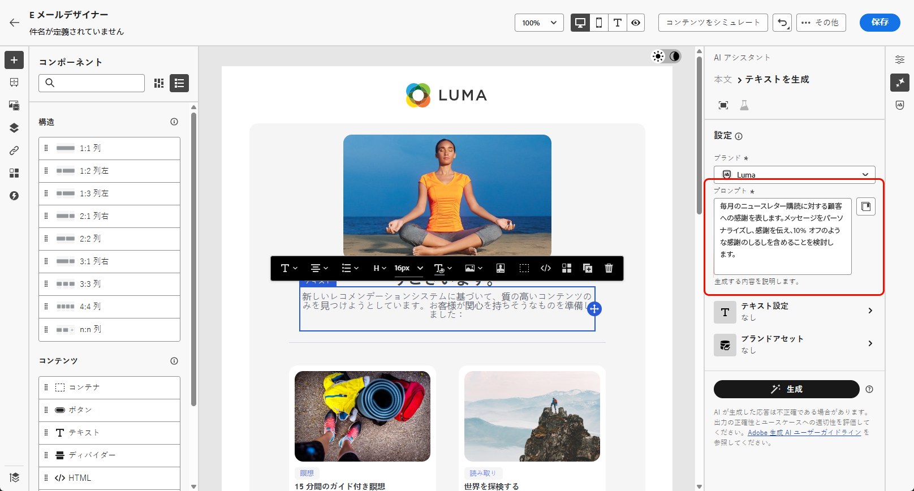
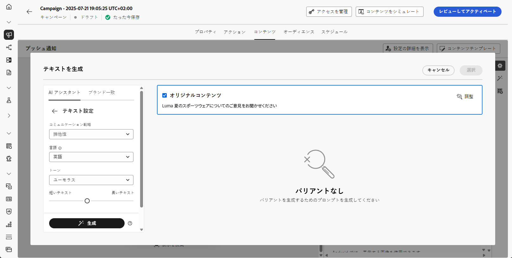

# AI アシスタントでテキストを生成 {#generative-text}

>[!IMPORTANT]
>
>この機能の使用を開始する前に、関連する[ガードレールと制限](gs-generative.md#generative-guardrails)のトピックに目を通してください。
> 
>
>Journey Optimizer で AI アシスタントを使用する前に、[ユーザー契約](https://www.adobe.com/jp/legal/licenses-terms/adobe-dx-gen-ai-user-guidelines.html)に同意する必要があります。詳しくは、アドビ担当者にお問い合わせください。

Journey Optimizerの AI アシスタントを使用して、オーディエンスの共感を得られる魅力的なテキストコンテンツを生成します。 メールのコピーを強化したり、魅力的な web コンテンツを作成したり、説得力のあるランディングページテキストを作成したり、プッシュ通知メッセージを書いたり、SMS メッセージを作成したりする必要がある場合でも、AI アシスタントは影響力のあるテキストを配信するのに役立ちます。

## メールおよび Web チャネルの場合 {#email-web-channels}

AI アシスタントは、メールキャンペーン、web エクスペリエンス、ランディングページ用に高品質のテキストコンテンツを生成できます。 この機能を使用すると、デジタルタッチポイントをまたいでオーディエンスと接続する、魅力的なオンブランドメッセージを作成できます。

### アクセスと設定 {#access-configure}

AI アシスタントでテキストコンテンツの生成を開始する前に、キャンペーンまたはジャーニーを設定し、コンテンツエディターにアクセスする必要があります。 次の手順に従ってワークスペースを準備し、AI アシスタント パネルを開きます。

1. キャンペーンまたはジャーニーを作成して設定します。

   * **メール**：メールキャンペーンを作成して設定したら、「**[!UICONTROL コンテンツを編集]**」をクリックします。 [詳細情報](../email/create-email.md)
   * **Web**:Web ページを作成および設定したら、「**[!UICONTROL Web ページを編集]**」をクリックします。 [詳細情報](../web/create-web.md)
   * **ランディングページ**：ランディングページを作成して設定したら、「**[!UICONTROL Designer を開く]**」をクリックします。 [詳細情報](../landing-pages/create-lp.md)

1. **[!UICONTROL テキストコンポーネント]** を選択して、特定のコンテンツのみをターゲットにし、**[!UICONTROL AI アシスタント]** メニュー（Web の場合は **[!UICONTROL AI アシスタントを表示]**）にアクセスします。

   {zoomable="yes"}

### コンテンツを生成 {#generate-content}

AI アシスタントを使用して明確なプロンプトを作成し、設定を微調整し、カスタマイズされたテキストを生成して、メッセージがブランドやコミュニケーションの目標に沿っていることを確認する方法を説明します。

1. 「**[!UICONTROL オリジナルコンテンツを使用]**」オプションを有効にして、AI アシスタントで、選択したコンテンツに基づいて新しいコンテンツをパーソナライズします。

1. **[!UICONTROL ブランド]**&#x200B;を選択して、AI で生成されたコンテンツがブランドの仕様と一致していることを確認します。ブランドについて詳しくは、[こちら](brands.md)を参照してください。

1. 生成する内容を「**[!UICONTROL プロンプト]**」フィールドに記述して、コンテンツを微調整します。

   プロンプトの作成に関するサポートが必要な場合は、キャンペーンを改善するための様々なプロンプトのアイデアを提供する&#x200B;**[!UICONTROL プロンプトライブラリ]**&#x200B;にアクセスしてください。

   {zoomable="yes"}

1. 次の&#x200B;**[!UICONTROL テキスト設定]**&#x200B;オプションを使用してプロンプトを調整します。

   * **[!UICONTROL コミュニケーション戦略]**：生成テキストに最適なコミュニケーションスタイルを選択します。
   * **[!UICONTROL 言語]**：生成されたコンテンツの言語を選択します。
   * **[!UICONTROL トーン]**：トーンはオーディエンスの共感を得られるはずです。 情報を提供する、遊び心を持たせる、説得力があるなど、目的に合わせて、AI アシスタントはメッセージを適切に調整することができます。
   * **テキストの長さ**：スライダーを使用して、目的のテキストの長さを選択します。

   {zoomable="yes"}

1. **[!UICONTROL ブランドアセット]**&#x200B;メニューから「**[!UICONTROL ブランドアセットをアップロード]**」をクリックすると、AI アシスタントに追加のコンテキストを提供できるコンテンツを含むブランドアセットを追加するか、以前にアップロードしたアセットを選択できます。

   以前にアップロードしたファイルは、**[!UICONTROL アップロードされたブランドアセット]**&#x200B;ドロップダウンで使用できます。生成に含めるアセットを切り替えるだけです。

   {zoomable="yes"}

1. プロンプトの準備が整ったら、「**[!UICONTROL 生成]**」をクリックします。

### 絞り込みと最終処理 {#refine-finalize}

生成されたテキストを確認し、絞り込みを行い、パーソナライゼーションを適用してコンテンツを最終決定し、洗練された魅力的なメッセージを配信準備として作成する方法を説明します。

1. 生成された&#x200B;**[!UICONTROL バリエーション]**&#x200B;を参照します。

   「**[!UICONTROL プレビュー]**」をクリックして、選択したバリエーションの全画面バージョンを表示するか、「**[!UICONTROL 適用]**」をクリックして、現在のコンテンツを置き換えます。

1. 「割合」アイコンをクリックして、**[!UICONTROL ブランド一致スコア]**&#x200B;を表示し、ブランドとの不一致を特定します。

   詳しくは、[ブランド一致スコア](brands-score.md)を参照してください。

   {zoomable="yes"}

1. **[!UICONTROL プレビュー]**&#x200B;ウィンドウ内の「**[!UICONTROL 絞り込み]**」オプションに移動して、追加のカスタマイズ機能にアクセスします。

   * **[!UICONTROL 参照コンテンツとして使用]**：選択したバリアントは、他の結果を生成するための参照コンテンツとして機能します。

   * **[!UICONTROL フレーズ変更]**：メッセージの意味を保持したまま、メッセージを書き換えます。 このオプションを使用すると、コアメッセージを変更せずに代替表現を生成したり、フローを改善したり、言葉遣いを調整したりできます。

   * **[!UICONTROL よりシンプルな言葉を使用]**：AI アシスタントを活用して言葉を簡素化し、より幅広いオーディエンスに対して明確さとアクセシビリティを確保します。

   * **[!UICONTROL トーンを変更]**：メッセージのトーンを調整して、よりフレンドリーでプロフェッショナル、緊急、または感動的なコミュニケーションスタイルに合わせます。

   * **[!UICONTROL コミュニケーション戦略の変更]**：緊急性の創出や魅力的なアピールの強調など、目的に応じてメッセージングアプローチを変更します。

   {zoomable="yes"}

1. 「**[!UICONTROL ブランド一致]**」タブを開いて、コンテンツが[ブランドガイドライン](brands.md)とどのように一致しているかを確認します。

1. 適切なコンテンツが見つかったら、「**[!UICONTROL 選択]**」をクリックします。

   また、コンテンツの実験を有効にすることもできます。[詳細情報](generative-experimentation.md)

1. パーソナライゼーションフィールドを挿入して、プロファイルデータに基づいてコンテンツをカスタマイズします。 次に「**[!UICONTROL コンテンツをシミュレート]**」ボタンをクリックしてレンダリングを制御し、テストプロファイルでパーソナライゼーション設定を確認します。[詳細情報](../personalization/personalize.md)

1. コンテンツをレビューしてアクティブ化します。
   * **メール**：コンテンツ、オーディエンス、スケジュールを定義したら、メールキャンペーンの準備を始めます。 [詳細情報](../campaigns/review-activate-campaign.md)
   * **Web**:web キャンペーンの設定を定義し、必要に応じてコンテンツを編集したら、web キャンペーンをレビューおよびアクティブ化できます。 [詳細情報](../web/create-web.md#activate-web-campaign)
   * **ランディングページ**：ランディングページの準備が整ったら、ページを公開して、メッセージで使用できるようにします。 [詳細情報](../landing-pages/create-lp.md#publish-landing-page)

## モバイルチャネル用 {#mobile-channels}

AI アシスタントは、プッシュ通知や SMS メッセージに説得力のあるテキストコンテンツを生成し、すべてのモバイルタッチポイントでオーディエンスの共感を得られる魅力的なモバイル通信を作成するのに役立ちます。

### アクセスと設定 {#mobile-access-configure}

モバイルチャネル用の AI アシスタントでテキストの生成を開始する前に、キャンペーンを設定して AI アシスタントにアクセスする必要があります。 アクセス方法は、プッシュ通知と SMS メッセージで少し異なります。

1. モバイルキャンペーンを作成および設定します。
   * **プッシュ通知**：プッシュ通知キャンペーンを作成および設定したら、**[!UICONTROL コンテンツを編集]** をクリックします。 [詳細情報](../push/create-push.md)
   * **SMS**:SMS キャンペーンを作成および設定したら、「**[!UICONTROL コンテンツを編集]**」をクリックします。 [詳細情報](../sms/create-sms.md)

1. キャンペーンの&#x200B;**[!UICONTROL 基本的な詳細]**&#x200B;を入力します。完了したら、「**[!UICONTROL コンテンツを編集]**」をクリックします。

1. 必要に応じてメッセージをパーソナライズします。
   * **プッシュ通知**:[&#x200B; 詳細情報 &#x200B;](../push/design-push.md)
   * **SMS**: [&#x200B; 詳細情報 &#x200B;](../sms/create-sms.md)

1. AI アシスタントにアクセス：
   * **プッシュ通知の場合**:**[!UICONTROL タイトル]** または **[!UICONTROL メッセージ]** フィールドの横にある「**[!UICONTROL AI アシスタントでテキストを編集]** メニューをクリックします。 **AI アシスタント** メニューに直接アクセスすることもできます。

     {zoomable="yes"}

   * **SMS の場合**:**[!UICONTROL メッセージ]** の横にある AI アシスタントでテキストを編集 **[!UICONTROL メニューをクリックするか]**&#x200B;**[!UICONTROL AI アシスタントを表示]** メニューにアクセスします。

     {zoomable="yes"}

### コンテンツを生成 {#mobile-generate-content}

AI アシスタントにアクセスしたら、生成設定を設定して、ブランドとキャンペーンの目標に合ったモバイルコンテンツを作成できます。 テキストパラメーターをカスタマイズし、ブランドアセットを追加し、関連するバリエーションを生成する際に AI をガイドするプロンプトを提供します。

1. **[!UICONTROL ブランド]**&#x200B;を選択して、AI で生成されたコンテンツがブランドの仕様と一致していることを確認します。ブランドについて詳しくは、[こちら](brands.md)を参照してください。

   ブランド機能は Private Beta としてリリースされており、今後のリリースですべての顧客が段階的に利用できるようになります。

1. 生成する内容を「**[!UICONTROL プロンプト]**」フィールドに記述して、コンテンツを微調整します。

   プロンプトを作成する際に支援を求めている場合は、**[!UICONTROL プロンプトライブラリ]** にアクセスしてください。このライブラリは、キャンペーンを改善するための様々な迅速なアイデアを提供します。 [&#x200B; プロンプトのベストプラクティスの詳細情報 &#x200B;](ai-assistant-prompting-guide.md)

   {zoomable="yes"}

1. **プッシュ通知の場合**、生成するフィールド（タイトルまたはメッセージ）を選択します。

1. 次の&#x200B;**[!UICONTROL テキスト設定]**&#x200B;オプションを使用してプロンプトを調整します。

   * **[!UICONTROL コミュニケーション戦略]**：生成テキストに最適なコミュニケーションスタイルを選択します。
   * **[!UICONTROL 言語]**：生成されたコンテンツの言語を選択します。
   * **[!UICONTROL トーン]**：トーンはオーディエンスの共感を得られるはずです。 情報を提供する、遊び心を持たせる、説得力があるなど、目的に合わせて、AI アシスタントはメッセージを適切に調整することができます。

     {zoomable="yes"}

1. **[!UICONTROL 参照コンテンツ]** メニューで「**[!UICONTROL ファイルをアップロード]**」をクリックし、追加のコンテキスト AI アシスタントを提供できるコンテンツを含むブランドアセットを追加するか、以前にアップロードしたものを選択します。

   以前にアップロードしたファイルは、「**[!UICONTROL アップロードされた参照コンテンツ]** ドロップダウンで使用できます。 生成に含めるアセットを切り替えるだけです。

1. プロンプトの準備が整ったら、「**[!UICONTROL 生成]**」をクリックします。

### 絞り込みと最終処理 {#mobile-refine-finalize}

モバイルメッセージ用にテキストバリエーションを生成したら、結果を微調整して、正確な要件を満たしていることを確認できます。 ブランドの整合性を確認し、トーンと言語を調整し、アクティブ化するコンテンツを準備します。

1. 生成後、**[!UICONTROL バリエーション]** を参照できます。

1. 「割合」アイコンをクリックして、**[!UICONTROL ブランド一致スコア]**&#x200B;を表示し、ブランドとの不一致を特定します。

   詳しくは、[ブランド一致スコア](brands-score.md)を参照してください。

   {zoomable="yes"}

1. 「**[!UICONTROL プレビュー]**」をクリックして、選択したバリエーションの全画面バージョンを表示するか、「**[!UICONTROL 適用]**」をクリックして、現在のコンテンツを置き換えます。

1. **[!UICONTROL プレビュー]**&#x200B;ウィンドウ内の「**[!UICONTROL 絞り込み]**」オプションに移動して、追加のカスタマイズ機能にアクセスします。

   * **[!UICONTROL 参照コンテンツとして使用]**：選択したバリアントは、他の結果を生成するための参照コンテンツとして機能します。

   * **[!UICONTROL フレーズ変更]**：メッセージの意味を保持したまま、メッセージを書き換えます。 このオプションを使用すると、コアメッセージを変更せずに代替表現を生成したり、フローを改善したり、言葉遣いを調整したりできます。

   * **[!UICONTROL よりシンプルな言葉を使用]**：AI アシスタントを活用して言葉を簡素化し、より幅広いオーディエンスに対して明確さとアクセシビリティを確保します。

   * **[!UICONTROL 翻訳]**：言語を簡素化して、より幅広いオーディエンスに対して明確さとアクセシビリティを確保します。

   * **[!UICONTROL トーンを変更]**：メッセージのトーンを調整して、よりフレンドリーでプロフェッショナル、緊急、または感動的なコミュニケーションスタイルに合わせます。

   * **[!UICONTROL コミュニケーション戦略の変更]**：緊急性の創出や魅力的なアピールの強調など、目的に応じてメッセージングアプローチを変更します。

     {zoomable="yes"}

1. 「**[!UICONTROL ブランド一致]**」タブを開いて、コンテンツが[ブランドガイドライン](brands.md)とどのように一致しているかを確認します。

1. 適切なコンテンツが見つかったら、「**[!UICONTROL 選択]**」をクリックします。

   また、コンテンツの実験を有効にすることもできます。[詳細情報](generative-experimentation.md)

1. パーソナライゼーションフィールドを挿入して、プロファイルデータに基づいてコンテンツをカスタマイズします。 次に「**[!UICONTROL コンテンツをシミュレート]**」ボタンをクリックしてレンダリングを制御し、テストプロファイルでパーソナライゼーション設定を確認します。[詳細情報](../personalization/personalize.md)

コンテンツ、オーディエンスおよびスケジュールを定義したら、モバイルキャンペーンの準備を始めます。 [詳細情報](../campaigns/review-activate-campaign.md)

