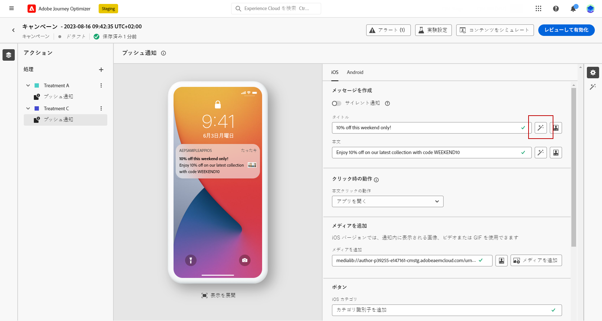
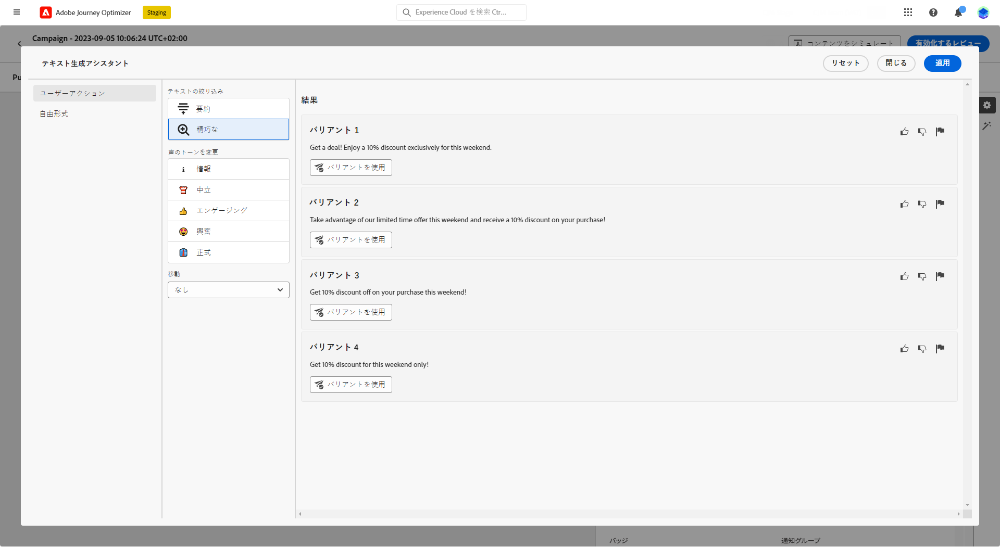
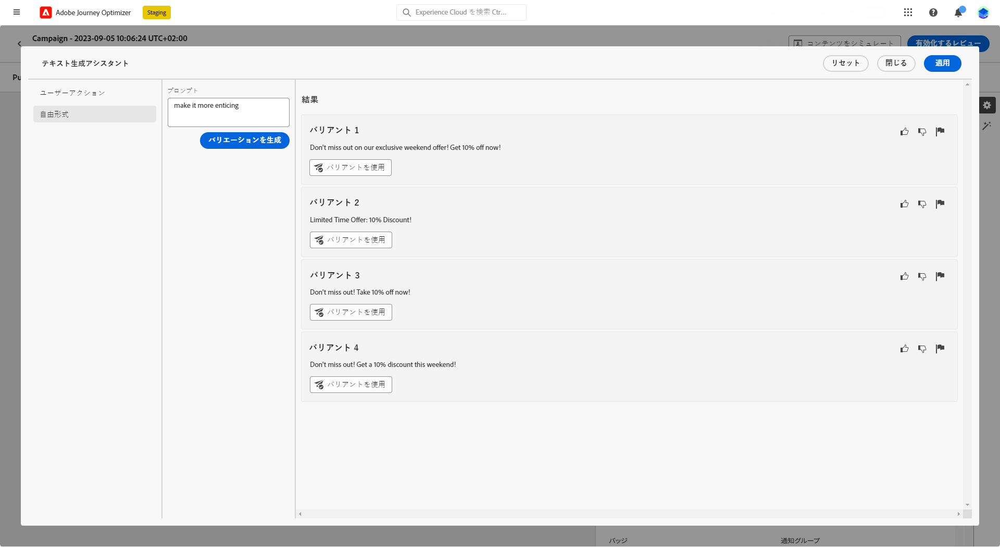
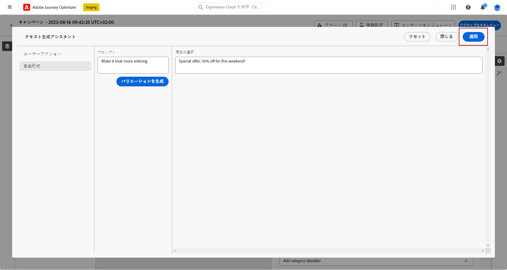

# コンテンツアシスタントを使用したタイトルの生成 {#title-content-assistant}

>[!BEGINSHADEBOX]

**目次**

* [コンテンツアシスタント入門](gs-generative.md)
* **[コンテンツアシスタントを使用したテキストの生成](generative-title.md)**
* [コンテンツアシスタントを使用した画像の生成](generative-image.md)

>[!ENDSHADEBOX]

メッセージを作成してパーソナライズしたら、コンテンツアシスタントを使用してコンテンツを次のレベルに引き上げます。

コンテンツアシスタントを活用して、様々なメインタイトルを試すことで、メッセージのインパクトを最適化できるようになりました。どのタイトルがより多くのクリックを効果的に生み出すかを測定して比較するために、各バリエーションは個別の処理とみなされます。

この例では、コンテンツ実験を使用して魅力的なプッシュ通知を送信する方法を説明します。次の手順に従います。

1. メッセージを作成し、コンテンツ実験を追加します。コンテンツ実験について詳しくは、[この節](../campaigns/content-experiment.md)を参照してください。

1. キャンペーンと実験を設定したら、「**[!UICONTROL コンテンツを作成]**」をクリックし、必要に応じてメッセージの内容をパーソナライズします。

1. 2 番目の「**[!UICONTROL 処理]**」をクリックし、生成アシスタントを使用して「タイトル」を変更します。

   「**[!UICONTROL ヘッダー]**」フィールドの横にある「**[!UICONTROL テキスト生成アシスタントを使用して編集]**」をクリックします。

   

1. **[!UICONTROL ユーザーアクション]**&#x200B;メニューで、「**[!UICONTROL テキストの絞り込み]**」を選択します。

   * **[!UICONTROL 要約]**：このオプションを使用すると、テキストを短くし、要旨を残します。

   * **[!UICONTROL 詳細]**：このオプションを使用すると、コンテンツアシスタントからクリエイティブなバリエーションを追加して、コンテンツを拡充します。

   

1. **[!UICONTROL 口調を変更]**&#x200B;メニューでバリエーションの口調を選択します。

1. **[!UICONTROL フリーフォーム]**&#x200B;メニューから、結果をより細かく調整するためのプロンプトを提供することも選択できます。

   

1. 適切なバリエーションが見つかったら、「**[!UICONTROL ユーザーバリアント]**」をクリックして「**[!UICONTROL 適用]**」をクリックします。

   

1. メッセージの内容を定義したら、「**[!UICONTROL コンテンツをシミュレート]**」ボタンをクリックしてレンダリングを制御し、テストプロファイルでパーソナライゼーション設定を確認します。[詳細情報](../email/preview.md)

1. コンテンツ実験の準備が整ったら、キャンペーンの概要ページで「**[!UICONTROL アクティブ化のレビュー]**」をクリックして、キャンペーンの概要を表示できます。パラメーターが正しくない、または見つからない場合は、警告が表示されます。

1. キャンペーンを開始する前に、すべての設定が正しいことを再確認し、「**[!UICONTROL アクティブ化]**」をクリックします。

実験とキャンペーンを正常に設定したら、キャンペーンレポートを使用してキャンペーンをトラッキングできます。[詳細情報](../reports/campaign-global-report.md#experimentation-report)
