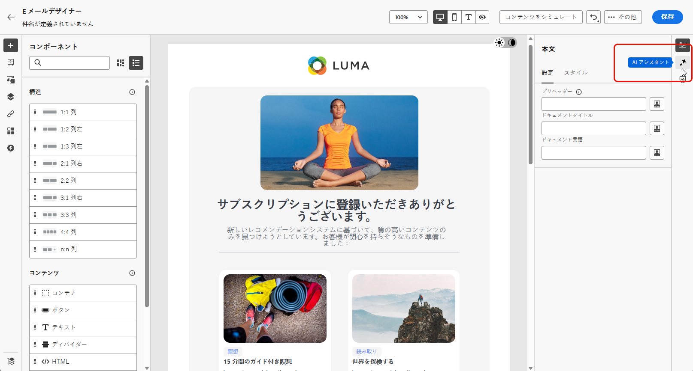
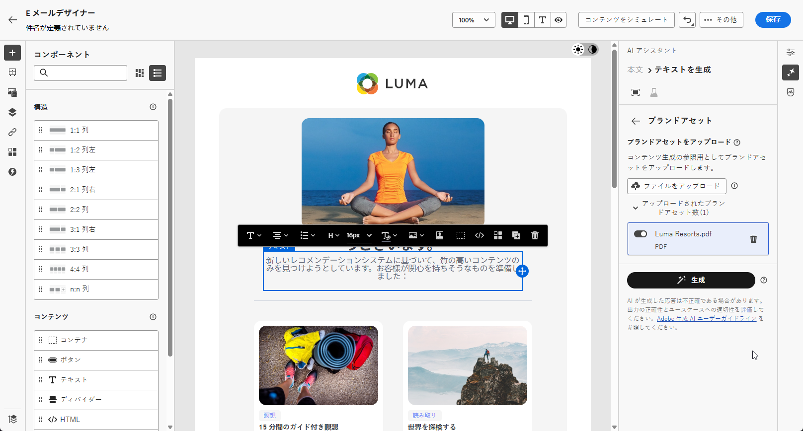

# AI アシスタントを使用した web ページの生成 {#generative-web}

>[!BEGINSHADEBOX]

**目次**

* [AI アシスタントの基本を学ぶ](gs-generative.md)
* [AI アシスタントを使用したメールの生成](generative-email.md)
* [AI アシスタントを使用した SMS の生成](generative-SMS.md)
* [AI アシスタントを使用したプッシュの生成](generative-push.md)
* AI アシスタントを使用した web ページの生成
* [AI アシスタントを使用したコンテンツ実験](generative-experimentation.md)

>[!ENDSHADEBOX]

メールを作成してパーソナライズしたら、Adobe Journey Optimizer で生成 AI による AI アシスタントを利用し、コンテンツを次のレベルに引き上げます。

AI アシスタントは、オーディエンスの共感を得られる可能性の高い様々なコンテンツを提案することで、配信の影響を最適化するのに役立ちます。

>[!NOTE]
>
>この機能の使用を開始する前に、関連する[ガードレールと制限](generative-gs.md#guardrails-and-limitations)のトピックに目を通してください。

>[!BEGINTABS]

>[!TAB Web ページの完全生成]

次の例では、AI アシスタントを利用して既存のメールを調整し、特別なイベント用にカスタマイズします。

1. メール配信を作成して設定したら、 **[!UICONTROL コンテンツを編集]**.

   メール配信の設定方法について詳しくは、以下を参照してください。 [このページ](../email/create-email-content.md).

1. 必要に応じてメールをパーソナライズし、 **[!UICONTROL AI アシスタント]** メニュー。

   {zoomable="yes"}

1. を有効にする **[!UICONTROL 元のコンテンツを使用]** 配信、配信名、選択したオーディエンスに基づいて新しいコンテンツをパーソナライズするための AI アシスタントのオプション。

   プロンプトは、常に特定のコンテキストに関連付けられている必要があります。

1. 生成する内容を「**[!UICONTROL プロンプト]**」フィールドに記述して、コンテンツを微調整します。

   プロンプトの作成に関する支援を探している場合は、 **[!UICONTROL プロンプトライブラリ]** を使用すると、配信を改善するための様々な迅速なアイデアを利用できます。

   {zoomable="yes"}

1. を切り替えることができます **[!UICONTROL 件名]** または **[!UICONTROL プリヘッダー]** をクリックして、バリアント生成に含めます。

1. クリック **[!UICONTROL ブランドアセットのアップロード]** ai アシスタントに追加のコンテキストを提供できるコンテンツを含むブランドアセットを追加するか、以前にアップロードしたものを選択します。

   {zoomable="yes"}

1. 様々なオプションを使用してプロンプトを調整します。

   * **[!UICONTROL コミュニケーション戦略]**：生成テキストに最適なコミュニケーションスタイルを選択します。
   * **[!UICONTROL 言語]**：コンテンツを生成する言語を選択します。
   * **[!UICONTROL トーン]**：メールのトーンは、オーディエンスの共感を呼ぶはずです。 情報を提供する、遊び心がある、説得力がある、のいずれを求めているかに関わらず、AI アシスタントはメッセージを適切に適応させることができます。
   * **[!UICONTROL 長さ]**：範囲スライダーを使用して、コンテンツの目的の長さを選択します。

   {zoomable="yes"}

1. プロンプトの準備ができたら、 **[!UICONTROL Generate]**.

1. 生成された&#x200B;**[!UICONTROL バリエーション]**&#x200B;を参照し、「**[!UICONTROL プレビュー]**」をクリックして、選択したバリエーションのフルスクリーンバージョンを表示します。

1. に移動します。 **[!UICONTROL 調整]** 内のオプション **[!UICONTROL プレビュー]** 追加のカスタマイズ機能にアクセスするためのウィンドウ：

   * **[!UICONTROL Rephrase]**:AI アシスタントは、様々な方法でメッセージのフレーズを変更できるので、書き物を新鮮に保ち、様々なオーディエンスを魅了します。

   * **[!UICONTROL シンプルな言語を使用]**:AI アシスタントを活用して言語を簡素化し、より広いオーディエンスに対して明確なアクセシビリティを確保します。

   {zoomable="yes"}

1. クリック **[!UICONTROL を選択]** 適切なコンテンツが見つかったら、

1. パーソナライゼーションフィールドを挿入して、プロファイルデータに基づいてメールコンテンツをカスタマイズします。 次に、 **[!UICONTROL コンテンツをシミュレート]** ボタンをクリックしてレンダリングを制御し、テストプロファイルでパーソナライゼーション設定を確認します。 [詳細情報](../preview-test/preview-content.md)

   {zoomable="yes"}

コンテンツ、オーディエンスおよびスケジュールを定義したら、メール配信の準備を始めます。 [詳細情報](../monitor/prepare-send.md)

>[!TAB Web ページのテキスト生成]

次の例では、AI アシスタントを活用して、今後のイベントへのメール招待のコンテンツを強化します。

1. メール配信を作成して設定したら、 **[!UICONTROL コンテンツを編集]**.

   メール配信の設定方法について詳しくは、以下を参照してください。 [このページ](../email/create-email-content.md).

1. を選択 **[!UICONTROL テキストコンポーネント]** 特定のコンテンツのみをターゲットにします。 にアクセスします。 **[!UICONTROL AI アシスタント]** メニュー。

   {zoomable="yes"}

1. を有効にする **[!UICONTROL 元のコンテンツを使用]** 配信、配信名、選択したオーディエンスに基づいて新しいコンテンツをパーソナライズするための AI アシスタントのオプション。

   プロンプトは、常に特定のコンテキストに関連付けられている必要があります。

1. 生成する内容を「**[!UICONTROL プロンプト]**」フィールドに記述して、コンテンツを微調整します。

   プロンプトの作成に関する支援を探している場合は、 **[!UICONTROL プロンプトライブラリ]** を使用すると、配信を改善するための様々な迅速なアイデアを利用できます。

   {zoomable="yes"}

1. クリック **[!UICONTROL ブランドアセットのアップロード]** AI アシスタントに追加のコンテキストを提供できるコンテンツを含むブランドアセットを追加します。

   {zoomable="yes"}

1. 様々なオプションを使用してプロンプトを調整します。

   * **[!UICONTROL コミュニケーション戦略]**：生成テキストに適した通信方法を選択します。
   * **[!UICONTROL 言語]**：バリアントのコンテンツの言語を選択します。
   * **[!UICONTROL トーン]**：テキストがオーディエンスと目的に適していることを確認します。
   * **[!UICONTROL 長さ]**：範囲スライダーを使用して、コンテンツの長さを選択します。

   {zoomable="yes"}

1. プロンプトの準備ができたら、 **[!UICONTROL Generate]**.

1. 生成された&#x200B;**[!UICONTROL バリエーション]**&#x200B;を参照し、「**[!UICONTROL プレビュー]**」をクリックして、選択したバリエーションのフルスクリーンバージョンを表示します。

1. に移動します。 **[!UICONTROL 調整]** 内のオプション **[!UICONTROL プレビュー]** 追加のカスタマイズ機能にアクセスするためのウィンドウ：

   * **を参照コンテンツとして使用**：選択したバリアントは、他の結果を生成するための参照コンテンツとして機能します。

   * **精巧**:AI アシスタントは、特定のトピックを展開するのに役立ち、理解とエンゲージメントを深めるために追加の詳細を提供します。

   * **要約**：情報が長すぎると、メール受信者が過負荷になる可能性があります。 AI アシスタントを使用して、重要なポイントを明確かつ簡潔な要約に要約し、注意を引いてさらに読むよう促します。

   * **言い換え**：AI アシスタントは、メッセージを様々な方法で言い換えることができ、ユーザーが作成した文章を多様なオーディエンスにとって新鮮で魅力的なメッセージにします。

   * **シンプルな言語を使用**:AI アシスタントを活用して言語を簡素化し、より広いオーディエンスに対して明確なアクセシビリティを確保します。

   {zoomable="yes"}

1. クリック **[!UICONTROL を選択]** 適切なコンテンツが見つかったら、

1. パーソナライゼーションフィールドを挿入して、プロファイルデータに基づいてメールコンテンツをカスタマイズします。 次に、 **[!UICONTROL コンテンツをシミュレート]** ボタンをクリックしてレンダリングを制御し、テストプロファイルでパーソナライゼーション設定を確認します。 [詳細情報](../preview-test/preview-content.md)

   {zoomable="yes"}

コンテンツ、オーディエンスおよびスケジュールを定義したら、メール配信の準備を始めます。 [詳細情報](../monitor/prepare-send.md)

>[!TAB Web ページの画像生成]

次の例では、AI アシスタントを活用してアセットを最適化および改善し、より使いやすいエクスペリエンスを確保する方法について説明します。

1. メール配信を作成して設定したら、 **[!UICONTROL コンテンツを編集]**.

   メール配信の設定方法について詳しくは、以下を参照してください。 [このページ](../email/create-email-content.md).

1. を入力します **[!UICONTROL 基本の詳細]** 配信に使用します。 完了したら、「**[!UICONTROL メールコンテンツを編集]**」をクリックします。

1. AI アシスタントで変更するアセットを選択します。

1. 右側のメニューから、 **[!UICONTROL AI アシスタント]**.

   {zoomable="yes"}

1. 生成する内容を「**[!UICONTROL プロンプト]**」フィールドに記述して、コンテンツを微調整します。

   プロンプトの作成に関する支援を探している場合は、 **[!UICONTROL プロンプトライブラリ]** を使用すると、配信を改善するための様々な迅速なアイデアを利用できます。

   {zoomable="yes"}

1. クリック **[!UICONTROL ブランドアセットのアップロード]** AI アシスタントに追加のコンテキストを提供できるコンテンツを含むブランドアセットを追加します。

   プロンプトは、常に特定のコンテキストに関連付けられている必要があります。

1. 様々なオプションを使用してプロンプトを調整します。

   * **[!UICONTROL 縦横比]**：アセットの幅と高さを決定します。 16:9、4:3、3:2、1:1 などの一般的な比率から選択することも、カスタムサイズを入力することもできます。
   * **[!UICONTROL カラーとトーン]**：画像内の色の全体的な外観と、それが伝えるムードまたは雰囲気。
   * **[!UICONTROL コンテンツタイプ]**：これにより、視覚要素の性質が分類され、写真、グラフィック、アートなど、様々な視覚的表現が区別されます。
   * **[!UICONTROL 照明]**：これは、画像内に存在する稲妻を指し、大気を形作り、特定の要素を強調表示します。
   * **[!UICONTROL 構成]**：画像のフレーム内の要素の配置を指します

   {zoomable="yes"}

1. プロンプトの設定に満足したら、 **[!UICONTROL Generate]**.

1. 「**[!UICONTROL バリエーションの提案]**」を参照して、目的のアセットを見つけます。

   クリック **[!UICONTROL プレビュー]** 選択したバリエーションのフルスクリーンバージョンを表示します。

   {zoomable="yes"}

1. を選択 **[!UICONTROL 類似を表示]** このバリアントに関連する画像を表示する場合。

1. クリック **[!UICONTROL を選択]** 適切なコンテンツが見つかったら、

   {zoomable="yes"}

1. メッセージコンテンツを定義したら、 **[!UICONTROL コンテンツをシミュレート]** ボタンをクリックしてレンダリングを制御し、テストプロファイルでパーソナライゼーション設定を確認します。  [詳細情報](../preview-test/preview-content.md)

   {zoomable="yes"}

1. コンテンツ、オーディエンスおよびスケジュールを定義したら、メール配信の準備を始めます。 [詳細情報](../monitor/prepare-send.md)

>[!ENDTABS]

