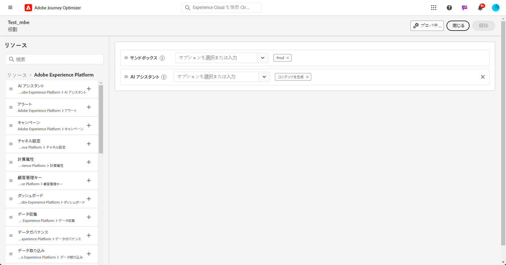

# AI アシスタントのコンテンツアクセラレータの基本を学ぶ {#gs-content-assistant}

>[!CONTEXTUALHELP]
>id="ajo_ai_generation_settings"
>title="Journey Optimizer の AI アシスタントコンテンツアクセラレータ"
>abstract="配信を作成してパーソナライズしたら、Journey Optimizer で AI アシスタントコンテンツアクセラレータを使用してコンテンツを強化できます。この機能により、何を生成するかを記述することで、コンテンツを微調整できるので、パーソナライゼーションとコンテンツの改善のプロセスが簡素化されます。"

>[!CONTEXTUALHELP]
>id="ajo_ai_generation_context"
>title="ブランドアセットをアップロード"
>abstract="ブランドアセットをアップロードメニューを使用すると、Journey Optimizer の AI アシスタントコンテンツアクセラレータに追加のコンテキストを提供できるコンテンツを含むブランドアセットを追加するか、以前にアップロードしたアセットを選択することができます。このオプションにより、AI アシスタントは機能と関連性を高めるために必要なすべての資料にアクセスできます。"

>[!CONTEXTUALHELP]
>id="ajo_ai_generation_start"
>title="Adobe 生成 AI 用語"
>abstract="この機能にアクセスするには、Adobe Experience Cloud 生成 AI ユーザーガイドラインに同意する必要があります。この機能からの出力の正確性を確認し、ユースケースに適していることを確認してください。"
>additional-url="https://www.adobe.com/legal/licenses-terms/adobe-dx-gen-ai-user-guidelines.html" text="Adobe 生成 AI ユーザーガイドライン"

>[!INFO]
>
>[ライブ機能プレビュー](https://experienceleague.adobe.com/ja/apps/journey-optimizer/ai-assistant-content-accelerator){target="_blank"}で実際のエクスペリエンスに浸りましょう。このプレビューは、その機能を直接探索し、その機能を完全に理解できるように設計されています。

Microsoft Azure OpenAI と Adobe Firefly を利用した Adobe Journey Optimizer の AI アシスタントコンテンツアクセラレータは、テキストと画像に対するプロアクティブなコンテンツバリエーションの提案を提供します。メール、プッシュ、SMS の各チャネルで使用できます。この新しい機能は、プロンプトベースのテキストおよび画像の生成を提供します。画像の生成は、Adobe Firefly で管理されます。

Adobe Journey Optimizer の AI アシスタントコンテンツアクセラレータを使用して、様々なメインタイトルや画像を試すことで、メッセージの影響を最適化します。複数のバリアントを生成し、それらを比較する実験を作成します。Journey Optimizer のコンテンツ実験を使用すると、ターゲットオーディエンスに最適なパフォーマンスを発揮するのはどれかを測定するために、複数のメッセージ処理を定義できます。配信コンテンツまたは件名を変更できます。メッセージオーディエンスが各処理にランダムに割り当てられて、指定の指標に関して最も効果が高い処理が判断されます。コンテンツ実験について詳しくは、[この節](../content-management/content-experiment.md)を参照してください。

>[!IMPORTANT]
>
>* この機能の使用を開始する前に、関連する[ガードレールと制限](#generative-guardrails)のトピックに目を通してください。
>
>
>* Adobe Journey Optimizer で AI アシスタントコンテンツアクセラレータを使用する前に、[ユーザー契約](https://www.adobe.com/legal/licenses-terms/adobe-dx-gen-ai-user-guidelines.html){target="_blank"}に同意する必要があります。詳しくは、アドビ担当者にお問い合わせください。

## AI アシスタントのコンテンツアクセラレータへのアクセス {#generative-access}

Adobe Journey Optimizer の AI アシスタントコンテンツアクセラレータ機能にアクセスするには、ユーザーに&#x200B;**コンテンツの生成**&#x200B;権限を付与する必要があります。[詳細情報](../administration/permissions.md)

+++  コンテンツ生成関連の権限を割り当てる方法について説明します。

1. **権限**&#x200B;付きの製品で、「**役割**」タブに移動し、目的の「**役割**」を選択します。

1. 「**編集**」をクリックして、権限を変更します。

1. **AI アシスタント**&#x200B;のリソースを追加し、ドロップダウンメニューから「**コンテンツを生成**」を選択します。

   {zoomable="yes"}

1. 「**保存**」をクリックして、変更を適用します。

   この役割に既に割り当てられているユーザーの権限は、自動的に更新されます。

1. この役割を新しいユーザーに割り当てるには、**役割**&#x200B;ダッシュボード内の「**ユーザー**」タブに移動し、「**ユーザーを追加**」をクリックします。

1. ユーザーの名前、メールアドレスを入力するか、リストから選択して、「**保存**」をクリックします。

1. まだユーザーを作成していない場合は、[このドキュメント](https://experienceleague.adobe.com/ja/docs/experience-platform/access-control/abac/permissions-ui/users)を参照してください。

ユーザーは、インスタンスにアクセスする手順が記載されたメールを受信します。

+++

## ガードレールと制限 {#generative-guardrails}

メールの生成に Adobe Journey Optimizer の AI アシスタントコンテンツアクセラレータを使用する際の一般的なガイドラインは次のとおりです。

* 生成されるコンテンツの品質は、定義したマーケティング目的/プロンプトの影響を強く受けます。 生成 AI モデルが正確に解釈できるように、明確に定義されたプロンプトを使用します。 
* 正確な情報が得られるように、ブランドコンテンツでブランドアセットをアップロードします。それ以外の場合、コンテンツは、公開されている情報に基づきます。アップロードされるコンテンツの形式は、PDF、JPEG、PNG、ZIP ファイル（サポートされているファイル形式を含む）のいずれかです。
* アップロードされるブランドアセットの最大サイズは 50 MB です。サイズの大きいファイルや多数の画像を処理できますが、処理時間は長くなります。
* ブランド固有またはカスタムテンプレートを使用して、Adobe Journey Optimizer の AI アシスタントコンテンツアクセラレータを使用してメールコンテンツを作成します。最大 8〜10 個の画像を含むメールテンプレートをお勧めします。
* バリアントを選択する際は、サムアップ、サムダウンまたはフラグのアイコンを使用して、問題のある出力を報告する必要があります。
* AI アシスタントの使用には、Adobe Experience Cloud 生成 AI ユーザーガイドラインが適用されます。[詳細情報](https://www.adobe.com/legal/licenses-terms/adobe-dx-gen-ai-user-guidelines.html)
* メディア作成で生成 AI ツールを使用する際の透明性を促進するアドビの取り組みの一環として、アドビは、Firefly 生成アセットを含むコンテンツまたはプロジェクトのダウンロードまたは書き出し時に、コンテンツ認証情報を適用します。[詳細情報](https://helpx.adobe.com/jp/firefly/using/content-credentials.html)

Adobe Journey Optimizer の AI アシスタントコンテンツアクセラレータには、次の制限が適用されます。

* サポート対象の言語は英語のみです。英語以外の入力では、一貫性のない結果や誤った結果が生成される可能性があります。英語以外の応答によって生じる問題については、現時点では対処または改善の予定はありません。
* メール、プッシュ、web、SMS チャネルでのみ使用できます。
* 生成 AI コンテンツは必ずしも正確ではない可能性があります。エンジニアがモデルを改良できるよう、フィードバックをお寄せください。
* 複数のブランドアセットをアップロードできますが、特定の世代に活用できるのは 1 つだけです。

## AI アシスタントのコンテンツ生成機能 {#generative-features}

<table style="table-layout:fixed"><tr style="border: 0;">
<td>

<a href="generative-email.md"><strong>メールの生成</strong></a>

</td>
<td>

<a href="generative-sms.md"><strong>SMS の生成</strong>

</td>
<td>

<a href="generative-push.md"><strong>プッシュ通知の生成</strong></a>

</td>
<td>

<a href="generative-web.md"><strong>Web ページの生成</strong>

</td>
</tr></table>
