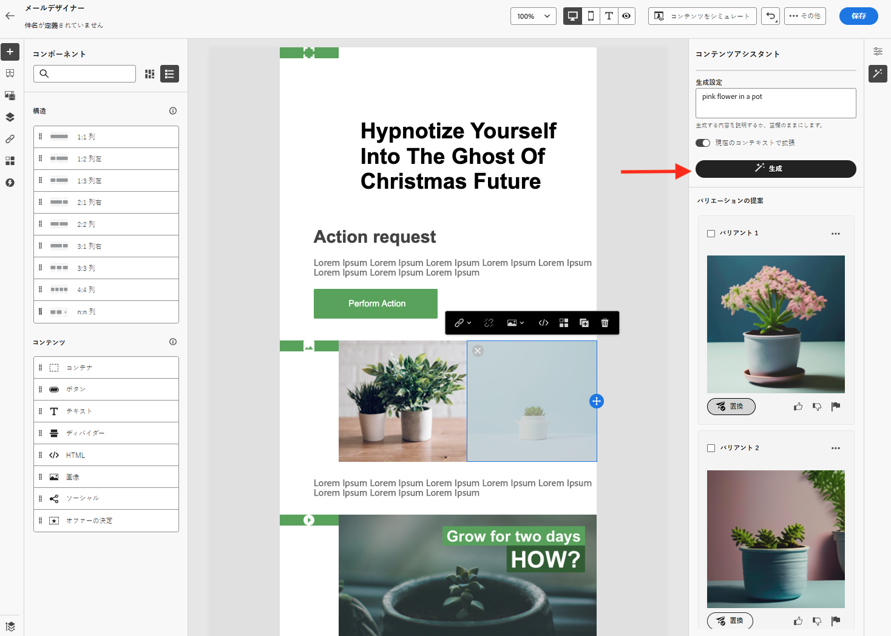

# AI アシスタントの概要 {#gs-content-assistant}

>[!CONTEXTUALHELP]
>id="ajo_content_generation"
>title="メールコンテンツを作成"
>abstract="Adobeジャーニー最適化 AI アシスタントは、テキストや画像に対して事前にコンテンツのバリエーションを提案する機能を提供します。 メール、プッシュ、SMS および web の各チャネルで使用できます。この新しい機能は、プロンプトベースのテキストおよび画像の生成を提供します。"

>[!BEGINSHADEBOX]

**目次**

* **[AI アシスタントの概要](gs-generative.md)**
* [AI アシスタントを使用してテキストを生成](generative-content.md)
* [AI アシスタントを使用して画像を生成](generative-image.md)

>[!ENDSHADEBOX]

Adobe Journey Optimizer AI Assistant は、テキストや画像に対して、コンテンツのバリエーションに関する事前の提案を提供します。 メール、プッシュ、SMS および web の各チャネルで使用できます。この新しい機能は、プロンプトベースのテキストおよび画像の生成を提供します。画像の生成は、Adobe Firefly で管理されます。

Journey Optimizerの AI Assistant を使用して、様々なメインタイトルや画像を試し、メッセージの影響を最適化します。 複数のバリアントを生成し、それらを比較する実験を作成します。Journey Optimizer のコンテンツ実験を使用すると、ターゲットオーディエンスに最適なパフォーマンスを発揮するのはどれかを測定するために、複数のメッセージ処理を定義できます。配信コンテンツまたは件名を変更できます。メッセージオーディエンスが各処理にランダムに割り当てられて、指定の指標に関して最も効果が高い処理が判断されます。コンテンツ実験について詳しくは、[この節](../campaigns/content-experiment.md)を参照してください。

>[!AVAILABILITY]
>
>Adobe Journey Optimizer AI Assistant は、現在、一部のユーザーに対してのみベータ版として利用できます。 ベータ版プログラムに参加するには、アドビカスタマーケアにお問い合わせください。
