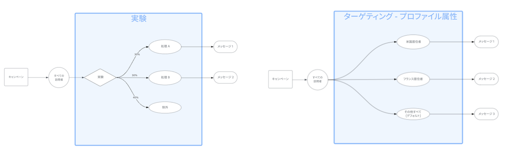

# コンテンツの最適化の基本を学ぶ {#message-optimization}

>[!CONTEXTUALHELP]
>id="ajo_campaigns_content_optimization"
>title="コンテンツの最適化"
>abstract="Journey Optimizer のコンテンツの最適化を使用すると、様々なバージョンのコンテンツをテストして、最も効果が高いバージョンを判断できます。 ターゲティングを使用して、パーソナライズされたコンテンツを特定のセグメントに提供したり、実験を使用して複数のバリエーションをテストしたり、両方のアプローチを組み合わせて洗練された最適化戦略を構築したりできます。"

コンテンツの最適化は、適切なオーディエンスにタイミングよく適切なメッセージを配信するためのツールを提供します。 データ主導のインサイトと強力なパーソナライゼーション機能を組み合わせることで、キャンペーンやジャーニーをまたいでエンゲージメントとコンバージョンを最大化できます。

コンテンツの最適化は、[ キャンペーン ](../campaigns/create-campaign.md)と[ ジャーニー](../building-journeys/journey-gs.md)の両方で利用でき、すべての顧客接点に同じ最適化戦略を適用できます。

➡️ [ キャンペーン内でコンテンツ最適化を活用する方法については、このビデオをご覧ください](#video)

## 最適化機能 {#capabilities}

Journey Optimizerのコンテンツの最適化機能を利用すれば、次のことが可能になります。

* [ ターゲティング ](optimization-targeting.md)を使用して、プロファイル属性、コンテキストデータ、オーディエンスメンバーシップに基づいて、特定のオーディエンスセグメントにパーソナライズされたコンテンツを配信します。

* [実験](optimization-experimentation.md)を実行して、複数のコンテンツのバリエーションをテストし、成功指標にもとづいて最もパフォーマンスの高いコンテンツを特定します。

* [両方のアプローチを組み合わせて](optimization-combination.md)高度な最適化戦略を作成し、ターゲットセグメントごとに異なるバリエーションをテストします。

## ターゲティングと実験 {#targeting-vs-experimentation}

ターゲティングと検証の違いを把握することで、自社の目標に最適な最適化アプローチを選択することができます。

**ターゲティング**&#x200B;は、決定性ルールを使用して、既知のプロファイル属性、コンテキスト、またはオーディエンスメンバーシップに基づいて、特定のセグメントにパーソナライズされたコンテンツを配信します。 これにより、適切なメッセージを的確なオーディエンスに届けることができます。

**実験**&#x200B;では、ランダム割り当てを使用して、複数のコンテンツのバリエーションをテストし、最もパフォーマンスの高いものを見つけ出します。 データドリブン型テストを通じて、オーディエンスの心に最も響くものを学ぶことができます。

主な違いを次の表にまとめました。

| 機能 | ターゲティング | 実験 |
|--------|-----------|-----------------|
| **割り当て方法** | 決定性 – ルールに基づく | ランダム – トラフィック配分に基づく |
| **元** | プロファイル属性、コンテキスト、オーディエンス | ランダム分布 |
| **ユースケース** | 既知のセグメントに最適なコンテンツを配信 | 最も効果を発揮しているコンテンツを特定 |
| **例** | 場所ごとに異なるプロモーションを表示 | 2つの件名をテストして、どの件名がより多くの開封率を獲得するかを確認します |
| **最適な用途：** | Personalizationの大量運用 | 最適化と学習 |

{width="110%" zoomable="yes"}

## よくあるユースケース {#use-cases}

ここでは、コンテンツの最適化がより優れた成果を達成する典型的なシナリオをいくつか紹介します。

ターゲティング：

* **地域ターゲット設定** – 顧客の所在地に基づいて、地域固有のオファーを送信します。 例えば、寒い地域では冬用のコート、暖かい気候では水着を宣伝します。

* **デバイスの最適化** - デスクトップユーザー向けのデスクトップ向けレイアウトや、スマートフォンユーザー向けのモバイル向けレイアウトなど、デバイス固有のコンテンツを配信します。

実験：

* **A/B テスト** – 様々なメールの件名、call-to-actionボタン、プロモーションオファーをテストして、コンバージョンに最も貢献している要素を見つけ出します。

* **ライフサイクルマーケティング** – 新規顧客向けの異なるオンボーディングメッセージと既存顧客向けのリテンションオファーをテストします。

コンビネーション：

* **高度なセグメンテーション** - ロイヤルティ階層別に顧客をターゲティングし、各階層内で異なる報酬メッセージをテストして、すべてのセグメントをまたいでエンゲージメントを最大化します。

## 基本を学ぶ {#get-started}

コンテンツの最適化を開始するには、次の手順に従います。

1. **キャンペーンまたはジャーニーを作成**: [ キャンペーン ](../campaigns/create-campaign.md)または[ ジャーニー](../building-journeys/journey-gs.md)を設定し、少なくとも1つのアクションを追加します。

1. **最適化アプローチを選択**:
   * [ ターゲティング ](optimization-targeting.md)を使用して、特定のセグメントのコンテンツをパーソナライズします。
   * [実験](optimization-experimentation.md)を使用して、複数のバリエーションをテストします。
   * [両方を組み合わせて](optimization-combination.md)高度な最適化を行います。

1. **コンテンツを定義**：最適化戦略のために様々なコンテンツバリエーションを作成します。

1. **アクティブ化して監視**：最適化されたキャンペーンまたはジャーニーを開始し、[ レポート ](../reports/campaign-global-report-cja.md)でパフォーマンスを追跡します。

## 仕組み {#how-it-works}

ジャーニーやキャンペーンが開始されると、プロファイルは定義した基準に照らして評価されます。 これらの評価にもとづいて、各プロファイルは最も適切なコンテンツバージョンを受け取ります。

1. **プロファイルの評価** - プロファイルがキャンペーンまたはジャーニーに入ると、Journey Optimizerはそのプロファイルの属性とコンテキストを評価します。

1. **コンテンツ割り当て** – 最適化設定に基づいて：
   * **ターゲティング**&#x200B;の場合、特定の条件に一致するプロファイルには、対応するパーソナライズされたコンテンツが表示されます。
   * **実験**&#x200B;の場合、プロファイルは、トラフィック割り当て設定に基づいて、様々なコンテンツバリエーションにランダムに割り当てられます。
   * **組み合わせ**&#x200B;の場合、プロファイルは最初にターゲティングルールに一致し、そのセグメントの実験バリエーションのいずれかにランダムに割り当てられます。

1. **パフォーマンストラッキング** - Journey Optimizerは、エンゲージメント指標とコンバージョンデータを自動的に追跡し、最もパフォーマンスが高いコンテンツを特定するのに役立ちます。

## チュートリアルビデオ {#video}

実際にコンテンツを最適化する方法や、API トリガーキャンペーンを活用する方法をご確認ください。 サブオーディエンスをターゲットにする方法、場所ごとにメッセージのバリエーションを作成する方法、フォールバックコンテンツを有効にする方法、単一のキャンペーン内で複数の実験を実行する方法について説明します。 また、このチュートリアルでは、メッセージの一貫性を維持しながらマルチチャネルキャンペーンを管理する方法についても説明します。

>[!VIDEO](https://video.tv.adobe.com/v/3470368?quality=12)

**関連トピック**

* [キャンペーンの作成](../campaigns/create-campaign.md)
* [ジャーニーの作成](../building-journeys/journey-gs.md)
* [コンテンツ実験](../content-management/get-started-experiment.md)
