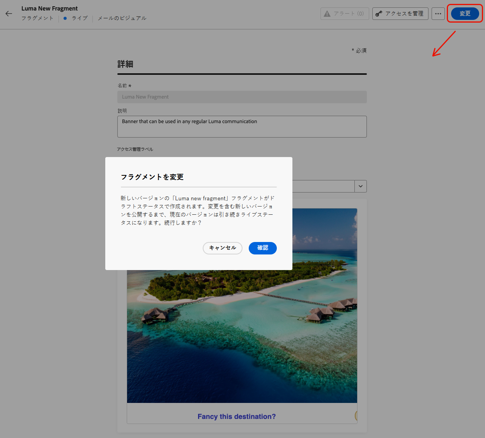

# 公開済みのフラグメントへのコンテキスト属性の追加 {#adding-contextual-attributes}

>[!AVAILABILITY]
>
>この機能は一部の顧客のみが利用でき、重大なリスクを伴います。 Adobeの担当者に、この機能が自社で有効になっていることを確認します。

デフォルトでは、公開されたフラグメントに新しい[ パーソナライゼーション属性](../personalization/personalization-build-expressions.md)を追加することはサポートされていません。 フラグメントが公開されると、すべてのキャンペーンとジャーニーに対して、プロファイルまたはコンテキスト属性のセットがロックされます。

ただし、一部のお客様の場合は、公開されたフラグメントにのみ&#x200B;**コンテキスト属性**&#x200B;を追加できます。

>[!WARNING]
>
>公開されたフラグメントにパーソナライゼーション属性を追加する場合、検証プロセスの厳格さが低下し、エラーが検出されない可能性があります。 これにより、ジャーニーやキャンペーンをまたいで、そのフラグメントを大規模に使用しながら、意図しない破損が発生する可能性があります。

## ガードレールと制限 {#limitations}

* フラグメントを現在使用しているすべてのジャーニーとキャンペーンが、新しいコンテキスト属性を処理できることを確認します。
* プロファイル属性を公開フラグメントに追加することはできません。 コンテキスト属性のみがサポートされます。
* コンテキスト属性は、コードエディターに手動で入力する必要があります。パーソナライゼーションエディターUIから選択することはできません。
* パーソナライズされた属性をライブフラグメントに追加する場合、検証が緩和されるため、エラーが検出されず、意図しない破損が大規模に発生する可能性があります。
* 公開したエラーは、そのフラグメントを使用するすべてのコミュニケーションに直ちに影響します。

## コンテキスト属性の追加 {#add-contextual-attributes}

公開済みフラグメントにコンテキスト属性を追加するには、次の手順に従います。

>[!IMPORTANT]
>
>フラグメントを参照するジャーニーとキャンペーンへの影響[を完全に](#limitations)理解した場合にのみ続行します。

1. **[!UICONTROL コンテンツ管理]** > **[!UICONTROL フラグメント]**&#x200B;に移動します。

1. 公開したフラグメントを選択し、**[!UICONTROL 変更]**&#x200B;をクリックしてドラフトバージョンを作成します。

   {width="70%" align="left"}

1. 「**[!UICONTROL 編集]**」をクリックして、フラグメントコンテンツエディターを開きます。

1. パーソナライゼーションエディターで&#x200B;**[!UICONTROL コードエディター]**&#x200B;または&#x200B;**[!UICONTROL 詳細モード]**&#x200B;に切り替えます。

1. `{{context.attribute_name}}`構文を使用して、コンテキスト属性を手動で入力またはコピー&amp;ペーストします。

   `promotionCode`属性の例：

   ```
   {{context.promotionCode}}
   ```

   >[!CAUTION]
   >
   >属性パスが正確かどうかを再確認します。 エラーは検出されず、ジャーニーやキャンペーンのコミュニケーションが大規模に中断される可能性があります。

1. 変更を保存します。

1. 確認したら、**[!UICONTROL 公開]**&#x200B;をクリックして、変更を公開します。

>[!NOTE]
>ジャーニーやキャンペーンをまたいで意図しない破損を回避するために、実稼動以外の環境でコンテキスト属性のパスをテストできます。

## 関連トピック {#related-topics}

* [フラグメントの管理](manage-fragments.md)
* [フラグメントの編集](manage-fragments.md#edit-fragments)
* [API トリガーキャンペーン](../campaigns/api-triggered-campaigns.md)
* [パーソナライゼーション構文](../personalization/personalization-syntax.md)
