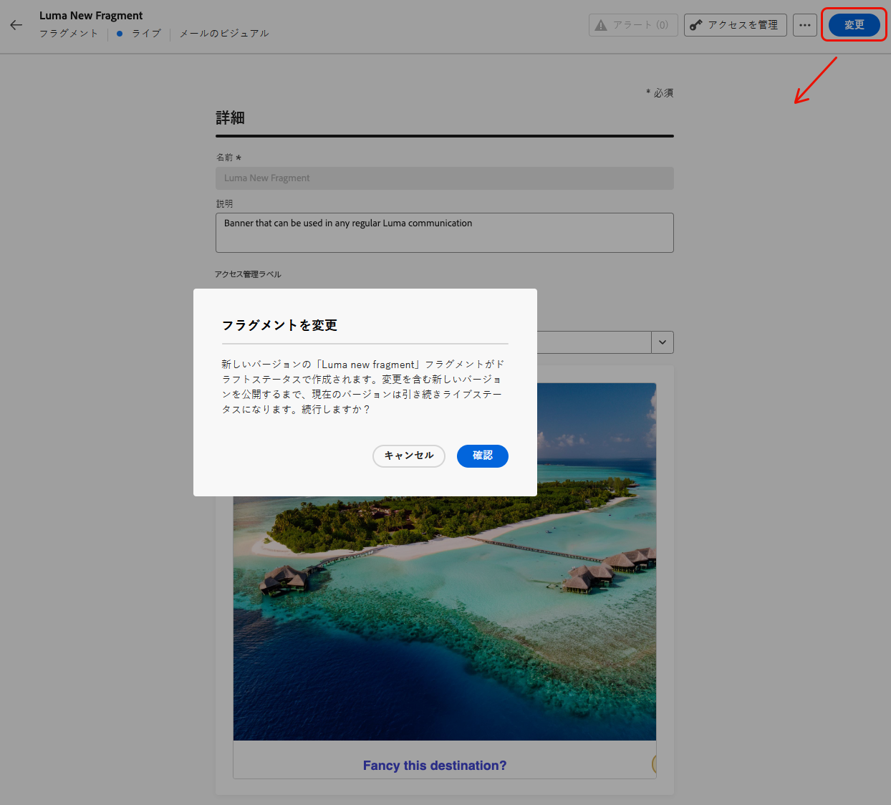

# 公開済みのフラグメントへのコンテキスト属性の追加 {#adding-contextual-attributes}

>[!AVAILABILITY]
>
>この機能は一部のお客様のみが利用でき、重大なリスクが伴います。 この機能が組織で有効になっていることをAdobe担当者に確認します。

デフォルトでは、公開されたフラグメントへの新しい [ パーソナライゼーション属性 ](../personalization/personalization-build-expressions.md) の追加はサポートされていません。 フラグメントが公開されると、すべてのキャンペーンおよびジャーニーで、一連のプロファイルまたはコンテキスト属性がロックされます。

ただし、一部の顧客については、公開済みのフラグメントにのみ **コンテキスト属性** を追加することが可能です。

>[!WARNING]
>
>公開されたフラグメントにパーソナライゼーション属性を追加すると、検証プロセスが緩やかに実行され、エラーが検出されない場合があります。 これにより、そのフラグメントを大規模に使用するジャーニーやキャンペーンで意図しない破損が生じる可能性があります。

## ガードレールと制限 {#limitations}

* フラグメントを現在使用しているすべてのジャーニーとキャンペーンが、新しいコンテキスト属性を処理できることを確認します。
* プロファイル属性は、公開済みのフラグメントには追加できません。 コンテキスト属性のみがサポートされています。
* コンテキスト属性は、コードエディターに手動で入力する必要があります。パーソナライゼーションエディター UI から選択することはできません。
* パーソナライズされた属性をライブフラグメントに追加すると、検証が緩められます。つまり、エラーが検出されず、意図しない破損が大規模に発生する可能性があります。
* 公開すると、エラーはそのフラグメントを使用するすべての通信に直ちに影響を与えます。

## コンテキスト属性の追加 {#add-contextual-attributes}

公開済みのフラグメントにコンテキスト属性を追加するには、次の手順に従います。

>[!IMPORTANT]
>
>フラグメントを参照するジャーニーとキャンペーンへの影響を十分に理解している場合にのみ続行します。 [詳細情報](#limitations)

1. **[!UICONTROL コンテンツ管理]**/**[!UICONTROL フラグメント]** に移動します。

1. 公開されたフラグメントを選択し、「**[!UICONTROL 変更]** をクリックしてドラフトバージョンを作成します。

   {width="70%" align="left"}

1. **[!UICONTROL 編集]** をクリックして、フラグメントコンテンツエディターを開きます。

1. パーソナライゼーションエディターで **[!UICONTROL コードエディター]** または **[!UICONTROL 詳細設定モード]** に切り替えます。

1. 次の構文を使用して、コンテキスト属性を手動で入力またはコピーして貼り付けます。

   ```
   {{context.attribute_name}}
   ```

   `promotionCode` 属性の例：

   ```
   {{context.promotionCode}}
   ```

   >[!CAUTION]
   >
   >属性パスが正しいかどうかを再確認します。 エラーは検出されない場合があり、ジャーニーやキャンペーンの大規模な通信に支障をきたす可能性があります。

1. 変更を保存します。

1. 確認したら、「**[!UICONTROL 公開]** をクリックして、変更をライブにします。

>[!NOTE]
>ジャーニーとキャンペーン間で意図しないブレークポイントを回避するために、実稼動以外の環境でコンテキスト属性パスをテストできます。

## 関連トピック {#related-topics}

* [フラグメントの管理](manage-fragments.md)
* [フラグメントの編集](manage-fragments.md#edit-fragments)
* [API トリガーキャンペーン](../campaigns/api-triggered-campaigns.md)
* [パーソナライゼーション構文](../personalization/personalization-syntax.md)

