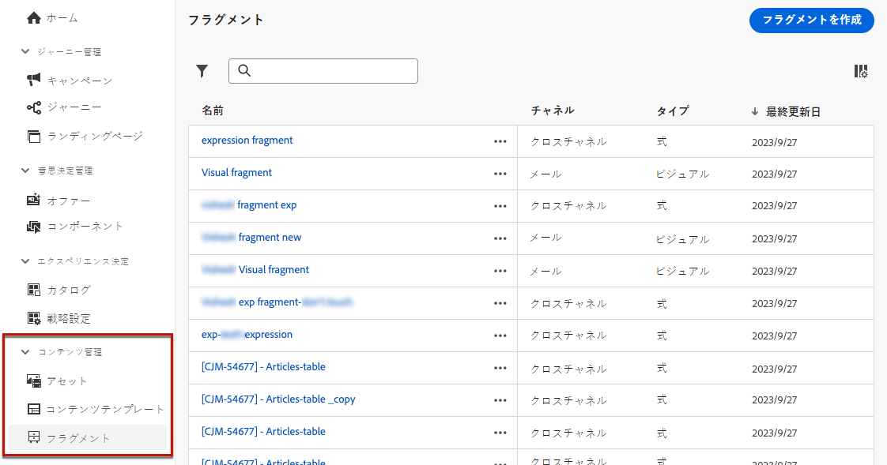
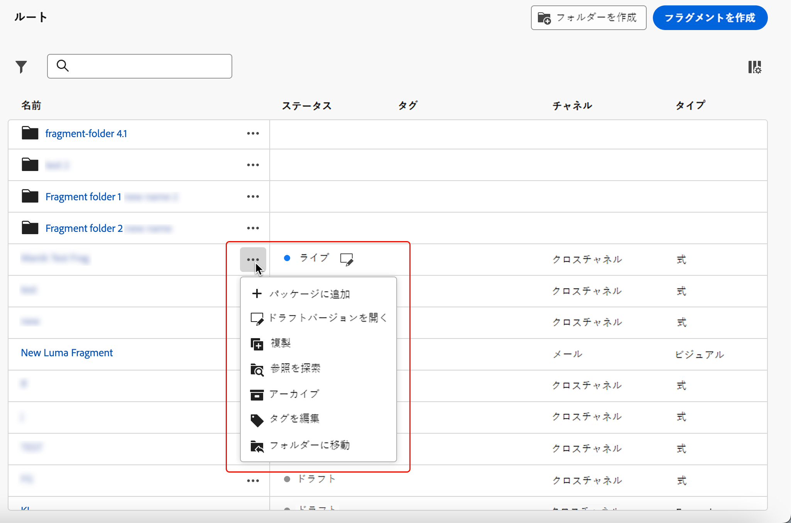
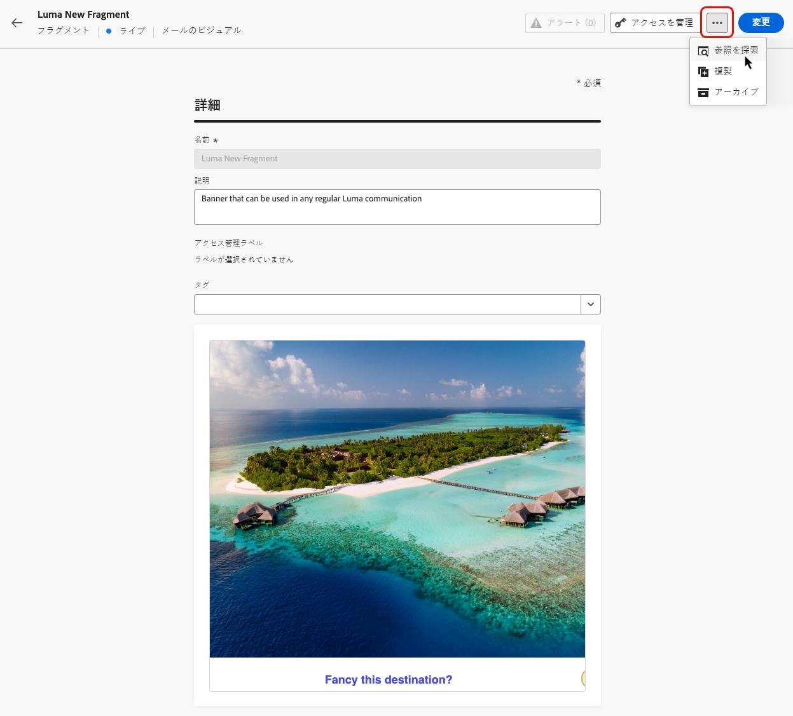
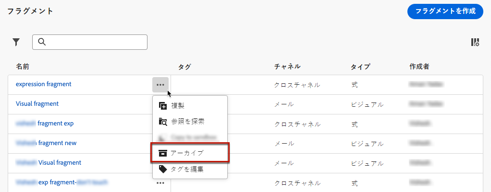

# フラグメントの管理 {#manage-fragments}

フラグメントを管理するには、からフラグメントリストにアクセスします **[!UICONTROL コンテンツ管理]** > **[!UICONTROL フラグメント]** 左メニュー。

現在のサンドボックスで作成されたすべてのフラグメント（[**[!UICONTROL フラグメント]**&#x200B;メニューから](#create-fragments)か、「[フラグメントとして保存](#save-as-fragment)」オプションを使用して）が表示されます。

次の項目でフラグメントをフィルタリングできます。

* タイプ：**[!UICONTROL ビジュアル]**&#x200B;または&#x200B;**[!UICONTROL 式]**
* タグ
* 作成日または変更日

すべてのフラグメントを表示するか、現在のユーザーが作成または変更した項目のみを表示するかを選択できます。

また、**[!UICONTROL アーカイブ済み]**&#x200B;フラグメントを表示することもできます。[詳細情報](#archive-fragments)

各フラグメントの横にある「**[!UICONTROL その他のアクション]**」ボタンから、次の操作を実行できます。

* フラグメントを複製します。

* 「**[!UICONTROL 参照を探索]**」オプションを使用して、使用されているジャーニー、キャンペーン、テンプレートを確認します。[詳細情報](#explore-references)

* フラグメントをアーカイブします。[詳細情報](#archive-fragments)

* フラグメントの[タグ](../start/search-filter-categorize.md#tags)を編集します。

## フラグメントの編集 {#edit-fragments}

フラグメントを編集するには、次の手順に従います。

1. **[!UICONTROL フラグメント]**&#x200B;リストから目的の項目をクリックします。
1. フラグメントのプロパティから、[参照の探索](#explore-references)、[そのアクセスの管理](../administration/object-based-access.md)および[タグ](../start/search-filter-categorize.md#tags)などのフラグメント詳細の更新を行えます。

   

1. フラグメントをゼロから作成する場合と同様に、対応するボタンを選択してコンテンツを編集します。[詳細情報](#create-from-scratch)

>[!NOTE]
>
>フラグメントを編集すると、**[!UICONTROL ライブ]**&#x200B;ジャーニーまたはキャンペーンで使用するコンテンツを除く、そのフラグメントを使用するすべてのコンテンツに変更が自動的に生成されます。また、元のフラグメントからの継承を解除することもできます。詳しくは、[メールへのビジュアルフラグメントの追加](../email/use-visual-fragments.md#break-inheritance)および[式フラグメントの活用](../personalization/use-expression-fragments.md#break-inheritance) の節を参照してください。

## 参照の探索 {#explore-references}

フラグメントを現在使用しているジャーニー、キャンペーン、コンテンツテンプレートのリストを表示できます。

これを行うには、フラグメントリストの&#x200B;**[!UICONTROL その他のアクション]**&#x200B;メニューまたはフラグメントのプロパティ画面から「**[!UICONTROL 参照を探索]**」を選択します。

タブを選択して、ジャーニー、キャンペーン、テンプレート、フラグメントを切り替えます。ステータスを確認し、名前をクリックすると、フラグメントが参照されている対応する項目にリダイレクトされます。

>[!NOTE]
>
>アクセスを妨げるラベルが付いているジャーニー、キャンペーン、テンプレートでフラグメントが使用されている場合、選択したタブの上部にアラートメッセージが表示されます。[オブジェクトレベルのアクセス制御（OLAC）について詳しくはこちらを参照してください](../administration/object-based-access.md)

## フラグメントのアーカイブ {#archive-fragments}

ブランドと関係がなくなった項目からフラグメントリストを削除できます。

これを行うには、目的のフラグメントの横にある「**[!UICONTROL その他のアクション]**」ボタンをクリックし、「**[!UICONTROL アーカイブ]**」を選択します。フラグメントリストから表示されなくなるので、今後のメールやテンプレートでユーザーはフラグメントを使用できなくなります。

>[!NOTE]
>
>コンテンツで使用しているフラグメントをアーカイブしても、<!--it will remain in the email or template, but you won't be able to select it from the fragment list to edit it-->そのコンテンツは影響を受けません。

フラグメントをアーカイブ解除するには、**[!UICONTROL アーカイブ済み]**&#x200B;項目をフィルタリングし、**[!UICONTROL その他のアクション]**&#x200B;メニューから「**[!UICONTROL アーカイブ解除]**」を選択します。これで、フラグメントリストから再びアクセスし、任意のメールまたはテンプレートで使用できるようになりました。

