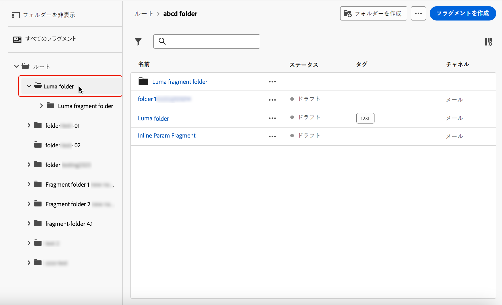
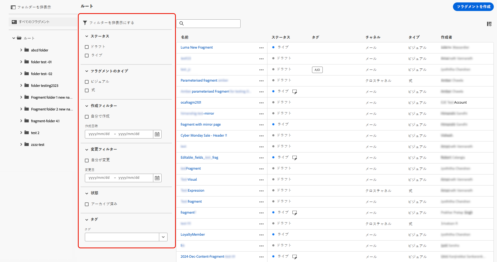
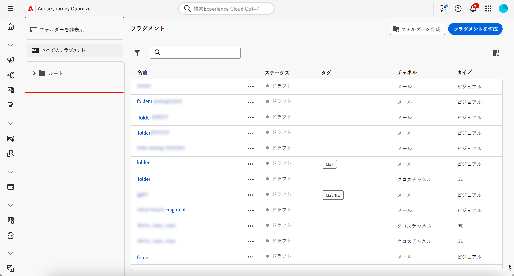
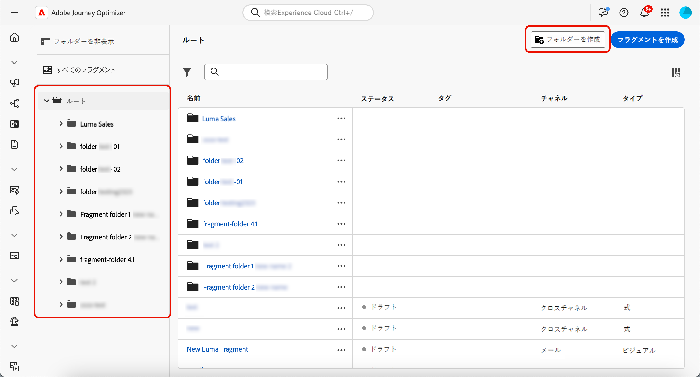
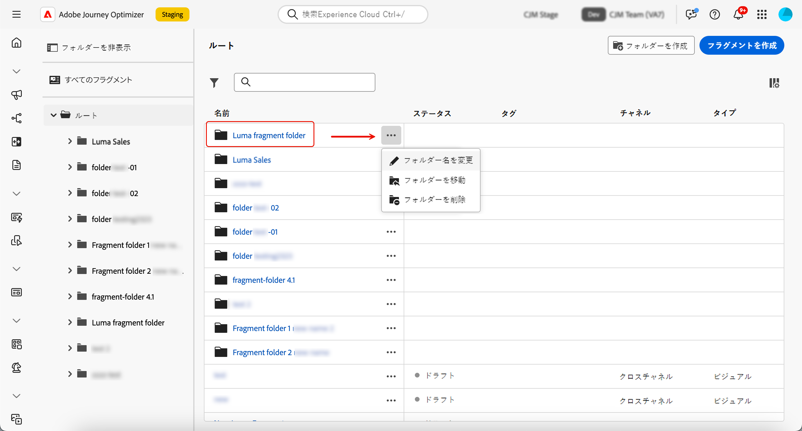
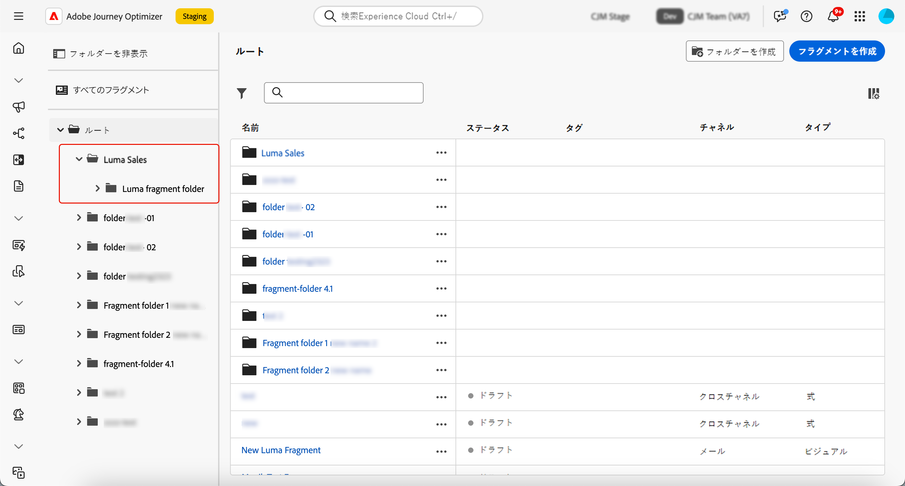
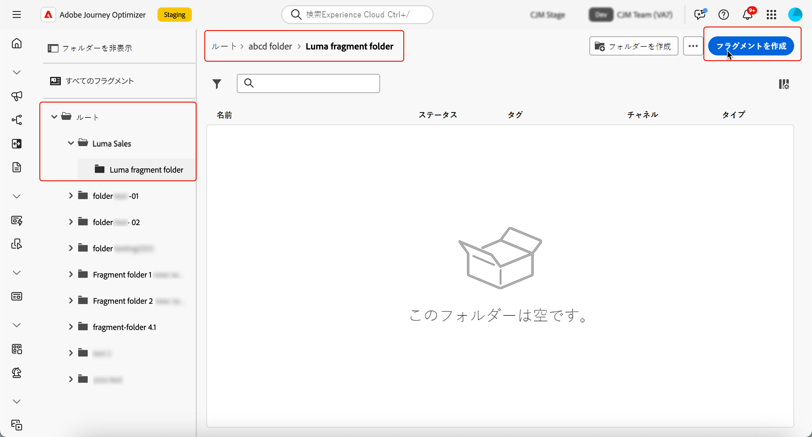

# フラグメントを管理 {#manage-fragments}

## フラグメントへのアクセス {#access-fragments}

フラグメントを管理するには、左側のメニューの&#x200B;**[!UICONTROL コンテンツ管理]**／**[!UICONTROL フラグメント]**&#x200B;からフラグメントリストにアクセスします。

現在のサンドボックスで作成されたすべてのフラグメント（[**[!UICONTROL フラグメント]**&#x200B;メニューから](#create-fragments)か、「[フラグメントとして保存](#save-as-fragment)」オプションを使用して）が表示されます。

左側のパネルでは、フラグメントをフォルダーに整理できます。デフォルトでは、すべてのフラグメントが表示されます。フォルダーを選択すると、選択したフォルダーに含まれるフラグメントとフォルダーのみが表示されます。[詳細情報](#folders)

特定の項目を検索するには、検索フィールドに名前を入力します。[フォルダー](#folders)を選択すると、このフォルダーの階層の最初のレベルにあるすべてのフラグメントまたはフォルダーに検索が適用されます<!--(not nested items)-->。

次の項目でフラグメントをフィルタリングできます。

* ステータス（ドラフトまたはライブ）
* タイプ（ビジュアルまたは式）
* 作成日または変更日
* 状態（アーカイブ済みかどうか）
* タグ

{width="90%" align="left"}

また、すべてのフラグメントを表示するか、現在のユーザーが作成または変更した項目のみを表示するかを選択することもできます。

各フラグメントの横にある「**[!UICONTROL その他のアクション]**」ボタンから、次の操作を実行できます。

* 書き出し用にパッケージに追加します。[詳細情報](#export)
* ライブフラグメントが編集されている場合は、このフラグメントのドラフトバージョンを開きます。[詳細情報](#edit-fragments)
* フラグメントを複製します。
* 「**[!UICONTROL 参照を探索]**」オプションを使用して、使用されているジャーニー、キャンペーン、テンプレートを確認します。[詳細情報](#explore-references)
* フラグメントをアーカイブします。[詳細情報](#archive-fragments)
* フラグメントのタグを編集します。[詳しくは、統合タグの操作方法を参照してください](../start/search-filter-categorize.md#tags)
* フラグメントをフォルダーに移動します。[詳細情報](#folders)

## フォルダーを使用したフラグメントの管理 {#folders}

>[!CONTEXTUALHELP]
>id="ajo_fragments_folders"
>title="フラグメントをフォルダーに整理します。"
>abstract="フォルダーを使用すると、組織のニーズに応じてフラグメントを分類および管理できます。"

フラグメントを簡単に移動するには、フォルダーを使用してフラグメントをより効果的に構造化された階層に整理します。これにより、組織のニーズに応じて項目を分類および管理できます。

1. 「**[!UICONTROL すべてのフラグメント]**」ボタンをクリックして、フォルダーのグループ化を使用せずに、以前に作成したすべての項目を表示します。

1. **[!UICONTROL ルート]**&#x200B;フォルダーをクリックして、作成したすべてのフォルダーを表示します。

   >[!NOTE]
   >
   >フォルダーをまだ作成していない場合は、すべてのフラグメントが表示されます。

1. **[!UICONTROL ルート]**&#x200B;フォルダー内の任意のフォルダーをクリックして、そのコンテンツを表示します。

1. **[!UICONTROL ルート]**&#x200B;フォルダーまたは他のフォルダーをクリックすると、「**[!DNL Create folder]**」ボタンが表示されます。これを選択します。

   

1. 新しいフォルダーの名前を入力し、「**[!UICONTROL 保存]**」をクリックします。新しいフォルダーは、**[!UICONTROL ルート]**&#x200B;フォルダー内や、現在選択されているフォルダー内のフラグメントリストの上部に表示されます。

1. 「**[!UICONTROL その他のアクション]**」ボタンをクリックして、フォルダーの名前を変更または削除できます。

   

1. 「**[!UICONTROL その他のアクション]**」ボタンを使用すると、フラグメントを別の既存のフォルダーに移動することもできます。

   <!---->

1. これで、作成したフォルダーに移動できます。ここから[作成](create-fragments.md)した新しいフラグメントはそれぞれ現在のフォルダーに保存されます。

   

## フラグメントのステータス {#fragments-statuses}

>[!CONTEXTUALHELP]
>id="ajo_fragment_statuses"
>title="新しいフラグメントのステータス"
>abstract="**ドラフト**&#x200B;および&#x200B;**ライブ**&#x200B;ステータスは、Journey Optimizer の 6 月リリースで導入されたので、このリリースより前に作成されたすべてのフラグメントは、ジャーニーやキャンペーンで使用された場合でも、**ドラフト**&#x200B;ステータスになります。これらのフラグメントに変更を加えた場合は、それらを公開して&#x200B;**ライブ**&#x200B;にし、関連するキャンペーンとジャーニーにその変更を反映する必要があります。また、新しいジャーニー／キャンペーンのバージョンを作成し、公開する必要もあります。 公開には、<a href="https://experienceleague.adobe.com/ja/docs/journey-optimizer/using/access-control/privacy/ootb-product-profiles#content-library-manage">フラグメントを公開</a>するユーザー権限が必要です。"
>additional-url="https://experienceleague.adobe.com/ja/docs/journey-optimizer/using/access-control/privacy/ootb-product-profiles#content-library-manager" text="詳しくは、コンテンツフラグメント権限を参照してください"

フラグメントには複数のステータスがあります。

* **[!UICONTROL ドラフト]**：フラグメントは編集中で、承認されていません。

* **[!UICONTROL ライブ]**：フラグメントは承認され、ライブになっています。[詳しくは、フラグメントの公開方法を参照してください](../content-management/create-fragments.md#publish)

  ライブフラグメントが編集中の場合、そのステータスの横に特定のアイコンが表示されます。このアイコンをクリックして、フラグメントのドラフトバージョンを開きます。

* **[!UICONTROL 公開中]**：フラグメントは承認され、公開中です。
* **[!UICONTROL アーカイブ済み]**：フラグメントはアーカイブされています。[詳しくは、フラグメントのアーカイブ方法を参照してください](#archive-fragments)

>[!CAUTION]
>
>**ドラフト**&#x200B;および&#x200B;**ライブ**&#x200B;ステータスは、Journey Optimizer の 6 月リリースで導入されたので、このリリースより前に作成されたすべてのフラグメントは、ジャーニーやキャンペーンで使用された場合でも、**ドラフト**&#x200B;ステータスになります。これらのフラグメントに変更を加えた場合は、それらを公開して&#x200B;**ライブ**&#x200B;にし、関連するキャンペーンとジャーニーにその変更を反映する必要があります。また、新しいジャーニー／キャンペーンのバージョンを作成し、公開する必要もあります。公開には、[フラグメントを公開](../administration/ootb-product-profiles.md#content-library-manager)するユーザー権限が必要です。

## フラグメントの編集 {#edit-fragments}

>[!CONTEXTUALHELP]
>id="ajo_fragments_update_campaigns"
>title="キャンペーンのフラグメント更新"
>abstract="フラグメントに対する変更を公開しても、このキャンペーンは更新されません。フラグメント更新機能をサポートするには、新しいバージョンを公開する必要があります。"

>[!CONTEXTUALHELP]
>id="ajo_fragments_update_journeys"
>title="ジャーニーのフラグメント更新"
>abstract="フラグメントに対する変更を公開しても、このジャーニーは更新されません。フラグメント更新機能をサポートするには、新しいバージョンを公開する必要があります。"

フラグメントを編集するには、次の手順に従います。

1. **[!UICONTROL フラグメント]**&#x200B;リストから目的のフラグメントをクリックします。フラグメントのプロパティ画面が開き、そのコンテンツのプレビューが表示されます。

1. 現在そのフラグメントを使用しているジャーニー、キャンペーン、コンテンツテンプレートのリストを確認できます。これを行うには、「その他のアクション」ボタンから「**[!UICONTROL 参照を探索]**」オプションを選択します。[詳細情報](#explore-references)

1. 編集中のフラグメントのステータスが&#x200B;**[!UICONTROL ライブ]**&#x200B;の場合は、「**[!UICONTROL 変更]**」ボタンをクリックしてフラグメントのドラフトバージョンを作成します。「**[!UICONTROL 確認]**」をクリックします。

   {width="70%" align="left"}

   >[!NOTE]
   >
   >新しい更新済みのバージョンを公開するまで、フラグメントの現在のバージョンは引き続きライブになります。

1. 必要に応じて、フラグメントの詳細に対して必要な変更を行います。

1. フラグメントのコンテンツを変更するには、「**[!UICONTROL 編集]**」ボタンをクリックし、フラグメントをゼロから作成する場合と同様にコンテンツを更新します。[詳しくは、フラグメントの作成方法を参照してください](create-fragments.md#content)

   {width="70%" align="left"}

   >[!NOTE]
   >
   >公開済みのフラグメントを編集する際、パーソナライゼーションフィールドは削除できますが、フラグメントコンテンツに新しいフィールドを追加することはできません。パーソナライズされた属性を追加する場合は、フラグメントを複製する必要があります。[詳細情報](#adding-new-attributes)

1. 変更の準備が整ったら、変更を保存し、「**[!UICONTROL 公開]**」ボタンをクリックして変更をライブにします。[詳細情報](create-fragments.md#publish)

フラグメントを編集する際、元のフラグメントからの継承が解除されたコンテンツを除き、ライブジャーニーやキャンペーンなど、そのフラグメントを使用するすべてのコンテンツに変更が自動的に生成されます。

>[!NOTE]
>
>継承の解除方法について詳しくは、[メールへのビジュアルフラグメントの追加](../email/use-visual-fragments.md#break-inheritance)および[式フラグメントの活用](../personalization/use-expression-fragments.md#break-inheritance)の節を参照してください。

### ライブフラグメントへの新しい属性の追加 {#adding-new-attributes}

>[!WARNING]
>
>ライブフラグメントへの新しい[パーソナライズされた属性](../personalization/personalization-build-expressions.md)の追加はサポートされていません。

フラグメントを公開すると、参照するすべてのキャンペーンとジャーニーに対して、パーソナライズされた属性またはコンテキスト属性の設定がロックされます。

ライブフラグメントに追加の属性を組み込むには、次の手順に従います。

1. 「**[!UICONTROL その他のアクション]**」ボタンを使用して、既存のフラグメントを複製します。

   {width="70%" align="left"}

1. 複製したフラグメントを選択して開き、「**[!UICONTROL 編集]**」ボタンをクリックします。

1. 複製したフラグメントに、パーソナライゼーションフィールドなどの[新しい目的の属性を追加](../personalization/personalization-build-expressions.md#add)します。

   {width="70%" align="left"}

1. 変更を保存し、新しいフラグメントを公開します。[方法について詳しくは、こちらを参照してください](create-fragments.md#publish)

1. 新しい属性を追加した、更新済みのフラグメントを参照するように、キャンペーンまたはジャーニーを更新します。

   * [ビジュアルフラグメントの使用方法を学ぶ](../email/use-visual-fragments.md)
   * [式フラグメントの使用方法を学ぶ](../personalization/use-expression-fragments.md)

## 参照の探索 {#explore-references}

フラグメントを現在使用しているジャーニー、キャンペーン、コンテンツテンプレートのリストを表示できます。これを行うには、フラグメントリストの&#x200B;**[!UICONTROL その他のアクション]**&#x200B;メニューまたはフラグメントのプロパティ画面から「**[!UICONTROL 参照を探索]**」を選択します。

{width="70%" align="left"}

タブを選択して、ジャーニー、キャンペーン、テンプレート、フラグメントを切り替えます。ステータスを確認し、名前をクリックすると、フラグメントが参照されている対応する項目にリダイレクトされます。

{width="70%" align="left"}

>[!NOTE]
>
>アクセスを妨げるラベルが付いているジャーニー、キャンペーン、テンプレートでフラグメントが使用されている場合、選択したタブの上部にアラートメッセージが表示されます。[オブジェクトレベルのアクセス制御（OLAC）についての詳細情報](../administration/object-based-access.md)

## フラグメントのアーカイブ {#archive-fragments}

ブランドと関係がなくなった項目からフラグメントリストを削除できます。

これを行うには、目的のフラグメントの横にある「**[!UICONTROL その他のアクション]**」ボタンをクリックし、「**[!UICONTROL アーカイブ]**」を選択します。フラグメントリストから表示されなくなるので、今後のメールやテンプレートでユーザーはフラグメントを使用できなくなります。

{width="70%" align="left"}

>[!NOTE]
>
>コンテンツで使用しているフラグメントをアーカイブしても、<!--it will remain in the email or template, but you won't be able to select it from the fragment list to edit it-->そのコンテンツは影響を受けません。

フラグメントをアーカイブ解除するには、**[!UICONTROL アーカイブ済み]**&#x200B;項目をフィルタリングし、**[!UICONTROL その他のアクション]**&#x200B;メニューから「**[!UICONTROL アーカイブ解除]**」を選択します。これで、フラグメントリストから再びアクセスし、任意のメールまたはテンプレートで使用できるようになりました。

{width="70%" align="left"}

## 別のサンドボックスへのフラグメントの書き出し {#export}

Journey Optimizer では、1 つのサンドボックスから別のサンドボックスにフラグメントをコピーできます。例えば、ステージサンドボックス環境から実稼動サンドボックスにフラグメントをコピーできます。

コピープロセスは、ソースサンドボックスとターゲットサンドボックス間の&#x200B;**パッケージの書き出しおよび読み込み**&#x200B;を介して実行されます。オブジェクトを書き出してターゲットサンドボックスに読み込む方法について詳しくは、[別のサンドボックスへのオブジェクトのコピー](../configuration/copy-objects-to-sandbox.md)の節を参照してください。
