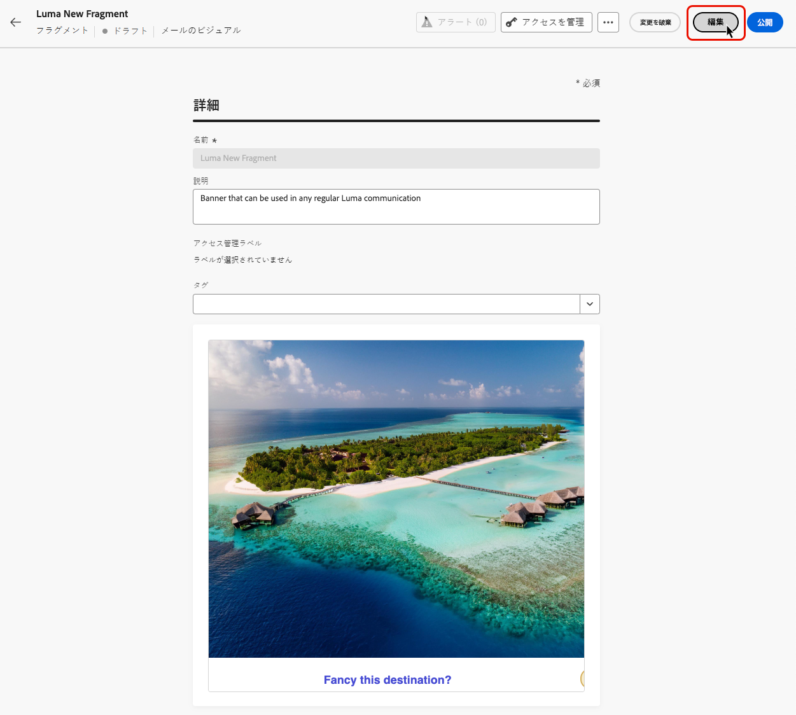
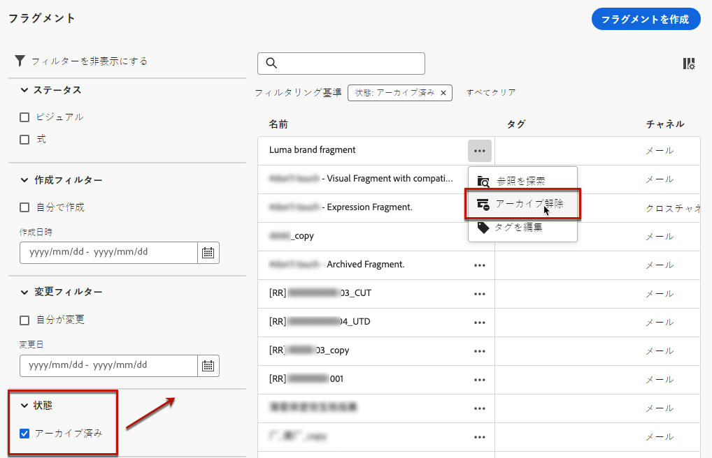

# フラグメントを管理 {#manage-fragments}

フラグメントを管理するには、左側のメニューの&#x200B;**[!UICONTROL コンテンツ管理]**／**[!UICONTROL フラグメント]**&#x200B;からフラグメントリストにアクセスします。

現在のサンドボックスで作成されたすべてのフラグメント（[**[!UICONTROL フラグメント]**&#x200B;メニューから](#create-fragments)か、「[フラグメントとして保存](#save-as-fragment)」オプションを使用して）が表示されます。

次の項目でフラグメントをフィルタリングできます。

* ステータス（ドラフトまたはライブ）
* タイプ（ビジュアルまたは式）
* 作成日または変更日
* 状態（アーカイブ済みかどうか）
* タグ

また、すべてのフラグメントを表示するか、現在のユーザーが作成または変更した項目のみを表示するかを選択することもできます。

各フラグメントの横にある「**[!UICONTROL その他のアクション]**」ボタンから、次の操作を実行できます。

* フラグメントを複製します。
* 「**[!UICONTROL 参照を探索]**」オプションを使用して、使用されているジャーニー、キャンペーン、テンプレートを確認します。[詳細情報](#explore-references)
* フラグメントをアーカイブします。[詳細情報](#archive-fragments)
* フラグメントのタグを編集します。[詳しくは、統合タグの操作方法を参照してください](../start/search-filter-categorize.md#tags)。

## フラグメントのステータス

>[!CONTEXTUALHELP]
>id="ajo_fragment_statuses"
>title="新しいフラグメントのステータス"
>abstract="**ドラフト**&#x200B;および&#x200B;**ライブ**&#x200B;ステータスは、Journey Optimizer の 6 月リリースで導入されたので、このリリースより前に作成されたすべてのフラグメントは、ジャーニーやキャンペーンで使用された場合でも、「ドラフト」ステータスになります。これらのフラグメントに変更を加えた場合は、それらを公開して「ライブ」にし、関連するキャンペーンとジャーニーにその変更を反映する必要があります。また、新しいジャーニー／キャンペーンのバージョンを作成し、公開する必要もあります。 公開には、<a href="https://experienceleague.adobe.com/ja/docs/journey-optimizer/using/access-control/privacy/ootb-product-profiles#content-library-manage">フラグメントを公開</a>するユーザー権限が必要です。"
>additional-url="https://experienceleague.adobe.com/ja/docs/journey-optimizer/using/access-control/privacy/ootb-product-profiles#content-library-manager" text="詳しくは、コンテンツフラグメント権限を参照してください"

フラグメントには複数のステータスがあります。

* **[!UICONTROL ドラフト]**：フラグメントは編集中で、承認されていません。

* **[!UICONTROL ライブ]**：フラグメントは承認され、ライブになっています。[詳しくは、フラグメントの公開方法を参照してください](../content-management/create-fragments.md#publish)

  ライブフラグメントが編集中の場合、そのステータスの横に特定のアイコンが表示されます。このアイコンをクリックして、フラグメントのドラフトバージョンを開きます。

* **[!UICONTROL 公開中]**：フラグメントは承認され、公開中です。
* **[!UICONTROL アーカイブ済み]**：フラグメントはアーカイブされています。[詳しくは、フラグメントのアーカイブ方法を参照してください](#archive-fragments)

>[!CAUTION]
>
>**ドラフト**&#x200B;および&#x200B;**ライブ**&#x200B;ステータスは、Journey Optimizer の 6 月リリースで導入されたので、このリリースより前に作成されたすべてのフラグメントは、ジャーニーやキャンペーンで使用された場合でも、「ドラフト」ステータスになります。これらのフラグメントに変更を加えた場合は、それらを公開して「ライブ」にし、関連するキャンペーンとジャーニーにその変更を反映する必要があります。また、新しいジャーニー／キャンペーンのバージョンを作成し、公開する必要もあります。公開には、[フラグメントを公開](../administration/ootb-product-profiles.md#content-library-manager)するユーザー権限が必要です。

## フラグメントの編集 {#edit-fragments}

>[!CONTEXTUALHELP]
>id="ajo_fragments_update_campaigns"
>title="キャンペーンのフラグメント更新"
>abstract="フラグメントに対する変更を公開しても、このキャンペーンは更新されません。フラグメント更新機能をサポートするには、新しいバージョンを公開する必要があります。"

>[!CONTEXTUALHELP]
>id="ajo_fragments_update_journeys"
>title="ジャーニーのフラグメント更新"
>abstract="フラグメントに対する変更を公開しても、このジャーニーは更新されません。フラグメント更新機能をサポートするには、新しいバージョンを公開する必要があります。"

フラグメントを編集するには、次の手順に従います。

1. **[!UICONTROL フラグメント]**&#x200B;リストから目的のフラグメントをクリックします。

1. フラグメントのプロパティが開き、そのコンテンツのプレビューが表示されます。

1. 編集中のフラグメントのステータスが&#x200B;**ライブ**&#x200B;の場合は、「**変更**」ボタンをクリックしてフラグメントのドラフトバージョンを作成します。ドラフトバージョンを公開するまで、フラグメントの現在のバージョンは引き続きライブになります。

1. フラグメントに対して必要な変更を行います。コンテンツを編集するには、「**編集**」ボタンをクリックし、フラグメントをゼロから作成する場合と同様にコンテンツを編集します。[詳しくは、フラグメントの作成方法を参照してください](#create-from-scratch)

   >[!NOTE]
   >
   >式フラグメントを編集する際、パーソナライゼーションフィールドは削除できますが、フラグメントコンテンツに新しいフィールドを追加することはできません。パーソナライゼーションフィールドを追加する場合は、フラグメントを複製して新しいフィールドを作成します。

   また、「**エクスプローラー参照**」オプションを選択することで、フラグメントが現在使用されているジャーニー、キャンペーン、コンテンツテンプレートのリストを確認することもできます。[詳細情報](#explore-references)

   

1. 変更の準備が整ったら、「**公開**」ボタンをクリックして変更をライブにします。

フラグメントを編集する際、元のフラグメントからの継承が解除されたコンテンツを除き、ライブジャーニーやキャンペーンなど、そのフラグメントを使用するすべてのコンテンツに変更が自動的に生成されます。継承の解除方法について詳しくは、[メールへのビジュアルフラグメントの追加](../email/use-visual-fragments.md#break-inheritance)および[式フラグメントの活用](../personalization/use-expression-fragments.md#break-inheritance)の節を参照してください。

## 参照の探索 {#explore-references}

フラグメントを現在使用しているジャーニー、キャンペーン、コンテンツテンプレートのリストを表示できます。これを行うには、フラグメントリストの&#x200B;**[!UICONTROL その他のアクション]**&#x200B;メニューまたはフラグメントのプロパティ画面から「**[!UICONTROL 参照を探索]**」を選択します。

タブを選択して、ジャーニー、キャンペーン、テンプレート、フラグメントを切り替えます。ステータスを確認し、名前をクリックすると、フラグメントが参照されている対応する項目にリダイレクトされます。

>[!NOTE]
>
>アクセスを妨げるラベルが付いているジャーニー、キャンペーン、テンプレートでフラグメントが使用されている場合、選択したタブの上部にアラートメッセージが表示されます。[オブジェクトレベルのアクセス制御（OLAC）について詳しくはこちらを参照してください](../administration/object-based-access.md)

## フラグメントのアーカイブ {#archive-fragments}

ブランドと関係がなくなった項目からフラグメントリストを削除できます。

これを行うには、目的のフラグメントの横にある「**[!UICONTROL その他のアクション]**」ボタンをクリックし、「**[!UICONTROL アーカイブ]**」を選択します。フラグメントリストから表示されなくなるので、今後のメールやテンプレートでユーザーはフラグメントを使用できなくなります。

>[!NOTE]
>
>コンテンツで使用しているフラグメントをアーカイブしても、<!--it will remain in the email or template, but you won't be able to select it from the fragment list to edit it-->そのコンテンツは影響を受けません。

フラグメントをアーカイブ解除するには、**[!UICONTROL アーカイブ済み]**&#x200B;項目をフィルタリングし、**[!UICONTROL その他のアクション]**&#x200B;メニューから「**[!UICONTROL アーカイブ解除]**」を選択します。これで、フラグメントリストから再びアクセスし、任意のメールまたはテンプレートで使用できるようになりました。

