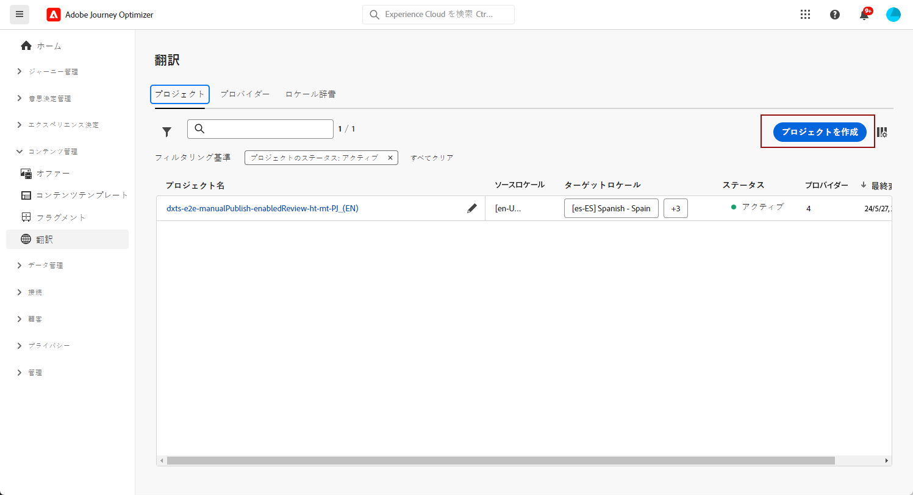
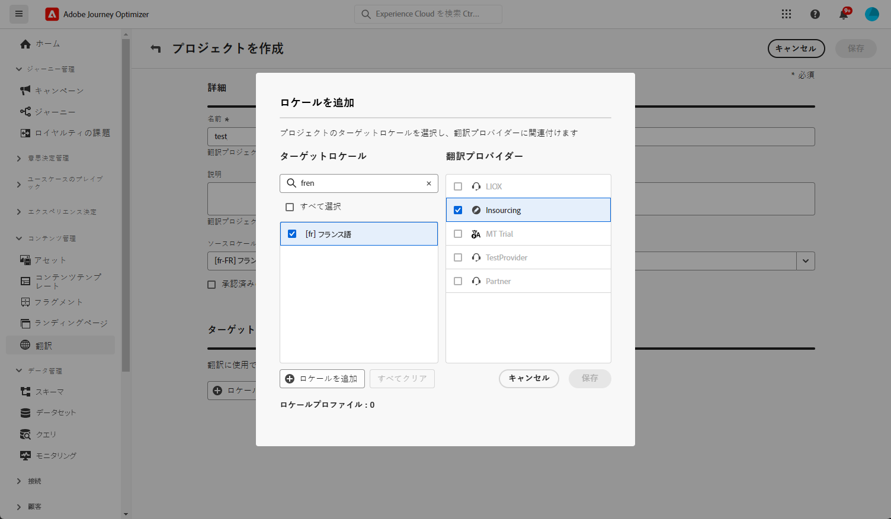
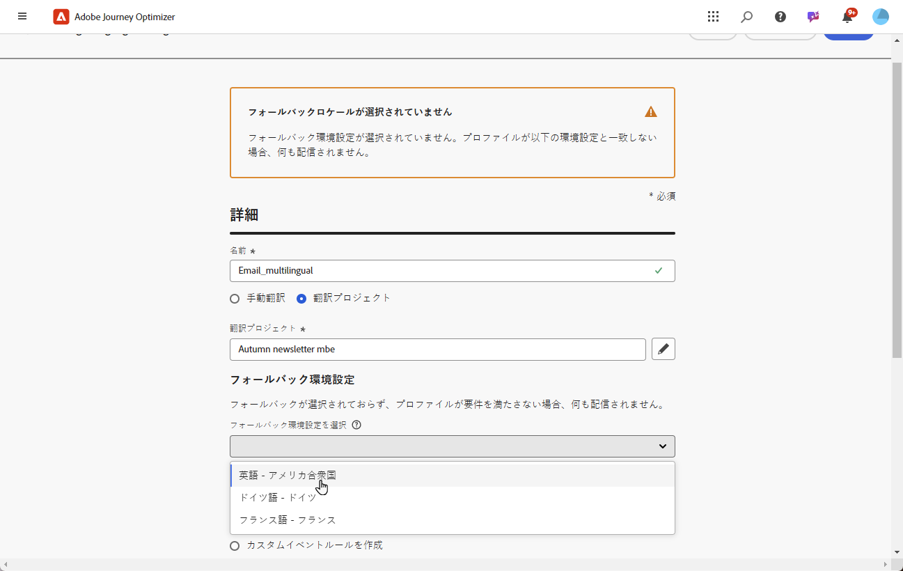
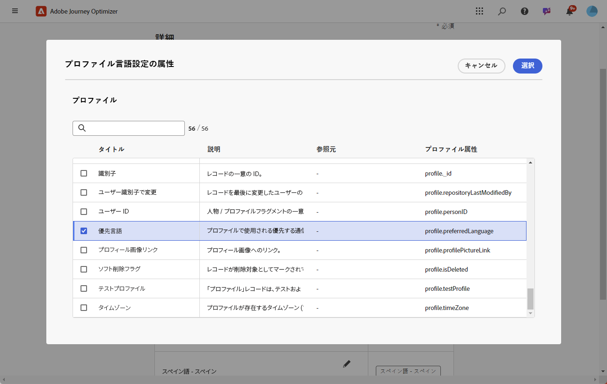
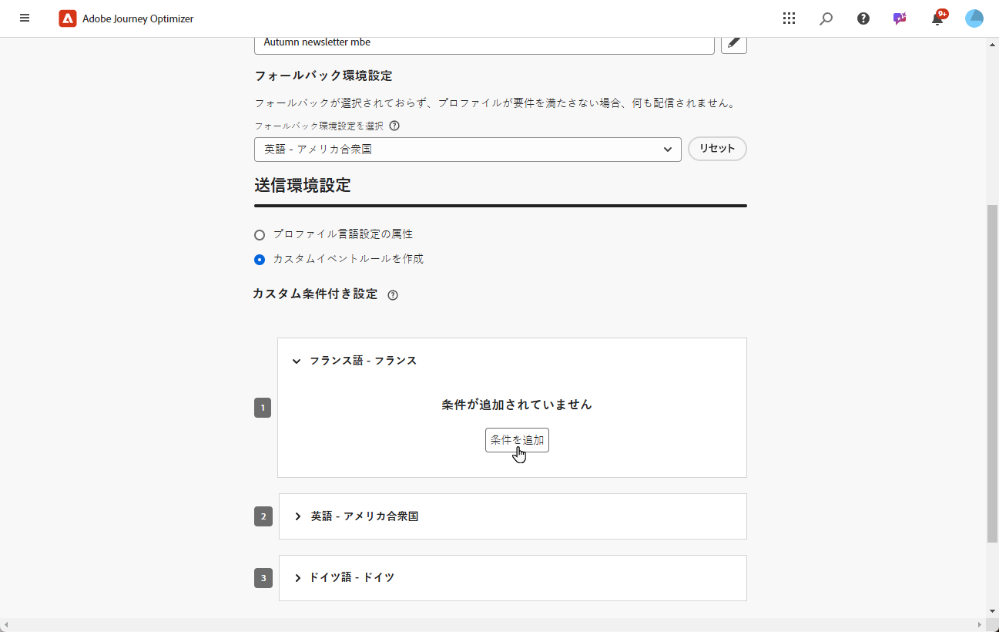
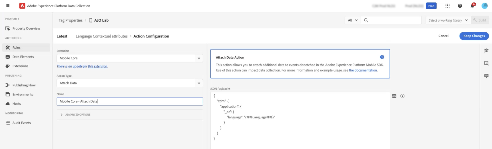

# 自動翻訳を使用した多言語コンテンツの作成 {#multilingual-automated}

>[!CONTEXTUALHELP]
>id="ajo_multi_add_provider"
>title="プロバイダーを追加"
>abstract="必要に応じて、翻訳プロバイダーとロケールを追加します。これにより、プロジェクトに対してアクティブなプロバイダーとロケールを管理でき、現在の要件とプロジェクトの範囲に基づいてリソースを調整し、オーディエンスをターゲットにする柔軟性が得られます。"

>[!CONTEXTUALHELP]
>id="ajo_multi_edit_provider"
>title="プロバイダーを編集"
>abstract="必要に応じて、既存の翻訳プロバイダーを変更し、ロケールを追加します。この機能を使用すると、プロジェクトに対してアクティブなプロバイダーとロケールを制御でき、現在のニーズとプロジェクトの目標に応じてリソースを調整し、特定のオーディエンスをターゲットにする柔軟性が得られます。"

>[!IMPORTANT]
>
>自動フローの場合、ユーザーには&#x200B;**[!UICONTROL 翻訳サービス]**&#x200B;機能に関連する権限が必要です。[権限の詳細情報](../administration/permissions.md)

自動フローを使用して、ターゲット言語と言語プロバイダーを簡単に選択できます。その後、コンテンツは翻訳に直接送信され、完了時に最終レビューが行われます。

自動翻訳を使用して多言語コンテンツを作成するには、次の手順に従います。

1. [プロバイダーの追加](multilingual-provider.md)

1. [ロケールの追加（オプション）](multilingual-locale.md)

1. [言語プロジェクトの作成](#create-translation-project)

1. [言語設定の作成](#create-language-settings)

1. [多言語コンテンツの作成](#create-a-multilingual-campaign)

1. [翻訳タスクのレビュー（オプション）](#review-translation-project)

## 翻訳プロジェクトを作成 {#translation-project}

>[!CONTEXTUALHELP]
>id="ajo_multi_create_project"
>title="プロジェクトの作成"
>abstract="多言語コンテンツの作成を開始するには、ターゲットロケールを特定し、オーディエンスに適した言語または地域の方言を選択して、翻訳プロジェクトを開始します。その後、プロジェクトのニーズに合った翻訳プロバイダーを選択します。"

>[!CONTEXTUALHELP]
>id="ajo_multi_edit_project"
>title="プロジェクトの編集"
>abstract="翻訳プロジェクトを更新して追加のロケールを組み込むことで、コンテンツを拡張し、より幅広いオーディエンスにリーチできます。"

コンテンツの特定の言語または地域を示すターゲットロケールを指定して、翻訳プロジェクトを開始します。その後、翻訳プロバイダーを選択できます。

1. **[!UICONTROL コンテンツ管理]**&#x200B;の&#x200B;**[!UICONTROL 翻訳]**&#x200B;メニューから、「**[!UICONTROL プロジェクト]**」タブの「**[!UICONTROL プロジェクトを作成]**」をクリックします。

   

1. **[!UICONTROL 名前]**&#x200B;と&#x200B;**[!UICONTROL 説明]**&#x200B;を入力します。

1. 「**[!UICONTROL ソースロケール]**」を選択します。

   

1. 次のオプションを有効にするかどうかを選択します。

   * **[!UICONTROL 承認済みの翻訳を自動的に公開]**：翻訳が承認されると、手動介入を必要とせずに自動的にキャンペーンに統合されます。
   * **[!UICONTROL レビューワークフローを有効にする]**：人間が翻訳したロケールにのみ適用されます。これにより、内部レビュアーが翻訳されたコンテンツを効率的に評価し、承認または却下できます。[詳細情報](#review-translation-project)

1. 「**[!UICONTROL ロケールを追加]**」をクリックしてメニューにアクセスし、翻訳プロジェクトの言語を定義します。

   **[!UICONTROL ロケール]**&#x200B;が見つからない場合は、**[!UICONTROL 翻訳]**&#x200B;メニューから、または API を使用して、事前に手動で作成できます。[新しいロケールの作成](#create-locale)を参照してください。

   

1. リストから「**[!UICONTROL ターゲットロケール]**」を選択し、各ロケールで使用する&#x200B;**[!UICONTROL 翻訳プロバイダー]**&#x200B;を選択します。

   **[!UICONTROL 翻訳プロバイダー]**&#x200B;の設定には、「**[!UICONTROL 管理]**」メニューセクションの&#x200B;**[!UICONTROL 翻訳]**&#x200B;メニューからアクセスできます。

   >[!NOTE]
   >
   >翻訳プロバイダーとの契約管理は、この機能の範囲外です。指定した翻訳パートナーと有効でアクティブな契約を結んでいることを確認してください。
   >
   ></br>翻訳プロバイダーは、翻訳されたコンテンツの品質の所有権を保持します。

1. ターゲットロケールと正しい翻訳プロバイダーのリンク設定が完了したら、「**[!UICONTROL ロケールを追加]**」をクリックします。次に、「**[!UICONTROL 保存]**」をクリックします。

   ターゲットロケールに対してプロバイダーが灰色表示されている場合は、プロバイダーがその特定のロケールをサポートしていないことを示します。

   

1. 翻訳プロジェクトを設定したら、「**[!UICONTROL 保存]**」をクリックします。

これで、翻訳プロジェクトが作成され、多言語キャンペーンで使用できます。

## 言語設定の作成 {#language-settings}

>[!CONTEXTUALHELP]
>id="ajo_multi_custom_conditional"
>title="カスタム条件付き設定"
>abstract="カスタム条件付き設定は、特定の条件に基づいてコンテンツを表示するロケールを決定するルールセットです。これらの設定により、ユーザーの場所、言語設定、その他のコンテキスト要素などの要因に基づいて、コンテンツの表示を制御できます。"

>[!CONTEXTUALHELP]
>id="ajo_multi_fallback"
>title="フォールバック環境設定"
>abstract="フォールバック環境設定の選択は、ユーザーエクスペリエンスを向上させるために重要です。フォールバックが選択されておらず、プロファイルが必要な要件を満たさない場合、コンテンツは配信されません。適切なフォールバックを選択することで、プロファイルが初期条件に一致しない場合でも、一貫したコンテンツ配信を確保できます。"

このセクションでは、多言語コンテンツを管理するための様々なロケールを設定できます。また、プロファイル言語に関連する情報の検索に使用する属性を選択することもできます。

1. **[!UICONTROL 管理]**&#x200B;メニューから、**[!UICONTROL チャネル]**／**[!UICONTROL 一般設定]**&#x200B;にアクセスします。

1. **[!UICONTROL 言語設定]**&#x200B;メニューで、「**[!UICONTROL 言語設定を作成]**」をクリックします。

   

1. **[!UICONTROL 言語設定]**&#x200B;の名前を入力し、「**[!UICONTROL 翻訳プロジェクト]**」を選択します。

1. 「**[!UICONTROL 翻訳プロジェクト]**」フィールドから、「**[!UICONTROL 編集]**」をクリックし、以前に作成した&#x200B;**[!UICONTROL 翻訳プロジェクト]**&#x200B;を選択します。

   以前に設定した&#x200B;**[!UICONTROL ロケール]**&#x200B;が自動的に読み込まれます。

1. **[!UICONTROL フォールバック環境設定]**&#x200B;を選択して、プロファイルがコンテンツ配信に必要な条件を満たさない場合のバックアップオプションを定義します。

   フォールバックオプションが選択されていない場合、キャンペーンやジャーニーは送信されません。

   

1. 次のオプションから送信設定を選択します。

   * **[!UICONTROL プロファイル言語設定の属性の選択]**
   * **[!UICONTROL カスタム条件付きルールの作成]**

1. 「**[!UICONTROL プロファイル言語設定の属性]**」を選択した場合は、**[!UICONTROL プロファイル言語設定の属性]**&#x200B;メニューから関連属性を選択して、プロファイル言語情報を検索します。

   

1. 「**[!UICONTROL カスタムイベントルールを作成]**」を選択した場合は、条件を作成するロケールを選択します。次に、ユーザーの場所、言語設定、その他のコンテキスト要素などの要因に基づいてルールを作成します。

   

1. 条件の作成を開始するには、属性、イベントまたはオーディエンスを追加してターゲットグループを定義します。

   >[!IMPORTANT]
   >
   >コンテキストデータは、web、アプリ内、コードベースのエクスペリエンスおよびコンテンツカードの各チャネルでのみ使用できます。メール、SMS、プッシュ通知、ダイレクトメールチャネルに使用すると、追加属性なしで、キャンペーンまたはジャーニーがリストの最初のオプション言語で送信されます。

   

   +++条件でコンテキストイベントを使用する前提条件

   ユーザーがコンテンツを表示すると、パーソナライゼーションリクエストがエクスペリエンスイベントと共に送信されます。条件でコンテキストデータを活用するには、パーソナライゼーションリクエストペイロードに追加データを添付する必要があります。これを行うには、Adobe Experience Platform のデータ収集でルールを作成して、パーソナライゼーションリクエストが送信された場合（IF）は、スキーマの言語フィールドと一致する属性を定義して、リクエストに追加データを添付する必要があります（THEN）。

   >[!NOTE]
   >
   >これらの前提条件は、アプリ内およびコンテンツカードチャネルにのみ必要です。

   1. Adobe Experience Platform のデータ収集で、タグのプロパティにアクセスします。

   1. **[!UICONTROL ルール]**&#x200B;メニューにアクセスし、新しいルールを作成します。ルールの作成方法について詳しくは、[!DNL Adobe Experience Platform] [データ収集ドキュメント](https://experienceleague.adobe.com/ja/docs/experience-platform/collection/e2e#create-a-rule){target="_blank"}を参照してください。

   1. ルールの「**[!UICONTROL IF]**」セクションで、次のように設定されたイベントを追加します。

      

      * 使用している&#x200B;**[!UICONTROL 拡張機能]**&#x200B;を選択します。
      * 「**[!UICONTROL イベントタイプ]**」フィールドで「AEP リクエストイベント」を選択します。
      * 右側のパネルで、「XDM イベントタイプが personalization.request と等しい」を選択します。
      * 「**[!UICONTROL 変更を保存]**」ボタンをクリックして、確定します。

   1. ルールの「**[!UICONTROL THEN]**」セクションで、次のように設定されたアクションを追加します。

      

      * 使用している&#x200B;**[!UICONTROL 拡張機能]**&#x200B;を選択します。
      * 「**[!UICONTROL アクションタイプ]**」フィールドで「データを添付」を選択します。
      * 「JSON ペイロード」セクションで、使用する言語を取得するのに使用する属性（以下の例では「language」）が、データ収集データストリームが送られるスキーマで指定された属性名と一致することを確認します。

        ```JSON
        {
            "xdm":{
                "application":{
                    "_dc":{
                        "language":"{%%Language%%}"
                    }
                }
            }
        }
        ```

      * 「**[!UICONTROL 変更を保持]**」ボタンをクリックして、ルールを確認して保存します。

+++

1. ロケールをドラッグ＆ドロップして並べ替え、リスト内の優先度を管理します。

1. 「**[!UICONTROL 送信]**」をクリックして、**[!UICONTROL 言語設定]**&#x200B;を作成します。

言語設定を行った後は、それらを編集するオプションは表示されなくなります。

<!--
1. Access the **[!UICONTROL channel configurations]** menu and create a new channel configuration or select an existing one.

1. In the **[!UICONTROL Header parameters]** section, select the **[!UICONTROL Enable multilingual]** option.


1. Select your **[!UICONTROL Locales dictionary]** and add as many as needed.
-->

## 多言語コンテンツの作成 {#create-multilingual-campaign}

>[!AVAILABILITY]
>
> コードベースのエクスペリエンスおよびコンテンツカードのコンテンツのプレビューは、現在、自動フローでは使用できません。

翻訳プロジェクトと言語の設定を行ったら、キャンペーンまたはジャーニーを作成し、様々なロケールに対してコンテンツをカスタマイズする準備が整います。

1. まず、要件に応じて、メール、SMS またはプッシュ通知[キャンペーン](../campaigns/create-campaign.md)や[ジャーニー](../building-journeys/journeys-message.md)を作成し、設定します。

1. プライマリコンテンツを作成したら、「**[!UICONTROL 保存]**」をクリックし、キャンペーン設定画面に戻ります。

1. 「**[!UICONTROL 言語を追加]**」をクリックします。[詳細情報](#create-language-settings)

   

1. 以前に作成した&#x200B;**[!UICONTROL 言語設定]**&#x200B;を選択します。

   

1. ロケールが読み込まれたら、「**[!UICONTROL 翻訳に送信]**」をクリックして、以前に選択した翻訳プロバイダーにコンテンツを転送します。

   

1. コンテンツを翻訳用に送信した後は、編集できなくなります。元のコンテンツに変更を加えるには、鍵アイコンをクリックします。

   このコンテンツに変更を加える場合は、新しい翻訳プロジェクトを作成し、翻訳用に再送信する必要があります。

   

1. 「**[!UICONTROL 翻訳を開く]**」をクリックして翻訳プロジェクトにアクセスし、レビューします。

   

1. このページでは、翻訳プロジェクトのステータスに従います。

   * **[!UICONTROL 翻訳中]**：サービスプロバイダーが翻訳に積極的に取り組んでいます。

     **言語設定**&#x200B;を行う際、**インソーシング**&#x200B;を選択した場合は、翻訳プロジェクトでコンテンツを直接翻訳できます。[詳細情報](#manage-ht-project)

   * **[!UICONTROL レビューの準備完了]**：レビュープロセスを開始する準備が整い、翻訳にアクセスして却下または承認できます。

     **[!UICONTROL 翻訳プロジェクト]**&#x200B;で「**[!UICONTROL レビューワークフローを有効にする]**」を選択した場合は、選択した翻訳プロバイダーによる翻訳の完了後に、Journey Optimizer で翻訳を直接レビューできます。[詳細情報](#review-translation-project)

   * **[!UICONTROL レビュー済み]**：翻訳が承認され、公開してキャンペーンに送信する準備が整いました。

   * **[!UICONTROL 公開準備完了]**：機械翻訳が完了し、キャンペーンに送信できるようになりました。

   * **[!UICONTROL 完了]**：キャンペーンで翻訳が使用できるようになりました。

   

1. 翻訳が完了すると、多言語コンテンツを送信する準備が整います。

   

1. 「**[!UICONTROL アクティブ化するレビュー]**」をクリックして、キャンペーンの概要を表示します。

   概要では、必要に応じてキャンペーンを変更し、パラメーターが正しくないか、または見つからないかを確認できます。

1. 多言語コンテンツを参照して、各言語でのレンダリングを確認します。

   

1. キャンペーンが正しく設定されていることを確認してから、「**[!UICONTROL アクティブ化]**」をクリックします。

   >[!IMPORTANT]
   >
   > キャンペーンが承認ポリシーの対象となっている場合、多言語キャンペーンを送信できるようにするには、承認をリクエストする必要があります。[詳細情報](../test-approve/gs-approval.md)

これで、キャンペーンまたはジャーニーをアクティブ化できます。送信後は、レポート内で多言語ジャーニーまたはキャンペーンの影響を測定できます。

## インソーシング翻訳プロジェクトの管理 {#manage-ht-project}

>[!CONTEXTUALHELP]
>id="ajo_multi_insourcing_project"
>title="インソーシング翻訳プロジェクト"
>abstract="インソーシング翻訳プロジェクトを使用すると、翻訳プロジェクト内で直接、翻訳を管理および実行できるので、プロセスが効率化され、翻訳の品質と一貫性をより適切に制御できます。"

言語設定を指定する際にインソーシングを選択した場合は、翻訳プロジェクトでコンテンツを直接翻訳できます。

1. **[!UICONTROL 翻訳プロジェクト]**&#x200B;から、**[!UICONTROL その他のアクション]**&#x200B;メニューにアクセスし、「**[!UICONTROL インソーシング]**」を選択します。

   

1. 外部翻訳ソフトウェアを使用して、翻訳を CSV ファイルに書き出すことができます。または、「**[!UICONTROL CSV を読み込み]**」ボタンをクリックして、その CSV ファイルを元の翻訳プロジェクトに読み込むこともできます。

   

1. 「**[!UICONTROL 編集]**」をクリックして、翻訳内容を追加します。

   

1. 翻訳したテキストを公開する準備が整ったら、「**[!UICONTROL 完了]**」をクリックします。

## 翻訳プロジェクトのレビュー {#review-translation-project}

>[!CONTEXTUALHELP]
>id="ajo_multi_review_project"
>title="翻訳プロジェクトのレビュー"
>abstract="選択した翻訳プロバイダーが翻訳を完了すると、Journey Optimizer 内で結果を直接確認できます。これにより、翻訳の正確性と品質を評価し、最終処理を行う前に、期待とプロジェクト要件に一致していることを確認できます。"

>[!CONTEXTUALHELP]
>id="ajo_multi_preview_project"
>title="翻訳プロジェクトのプレビュー"
>abstract="プレビューウィンドウでは、翻訳済みコンテンツが各言語でどのように表示されるかを確認できます。この機能を使用すると、レンダリングを調べ、選択したすべての言語でコンテンツが正しく効果的に表示されていることを確認できます。"

**[!UICONTROL 翻訳プロジェクト]**&#x200B;で「**[!UICONTROL レビューワークフローを有効にする]**」を選択した場合は、選択した翻訳プロバイダーによる翻訳の完了後に、Journey Optimizer で翻訳を直接レビューできます。

このオプションが無効になっている場合、プロバイダーによる翻訳が完了すると、翻訳タスクのステータスが自動的に&#x200B;**[!UICONTROL レビュー済み]**&#x200B;に設定され、「**[!UICONTROL 公開]**」をクリックしてすばやく続行できるようになります。

1. サービスプロバイダーからの翻訳が完了したら、**[!UICONTROL 翻訳プロジェクト]**&#x200B;から、または&#x200B;**[!UICONTROL キャンペーン]**&#x200B;から直接、翻訳にアクセスしてレビューすることができます。

   **[!UICONTROL その他のアクション]**&#x200B;メニューから、「**[!UICONTROL レビュー]**」をクリックします。

   

1. レビューウィンドウから、翻訳済みコンテンツを閲覧し、各翻訳文字列を承認または却下します。

   

1. 「**[!UICONTROL 編集]**」をクリックして、翻訳文字列の内容を変更します。

   

1.   更新した翻訳を入力し、終了したら「**[!UICONTROL 確認]**」をクリックします。

   

1. 「**[!UICONTROL すべて却下]**」または「**[!UICONTROL すべて承認]**」を直接選択することもできます。

   「**[!UICONTROL すべて却下]**」を選択した場合は、コメントを追加して「**[!UICONTROL 却下]**」をクリックします。

1. 「**[!UICONTROL プレビュー]**」をクリックして、各言語の翻訳済みコンテンツのレンダリングを確認します。

1. 翻訳したテキストを公開する準備が整ったら、「**[!UICONTROL 完了]**」をクリックします。

   

1. **[!UICONTROL 翻訳プロジェクト]**&#x200B;からプロジェクトを 1 つ選択すると、詳細にアクセスできます。翻訳を却下した場合は、翻訳に送り返すように選択できます。

   

1. **[!UICONTROL 翻訳プロジェクト]**&#x200B;のステータスが「レビュー済み」に設定されたら、キャンペーンに送信できます。

   **[!UICONTROL その他のアクション]**&#x200B;メニューから、「**[!UICONTROL 公開]**」をクリックします。

   

1. キャンペーンで、翻訳のステータスが&#x200B;**[!UICONTROL 翻訳完了]**&#x200B;に変わったことを確認します。これで、多言語コンテンツを送信できるようになります。[この節](#create-multilingual-campaign)の手順 10 を参照してください。

   

<!--
# Create a multilingual journey {#create-multilingual-journey}

1. Create your journey with a Delivery and personalize your content as needed.
1. From your delivery action, click Edit content.
1. Click Add languages.


-->
