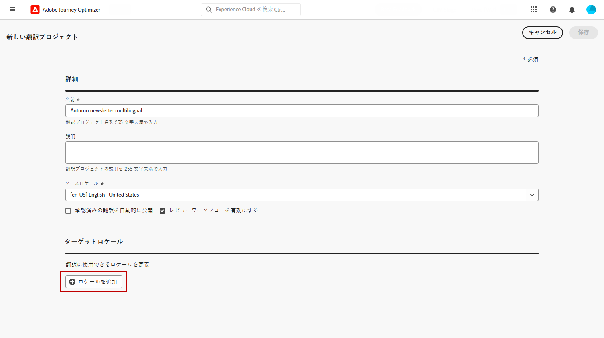
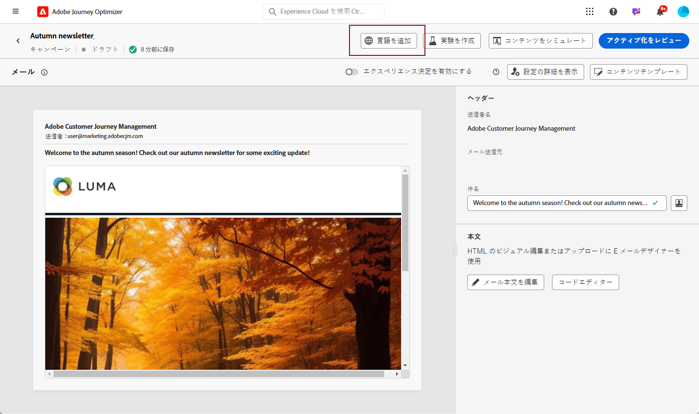
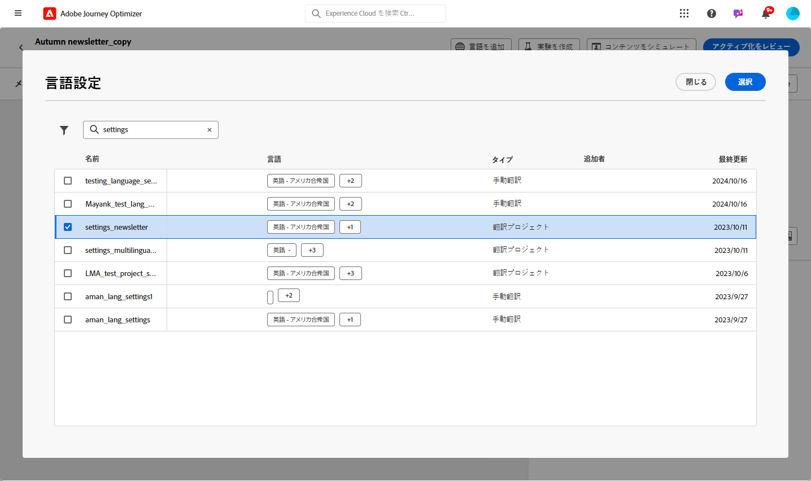

# 自動翻訳を使用した多言語コンテンツの作成 {#multilingual-automated}

>[!AVAILABILITY]
>
>多言語コンテンツは現在、一連の組織でのみ使用できます（限定提供）。アクセスするには、アドビ担当者にお問い合わせください。

自動フローを使用して、ターゲット言語と言語プロバイダーを簡単に選択できます。その後、コンテンツは翻訳に直接送信され、完了時に最終レビューが行われます。

自動翻訳を使用して多言語コンテンツを作成するには、次の手順に従います。

1. [ロケールを作成します](#create-locale)。

1. [言語プロジェクトを作成します](#create-translation-project)。

1. [言語設定を作成](#create-language-settings).

1. [多言語コンテンツを作成します](#create-a-multilingual-campaign)。

1. [翻訳タスクをレビューします（オプション）](#review-translation-project)。

## ロケールの作成 {#create-locale}

[言語設定の作成](#language-settings)の節で説明しているように、言語設定を行う際に、多言語コンテンツに特定のロケールが使用できない場合は、**[!UICONTROL 翻訳]**&#x200B;メニューを使用して必要に応じて新しいロケールを柔軟に作成できます。

1. **[!UICONTROL コンテンツ管理]**&#x200B;メニューから、**[!UICONTROL 翻訳]**&#x200B;にアクセスします。

1. 「**[!UICONTROL ロケール辞書]**」タブから、「**[!UICONTROL ロケールを追加]**」をクリックします。

   

1. **[!UICONTROL 言語]**&#x200B;リストと関連する&#x200B;**[!UICONTROL 地域]**&#x200B;からロケールコードを選択します。

1. 「**[!UICONTROL 保存]**」をクリックしてロケールを作成します。

   

## 翻訳プロジェクトを作成 {#translation-project}

コンテンツの特定の言語または地域を示すターゲットロケールを指定して、翻訳プロジェクトを開始します。その後、翻訳プロバイダーを選択できます。

1. **[!UICONTROL コンテンツ管理]**&#x200B;の&#x200B;**[!UICONTROL 翻訳]**&#x200B;メニューから、「**[!UICONTROL プロジェクト]**」タブの「**[!UICONTROL プロジェクトを作成]**」をクリックします。

   

1. **[!UICONTROL 名前]**&#x200B;と&#x200B;**[!UICONTROL 説明]**&#x200B;を入力します。

1. 「**[!UICONTROL ソースロケール]**」を選択します。

   

1. 次のオプションを有効にするかどうかを選択します。

   * **[!UICONTROL 承認済みの翻訳を自動的に公開]**：翻訳が承認されると、手動介入を必要とせずに自動的にキャンペーンに統合されます。
   * **[!UICONTROL レビューワークフローを有効にする]**：人間が翻訳したロケールにのみ適用されます。これにより、内部レビュアーが翻訳されたコンテンツを効率的に評価し、承認または却下できます。[詳細情報](#review-translation-project)

1. 「**[!UICONTROL ロケールを追加]**」をクリックしてメニューにアクセスし、翻訳プロジェクトの言語を定義します。

   **[!UICONTROL ロケール]**&#x200B;が見つからない場合は、**[!UICONTROL 翻訳]**&#x200B;メニューから、または API を使用して、事前に手動で作成できます。[新しいロケールの作成](#create-locale)を参照してください。

   

1. リストから「**[!UICONTROL ターゲットロケール]**」を選択し、各ロケールで使用する&#x200B;**[!UICONTROL 翻訳プロバイダー]**&#x200B;を選択します。

   **[!UICONTROL 翻訳プロバイダー]**&#x200B;の設定には、「**[!UICONTROL 管理]**」メニューセクションの&#x200B;**[!UICONTROL 翻訳]**&#x200B;メニューからアクセスできます。

   >[!NOTE]
   >
   >翻訳プロバイダーとの契約管理は、この機能の範囲外です。指定した翻訳パートナーと有効でアクティブな契約を結んでいることを確認してください。
   >
   > 翻訳プロバイダーは、翻訳されたコンテンツの品質の所有権を保持します。

1. ターゲットロケールと正しい翻訳プロバイダーのリンク設定が完了したら、「**[!UICONTROL ロケールを追加]**」をクリックします。次に、「**[!UICONTROL 保存]**」をクリックします。

   ターゲットロケールに対してプロバイダーが灰色表示されている場合は、プロバイダーがその特定のロケールをサポートしていないことを示します。

   

1. 翻訳プロジェクトを設定したら、「**[!UICONTROL 保存]**」をクリックします。

これで、翻訳プロジェクトが作成され、多言語キャンペーンで使用できます。

## 言語設定の作成 {#language-settings}

この節では、多言語コンテンツを管理するためのプライマリ言語とそれに関連するロケールを設定できます。また、プロファイル言語に関連する情報の検索に使用する属性を選択することもできます。

1. **[!UICONTROL 管理]**&#x200B;メニューから、**[!UICONTROL チャネル]**／**[!UICONTROL 一般設定]**&#x200B;にアクセスします。

1. **[!UICONTROL 言語設定]**&#x200B;メニューで、「**[!UICONTROL 言語設定を作成]**」をクリックします。

   

1. **[!UICONTROL 言語設定]**&#x200B;の名前を入力します。

1. 「**[!UICONTROL 翻訳プロジェクト]**」オプションを選択します。

1. 「**[!UICONTROL 翻訳プロジェクト]**」フィールドから、「**[!UICONTROL 編集]**」をクリックし、以前に作成した&#x200B;**[!UICONTROL 翻訳プロジェクト]**&#x200B;を選択します。

   以前に設定したロケールが自動的に読み込まれます。

   

1. **[!UICONTROL 送信環境設定]**&#x200B;メニューから、プロファイル言語に関する情報を見つけるために検索する属性を選択します。

1. **[!UICONTROL ロケール]**&#x200B;の横にある「**[!UICONTROL 編集]**」をクリックしてさらにパーソナライズし、**[!UICONTROL プロファイル環境設定]**&#x200B;を追加します。

   

1. **[!UICONTROL 翻訳プロジェクト]**&#x200B;を更新する場合は、「**[!UICONTROL 更新]**」をクリックして、**[!UICONTROL 言語設定]**&#x200B;にこれらの変更を反映します。

   

1. 「**[!UICONTROL 送信]**」をクリックして、**[!UICONTROL 言語設定]**&#x200B;を作成します。

<!--
1. Access the **[!UICONTROL channel configurations]** menu and create a new channel configuration or select an existing one.

1. In the **[!UICONTROL Header parameters]** section, select the **[!UICONTROL Enable multilingual]** option.

1. Select your **[!UICONTROL Locales dictionary]** and add as many as needed.
-->

## 多言語コンテンツの作成 {#create-multilingual-campaign}

翻訳プロジェクトと言語の設定を行ったら、キャンペーンまたはジャーニーを作成し、様々なロケールに対してコンテンツをカスタマイズする準備が整います。

1. まず、要件に応じて、メール、SMS またはプッシュ通知[キャンペーン](../campaigns/create-campaign.md)や[ジャーニー](../building-journeys/journeys-message.md)を作成し、設定します。

1. プライマリコンテンツを作成したら、「**[!UICONTROL 保存]**」をクリックし、キャンペーン設定画面に戻ります。

1. 「**[!UICONTROL 言語を追加]**」をクリックします。[詳細情報](#create-language-settings)

   

1. 以前に作成した&#x200B;**[!UICONTROL 言語設定]**&#x200B;を選択します。

   

1. ロケールが読み込まれたら、「**[!UICONTROL 翻訳に送信]**」をクリックして、以前に選択した翻訳プロバイダーにコンテンツを転送します。

   

1. コンテンツを翻訳用に送信した後は、編集できなくなります。元のコンテンツに変更を加えるには、鍵アイコンをクリックします。

   このコンテンツに変更を加える場合は、新しい翻訳プロジェクトを作成し、翻訳用に再送信する必要があります。

   

1. 「**[!UICONTROL 翻訳を開く]**」をクリックして翻訳プロジェクトにアクセスし、レビューします。

   

1. このページでは、翻訳プロジェクトのステータスに従います。

   * **[!UICONTROL 翻訳中]**：サービスプロバイダーが翻訳に積極的に取り組んでいます。

     **言語設定**&#x200B;を行う際、**インソーシング**&#x200B;を選択した場合は、翻訳プロジェクトでコンテンツを直接翻訳できます。[詳細情報](#manage-ht-project)

   * **[!UICONTROL レビューの準備完了]**：レビュープロセスを開始する準備が整い、翻訳にアクセスして却下または承認できます。

     **[!UICONTROL 翻訳プロジェクト]**&#x200B;で「**[!UICONTROL レビューワークフローを有効にする]**」を選択した場合は、選択した翻訳プロバイダーによる翻訳の完了後に、Journey Optimizer で翻訳を直接レビューできます。[詳細情報](#review-translation-project)

   * **[!UICONTROL レビュー済み]**：翻訳が承認され、公開してキャンペーンに送信する準備が整いました。

   * **[!UICONTROL 公開準備完了]**：機械翻訳が完了し、キャンペーンに送信できるようになりました。

   * **[!UICONTROL 完了]**：キャンペーンで翻訳が使用できるようになりました。

   

1. 翻訳が完了すると、多言語コンテンツを送信する準備が整います。

   

1. 「**[!UICONTROL アクティブ化するレビュー]**」をクリックして、キャンペーンの概要を表示します。

   概要では、必要に応じてキャンペーンを変更し、パラメーターが正しくないか、または見つからないかを確認できます。

1. 多言語コンテンツを参照して、各言語でのレンダリングを確認します。

   

1. キャンペーンが正しく設定されていることを確認してから、「**[!UICONTROL アクティブ化]**」をクリックします。

これで、キャンペーンまたはジャーニーをアクティブ化できます。送信後は、レポート内で多言語ジャーニーまたはキャンペーンの影響を測定できます。

## インソーシング翻訳プロジェクトの管理 {#manage-ht-project}

言語設定を指定する際にインソーシングを選択した場合は、翻訳プロジェクトでコンテンツを直接翻訳できます。

1. **[!UICONTROL 翻訳プロジェクト]**&#x200B;から、**[!UICONTROL その他のアクション]**&#x200B;メニューにアクセスし、「**[!UICONTROL インソーシング]**」を選択します。

   

1. 外部翻訳ソフトウェアを使用して、翻訳を CSV ファイルに書き出すことができます。または、「**[!UICONTROL CSV を読み込み]**」ボタンをクリックして、その CSV ファイルを元の翻訳プロジェクトに読み込むこともできます。

   

1. 「**[!UICONTROL 編集]**」をクリックして、翻訳内容を追加します。

   

1. 翻訳したテキストを公開する準備が整ったら、「**[!UICONTROL 完了]**」をクリックします。

## 翻訳プロジェクトのレビュー {#review-translation-project}

**[!UICONTROL 翻訳プロジェクト]**&#x200B;で「**[!UICONTROL レビューワークフローを有効にする]**」を選択した場合は、選択した翻訳プロバイダーによる翻訳の完了後に、Journey Optimizer で翻訳を直接レビューできます。

このオプションが無効になっている場合、プロバイダーによる翻訳が完了すると、翻訳タスクのステータスが自動的に&#x200B;**[!UICONTROL レビュー済み]**&#x200B;に設定され、「**[!UICONTROL 公開]**」をクリックしてすばやく続行できるようになります。

1. サービスプロバイダーからの翻訳が完了したら、**[!UICONTROL 翻訳プロジェクト]**&#x200B;から、または&#x200B;**[!UICONTROL キャンペーン]**&#x200B;から直接、翻訳にアクセスしてレビューすることができます。

   **[!UICONTROL その他のアクション]**&#x200B;メニューから、「**[!UICONTROL レビュー]**」をクリックします。

   

1. レビューウィンドウから、翻訳済みコンテンツを閲覧し、各翻訳文字列を承認または却下します。

   

1. 「**[!UICONTROL 編集]**」をクリックして、翻訳文字列の内容を変更します。

   

1.   更新した翻訳を入力し、終了したら「**[!UICONTROL 確認]**」をクリックします。

   

1. 「**[!UICONTROL すべて却下]**」または「**[!UICONTROL すべて承認]**」を直接選択することもできます。

   「**[!UICONTROL すべて却下]**」を選択した場合は、コメントを追加して「**[!UICONTROL 却下]**」をクリックします。

1. 「**[!UICONTROL プレビュー]**」をクリックして、各言語の翻訳済みコンテンツのレンダリングを確認します。

1. 翻訳したテキストを公開する準備が整ったら、「**[!UICONTROL 完了]**」をクリックします。

   

1. **[!UICONTROL 翻訳プロジェクト]**&#x200B;からプロジェクトを 1 つ選択すると、詳細にアクセスできます。翻訳を却下した場合は、翻訳に送り返すように選択できます。

   

1. **[!UICONTROL 翻訳プロジェクト]**&#x200B;のステータスが「レビュー済み」に設定されたら、キャンペーンに送信できます。

   **[!UICONTROL その他のアクション]**&#x200B;メニューから、「**[!UICONTROL 公開]**」をクリックします。

   

1. キャンペーンで、翻訳のステータスが&#x200B;**[!UICONTROL 翻訳完了]**&#x200B;に変わったことを確認します。これで、多言語コンテンツを送信できるようになります。[この節](#create-multilingual-campaign)の手順 10 を参照してください。

   

<!--
# Create a multilingual journey {#create-multilingual-journey}

1. Create your journey with a Delivery and personalize your content as needed.
1. From your delivery action, click Edit content.
1. Click Add languages.

-->
