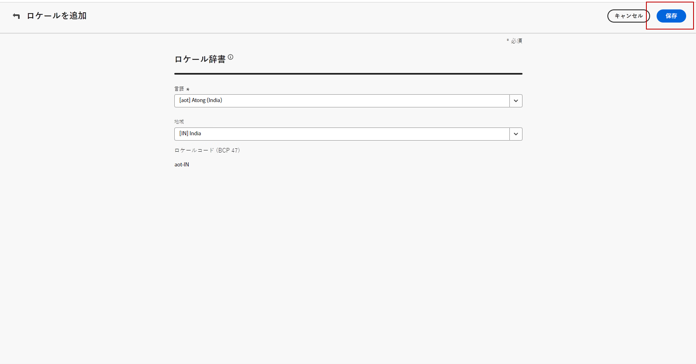
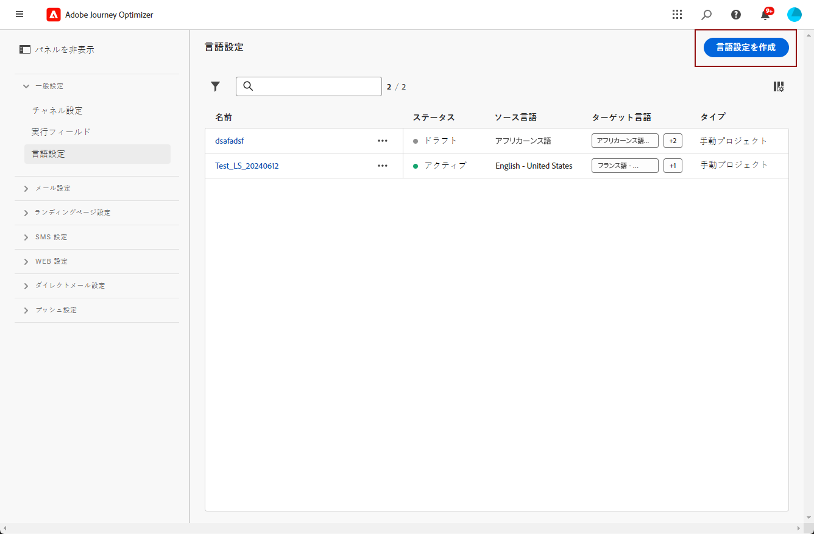
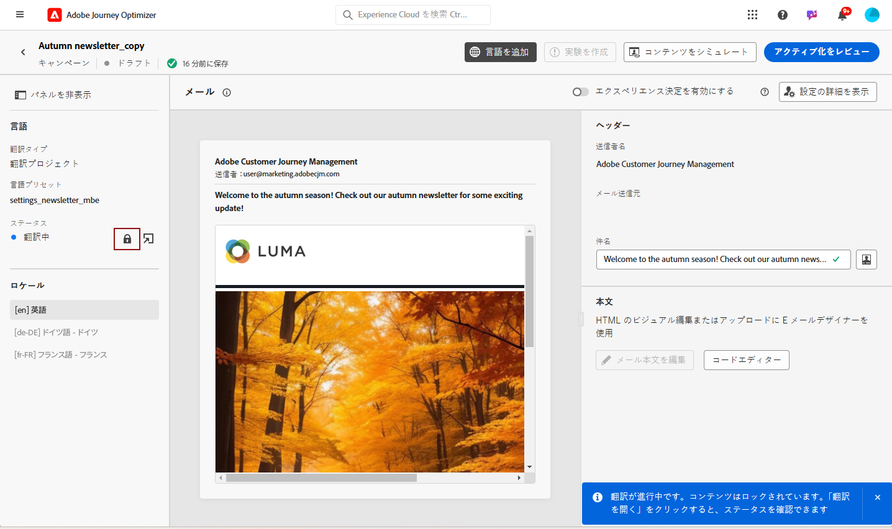

# 多言語コンテンツの作成 自動翻訳を使用 {#multilingual-automated}

>[!BEGINSHADEBOX]

**目次**

* [多言語コンテンツの基本を学ぶ](multilingual-gs.md)
* [手動翻訳を使用した多言語コンテンツの作成](multilingual-manual.md)
* **[自動翻訳を使用した多言語コンテンツの作成](multilingual-automated.md)**
* [多言語キャンペーンレポート](multilingual-report.md)

>[!ENDSHADEBOX]

自動フローを使用して、ターゲット言語と言語プロバイダーを簡単に選択できます。 その後、コンテンツが翻訳に直接送信され、完了時に最終レビューがおこなわれます。

自動翻訳を使用して多言語コンテンツを作成するには、次の手順に従います。

1. [ロケールを作成する](#create-locale).

1. [言語プロジェクトの作成](#create-translation-project).

1. [言語設定の作成](#create-language-settings).

1. [多言語キャンペーンを作成](#create-a-multilingual-campaign).

1. [翻訳タスクをレビュー（オプション）](#review-translation-project).

## ロケールの作成 {#create-locale}

[言語設定の作成](#language-settings)の節で説明しているように、言語設定を行う際に、多言語コンテンツに特定のロケールが使用できない場合は、**[!UICONTROL 翻訳]**&#x200B;メニューを使用して必要に応じて新しいロケールを柔軟に作成できます。

1. **[!UICONTROL 管理]**&#x200B;メニューから、**[!UICONTROL チャネル]**&#x200B;にアクセスします。

   翻訳メニューを使用すると、アクティブ化されたロケールのリストにアクセスできます。

1. 「**[!UICONTROL ロケール辞書]**」タブから、「**[!UICONTROL ロケールを追加]**」をクリックします。

   

1. **[!UICONTROL 言語]**&#x200B;リストと関連する&#x200B;**[!UICONTROL 地域]**&#x200B;からロケールコードを選択します。

1. 「**[!UICONTROL 保存]**」をクリックしてロケールを作成します。

   

## 翻訳プロジェクトを作成 {#translation-project}

Target ロケールを指定し、コンテンツの特定の言語または地域を示して、翻訳プロジェクトを開始します。 その後、翻訳プロバイダーを選択できます。

1. **[!UICONTROL コンテンツ管理]**&#x200B;の&#x200B;**[!UICONTROL 翻訳プロジェクト]**&#x200B;メニューから、「**[!UICONTROL プロジェクトを作成]**」をクリックします。

   

1. **[!UICONTROL 名前]**&#x200B;と&#x200B;**[!UICONTROL 説明]**&#x200B;を入力します。

1. 「**[!UICONTROL ソースロケール]**」を選択します。

   

1. 次のオプションを有効にする場合に選択します。

   * **[!UICONTROL 承認済みの翻訳を自動的に公開]**：翻訳が承認されると、手動の介入なしで、翻訳が自動的にキャンペーンに統合されます。
   * **[!UICONTROL レビューワークフローを有効にする]**：人間翻訳のロケールにのみ適用できます。 これにより、内部のレビュー担当者は、翻訳されたコンテンツを効率的に評価し、承認または却下できます。 [詳細情報](#review-translation-project)

1. 「**[!UICONTROL ロケールを追加]**」をクリックしてメニューにアクセスし、翻訳プロジェクトの言語を定義します。

   **[!UICONTROL ロケール]**&#x200B;が見つからない場合は、**[!UICONTROL 翻訳]**&#x200B;メニューから、または API を使用して、事前に手動で作成できます。[新しいロケールの作成](#create-locale)を参照してください。

   

1. リストから「**[!UICONTROL ターゲットロケール]**」を選択し、各ロケールで使用する&#x200B;**[!UICONTROL 翻訳プロバイダー]**&#x200B;を選択します。

1. ターゲットロケールと正しい翻訳プロバイダーのリンク設定が完了したら、「**[!UICONTROL ロケールを追加]**」をクリックします。次に、「**[!UICONTROL 保存]**」をクリックします。

   プロバイダが対象ロケールに対して灰色表示になっている場合は、そのプロバイダがその特定のロケールをサポートしていないことを示します。

   

1. 翻訳プロジェクトを設定したら、「**[!UICONTROL 保存]**」をクリックします。

これで、翻訳プロジェクトが作成され、多言語キャンペーンで使用できます。

## 言語設定の作成 {#language-settings}

この節では、多言語コンテンツを管理するためのプライマリ言語とそれに関連するロケールを設定できます。また、プロファイル言語に関連する情報の検索に使用する属性を選択することもできます。

1. **[!UICONTROL 管理]**&#x200B;メニューから、**[!UICONTROL チャネル]**&#x200B;にアクセスします。

1. **[!UICONTROL 言語設定]**&#x200B;メニューで、「**[!UICONTROL 言語設定を作成]**」をクリックします。

   

1. **[!UICONTROL 言語設定]**&#x200B;の名前を入力します。

1. 「**[!UICONTROL 翻訳プロジェクト]**」オプションを選択します。

1. 「**[!UICONTROL 翻訳プロジェクト]**」フィールドから、「**[!UICONTROL 編集]**」をクリックし、以前に作成した&#x200B;**[!UICONTROL 翻訳プロジェクト]**&#x200B;を選択します。

   以前に設定したロケールが自動的に読み込まれます。

   

1. **[!UICONTROL 送信環境設定]**&#x200B;メニューから、プロファイル言語に関する情報を見つけるために検索する属性を選択します。

1. **[!UICONTROL ロケール]**&#x200B;の横にある「**[!UICONTROL 編集]**」をクリックしてさらにパーソナライズし、**[!UICONTROL プロファイル環境設定]**&#x200B;を追加します。

   

1. 次の場合、 **[!UICONTROL 翻訳プロジェクト]** が更新されました。「 **[!UICONTROL 更新]** これらの変更を **[!UICONTROL 言語設定]**.

   

1. 「**[!UICONTROL 送信]**」をクリックして、**[!UICONTROL 言語設定]**&#x200B;を作成します。

<!--
1. Access the **[!UICONTROL Channel surfaces]** menu and create a new channel surface or select an existing one.

1. In the **[!UICONTROL Header parameters]** section, select the **[!UICONTROL Enable multilingual]** option.

1. Select your **[!UICONTROL Locales dictionary]** and add as many as needed.
-->

## 多言語キャンペーンを作成 {#create-multilingual-campaign}

翻訳プロジェクトと言語の設定が完了したら、キャンペーンを作成し、様々なロケール用にコンテンツをカスタマイズする準備が整いました。

1. まず、要件に応じて、電子メール、SMS、またはプッシュ通知キャンペーンを作成し、設定します。 [詳細情報](../campaigns/create-campaign.md)

1. プライマリコンテンツを作成したら、「**[!UICONTROL 保存]**」をクリックし、キャンペーン設定画面に戻ります。

1. クリック **[!UICONTROL 言語を追加]**.  [詳細情報](#create-language-settings)

   

1. 以前に作成したを選択 **[!UICONTROL 言語設定]**.

   

1. ロケールが読み込まれたので、 **[!UICONTROL 翻訳に送信]** をクリックして、以前に選択した翻訳プロバイダーにコンテンツを転送します。

   

1. コンテンツを翻訳用に送信した後は、編集できなくなります。 元のコンテンツに変更を加えるには、ロックアイコンをクリックします。

   このコンテンツに変更を加える場合は、新しい翻訳プロジェクトを作成し、翻訳用に再送信する必要があります。

   

1. クリック **[!UICONTROL 翻訳を開く]** 翻訳プロジェクトにアクセスして確認するには、以下を実行します。

   

1. このページでは、翻訳プロジェクトのステータスに従います。

   * **[!UICONTROL 翻訳中]**：サービスプロバイダーが翻訳に積極的に取り組んでいます。
   * **[!UICONTROL レビューの準備完了]**：レビュープロセスを開始する準備が整い、翻訳にアクセスして拒否または承認できます。
   * **[!UICONTROL 確認済み]**：翻訳が承認され、キャンペーンに送信する準備が整いました。
   * **[!UICONTROL 公開準備完了]**：機械翻訳が完了し、キャンペーンに送信できるようになりました。
   * **[!UICONTROL 完了]**：キャンペーンで翻訳を利用できるようになりました。

   

1. 翻訳が完了すると、多言語コンテンツを送信する準備が整います。

   

1. 「**[!UICONTROL アクティブ化するレビュー]**」をクリックして、キャンペーンの概要を表示します。

   概要では、必要に応じてキャンペーンを変更し、パラメーターが正しくないか、または見つからないかを確認できます。

1. 多言語コンテンツを参照して、各言語でのレンダリングを確認します。

   

1. キャンペーンが正しく設定されていることを確認してから、「**[!UICONTROL アクティブ化]**」をクリックします。

これで、キャンペーンがアクティブ化されました。キャンペーンで設定されたメッセージは、すぐに送信されるか、指定日に送信されます。キャンペーンがライブになるとすぐ、変更できなくなります。コンテンツを再利用するには、キャンペーンを複製します。

送信後は、キャンペーンレポート内でキャンペーンの影響を測定できます。

## 社内翻訳プロジェクトを管理 {#manage-ht-project}

言語設定の際に社内翻訳を選択した場合は、翻訳プロジェクトで直接コンテンツを翻訳できます。

1. お使いの **[!UICONTROL 翻訳プロジェクト]**、 **[!UICONTROL その他のアクション]** メニューと選択 **[!UICONTROL 社内翻訳]**.

   

1. 外部の翻訳ソフトウェアを使用して、翻訳用に CSV ファイルを書き出すことができます。 または、 **[!UICONTROL CSV を読み込み]** 」ボタンをクリックします。

   

1. クリック **[!UICONTROL 編集]** 翻訳コンテンツを追加します。

   

1. 翻訳済みテキストを公開する準備が整ったら、 **[!UICONTROL 最終化]**.

## 翻訳プロジェクトをレビュー {#review-translation-project}

次を選択した場合、 **[!UICONTROL レビューワークフローを有効にする]** の **[!UICONTROL 翻訳プロジェクト]**&#x200B;を使用すると、選択した翻訳プロバイダーによって、完了後にJourney Optimizerで直接翻訳をレビューできます。

このオプションが無効になっている場合、プロバイダーが翻訳を完了すると、翻訳タスクのステータスは自動的に「 」に設定されます。 **[!UICONTROL 確認済み]**&#x200B;をクリックすると、 **[!UICONTROL 公開]**.

1. 翻訳がサービスプロバイダーから完了したら、翻訳にアクセスして、 **[!UICONTROL 翻訳プロジェクト]** または直接 **[!UICONTROL Campaign]**.

   次から： **[!UICONTROL その他のアクション]** メニュー、クリック **[!UICONTROL レビュー]**.

   

1. レビューウィンドウから、翻訳済みコンテンツを参照し、各翻訳文字列を許可または却下します。

   

1. クリック **[!UICONTROL 編集]** 翻訳文字列のコンテンツを変更する場合。

   

1. 更新した翻訳を入力し、「 **[!UICONTROL 確認]** 終了したとき。

   

1. また、 **[!UICONTROL すべて却下]** または **[!UICONTROL すべて承認]** を直接使用します。

   選択時 **[!UICONTROL すべて却下]**&#x200B;をクリックし、コメントを追加して、 **[!UICONTROL 拒否]**.

1. クリック **[!UICONTROL プレビュー]** をクリックして、各言語の翻訳済みコンテンツのレンダリングを確認します。

1. 翻訳済みテキストを公開する準備が整ったら、 **[!UICONTROL 最終化]**.

   

1. お使いの **[!UICONTROL 翻訳プロジェクト]**」、プロジェクトの 1 つを選択して、詳細を表示します。 翻訳を拒否した場合は、翻訳に返信するように選択できます。

   

1. 一度、 **[!UICONTROL 翻訳プロジェクト]** ステータスが「レビュー済み」に設定されている場合は、キャンペーンに送信できます。

   次から： **[!UICONTROL その他のアクション]** メニュー、クリック **[!UICONTROL 公開]**.

   

1. キャンペーンで、翻訳のステータスが **[!UICONTROL 翻訳完了]**. これで、多言語コンテンツを送信できます。手順 10 ( [この節](#create-multilingual-campaign).

   

<!--
# Create a multilingual journey {#create-multilingual-journey}

1. Create your journey with a Delivery and personalize your content as needed.
1. From your delivery action, click Edit content.
1. Click Add languages.

-->
