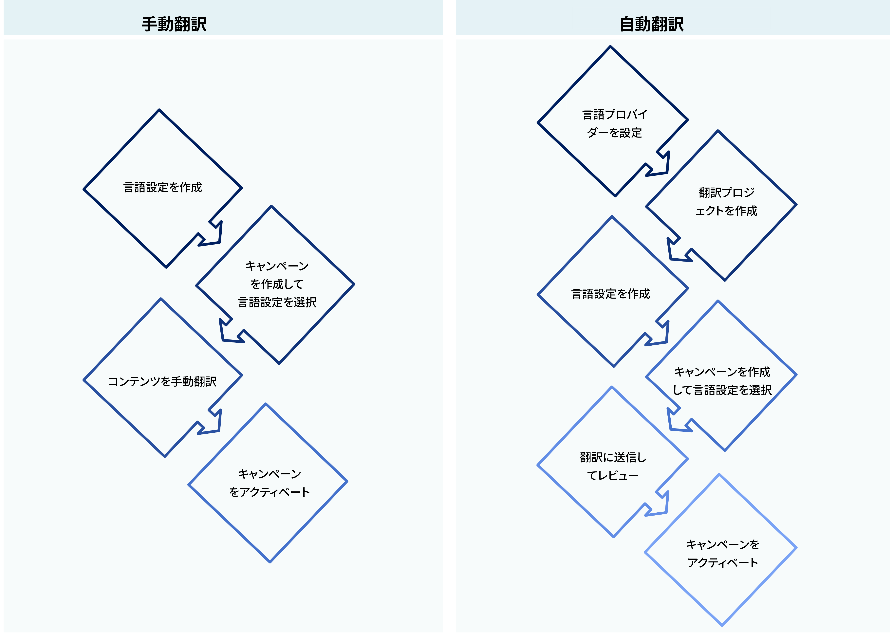
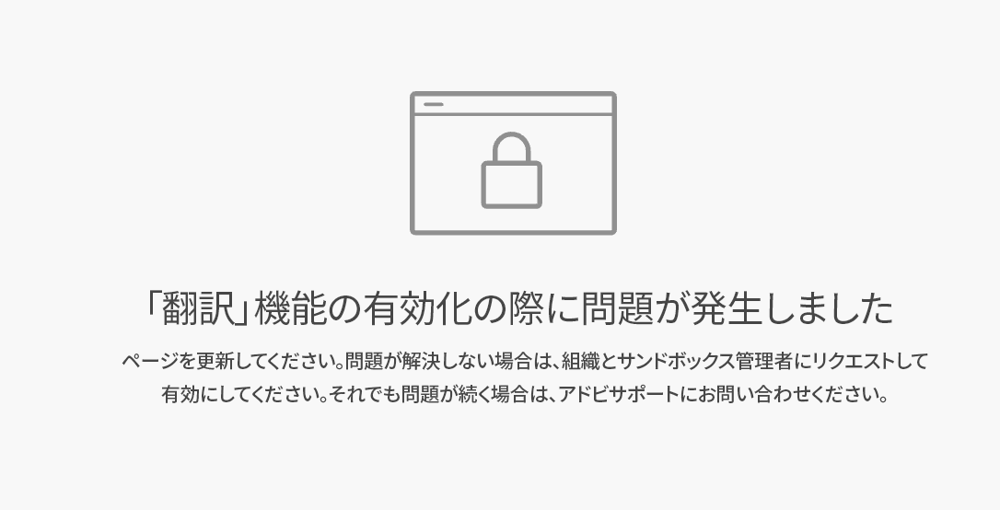

# 多言語コンテンツの基本を学ぶ {#multilingual-gs}

>[!AVAILABILITY]
>
>多言語コンテンツは現在、一連の組織でのみ使用できます（限定提供）。アクセスするには、アドビ担当者にお問い合わせください。

多言語機能を使用すると、単一のキャンペーンまたはジャーニー内で複数の言語のコンテンツを簡単に作成できます。この機能を使用すると、キャンペーンの編集時に言語を切り替えることができるので、編集プロセス全体が合理化され、多言語コンテンツを効率的に管理する機能が向上します。

Journey Optimizer を使用すると、次の 2 つの異なる方法で多言語コンテンツを作成できます。

* **手動翻訳**：メールデザイナーでコンテンツを直接翻訳するか、既存の多言語コンテンツを読み込みます。[詳細情報](multilingual-manual.md)

* **自動翻訳**：自動翻訳用にコンテンツを優先言語プロバイダーに送信します。[詳細情報](multilingual-automated.md)

 

## 前提条件 {#prerequisites}

>[!CONTEXTUALHELP]
>id="ajo_multi_translation_error"
>title="翻訳エラー"
>abstract="翻訳ページにアクセスできない場合は、翻訳機能が有効になっていないことが原因である可能性があります。 この問題を解決するには、組織とサンドボックス管理者が翻訳機能をアクティベートする必要があります。"

Adobe Journey Optimizer は現在、Adobe Journey Optimizer とは独立したサードパーティの翻訳サービス（機械翻訳または人間による翻訳）を提供する、翻訳プロバイダーと統合されています。

選択した翻訳プロバイダーを追加する前に、該当するプロバイダーでアカウントを作成する必要があります。

翻訳プロバイダーの翻訳サービスを使用した場合、該当するプロバイダーが定める追加の利用条件に同意したと見なされます。Adobe Journey Optimizer ユーザーは、サードパーティソリューションとして、統合を通じて翻訳サービスを利用できます。サードパーティ製品について、アドビは一切関係せず、責任も負いません。

翻訳に関する問題やサポートのリクエストについては、該当する翻訳プロバイダーにお問い合わせください。

翻訳ページにアクセスできない場合は、翻訳機能を有効にする必要があります。

+++ 翻訳機能を有効にする方法を説明します

1. 次のエラーページが表示される場合は、**[!UICONTROL 翻訳]** 機能がまだ有効になっていないことを示しています。 組織およびサンドボックス管理者にお問い合わせください。 アクセスをリクエストします。

   

1. 管理者は、左側のサイドバーの **[!UICONTROL 翻訳]** メニューに移動する必要があります。

   翻訳機能が自動的に有効になります。

1. この機能が正常に有効になると、「プロジェクト ]**」、「**[!UICONTROL  プロバイダー **[!UICONTROL 、「****ロケール]** の各タブと共に **[!UICONTROL 翻訳]** ページにアクセスできるようになります。

1. この手順が失敗した場合でも、同じエラーページが表示されます。 その場合は、Adobe担当者にお問い合わせください。

+++

## チュートリアルビデオ {#video}

1 つのキャンペーンまたはジャーニー内で複数の言語のコンテンツを作成する方法について説明します。

>[!VIDEO](https://video.tv.adobe.com/v/3430921/)
