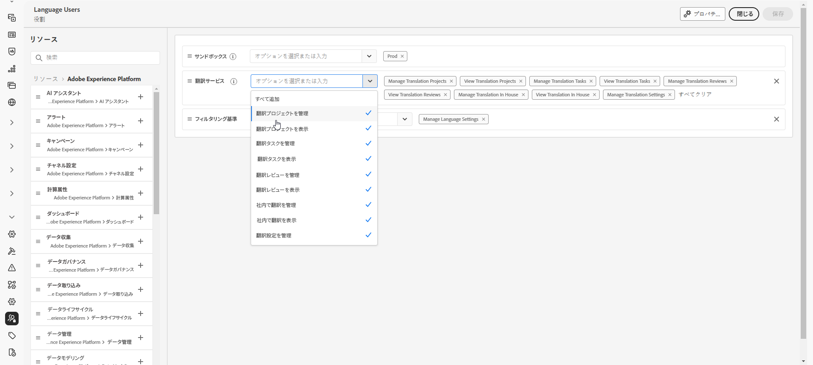

# 多言語コンテンツの基本を学ぶ {#multilingual-gs}

>[!CONTEXTUALHELP]
>id="ajo_multi_translation_homepage"
>title="翻訳"
>abstract="多言語機能を使用すると、1 つのキャンペーンまたはジャーニー内で複数の言語のコンテンツを簡単に作成できます。翻訳ページでは、プロジェクトの設定、翻訳プロバイダーの選択、ロケール固有の辞書の管理を行うことができます"

多言語機能を使用すると、単一のキャンペーンまたはジャーニー内で複数の言語のコンテンツを簡単に作成できます。この機能を使用すると、キャンペーンの編集時に言語を切り替えることができるので、編集プロセス全体が合理化され、多言語コンテンツを効率的に管理する機能が向上します。

Journey Optimizer を使用すると、次の 2 つの異なる方法で多言語コンテンツを作成できます。

* **手動翻訳**：メールデザイナーでコンテンツを直接翻訳するか、既存の多言語コンテンツを読み込みます。[詳細情報](multilingual-manual.md)

* **自動翻訳**：自動翻訳用にコンテンツを優先言語プロバイダーに送信します。[詳細情報](multilingual-automated.md)

 

## 前提条件 {#prerequisites}

>[!CONTEXTUALHELP]
>id="ajo_multi_translation_error"
>title="翻訳エラー"
>abstract="翻訳ページにアクセスできない場合は、翻訳機能が有効になっていないことが原因である可能性があります。この問題を解決するには、組織およびサンドボックス管理者が翻訳機能を有効にしていることを確認する必要があります。"

Adobe Journey Optimizer は現在、Adobe Journey Optimizer とは独立したサードパーティの翻訳サービス（機械翻訳または人間による翻訳）を提供する、翻訳プロバイダーと統合されています。

選択した翻訳プロバイダーを追加する前に、該当するプロバイダーでアカウントを作成する必要があります。

翻訳プロバイダーの翻訳サービスを使用した場合、該当するプロバイダーが定める追加の利用条件に同意したと見なされます。Adobe Journey Optimizer ユーザーは、サードパーティソリューションとして、統合を通じて翻訳サービスを利用できます。サードパーティ製品について、アドビは一切関係せず、責任も負いません。

翻訳に関する問題やサポートのリクエストについては、該当する翻訳プロバイダーにお問い合わせください。

多言語コンテンツについては、次の設定を定義する必要があります。

* Journey Optimizer で翻訳機能を使用するには、API を対応する役割に割り当てる必要があります。[詳細情報](https://experienceleague.adobe.com/ja/docs/experience-platform/landing/platform-apis/api-authentication#assign-api-to-a-role)

* 多言語コンテンツの作成を開始するには、ユーザーに&#x200B;**[!UICONTROL 言語設定の管理]**&#x200B;権限を付与する必要があります。自動フローの場合、ユーザーには&#x200B;**[!UICONTROL 翻訳サービス]**&#x200B;機能に関連する権限も必要です。[権限についての詳細情報](../administration/permissions.md)

  +++ 多言語関連の権限を割り当てる方法について説明します。

   1. **権限**&#x200B;付きの製品で、「**役割**」タブに移動し、目的の「**役割**」を選択します。

   1. 「**編集**」をクリックして、権限を変更します。

   1. **翻訳サービス**&#x200B;リソースを追加し、ドロップダウンメニューから適切な多言語権限を選択します。

      {zoomable="yes"}

   1. 「**保存**」をクリックして、変更を適用します。

      この役割に既に割り当てられているユーザーの権限は、自動的に更新されます。

   1. この役割を新しいユーザーに割り当てるには、**役割**&#x200B;ダッシュボード内の「**ユーザー**」タブに移動し、「**ユーザーを追加**」をクリックします。

   1. ユーザーの名前、メールアドレスを入力するか、リストから選択して、「**保存**」をクリックします。

   1. まだユーザーを作成していない場合は、[このドキュメント](https://experienceleague.adobe.com/ja/docs/experience-platform/access-control/abac/permissions-ui/users)を参照してください。

  +++

* 翻訳ページにアクセスできない場合は、翻訳機能を有効にし、**[!UICONTROL 翻訳サービス]**&#x200B;関連の権限を付与される必要があります。[詳細情報](../administration/ootb-permissions.md)

  +++ 翻訳機能を有効にする方法について説明します。

   1. 次のエラーページが表示される場合は、**[!UICONTROL 翻訳]**&#x200B;機能がまだ有効になっていないことを示しています。組織およびサンドボックス管理者に連絡して、アクセス権をリクエストしてください。

  

   1. 管理者は、左側のサイドバーの&#x200B;**[!UICONTROL 翻訳]**&#x200B;メニューに移動する必要があります。

      システムで翻訳機能が自動的に有効になります。

   1. この機能が正常に有効になると、「**[!UICONTROL プロジェクト]**」、「**[!UICONTROL プロバイダー]**、「**[!UICONTROL ロケール]**」の各タブと共に、**[!UICONTROL 翻訳]**&#x200B;ページにアクセスできるようになります。

   1. この手順が失敗した場合、同じエラーページが表示されます。その場合は、アドビ担当者にお問い合わせください。

  +++

## チュートリアルビデオ {#video}

1 つのキャンペーンまたはジャーニー内で複数の言語のコンテンツを作成する方法について説明します。

>[!VIDEO](https://video.tv.adobe.com/v/3430921/)
