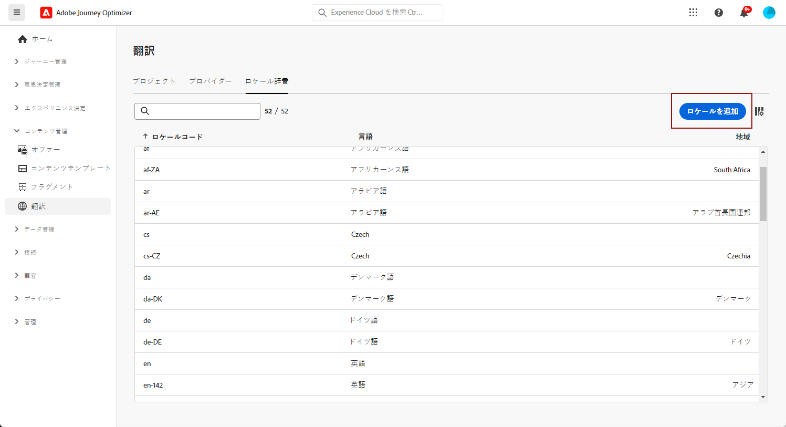

# ロケールの作成 {#multilingual-locale}

>[!CONTEXTUALHELP]
>id="ajo_multi_add_locale"
>title="ロケールの追加"
>abstract="言語の環境設定を設定する際に、多言語コンテンツで目的のロケールを使用できない場合は、追加のロケールを作成するオプションがあります。"

[言語設定の作成](multilingual-manual.md#language-settings)の節で説明しているように、言語設定を行う際に、多言語コンテンツに特定のロケールが使用できない場合は、**[!UICONTROL 翻訳]**&#x200B;メニューを使用して必要に応じて新しいロケールを柔軟に作成できます。

1. **[!UICONTROL コンテンツ管理]**&#x200B;メニューから、**[!UICONTROL 翻訳]**&#x200B;にアクセスします。

1. 「**[!UICONTROL ロケール辞書]**」タブから、「**[!UICONTROL ロケールを追加]**」をクリックします。

   

1. **[!UICONTROL 言語]**&#x200B;リストと関連する&#x200B;**[!UICONTROL 地域]**&#x200B;からロケールコードを選択します。

1. 「**[!UICONTROL 保存]**」をクリックしてロケールを作成します。

   

