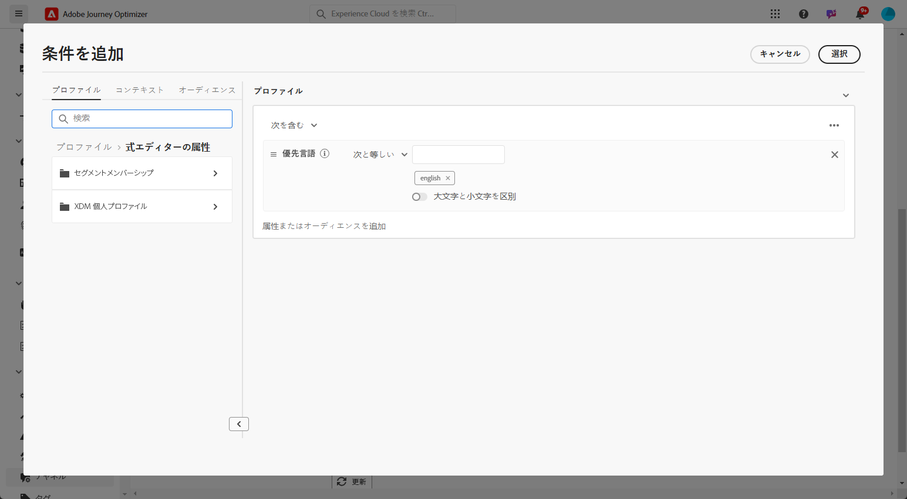
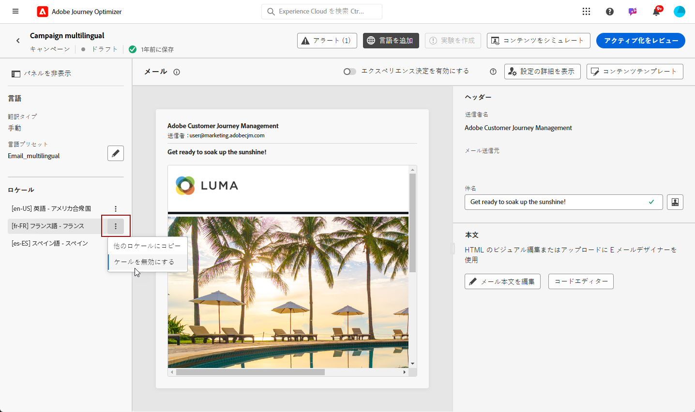

# 手動翻訳を使用した多言語コンテンツの作成 {#multilingual-manual}

>[!IMPORTANT]
>
>手動フローの場合、ユーザーに&#x200B;**[!UICONTROL 言語設定の管理]**&#x200B;権限を付与する必要があります。

手動フローを使用すると、多言語メッセージへの正確な制御とカスタマイズのオプションで、キャンペーンやジャーニーで直接コンテンツを簡単に翻訳できます。さらに、「HTML を読み込む」オプションを使用すると、既存の多言語コンテンツを簡単に読み込むことができます。

手動翻訳を使用して多言語コンテンツを作成するには、次の手順に従います。

1. [プロバイダーの追加（オプション）](multilingual-provider.md)

1. [ロケールの追加（オプション）](multilingual-locale.md)

1. [言語設定の作成](#language-settings)

1. [多言語コンテンツの作成](#create-multilingual-campaign)

## 言語設定の作成 {#language-settings}

このセクションでは、多言語コンテンツを管理するための様々なロケールを設定できます。また、プロファイル言語に関連する情報の検索に使用する属性を選択することもできます

1. **[!UICONTROL 管理]**&#x200B;メニューから、**[!UICONTROL チャネル]**／**[!UICONTROL 一般設定]**&#x200B;にアクセスします。

1. **[!UICONTROL 言語設定]**&#x200B;メニューで、「**[!UICONTROL 言語設定を作成]**」をクリックします。

   

1. **[!UICONTROL 言語設定]**&#x200B;の名前を入力し、「**[!UICONTROL 手動翻訳]**」を選択します。

1. この設定に関連付けられている&#x200B;**[!UICONTROL ロケール]**&#x200B;を選択します。最大 50 個のロケールを追加できます。

   **[!UICONTROL ロケール]**&#x200B;が見つからない場合は、**[!UICONTROL 翻訳]**&#x200B;メニューから、または API を使用して、事前に手動で作成できます。[新しいロケールの作成](multilingual-locale.md)を参照してください。

   

1. **[!UICONTROL フォールバック環境設定]**&#x200B;を選択して、プロファイルがコンテンツ配信に必要な条件を満たさない場合のバックアップオプションを定義します。

   フォールバックオプションが選択されていない場合、キャンペーンやジャーニーは送信されません。

1. 次のオプションから送信設定を選択します。

   * **[!UICONTROL プロファイル言語設定の属性の選択]**
   * **[!UICONTROL カスタム条件付きルールの作成]**

1. 「**[!UICONTROL プロファイル言語設定の属性]**」を選択した場合は、**[!UICONTROL プロファイル言語設定の属性]**&#x200B;メニューから関連属性を選択して、プロファイル言語情報を検索します。

   

1. 「**[!UICONTROL カスタムイベントルールを作成]**」を選択した場合は、条件を作成するロケールを選択します。次に、ユーザーの場所、言語設定、その他のコンテキスト要素などの要因に基づいてルールを作成します。

   

1. 条件の作成を開始するには、属性、イベントまたはオーディエンスを追加してターゲットグループを定義します。

   >[!IMPORTANT]
   >
   >コンテキストデータは、web、アプリ内、コードベースのエクスペリエンスおよびコンテンツカードの各チャネルでのみ使用できます。メール、SMS、プッシュ通知、ダイレクトメールチャネルに使用すると、追加属性なしで、キャンペーンまたはジャーニーがリストの最初のオプション言語で送信されます。

   

   +++条件でコンテキストイベントを使用する前提条件

   ユーザーがコンテンツを表示すると、パーソナライゼーションリクエストがエクスペリエンスイベントと共に送信されます。条件でコンテキストデータを活用するには、パーソナライゼーションリクエストペイロードに追加データを添付する必要があります。これを行うには、Adobe Experience Platform のデータ収集でルールを作成して、パーソナライゼーションリクエストが送信された場合（IF）は、スキーマの言語フィールドと一致する属性を定義して、リクエストに追加データを添付する必要があります（THEN）。

   >[!NOTE]
   >
   >これらの前提条件は、アプリ内およびコンテンツカードチャネルにのみ必要です。

   1. Adobe Experience Platform のデータ収集で、**[!UICONTROL ルール]**&#x200B;メニューにアクセスし、新しいルールを作成します。ルールの作成方法について詳しくは、[!DNL Adobe Experience Platform] [データ収集ドキュメント](https://experienceleague.adobe.com/ja/docs/experience-platform/collection/e2e#create-a-rule){target="_blank"}を参照してください。

   2. ルールの「**[!UICONTROL IF]**」セクションで、次のように設定されたイベントを追加します。

      

      * 使用している&#x200B;**[!UICONTROL 拡張機能]**&#x200B;を選択します。
      * 「**[!UICONTROL イベントタイプ]**」フィールドで「AEP リクエストイベント」を選択します。
      * 右側のパネルで、「XDM イベントタイプが personalization.request と等しい」を選択します。
      * 「**[!UICONTROL 変更を保存]**」ボタンをクリックして、確定します。

   3. ルールの「**[!UICONTROL THEN]**」セクションで、次のように設定されたアクションを追加します。

      

      * 使用している&#x200B;**[!UICONTROL 拡張機能]**&#x200B;を選択します。
      * 「**[!UICONTROL アクションタイプ]**」フィールドで「データを添付」を選択します。
      * 「JSON ペイロード」セクションで、使用する言語を取得するのに使用する属性（以下の例では「language」）が、データ収集データストリームが送られるスキーマで指定された属性名と一致することを確認します。

        ```JSON
        {
            "xdm":{
                "application":{
                    "_dc":{
                        "language":"{%%Language%%}"
                    }
                }
            }
        }
        ```

      * 「**[!UICONTROL 変更を保持]**」ボタンをクリックして、ルールを確認して保存します。

+++

1. ロケールをドラッグ＆ドロップして並べ替え、リスト内の優先度を管理します。

1. ロケールを削除するには、ごみ箱アイコンをクリックします。

   

1. 「**[!UICONTROL 送信]**」をクリックして、**[!UICONTROL 言語設定]**&#x200B;を作成します。

言語設定を行った後は、それらを編集するオプションは表示されなくなります。

<!--
1. Access the **[!UICONTROL channel configurations]** menu and create a new channel configuration or select an existing one.


1. In the **[!UICONTROL Header parameters]** section, select the **[!UICONTROL Enable multilingual]** option.

1. Select your **[!UICONTROL Locales dictionary]** and add as many as needed.
-->

## 多言語コンテンツの作成 {#create-multilingual-campaign}

多言語コンテンツを設定したら、キャンペーンまたはジャーニーを作成し、選択した各ロケールのコンテンツをカスタマイズする準備が整います。

1. まず、要件に応じて、メール、SMS またはプッシュ通知[キャンペーン](../campaigns/create-campaign.md)や[ジャーニー](../building-journeys/journeys-message.md)を作成し、設定します。

   >[!IMPORTANT]
   >
   >ジャーニーごとに 1 つの翻訳プロジェクトのみを含めることをお勧めします。

1. 元のコンテンツを作成または読み込み、必要に応じてパーソナライズします。

1. コンテンツを作成したら、「**[!UICONTROL 保存]**」をクリックし、キャンペーン設定画面に戻ります。

   

1. 「**[!UICONTROL 言語を追加]**」をクリックし、以前に作成した&#x200B;**[!UICONTROL 言語設定]**&#x200B;を選択します。[詳細情報](#language-settings)

   

1. ドロップダウンメニューから目的のロケールを選択して、既存の作成済みコンテンツに適用します。

1. **[!UICONTROL ロケール]**&#x200B;メニューの詳細設定にアクセスし、「**[!UICONTROL すべてのロケールにコピー]**」を選択します。

   

1. これで、選択した&#x200B;**[!UICONTROL ロケール]**&#x200B;全体にコンテンツが複製されました。各ロケールにアクセスし、「**[!UICONTROL メール本文を編集]**」をクリックしてコンテンツを翻訳します。

   

1. 選択したロケールの&#x200B;**[!UICONTROL その他のアクション]**&#x200B;メニューを使用して、ロケールを無効にするか有効にするかを選択できます。

   

1. 多言語設定を非アクティブ化するには、「**[!UICONTROL 言語を追加]**」をクリックし、ローカル言語として保持する言語を選択します。

   

1. 「**[!UICONTROL アクティブ化するレビュー]**」をクリックして、キャンペーンの概要を表示します。

   概要では、必要に応じてキャンペーンを変更し、パラメーターが正しくないか、または見つからないかを確認できます。

1. 多言語コンテンツを参照して、各言語でのレンダリングを確認します。

   

これで、キャンペーンまたはジャーニーをアクティブ化できます。送信後は、レポート内で多言語ジャーニーまたはキャンペーンの影響を測定できます。

>[!IMPORTANT]
>
> キャンペーンが承認ポリシーの対象となっている場合、多言語キャンペーンまたはジャーニーを送信できるようにするには、承認をリクエストする必要があります。[詳細情報](../test-approve/gs-approval.md)

<!--
# Create a multilingual journey {#create-multilingual-journey}

1. Create your journey with a Delivery and personalize your content as needed.
1. From your delivery action, click Edit content.
1. Click Add languages.

-->
