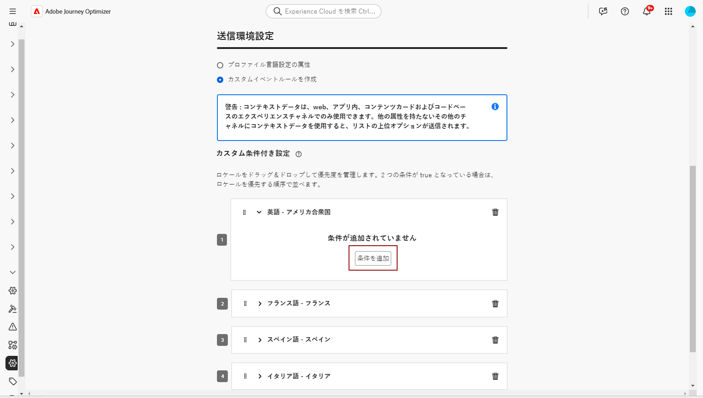
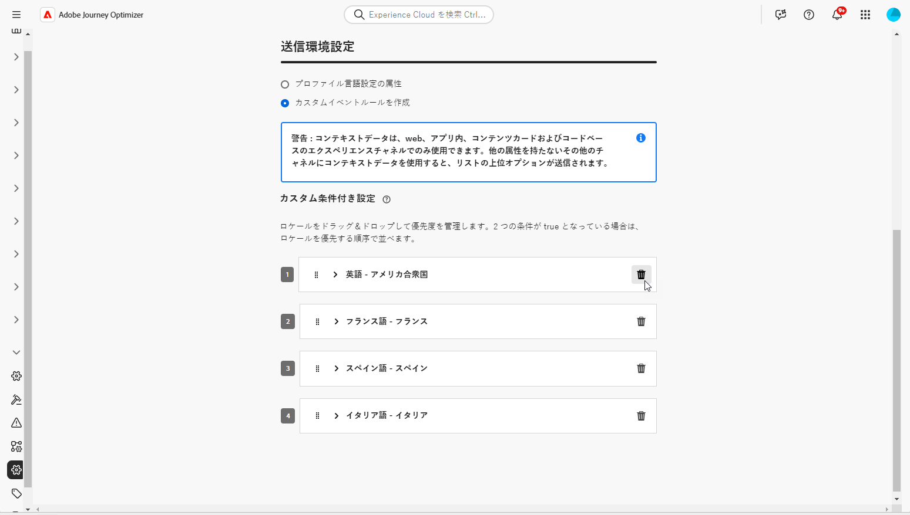
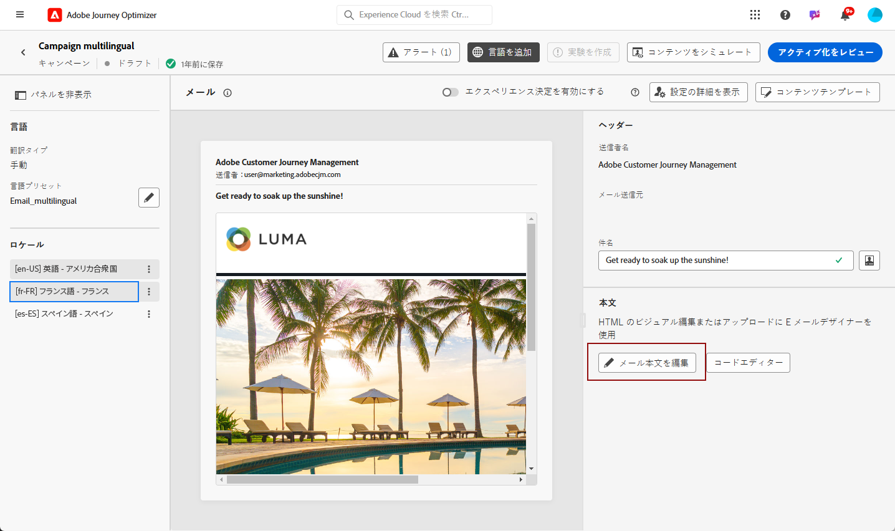
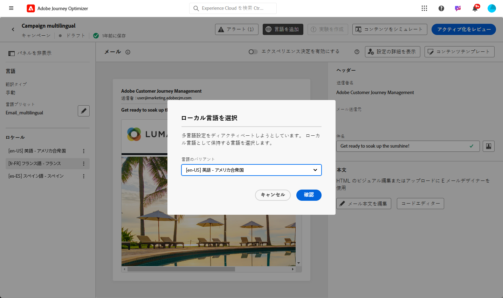

# 手動翻訳を使用した多言語コンテンツの作成 {#multilingual-manual}

>[!BEGINSHADEBOX]

**目次**

* [多言語コンテンツの基本を学ぶ](multilingual-gs.md)
* 手動翻訳を使用した多言語コンテンツの作成
* [自動翻訳を使用した多言語コンテンツの作成](multilingual-automated.md)
* [多言語キャンペーンレポート](multilingual-report.md)

>[!ENDSHADEBOX]

手動フローを使用すると、多言語メッセージへの正確な制御とカスタマイズのオプションで、メール、プッシュ通知または SMS キャンペーンに直接コンテンツを簡単に翻訳できます。さらに、「HTML を読み込む」オプションを使用すると、既存の多言語コンテンツを簡単に読み込むことができます。

手動翻訳を使用して多言語コンテンツを作成するには、次の手順に従います。

1. [ロケールを作成します](#create-locale)。

1. [言語設定の作成](#create-language-settings).

1. [多言語キャンペーンを作成](#create-a-multilingual-campaign).

## ロケールの作成 {#create-locale}

[言語設定の作成](#language-settings)の節で説明しているように、言語設定を行う際に、多言語コンテンツに特定のロケールが使用できない場合は、**[!UICONTROL 翻訳]**&#x200B;メニューを使用して必要に応じて新しいロケールを柔軟に作成できます。

1. **[!UICONTROL 管理]**&#x200B;メニューから、**[!UICONTROL チャネル]**&#x200B;にアクセスします。

   翻訳メニューを使用すると、アクティブ化されたロケールのリストにアクセスできます。

1. 「**[!UICONTROL ロケール辞書]**」タブから、「**[!UICONTROL ロケールを追加]**」をクリックします。

   

1. **[!UICONTROL 言語]**&#x200B;リストと関連する&#x200B;**[!UICONTROL 地域]**&#x200B;からロケールコードを選択します。

1. 「**[!UICONTROL 保存]**」をクリックしてロケールを作成します。

   

## 言語設定の作成 {#language-settings}

この節では、多言語コンテンツを管理するためのプライマリ言語とそれに関連するロケールを設定できます。また、プロファイル言語に関連する情報の検索に使用する属性を選択することもできます

1. **[!UICONTROL 管理]**&#x200B;メニューから、**[!UICONTROL チャネル]**&#x200B;にアクセスします。

1. **[!UICONTROL 言語設定]**&#x200B;メニューで、「**[!UICONTROL 言語設定を作成]**」をクリックします。

   

1. **[!UICONTROL 言語設定]**&#x200B;の名前を入力します。

1. この設定に関連付けられている&#x200B;**[!UICONTROL ロケール]**&#x200B;を選択します。最大 50 個のロケールを追加できます。

   **[!UICONTROL ロケール]**&#x200B;が見つからない場合は、**[!UICONTROL 翻訳]**&#x200B;メニューから、または API を使用して、事前に手動で作成できます。[新しいロケールの作成](#create-locale)を参照してください。

   

1. **[!UICONTROL 送信環境設定]**&#x200B;メニューから、プロファイル言語に関する情報を見つけるために検索する属性を選択します。

   

1. **[!UICONTROL ロケール]**&#x200B;の横にある「**[!UICONTROL 編集]**」をクリックしてさらにパーソナライズし、**[!UICONTROL プロファイル環境設定]**&#x200B;を追加します。

   

1. プロファイル環境設定ドロップダウンから他の&#x200B;**[!UICONTROL ロケール]**&#x200B;を選択し、「**[!UICONTROL プロファイルを追加]**」をクリックします。

1. **[!UICONTROL ロケール]**&#x200B;の詳細メニューにアクセスして、**[!UICONTROL プライマリロケール]**（プロファイル属性を指定していない場合のデフォルト言語）を定義します。

   また、この詳細メニューからロケールを削除することもできます。

   

1. 「**[!UICONTROL 送信]**」をクリックして、**[!UICONTROL 言語設定]**&#x200B;を作成します。

<!--
1. Access the **[!UICONTROL Channel surfaces]** menu and create a new channel surface or select an existing one.

1. In the **[!UICONTROL Header parameters]** section, select the **[!UICONTROL Enable multilingual]** option.

1. Select your **[!UICONTROL Locales dictionary]** and add as many as needed.
-->

## 多言語キャンペーンを作成 {#create-multilingual-campaign}

多言語コンテンツを設定したら、キャンペーンを作成し、選択した各ロケールのコンテンツをカスタマイズする準備が整います。

1. まず、要件に応じて、メール、SMS またはプッシュ通知キャンペーンを作成し、設定します。[詳細情報](../campaigns/create-campaign.md)

1. **[!UICONTROL アクション]**&#x200B;メニューに移動し、「**[!UICONTROL コンテンツを編集]**」を選択します。

   

1. 元のコンテンツを作成または読み込み、必要に応じてパーソナライズします。

1. プライマリコンテンツを作成したら、「**[!UICONTROL 保存]**」をクリックし、キャンペーン設定画面に戻ります。

   

1. 「**[!UICONTROL 言語を追加]**」をクリックし、以前に作成した&#x200B;**[!UICONTROL 言語設定]**&#x200B;を選択します。[詳細情報](#create-language-settings)

   

1. **[!UICONTROL ロケール]**&#x200B;メニューの詳細設定にアクセスし、「**[!UICONTROL プライマリをすべてのロケールにコピー]**」を選択します。

   

1. これで、選択した&#x200B;**[!UICONTROL ロケール]**&#x200B;全体にプライマリコンテンツが複製されました。各ロケールにアクセスし、「**[!UICONTROL メール本文を編集]**」をクリックしてコンテンツを翻訳します。

   

1. 選択したロケールの&#x200B;**[!UICONTROL その他のアクション]**&#x200B;メニューを使用して、ロケールを無効にするか有効にするかを選択できます。

   

1. 多言語設定を非アクティブ化するには、「**[!UICONTROL 言語を追加]**」をクリックし、ローカル言語として保持する言語を選択します。

   

1. 「**[!UICONTROL アクティブ化するレビュー]**」をクリックして、キャンペーンの概要を表示します。

   概要では、必要に応じてキャンペーンを変更し、パラメーターが正しくないか、または見つからないかを確認できます。

1. 多言語コンテンツを参照して、各言語でのレンダリングを確認します。

   

1. キャンペーンが正しく設定されていることを確認してから、「**[!UICONTROL アクティブ化]**」をクリックします。

これで、キャンペーンがアクティブ化されました。キャンペーンで設定されたメッセージは、すぐに送信されるか、指定日に送信されます。キャンペーンがライブになるとすぐ、変更できなくなります。コンテンツを再利用するには、キャンペーンを複製します。

送信後は、キャンペーンレポート内でキャンペーンの影響を測定できます。

<!--
# Create a multilingual journey {#create-multilingual-journey}

1. Create your journey with a Delivery and personalize your content as needed.
1. From your delivery action, click Edit content.
1. Click Add languages.

-->
