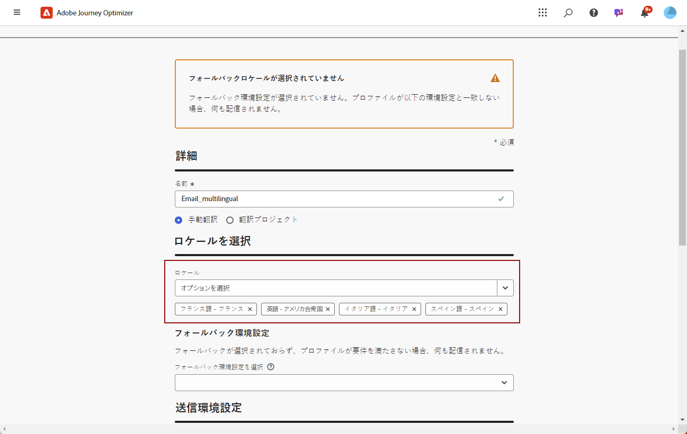
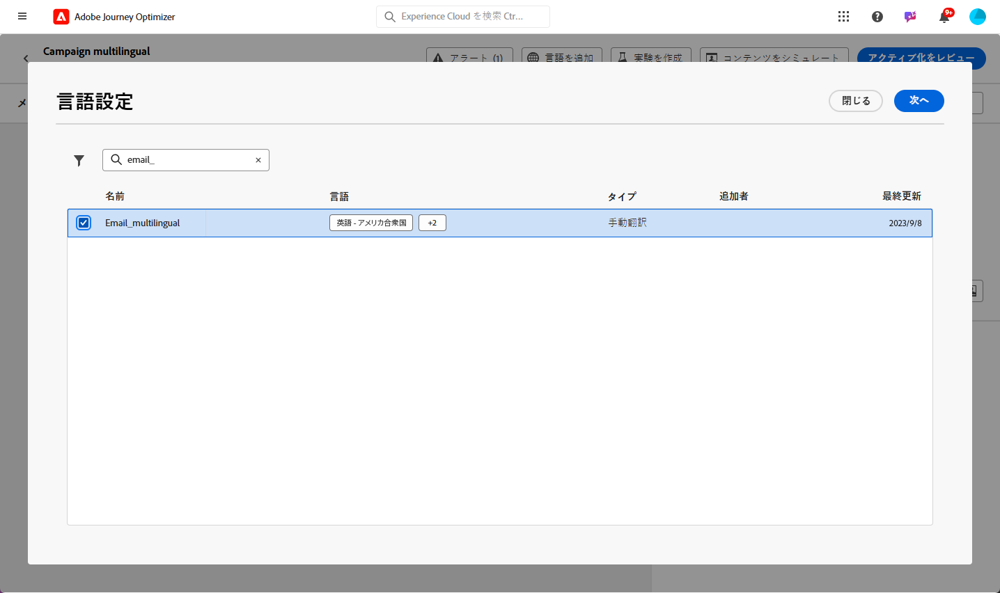

# 手動翻訳を使用した多言語コンテンツの作成 {#multilingual-manual}

>[!BEGINSHADEBOX]

**目次**

* [多言語コンテンツの概要](multilingual-gs.md)
* **[手動翻訳を使用した多言語コンテンツの作成](multilingual-manual.md)**
* [自動翻訳を使用した多言語コンテンツの作成](multilingual-automated.md)
* [多言語キャンペーンレポート](multilingual-report.md)

>[!ENDSHADEBOX]

手動フローを使用すると、E メール、プッシュ通知、SMS キャンペーンに直接コンテンツを簡単に翻訳し、多言語メッセージの正確な制御とカスタマイズのオプションを提供できます。 さらに、「読み込みHTML」オプションを使用すると、既存の多言語コンテンツを簡単に読み込むことができます。

手動翻訳を使用して多言語コンテンツを作成するには、次の手順に従います。

1. [ロケールを作成する](#create-locale).

1. [言語設定の作成](#create-language-settings).

1. [多言語キャンペーンの作成](#create-a-multilingual-campaign).

## ロケールを作成 {#create-locale}

言語設定を構成する際に、 [言語設定の作成](#language-settings) セクションでは、多言語コンテンツで特定のロケールが使用できない場合、を使用して必要な数の新しいロケールを柔軟に作成できます。 **[!UICONTROL 翻訳]** メニュー。

1. 次から： **[!UICONTROL 管理]** メニュー、アクセス **[!UICONTROL チャネル]**.

   翻訳メニューを使用すると、アクティベートされたロケールのリストにアクセスできます。

1. 次から： **[!UICONTROL ロケール辞書]** タブ、クリック **[!UICONTROL ロケールを追加]**.

   

1. ロケールコードを **[!UICONTROL 言語]** リストおよび関連する **[!UICONTROL 地域]**.

1. クリック **[!UICONTROL 保存]** をクリックしてロケールを作成します。

   

## 言語設定の作成 {#language-settings}

この節では、多言語コンテンツを管理するためのプライマリ言語とそれに関連するロケールを設定できます。 また、プロファイルの言語に関連する情報の検索に使用する属性を選択することもできます

1. 次から： **[!UICONTROL 管理]** メニュー、アクセス **[!UICONTROL チャネル]**.

1. Adobe Analytics の **[!UICONTROL 言語設定]** メニュー、クリック **[!UICONTROL 言語設定の作成]**.

   

1. 名前を入力 **[!UICONTROL 言語設定]**.

1. を選択します。 **[!UICONTROL ロケール]** をこの設定に関連付けました。 追加できるロケールは最大 50 個までです。

   次の場合、 **[!UICONTROL ロケール]** がない場合は、事前に **[!UICONTROL 翻訳]** メニューまたは API を使用します。 参照： [新しいロケールを作成](#create-locale).

   

1. 次から： **[!UICONTROL 送信環境設定]** メニューで、検索する属性を選択して、プロファイル言語に関する情報を見つけます。

   

1. クリック **[!UICONTROL 編集]** 次に **[!UICONTROL ロケール]** さらにパーソナライズし、 **[!UICONTROL プロファイル環境設定]**.

   

1. その他を選択 **[!UICONTROL ロケール]** 「プロファイルの環境設定」ドロップダウンで、「 **[!UICONTROL プロファイルを追加]**.

1. の詳細設定メニューにアクセスする **[!UICONTROL ロケール]** を定義するには、 **[!UICONTROL プライマリのロケール]**（プロファイル属性が指定されていない場合のデフォルト言語）。

   また、この詳細設定メニューからロケールを削除することもできます。

   

1. クリック **[!UICONTROL 送信]** をクリックして、 **[!UICONTROL 言語設定]**.

<!--
1. Access the **[!UICONTROL Channel surfaces]** menu and create a new channel surface or select an existing one.

1. In the **[!UICONTROL Header parameters]** section, select the **[!UICONTROL Enable multilingual]** option.

1. Select your **[!UICONTROL Locales dictionary]** and add as many as needed.
-->

## 多言語キャンペーンの作成 {#create-multilingual-campaign}

多言語コンテンツを設定したら、キャンペーンを作成し、選択した各ロケールのコンテンツをカスタマイズする準備が整いました。

1. まず、要件に応じて、電子メール、SMS、またはプッシュ通知キャンペーンを作成し、設定します。 [詳細情報](../campaigns/create-campaign.md)

1. 次に移動： **[!UICONTROL アクション]** メニューを開き、「 」を選択します。 **[!UICONTROL コンテンツを編集]**.

   

1. 元のコンテンツを作成または読み込み、必要に応じてパーソナライズします。

1. プライマリコンテンツを作成したら、「 **[!UICONTROL 保存]** キャンペーン設定画面に戻ります。

   

1. クリック **[!UICONTROL 言語を追加]** を選択し、以前に作成した **[!UICONTROL 言語設定]**. [詳細情報](#create-language-settings)

   

1. の詳細設定にアクセスする **[!UICONTROL ロケール]** メニューと選択 **[!UICONTROL プライマリをすべてのロケールにコピーする]**.

   

1. これで、選択した  **[!UICONTROL ロケール]**&#x200B;をクリックし、各ロケールにアクセスして、 **[!UICONTROL メール本文を編集]** コンテンツを翻訳します。

   

1. ロケールを無効にするか、有効にするかを選択すると、 **[!UICONTROL その他のアクション]** 選択したロケールのメニュー。

   

1. 多言語設定を非アクティブ化するには、 **[!UICONTROL 言語を追加]** ローカル言語として保持する言語を選択します。

   

1. クリック **[!UICONTROL 有効化するレビュー]** ：キャンペーンの概要を表示します。

   概要では、必要に応じてキャンペーンを変更し、パラメーターが正しくないか、または見つからないかを確認できます。

1. 多言語コンテンツを参照して、各言語でのレンダリングを確認します。

   

1. キャンペーンが正しく設定されていることを確認してから、「**[!UICONTROL アクティブ化]**」をクリックします。

これで、キャンペーンがアクティブ化されました。キャンペーンに設定されたメッセージは、即座に送信されるか、指定した日付に送信されます。 キャンペーンがライブになると、すぐに変更できなくなります。 コンテンツを再利用するには、キャンペーンを複製します。

送信後は、キャンペーンレポート内でキャンペーンの影響を測定できます。

<!--
# Create a multilingual journey {#create-multilingual-journey}

1. Create your journey with a Delivery and personalize your content as needed.
1. From your delivery action, click Edit content.
1. Click Add languages.

-->
